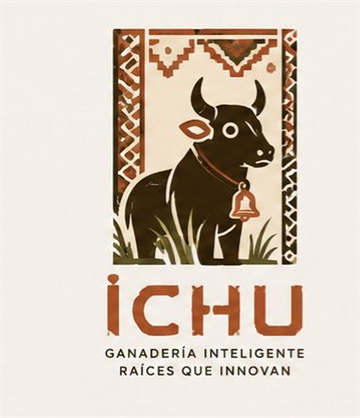
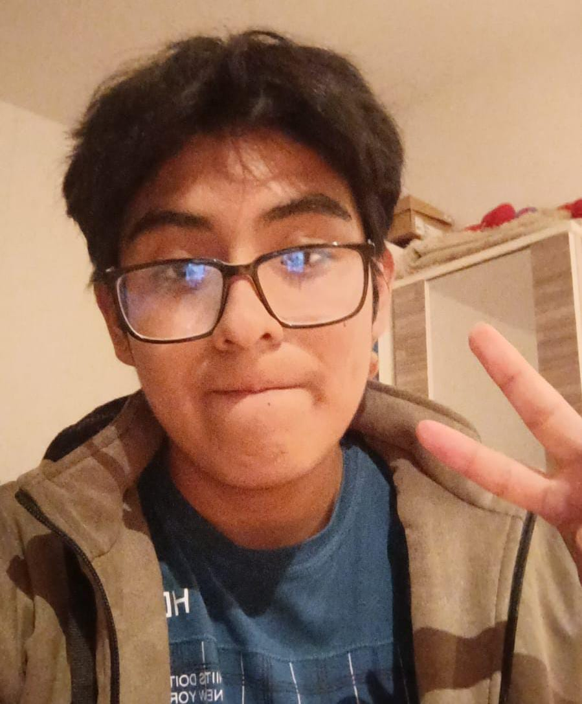
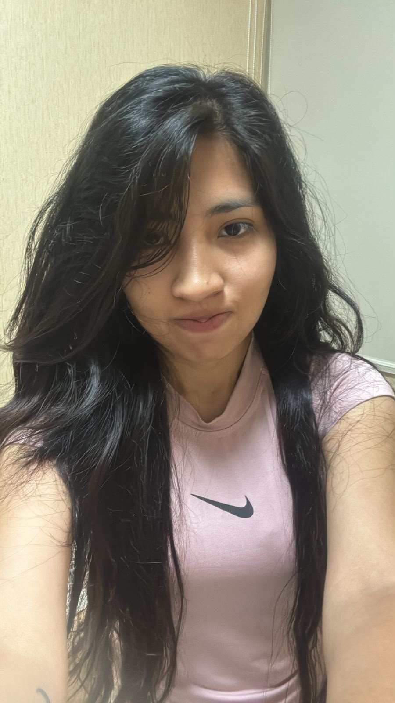
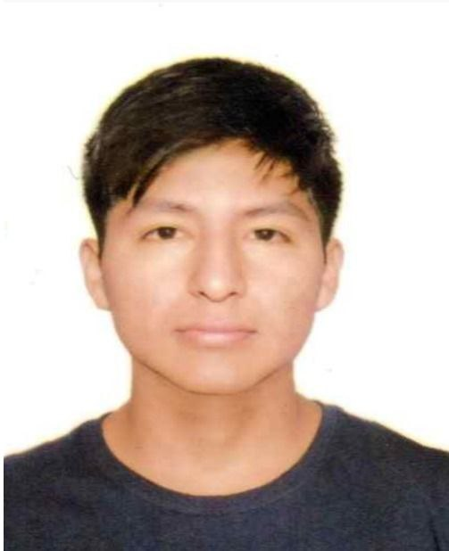
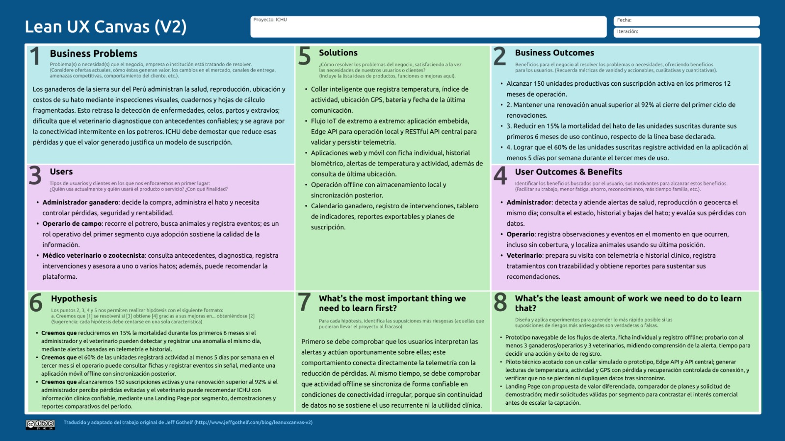

# Capítulo I: Introducción
## 1.1. Startup Profile
### 1.1.1. Descripción de la Startup
SmartFarm es una startup de base tecnológica orientada al sector ganadero, cuyo producto, ICHU, es una solución digital que permita a los ganaderos mejorar la gestión, monitoreo y cuidado de su ganado mediante el uso de tecnologías como Internet de las Cosas (IoT), dispositivos inteligentes y aplicaciones móviles. La propuesta busca facilitar el acceso a información relevante sobre el estado y comportamiento de los animales, permitiendo que los ganaderos puedan tomar decisiones de manera más rápida y eficiente.

La solución estará conformada principalmente por una aplicación móvil y una plataforma digital que recibirán información recopilada mediante collares inteligentes IoT colocados en los animales. Estos dispositivos permitirán registrar datos relacionados con la actividad, ubicación, comportamiento y posibles cambios en el estado del animal. La información será procesada y presentada de manera sencilla al ganadero, permitiéndole realizar un seguimiento individual de cada animal y de su ganado en general.

De esta manera, la startup busca contribuir a la modernización de la actividad ganadera mediante una herramienta tecnológica que centralice la información de los animales y facilite su monitoreo. La solución permitirá identificar oportunamente situaciones que puedan requerir atención, optimizar las actividades de manejo del ganado y contar con un historial de información que apoye la toma de decisiones. Asimismo, la propuesta busca reducir la dependencia de controles manuales y mejorar la eficiencia en la gestión de las unidades ganaderas.

### 1.1.2. Perfiles de integrantes del equipo

<table style="width:100%; border-collapse: collapse; font-family: Arial, sans-serif; font-size: 12px; table-layout: fixed;">
  <thead>
    <tr>
      <th style="padding: 10px; border: 1px solid #aaa; width: 28%; text-align: left;">Integrante</th>
      <th style="padding: 10px; border: 1px solid #aaa; width: 18%; text-align: center;">Foto</th>
      <th style="padding: 10px; border: 1px solid #aaa; text-align: left;">Carrera, conocimientos y aporte al equipo</th>
    </tr>
  </thead>
  <tbody>
    <tr>
      <td style="padding: 10px; border: 1px solid #aaa;">
        Avalos Cordova, Diego Andres 
        (U202313922)
      </td>
      <td style="padding: 10px; border: 1px solid #aaa; text-align: center;">
        
      </td>
      <td style="padding: 10px; border: 1px solid #aaa; text-align: justify;">
        Ingeniería de Software. Mi nombre es Diego Ávalos, tengo 20 años y actualmente estudio Ingeniería de Software. Me interesa especializarme en desarrollo full stack, ciberseguridad y hacking ético. Tengo experiencia usando sistemas operativos GNU/Linux y conocimientos en desarrollo web. También me interesan los temas relacionados con tecnología e inteligencia artificial, por lo que busco investigar y aprender constantemente sobre nuevas herramientas que aporten valor al proyecto.
      </td>
    </tr>
    <tr>
      <td style="padding: 10px; border: 1px solid #aaa;">
        Contreras Leon, Flor de María 
        (U202323243)
      </td>
      <td style="padding: 10px; border: 1px solid #aaa; text-align: center;">
        
      </td>
      <td style="padding: 10px; border: 1px solid #aaa; text-align: justify;">
        Ingeniería de Software. Mi nombre es Flor de María, tengo 20 años y actualmente curso la carrera de Ingeniería de Software en la Universidad Peruana de Ciencias Aplicadas. Desde siempre me he caracterizado por ser una persona que toma la iniciativa y busca aportar de manera activa en los proyectos en los que participa.
      </td>
    </tr>
    <tr>
      <td style="padding: 10px; border: 1px solid #aaa;">
        Romero Meza, Jhimy Pool 
        (U202321510)
      </td>
      <td style="padding: 10px; border: 1px solid #aaa; text-align: center;">
        
      </td>
      <td style="padding: 10px; border: 1px solid #aaa; text-align: justify;">
        Ingeniería de Software, quinto ciclo. Se destaca por su responsabilidad, compromiso y disposición constante para colaborar. Cuenta con conocimientos previos en tecnología y en el desarrollo de proyectos, demostrando iniciativa y capacidad de aprendizaje autónomo.
      </td>
    </tr>
    <tr>
      <td style="padding: 10px; border: 1px solid #aaa;">
        Arrieta Quispe, Alison Jimena 
        (U202312031)
      </td>
      <td style="padding: 10px; border: 1px solid #aaa; text-align: center;">
        
      </td>
      <td style="padding: 10px; border: 1px solid #aaa; text-align: justify;">
        Estudiante de 7mo ciclo de la carrera de Ingeniería de Software. Conocimientos en .NET, Angular y Azure. Experiencia en coorporativa como full stack developer.</em>
      </td>
    </tr>
    <tr>
      <td style="padding: 10px; border: 1px solid #aaa;">
        Sanchez Arenas, Manuel Angel 
        (U202320574)
      </td>
      <td style="padding: 10px; border: 1px solid #aaa; text-align: center;">
        
      </td>
      <td style="padding: 10px; border: 1px solid #aaa; text-align: justify;">
        Estudiante de la carrera de Ingeniería de Software. Me desempeño como desarrollador full stack con experiencia en tecnologías como .NET, Angular y Azure. Además cuento con experiencia en metodologías de desarrollo ágil.</em>
      </td>
    </tr>
    <tr>
      <td style="padding: 10px; border: 1px solid #aaa;">
        Awad Vargas, Giorgio Marzouk 
        (U202320442)
      </td>
      <td style="padding: 10px; border: 1px solid #aaa; text-align: center;">

      </td>
      <td style="padding: 10px; border: 1px solid #aaa; text-align: justify;">
        Estudiante de Ingeniería de Software. Participa en el análisis de requisitos, la elaboración de User Stories y la documentación colaborativa del proyecto.
      </td>
    </tr>
  </tbody>
</table>

## 1.2. Solution Profile
### 1.2.1. Antecedentes y problemática
La ganadería es una de las actividades económicas y de sustento alimentario más antiguas y cruciales del mundo. Históricamente, la gestión de las unidades ganaderas se ha basado en procesos tradicionales y controles estrictamente manuales. El monitoreo del ganado en grandes extensiones de terreno siempre ha presentado enormes dificultades logísticas, requiriendo patrullajes físicos diarios por parte de los operarios para verificar visualmente el estado de salud, la ubicación y el comportamiento de cada animal.

En el contexto actual de la industria agropecuaria, el auge de tecnologías disruptivas ha abierto las puertas a la ganadería inteligente. El uso de sensores de bajo costo, redes inalámbricas de largo alcance (como LoRaWAN), plataformas en la nube y dispositivos móviles permite capturar parámetros biométricos y de comportamiento en tiempo real. Esto permite transformar un modelo de gestión reactivo donde un problema médico o una pérdida de animal se detecta cuando ya es demasiado tarde en un modelo predictivo y de monitoreo preventivo constante.

**Descripción de la Problemática (Análisis 5W2H)**

Para estructurar las dimensiones del problema del sector objetivo, se aplica la técnica 5W2H. Los hallazgos cuantitativos de esta tabla corresponden al cuestionario y a las entrevistas desarrolladas en el Capítulo II; no representan una estimación estadística de todo el sector ganadero.

| Elemento | Hallazgo identificado | Implicación para ICHU |
|---|---|---|
| **Who: ¿quién?** | Los usuarios principales son los ganaderos propietarios o administradores y los zootecnistas o médicos veterinarios que atienden sus hatos. | Diseñar una experiencia diferenciada para la gestión productiva y para la consulta clínica. |
| **What: ¿qué problema?** | Existe detección tardía de enfermedades, celos, partos y extravíos; además, los registros se encuentran fragmentados entre Excel y cuadernos. | Centralizar la ficha individual del animal, la telemetría, las alertas y los eventos productivos. |
| **Where: ¿dónde?** | En fundos, estancias, establos y potreros rurales de Apurímac, Cusco, Puno y otras zonas ganaderas con cobertura irregular. | Incorporar collar inteligente, ubicación y operación sin conexión. |
| **When: ¿cuándo?** | Durante campañas sanitarias, partos, periodos de celo, enfermedades metabólicas y situaciones de abigeato; también durante las actividades rutinarias de campo. | Generar recordatorios preventivos y alertas inmediatas según la gravedad del evento. |
| **Why: ¿por qué?** | La supervisión depende de observación visual, Excel, cuadernos y visitas veterinarias puntuales. La conectividad intermitente dificulta actualizar los registros desde el potrero. | Ofrecer una aplicación móvil offline con sincronización posterior y una plataforma web centralizada. |
| **How: ¿cómo se manifiesta?** | Los ganaderos realizan conteos e inspecciones físicas; los veterinarios reciben información incompleta o duplicada sobre tratamientos, vacunas y antecedentes. | Mantener trazabilidad por animal, registrar tratamientos y compartir información autorizada entre ganaderos y profesionales. |
| **How Much: ¿cuánto impacto tiene?** | En el cuestionario del Segmento 1, 2 de 2 participantes reportaron pérdidas de entre 5% y 10% del hato y calificaron el abigeato como frecuente y costoso. Próspero reportó la muerte de aproximadamente cinco vaquillas por partos prematuros y antecedentes de robos de 15 a 20 animales. | Priorizar alertas de salud y reproducción, geolocalización, reportes de costos y métricas de mortalidad. |

**Puntos más importantes a resolver por la solución propuesta**

La propuesta de software y hardware IoT tiene como meta prioritaria resolver los siguientes desafíos críticos:

**Detección temprana de anomalías de salud:** Monitorear parámetros biométricos y de actividad física para identificar signos precoces de enfermedad o fatiga extrema antes de que ocurra la muerte del animal.

**Prevención de pérdidas y robos:** Proporcionar geolocalización constante y alertas de geofencing (barreras geográficas virtuales) para avisar al ganadero de inmediato si un animal sale del área permitida o si se detecta un patrón de velocidad inusual de huida.

**Monitoreo del ciclo reproductivo**: Rastrear variaciones de comportamiento y temperatura que faciliten la detección oportuna de periodos de celo, optimizando las tasas de preñez y el manejo del nacimiento de crías.

**Centralización de datos individuales**: Reemplazar el registro manual por un historial digital individual de salud, genealogía, vacunación y movimientos de cada animal, accesible de forma centralizada y remota.

**Objetivos del Proyecto**

**Objetivo General**

Desarrollar una solución tecnológica distribuida e innovadora basada en Internet de las Cosas (IoT) que permita centralizar, procesar y visualizar información biométrica y de comportamiento animal en tiempo real o mediante sincronización posterior cuando no exista cobertura, facilitando la toma de decisiones preventivas y mejorando la eficiencia operativa en las unidades ganaderas.

**Objetivos Específicos**

- **Diseñar y simular el dispositivo físico de borde:** Desarrollar un prototipo funcional de collar inteligente mediante herramientas de modelado de circuitos, incorporando sensores de movimiento (acelerómetro), temperatura y posicionamiento GPS con un consumo de energía óptimo.
- **Implementar una API REST interna robusta:** Construir el servicio web de backend para la persistencia, procesamiento y analítica cuantitativa de los datos biométricos enviados por los dispositivos de borde.
- **Desarrollar aplicaciones cliente adaptables:** Implementar una aplicación móvil nativa o multiplataforma dirigida al personal de campo para alertas y monitoreo rápido en movimiento, junto con una aplicación web completa para que los administradores analicen historiales detallados y métricas estadísticas.
- **Desplegar una Landing Page informativa:** Crear un sitio web estático para la promoción comercial del modelo de negocio, integrando secciones de código de ética, términos y condiciones legales y enlaces a las plataformas operativas.
- **Integrar servicios externos de terceros:** Conectar la solución con un servicio meteorológico externo o una pasarela de mensajería (SMS/Email) para enriquecer la toma de decisiones y el envío de notificaciones automáticas ante emergencias.

**Restricciones del Proyecto**

Para asegurar la viabilidad técnica, el cumplimiento normativo y el rigor académico del curso, el proyecto se encuentra sujeto a las siguientes restricciones:

- **Restricciones de Stack Tecnológico:** El desarrollo de software debe apegarse estrictamente a las tecnologías autorizadas. Esto incluye el uso de HTML5, CSS3 y JavaScript para la Landing Page; Angular Framework (con Angular Material y TypeScript) o Vue para la Web Application; Spring Boot, ASP.NET Core o NestJS para los servicios web de backend; Flask con Peewee ORM y SQLite para los servicios Edge; y Kotlin (Android), Swift (iOS) o Flutter para las Mobile Applications.
- **Restricciones de Idioma y Localización:** Por exigencias del estándar del curso, el idioma por defecto para la interfaz de usuario, los mensajes de error y toda la interfaz de documentación técnica (como OpenAPI/Swagger) de todos los productos de la solución es estrictamente el inglés (en_US), requiriendo soporte de internacionalización (i18n) y accesibilidad (a11y) con atributos ARIA para español latinoamericano (es_419).
- **Restricciones de Diseño de Dispositivos IoT:** El diseño del circuito y simulación del collar inteligente debe ser elaborado obligatoriamente mediante herramientas autorizadas como Cirkit Designer o Wokwi, modelando de manera realista la comunicación con el Edge API.
- **Restricciones Normativas y de Responsabilidad Ética:** La solución debe incorporar en los pies de página (footer) de la Landing Page y de las aplicaciones un acceso explícito a los Términos y Condiciones del Servicio, estructurados en estricta conformidad con los códigos de ética para ingeniería de software establecidos por la ACM/IEEE y el Colegio de Ingenieros del Perú (CIP).
- **Restricciones de Gestión y Control de Código:** El control de versiones debe ser administrado en un repositorio público dentro de una organización en GitHub, empleando de manera rigurosa el flujo de trabajo de GitFlow, el estándar de mensajes conventional commits y versionamiento semántico.
### 1.2.2. Lean UX Process.
En esta sección se detalla el desarrollo y la aplicación del proceso Lean UX para nuestra solución digital orientada al sector ganadero. Este proceso permite alinear la visión del negocio con las necesidades reales de los usuarios, partiendo de un planteamiento del problema, seguido de supuestos verificables y, finalmente, hipótesis que serán validadas durante el proyecto.
#### 1.2.2.1. Lean UX Problem Statements.
De acuerdo con las pautas de diseño para iniciativas nuevas, se ha elaborado un planteamiento del problema que abarca las necesidades de los dos segmentos objetivo: ganaderos y zootecnistas o médicos veterinarios:

El estado actual de la ganadería extensiva y del seguimiento del ganado depende principalmente de inspecciones manuales en los potreros, identificación física y registros retrospectivos en papel. Estos procesos requieren mucho trabajo, son propensos a errores y presentan dificultades para escalar. Las soluciones existentes no combinan adecuadamente el monitoreo fisiológico continuo, como la temperatura corporal y los patrones de actividad, con la ubicación GPS dentro de un ecosistema digital accesible y fácil de utilizar. ICHU abordará esta brecha mediante una solución IoT integral basada en collares inteligentes que transmiten datos biométricos a una API REST central y a una aplicación web y móvil que visualiza el estado del ganado y genera alertas predictivas. El enfoque inicial estará dirigido a los ganaderos de escala media de la sierra sur del Perú, en las regiones de Apurímac, Cusco y Puno, y a los zootecnistas y médicos veterinarios que asesoran sus hatos. El éxito se evaluará mediante el uso diario de la aplicación, el tiempo de respuesta ante alertas críticas y la reducción de pérdidas de ganado durante el piloto.

#### 1.2.2.2. Lean UX Assumptions.
Para guiar el diseño centrado en el usuario, hemos estructurado nuestras creencias en cinco categorías de supuestos, redactados como enunciados verificables que serán validados durante el desarrollo.

| Categoría | Supuesto | Forma de validación |
|---|---|---|
| **A. Business Assumptions** | Los ganaderos están dispuestos a pagar una suscripción anual con tarifa fija bajo el modelo SaaS si se demuestra que la solución reduce la mortalidad del ganado en más de un 15%. | Entrevistas de disposición de pago, prueba piloto y seguimiento de conversión a suscripciones. |
| **A. Business Assumptions** | Un esquema de adquisición híbrido, que combine la venta física del collar inteligente a bajo costo con una suscripción digital, reducirá la barrera de entrada al mercado ganadero. | Pruebas de precio y comparación de interés entre venta de hardware, suscripción y paquete combinado. |
| **A. Business Assumptions** | Es factible producir collares IoT de bajo consumo utilizando hardware de código abierto, con un objetivo inicial de operación continua de hasta tres años por batería. | Pruebas de consumo, autonomía y transmisión realizadas con prototipos en laboratorio y campo. |
| **A. Business Assumptions** | Las alianzas con cooperativas ganaderas y veterinarios locales serán un canal principal de adquisición de clientes. | Registro de contactos, conversiones y suscripciones provenientes de cada alianza. |
| **B. Business Outcome Assumptions** | Se capturarán al menos 150 suscripciones activas de unidades ganaderas durante el primer año de operaciones. | Seguimiento mensual de clientes, planes activos y cancelaciones. |
| **B. Business Outcome Assumptions** | Se mantendrá una tasa de retención anual de suscripciones superior al 92%. | Análisis de cohortes y comparación entre suscripciones renovadas y canceladas. |
| **B. Business Outcome Assumptions** | La tasa de fallas técnicas o pérdida de señal de los collares IoT en el campo será inferior al 2% anual. | Registro de incidentes, disponibilidad de dispositivos y reportes de conectividad durante el piloto. |
| **B. Business Outcome Assumptions** | El costo de adquisición de clientes (CAC) disminuirá en un 25% durante el segundo semestre gracias a las recomendaciones orgánicas. | Comparación semestral del CAC y del origen de cada nuevo cliente. |
| **C. User Assumptions** | El usuario principal del Segmento 1 es el ganadero propietario o administrador de la finca, quien necesita interfaces legibles y pocos pasos. | Pruebas de usabilidad, tiempo de ejecución de tareas y entrevistas posteriores. |
| **C. User Assumptions** | El zootecnista o médico veterinario es un usuario clave que requiere acceso a historiales cuantitativos para realizar diagnósticos precisos. | Pruebas de consulta clínica, revisión de historiales y entrevistas con profesionales. |
| **C. User Assumptions** | Los ganaderos trabajan frecuentemente en zonas con conectividad intermitente y necesitan consultar datos locales previamente descargados. | Pruebas de campo en zonas con cobertura irregular y medición de tareas realizadas sin conexión. |
| **D. User Outcome and Benefit Assumptions** | El monitoreo automatizado y las alertas priorizadas reducirán el tiempo dedicado al conteo y a las inspecciones rutinarias. | Comparación del tiempo de trabajo antes y después de utilizar ICHU. |
| **D. User Outcome and Benefit Assumptions** | La geolocalización de los animales aumentará la sensación de seguridad y ayudará a prevenir abigeatos y extravíos. | Pruebas de alertas de alejamiento, recuperación de posiciones y encuestas de percepción. |
| **D. User Outcome and Benefit Assumptions** | Las anomalías térmicas detectadas automáticamente permitirán aislar oportunamente animales con posibles brotes epidémicos. | Medición del tiempo entre la detección, la alerta y la intervención del usuario. |
| **E. Feature Assumptions** | Un collar IoT hermético con sensores de temperatura, acelerómetro y GPS transmitirá datos biométricos estables al servicio Edge API. | Pruebas de precisión, autonomía, resistencia y continuidad de transmisión. |
| **E. Feature Assumptions** | Las notificaciones automáticas en la aplicación móvil y por SMS alertarán oportunamente ante desviaciones críticas del comportamiento animal. | Medición del tiempo de entrega, tasa de recepción y cantidad de falsos positivos. |
| **E. Feature Assumptions** | El panel de análisis permitirá visualizar métricas agrupadas, promedios de salud del hato y mapas de calor de pastoreo. | Pruebas de tareas, revisión de métricas consultadas y evaluación de utilidad por los usuarios. |
| **E. Feature Assumptions** | El modo sin conexión permitirá registrar datos localmente y sincronizarlos al recuperar señal, garantizando la continuidad operativa en campo. | Medición de registros creados sin conexión, sincronizaciones exitosas y datos faltantes. |

#### 1.2.2.3. Lean UX Hypothesis Statements.
Se redacta una declaración de hipótesis por cada Feature Assumption definido en la sección anterior, aplicando la estructura del template: el resultado de negocio que se busca alcanzar, las personas que deben obtenerlo, el beneficio que obtienen y la característica o solución que lo habilita.

**Hypothesis 1. Biometric and GPS Tracking**

**Creemos que lograremos** una tasa de renovación anual de suscripciones superior al 92%
**si** los administradores ganaderos
**alcanzan** la localización individual de cada animal y la detección temprana de indicios de enfermedad
**con** un collar inteligente de bajo consumo que registra temperatura corporal, índice de actividad y coordenadas de posición.

**Hypothesis 2. Real-Time Alerts**

**Creemos que lograremos** una reducción del 15% en la mortalidad del hato de las unidades productivas suscritas
**si** los ganaderos propietarios y administradores
**alcanzan** la capacidad de aislar y atender a un animal enfermo en menos de una hora desde la desviación de sus constantes
**con** un motor de alertas automáticas que notifica por aplicación móvil y por mensaje de texto cuando los indicadores biométricos superan los umbrales definidos.

**Hypothesis 3. Analytics Dashboard**

**Creemos que lograremos** 150 unidades productivas con suscripción activa durante el primer año, impulsadas por la recomendación profesional
**si** los zootecnistas y médicos veterinarios
**alcanzan** un diagnóstico sustentado en historiales biométricos, tendencias de temperatura y distribución de casos en el hato
**con** un panel de análisis integrado al RESTful API de desarrollo interno.

**Hypothesis 4. Offline Operation**

**Creemos que lograremos** que el 60% de las unidades productivas suscritas registre actividad en la aplicación al menos cinco días por semana
**si** el personal de campo de las unidades ganaderas
**alcanza** la continuidad de sus faenas en zonas sin cobertura celular, consultando fichas y registrando eventos en el momento en que ocurren
**con** un modo sin conexión que almacena los registros de forma local y los sincroniza al recuperar la señal.

#### 1.2.2.4. Lean UX Canvas.
A continuación, se presenta el Lienzo Lean UX de la startup ganadera, integrando los bloques estratégicos para validar de forma iterativa nuestro modelo de negocio digital:

*Figura 10. Elaboración de creación propia por datos recolectados, startup SmartFarm.*

<table>
    <thead>
        <tr>
            <th>Bloque</th>
            <th>Descripción / Aplicación en el Proyecto Ganadero</th>
        </tr>
    </thead>
    <tbody>
        <tr>
            <td><strong>1. Business Problem</strong></td>
            <td>
                Los ganaderos de crianza extensiva enfrentan pérdidas por detecciones tardías
                de enfermedades, eventos reproductivos no atendidos y robo de ganado (abigeato).
                Los controles manuales son costosos, ineficientes y no escalan a grandes
                extensiones de tierra. Esta problemática fue corroborada mediante las entrevistas
                y cuestionarios del equipo.
            </td>
        </tr>
        <tr>
            <td><strong>2. Business Outcomes</strong></td>
            <td>
                <ol>
                    <li>Lograr 150 suscripciones SaaS activas en el primer año.</li>
                    <li>Mantener la tasa de cancelación por debajo del 8% anual.</li>
                    <li>Reducir los costos de soporte en hardware mediante un diseño robusto y de bajo consumo.</li>
                </ol>
            </td>
        </tr>
        <tr>
            <td><strong>3. Users</strong></td>
            <td>
                <ol>
                    <li>
                        <strong>Cesar Flores, administrador ganadero:</strong>
                        Arquetipo del Segmento 1. Toma las decisiones de negocio, evalúa costos y rentabilidad, y responde por la seguridad del hato.
                    </li>
                    <li>
                        <strong>Leonardo Rosales, médico veterinario:</strong>
                        Arquetipo del Segmento 2. Necesita historiales cuantitativos y datos continuos para sustentar diagnósticos y tratamientos.
                    </li>
                    <li>
                        <strong>Operario de campo:</strong>
                        Rol operativo dentro del Segmento 1. Ejecuta las faenas en el potrero y registra lo que observa durante la jornada.
                    </li>
                </ol>
            </td>
        </tr>
        <tr>
            <td><strong>4. User Outcomes &amp; Benefits</strong></td>
            <td>
                <ol>
                    <li>Reducción significativa del tiempo dedicado a inspecciones visuales manuales.</li>
                    <li>Prevención de pérdidas masivas por enfermedades contagiosas gracias a alertas tempranas.</li>
                    <li>Localización exacta de animales extraviados o robados.</li>
                </ol>
            </td>
        </tr>
        <tr>
            <td><strong>5. Solutions</strong></td>
            <td>
                <ol>
                    <li>
                        <strong>Dispositivos IoT:</strong>
                        Collares inteligentes con sensores biométricos y GPS.
                    </li>
                    <li>
                        <strong>Servicios Edge y RESTful API:</strong>
                        Procesamiento y almacenamiento centralizado de telemetría.
                    </li>
                    <li>
                        <strong>Aplicaciones web y móviles:</strong>
                        Interfaces amigables con alertas en tiempo real, mapas y analíticas.
                    </li>
                </ol>
            </td>
        </tr>
        <tr>
            <td><strong>6. Hypotheses</strong></td>
            <td>
                Creemos que lograremos una reducción del 15% en la mortalidad del hato y una
                renovación anual superior al 92% si los ganaderos y los profesionales que los
                asesoran alcanzan la detección temprana de anomalías y la continuidad del
                registro en campo, con collares inteligentes integrados a un motor de alertas
                y a un modo sin conexión con sincronización posterior.
            </td>
        </tr>
        <tr>
            <td>
                        <strong>7. What's the most important thing we need to learn first?</strong>
            </td>
            <td>
                <ol>
                    <li>
                        ¿Soportará la batería del collar IoT hasta tres años transmitiendo
                        telemetría continua?
                    </li>
                    <li>
                        ¿Los ganaderos comprenderán y adoptarán con facilidad la interfaz
                        del mapa de calor y alertas en sus smartphones?
                    </li>
                    <li>
                        ¿Es estable la transmisión de datos desde zonas rurales remotas
                        hacia nuestras APIs centralizadas?
                    </li>
                </ol>
            </td>
        </tr>
        <tr>
            <td>
                 <strong>8. What's the least amount of work we need to do to learn that?</strong>
            </td>
            <td>
                <ol>
                    <li>
                        Desarrollar un prototipo físico mínimo con ESP32 simulado en Wokwi
                        para probar consumo de batería y transmisión al Edge API.
                    </li>
                    <li>
                        Diseñar un <em>wireframe</em> interactivo en Figma y realizar pruebas
                        de usabilidad de navegación rápida con 3 ganaderos locales.
                    </li>
                    <li>
                        Implementar un <em>landing page</em> básico para medir el interés de
                        suscripción digital mediante clics en un <em>Call-to-Action</em>
                        simulado.
                    </li>
                </ol>
            </td>
        </tr>
    </tbody>
</table>

## 1.3. Segmentos objetivo.

Para garantizar la viabilidad del modelo de negocio de nuestra startup y diseñar soluciones de software adaptables que satisfagan las necesidades reales del sector ganadero, se ha realizado un proceso de segmentación de mercado basado en criterios geográficos, demográficos, psicográficos y conductuales. El análisis del dominio revela que el ecosistema productivo ganadero depende de la interacción coordinada de dos perfiles principales: los responsables de la gestión de la unidad productiva y los profesionales encargados de la salud y el manejo técnico del ganado.

A continuación, se describen los dos segmentos objetivo identificados para nuestra solución de monitoreo de ganado mediante tecnología IoT. Las afirmaciones estadísticas se respaldan con fuentes oficiales cuando corresponde y los hallazgos de las entrevistas se presentan como evidencia de la investigación propia.

**Segmento 1:** Medianos y Grandes Ganaderos (Propietarios y Administradores de Estancias)

Dentro de este segmento conviven dos roles operativos. El administrador ganadero, propietario o gestor de la unidad productiva, es quien decide la compra y responde por los resultados económicos del hato. El operario de campo es el personal que ejecuta las faenas en el potrero y registra lo que observa durante la jornada; no decide la compra, pero su adopción determina que la información llegue al sistema. Este segmento representa a los tomadores de decisiones financieras y estratégicas de las unidades de producción ganadera. Son los responsables de adquirir la solución digital y los collares inteligentes IoT, motivados por la optimización de costos, el aumento de la productividad de leche y carne, y la mitigación de pérdidas críticas causadas por muertes no detectadas, enfermedades y abigeato.

**A. Perfil Demográfico y Geográfico**

- **Edad:** Entre 35 y 65 años.
- **Género:** Masculino y femenino.
- **Nivel Educativo:** Educación técnica superior o universitaria completa (típicamente en carreras como Agronomía, Medicina Veterinaria, Zootecnia, Administración de Empresas o Ingeniería Industrial).
- **Ubicación:** Regiones ganaderas de la sierra sur del Perú, en particular Apurímac, Cusco y Puno, donde se realizó la investigación de campo. Cajamarca, Arequipa, La Libertad y San Martín se consideran mercados de expansión posterior.
- **Ocupación:** Propietarios de haciendas, gerentes generales de cooperativas ganaderas o administradores generales de estancias ganaderas medianas y grandes (hatos de entre 50 y más de 500 cabezas de ganado).
- **Dispositivos de Preferencia:** Teléfonos inteligentes de gama media-alta (Android e iOS), tabletas y computadoras portátiles o de escritorio para el control administrativo de la empresa.
- **Canales de Interacción Digital:** Redes sociales profesionales (LinkedIn), grupos especializados de WhatsApp, correos electrónicos corporativos, motores de búsqueda (Google) y portales de noticias del sector agropecuario.

**B. Características Psicográficas y Conductuales**

- **Personalidad:** Analíticos, orientados a resultados, visionarios, cautelosos con las inversiones de capital pero abiertos a la adopción de tecnologías validadas que demuestren un rápido retorno de inversión (ROI).
- **Habilidades:** Gestión de presupuestos, planificación estratégica, liderazgo de personal de campo y negociación con proveedores de la cadena de valor láctea o cárnica.
- **Estilo de Vida:** Dividen su tiempo entre la supervisión estratégica en campo (visitas periódicas a las estancias) y la gestión comercial en zonas urbanas. Valoran el control de sus activos y la tranquilidad de saber que su patrimonio está protegido de forma preventiva.
- **Marcas e Influencias:** Compran insumos de marcas reconocidas como Zoetis, MSD Animal Health, e influyen sus decisiones a través de gremios ganaderos locales (como la Asociación de Ganaderos del Perú - AGALEP), ferias agropecuarias nacionales y consultores zootecnistas de confianza.

**C. Evidencia de investigación y fuentes**

En el cuestionario del Segmento 1, los 2 participantes reportaron manejar entre 51 y 200 cabezas, trabajar en pastoreo extensivo o régimen mixto y tener conectividad regular en las zonas de pastoreo. Ambos reportaron pérdidas de entre 5% y 10% del hato y calificaron el abigeato como frecuente y costoso. Estos resultados corresponden a la muestra investigada y no deben generalizarse a toda la población ganadera.

Como contexto nacional, la Encuesta Nacional Agropecuaria del INEI identifica al ganado vacuno como una de las principales crianzas de las unidades agropecuarias del país [1]. El sistema SIEA del MIDAGRI permite consultar datos productivos y estadísticos actualizados por región [2]. Para la conectividad, OSIPTEL publica indicadores de cobertura y calidad de los servicios móviles por departamento, por lo que la disponibilidad debe validarse por predio y no asumirse como uniforme [3]. Las campañas sanitarias y sus periodos deben contrastarse con la información oficial de SENASA y con el calendario regional correspondiente [4].

**Segmento 2:** Zootecnistas y Médicos Veterinarios
Este segmento abarca a los especialistas técnicos encargados del diagnóstico preventivo, la atención de brotes de enfermedades, la sincronización reproductiva y la prescripción de tratamientos médicos para el ganado. Son asesores externos clave o personal de planta que requiere de datos cuantitativos precisos, históricos y en tiempo real para optimizar la salud colectiva e individual de los bovinos.

**A. Perfil Demográfico y Geográfico**

- **Edad:** Entre 28 y 60 años.
- **Género:** Masculino y femenino.
- **Nivel Educativo:** Educación universitaria completa y posgrados (Especializaciones, Maestrías) en Medicina Veterinaria, Zootecnia o Reproducción Animal.
- **Ubicación:** Ciudades intermedias cercanas a los valles ganaderos o residentes en las capitales de región, realizando visitas técnicas programadas o de emergencia a múltiples establos ganaderos.
- **Ocupación:** Médicos veterinarios independientes, consultores de salud animal, asesores de sanidad de cooperativas o directores de sanidad animal de grandes agropecuarias.
- **Dispositivos de Preferencia:** Smartphones de gama media-alta, tabletas robustas (con estuches protectores para uso en corrales) y laptops para análisis estadístico de datos y reportes clínicos.
- **Canales de Interacción Digital:** Correo electrónico, plataformas académicas y científicas (PubMed, ResearchGate), boletines de sanidad agropecuaria (SENASA), aplicaciones web profesionales de gestión de establos y redes sociales enfocadas en la comunidad médica veterinaria.

**B. Características Psicográficas y Conductuales**

- **Personalidad:** Metódicos, analíticos, orientados a la ciencia de datos, rigurosos con los protocolos de bioseguridad y apasionados por el bienestar animal. Valoran la precisión de los datos biométricos por encima de las estimaciones subjetivas.
- **Habilidades:** Diagnóstico clínico, análisis de parámetros fisiológicos complejos (temperatura, frecuencia de rumia, nivel de actividad), diseño de calendarios de vacunación, inseminación artificial y gestión de fármacos veterinarios.
- **Estilo de Vida:** Dinámico y móvil. Viajan frecuentemente entre diferentes establos y estancias ganaderas. Deben estar preparados para responder a emergencias a cualquier hora del día.
- **Marcas e Influencias:** Influenciados por publicaciones de revistas indexadas especializadas, laboratorios multinacionales (como Boehringer Ingelheim, Elanco, Bayer Sanidad Animal) y colegios médico-veterinarios locales (como el Colegio Médico Veterinario del Perú).

**C. Evidencia de investigación**

Las entrevistas del Segmento 2 muestran que los profesionales necesitan consultar historiales clínicos, tratamientos, constantes fisiológicas, rumia, actividad, reproducción y evidencia ecográfica antes o durante la visita al establo. Darwin, Eliseo y Dionisio coincidieron en la necesidad de alertas tempranas, reportes exportables e integración con ecógrafos y sistemas de nutrición. Estos hallazgos provienen de la investigación propia y deben validarse posteriormente con una muestra más amplia antes de convertirse en indicadores estadísticos generales.
