# Capítulo II: Requirements Elicitation & Analysis

## 2.1. Competidores.

### 2.1.1. Análisis competitivo.

**Competitive Analysis Landscape**

**Pendiente:** insertar en la fila de encabezado el logo de cada organización, junto al nombre que ya figura en ella.

| Sección | Criterio | ICHU IoT (nuestra startup) | Competidor 1: Allflex SenseHub | Competidor 2: Digitanimal | Competidor 3: Moocall |
|---|---|---|---|---|---|
| **¿Por qué llevar a cabo este análisis?** | Objetivo del análisis | Comparar ICHU con sus principales competidores para identificar fortalezas, debilidades, oportunidades y amenazas, y determinar una ventaja competitiva clara y sostenible en el mercado de monitoreo inteligente de ganado. | | | |
| **Perfil** | Overview | Solución digital basada en collares inteligentes IoT con conectividad LoRaWAN y celular híbrida, integrada a una plataforma web y móvil nativa para el monitoreo biométrico y localización en tiempo real de ganado en pastoreo extensivo. | Líder global en identificación animal y monitoreo inteligente de ganado lechero y de carne, perteneciente al grupo MSD Animal Health, con infraestructura propietaria robusta. | Empresa de base tecnológica española que ofrece collares GPS y sensores para el monitoreo de la ubicación, temperatura y comportamiento de animales en pastoreo extensivo. | Compañía irlandesa especializada en dispositivos IoT acoplados a la cola del animal para la detección temprana del parto y collares para el monitoreo de celo. |
| **Perfil** | Ventaja competitiva: ¿qué valor ofrece a los clientes? | Conectividad híbrida adaptable (LoRaWAN/Red Celular) con modo offline para sincronización retrasada; algoritmos locales de bajo consumo; costo accesible sin necesidad de costosas antenas propietarias locales en cada rancho ganadero. | Monitoreo biométrico de altísima precisión (rumia, estrés por calor, celo) respaldado por décadas de investigación veterinaria y validación clínica a nivel industrial. | Alta durabilidad y resistencia del dispositivo GPS, geocofencing de gran precisión geográfica y mapeo visual avanzado de rutas de pastoreo sin antenas locales intermedias. | Especialización extrema y 100% enfocada en el parto y celo con alertas directas por SMS independientes de red local, con alta tasa de éxito preventivo en ganado gestante. |
| **Perfil de Marketing** | Mercado objetivo | Medianos y grandes productores ganaderos en América Latina con ganado de carne y doble propósito bajo esquemas de pastoreo extensivo o semi-intensivo. | Megaproductores de ganado lechero y de carne de alta producción bajo confinamiento o pastoreo intensivo que pueden costear alta infraestructura. | Ganaderos de montaña o pastoreo extensivo en Europa y América Latina que sufren pérdidas frecuentes por extravío o depredadores. | Criadores de ganado vacuno enfocados en la reproducción y mejora genética, con rodeos medianos que requieren monitoreo crítico en época de parición. |
| **Perfil de Marketing** | Estrategias de marketing | Demostraciones prácticas en asociaciones ganaderas locales, marketing digital enfocado en el ahorro de mano de obra y reducción de tasas de mortalidad animal, alianzas con veterinarias locales. | Venta consultiva directa corporativa, presencia imponente en ferias internacionales agropecuarias, marketing científico con publicaciones respaldadas por veterinarios. | Marketing de contenidos enfocado en la prevención del robo de ganado (abigeato), campañas digitales basadas en casos de éxito de recuperación de animales extraviados. | Publicidad de nicho en revistas y foros especializados en inseminación y cría, demostraciones de "antes y después" del parto, y distribución mediante veterinarias aliadas. |
| **Perfil de Producto** | Productos & Servicios | Collar inteligente con acelerómetro y sensor de temperatura; aplicación móvil nativa (Android/iOS); plataforma web de gestión analítica; API RESTful para servicios veterinarios. | Collares y aretes inteligentes SenseHub, antenas receptoras propietarias fijas de largo alcance, software SaaS de escritorio y aplicación móvil de alertas en tiempo real. | Collares de localización GPS con sensores de temperatura, plataforma web de visualización cartográfica, y aplicaciones para dispositivos móviles de rastreo y geocofencing. | Sensor Moocall Calving (acoplado a la cola), collar Moocall HEAT, servicio SaaS de envío de alertas por mensajes de texto integrados y aplicación para teléfonos inteligentes. |
| **Perfil de Producto** | Precios & Costos | Dispositivos de bajo costo de adquisición única; plan de suscripción mensual flexible por escala de ganado (Premium y Básico) adaptado al volumen real del ganadero. | Costo de adquisición de hardware muy elevado; tarifas de instalación de antenas propietarias muy costosas; contrato de licenciamiento SaaS anual rígido y de alto valor. | Costo moderado por dispositivo collar; suscripción mensual obligatoria por la conectividad celular/NB-IoT integrada en cada collar de forma independiente. | Costo único por el sensor de parto; cuota de servicio anual fija obligatoria para cubrir el costo de las alertas de telefonía celular global por SMS. |
| **Perfil de Producto** | Canales de distribución (Web y/o Móvil) | Plataforma web (Landing Page) con e-commerce integrado; distribuidores regionales de insumos agropecuarios; y tiendas oficiales de aplicaciones móviles nativas. | Red global de distribuidores autorizados exclusivos de MSD Animal Health y representantes de ventas técnicas directas en zonas ganaderas industriales. | Sitio web con tienda en línea directa; envíos internacionales; alianzas de distribución con operadores de redes de telecomunicaciones IoT (como Telefónica) y conectividad satelital NB-NTN. | Tienda en línea oficial, marketplaces especializados (Amazon, agro-tiendas), y cooperativas ganaderas autorizadas con presencia física internacional. |
| **Análisis SWOT** | Fortalezas | Conectividad híbrida LoRaWAN/celular de bajo consumo, soporte nativo de modo sin conexión (offline) para guardado local en zonas remotas, arquitectura de software basada en microservicios ágiles que facilita la integración rápida mediante API RESTful con laboratorios y veterinarias. | Respaldo de una multinacional farmacéutica veterinaria, algoritmos de rumia probados científicamente a nivel mundial, red de soporte técnico in situ de alta presencia. | Dispositivos muy resistentes con excelente diseño industrial hermético, fuerte presencia de marca en el mercado ganadero de habla hispana. | Solución sumamente específica y validada para la reducción de mortalidad de terneros durante el parto, sin necesidad de configuraciones de red complejas por parte del usuario. |
| **Análisis SWOT** | Debilidades | Marca nueva en el mercado sin posicionamiento previo, presupuesto de marketing inicialmente limitado, dependencia de la capacidad de ensamblaje inicial para los lotes de collares físicos. | Costo de inversión restrictivo para productores pequeños y medianos, obligatoriedad de instalar antenas fijas receptoras en el terreno (inviable para grandes pastizales extensivos sin energía eléctrica). | Fuerte dependencia de la conectividad de redes de telecomunicaciones de terceros para la transmisión de datos, falta de integración directa y amigable con servicios locales de atención de salud animal del sector. | Alcance funcional muy limitado (no sirve para geolocalización, control de pastoreo diario, ni detección generalizada de enfermedades comunes del ganado). |
| **Análisis SWOT** | Oportunidades | Creciente necesidad de digitalización en el sector ganadero latinoamericano para mitigar el robo de ganado (abigeato); alta disponibilidad de redes de comunicación IoT abiertas de largo alcance (LoRaWAN). | Migración de medianos ganaderos hacia ganaderías intensivas de alta eficiencia donde el retorno de inversión se percibe más rápido. | Expansión de redes de conectividad celular de banda estrecha (NB-IoT) en América Latina que podrían reducir el consumo de sus baterías. | Alianzas con proveedores de semen y genética bovina para empaquetar el dispositivo en programas de reproducción bovina de alta gama. |
| **Análisis SWOT** | Amenazas | Fluctuación de precios de los componentes electrónicos para la fabricación de los collares; posibilidad de ingreso rápido de competidores chinos de bajo costo con hardware genérico sin valor analítico. | Desintermediación del mercado por soluciones de software de código abierto e integraciones de sensores genéricos. | Lanzamiento de collares inteligentes de bajo costo por parte de startups locales latinoamericanas con mejor soporte al cliente y tarifas flexibles. | Obsolescencia del dispositivo de cola si los collares biométricos de la competencia logran predecir el parto con la misma o mayor precisión a menor costo general. |

### 2.1.2. Estrategias y tácticas frente a competidores.

Para posicionar a ICHU IoT con éxito, nuestra startup implementará un conjunto de estrategias y tácticas comerciales y de ingeniería de software orientadas a contrarrestar las fortalezas de los competidores establecidos y capitalizar sus debilidades en el contexto ganadero latinoamericano:

#### Estrategia 1: Reducción de Barreras Económicas y Tecnológicas de Infraestructura

- **Táctica Comercial:** Eliminar la necesidad de costosas antenas fijas propietarias en el rancho ganadero (la gran debilidad de Allflex). El ganadero podrá optar por el collar inteligente ICHU, que transmite de forma local desde cada animal de la manada y sincroniza los datos directamente con nuestra plataforma, reduciendo a una fracción los costos de instalación física.
- **Táctica de Ingeniería:** Diseñar el collar inteligente con conectividad híbrida que almacene la telemetría en memoria flash local cuando el ganado se encuentre en "zonas ciegas" sin señal. Una vez que el ganado retorne a áreas de cobertura o se aproxime al corral principal, los datos se sincronizarán de forma transparente y asíncrona hacia nuestro Edge API.

#### Estrategia 2: Optimización Energética de los Dispositivos Físicos

- **Táctica Comercial:** Promocionar una vida útil de la batería del collar de hasta 3 años, reduciendo drásticamente las horas de mano de obra asociadas al cambio de baterías y manipulación estresante del ganado (superando la debilidad de Digitanimal).
- **Táctica de Ingeniería:** Implementar en los dispositivos embebidos un algoritmo inteligente de transmisión dinámica. Si el ganado se encuentra en reposo (determinado por el acelerómetro local), el módulo GPS/transmisor entra en modo de ultra bajo consumo (Deep Sleep), transmitiendo únicamente cuando se detecten patrones de actividad inusual, geocofencing cruzado o anomalías térmicas en el animal.

#### Estrategia 3: Flexibilidad de Suscripción y Monetización Adaptativa

- **Táctica Comercial:** Ofrecer un modelo de negocio SaaS con planes escalables basados en el tamaño real de la unidad ganadera (por cabeza de ganado), permitiendo a los medianos productores adoptar la tecnología de forma incremental. Esto contrasta directamente con los planes de pago anuales rígidos e inaccesibles de Allflex y Digitanimal.
- **Táctica de Ingeniería:** Implementar en nuestro backend de servicios web un módulo dinámico de suscripciones y facturación asimilado por el microservicio correspondiente, permitiendo habilitar o deshabilitar de forma automática características del software (como reportes avanzados o alertas SMS críticas) basándose en el plan activo del usuario.

#### Estrategia 4: Integración del Ecosistema de Salud mediante API RESTful de Desarrollo Interno

- **Táctica Comercial:** Posicionar a ICHU IoT no solo como un rastreador o un sensor aislado, sino como una plataforma abierta que conecta al ganadero con su médico veterinario de confianza. El veterinario podrá visualizar análisis clínicos e históricos de salud de manera remota para prescribir tratamientos oportunos, reduciendo las visitas físicas improductivas.
- **Táctica de Ingeniería:** Diseñar y documentar rigurosamente los endpoints de nuestro RESTful API con OpenAPI/Swagger, permitiendo que sistemas externos de laboratorios o software de gestión de terceros se integren de forma segura mediante protocolos estandarizados, expandiendo el valor del ecosistema sin comprometer la seguridad de la información.

## 2.2. Entrevistas.

### 2.2.1. Diseño de entrevistas.

A continuación, se presenta la relación de preguntas principales y complementarias estructuradas para cada uno de los dos segmentos objetivo identificados. El cuestionario recopila tanto la información demográfica y de perfil requerida para construir los User Personas (arquetipos) como la información operativa y de dolor para mapear los requisitos de software del sistema.

**Segmento 1:** Medianos y Grandes Ganaderos (Propietarios y Administradores de Estancias)

Este segmento representa al comprador principal (Buyer Persona) y tomador de decisiones financieras de la estancia. El objetivo es identificar la viabilidad de la plataforma web administrativa, el modelo de suscripción SaaS y los indicadores clave (KPIs) de productividad que desean ver en pantalla.

#### BLOQUE 1: Datos Demográficos y de Perfil (Información Complementaria)

**Objetivo:** Construir el arquetipo recolectando características demográficas, ocupación, biografía y canales digitales de interacción.

1. ¿Cuál es su nombre, edad, nivel de instrucción y en qué distrito/región se encuentra su estancia ganadera?
2. ¿Cuál es su ocupación o rol principal en el día a día en torno al ganado?
3. ¿Qué dispositivos digitales prefiere utilizar en su rutina diaria (computadora de escritorio, laptop, tablet, teléfono inteligente)?

---

#### BLOQUE 2: Comportamiento, Infraestructura y Frustraciones

**Objetivo:** Entender el contexto operativo actual del rancho, sus cuellos de botella tecnológicos y sus principales puntos de dolor.

1. ¿Cuántas cabezas de ganado maneja actualmente en su unidad productiva y bajo qué régimen (pastoreo extensivo, estabulado o semi-intensivo)?
2. ¿Qué herramientas o sistemas de software utiliza actualmente para llevar el control del inventario de animales, partos, muertes e historial médico?
3. ¿Cómo es el estado de la conectividad a internet (red celular 3G/4G/5G, internet satelital, etc.) en la casa del rancho y en las zonas de pastoreo?
4. ¿Cuál ha sido la pérdida económica más significativa que ha tenido en el último año debido a enfermedades no detectadas a tiempo o muerte súbita de animales?
5. ¿Cómo le afecta el robo de ganado (abigeato) o el extravío de animales en términos de costos de búsqueda y pérdida patrimonial?
6. Al contratar consultorías veterinarias externas, ¿cuáles son los principales problemas de comunicación o falta de datos históricos que experimenta?

---

#### BLOQUE 3: Validación de la Propuesta de Software (ICHU)

**Objetivo:** Validar el modelo de negocio, el hardware y los indicadores clave (KPIs) del proyecto.

1. Si existiera una plataforma web que centralizara el historial de salud, ubicación y alertas térmicas de cada animal sin que usted tenga que estar físicamente en el corral, ¿cómo cambiaría su proceso de toma de decisiones?
2. ¿Qué información cuantitativa (gráficos de temperatura, horas de actividad, alertas de celo) consideraría indispensable visualizar en un tablero de control ejecutivo?
3. ¿Bajo qué condiciones o modelo de suscripción (ej. un pago mensual por cabeza de ganado monitoreada) consideraría rentable implementar esta solución de software en su negocio?

---

#### BLOQUE 4: Captura de Funcionalidades

**Objetivo:** Obtener los requisitos técnicos y módulos específicos que deben programarse en el sistema.

##### 1. Funcionalidades de Sanidad y Trazabilidad (El Historial del Animal)

1. En su trabajo diario controlando la salud del ganado, ¿qué datos médicos necesita registrar sí o sí en el sistema? (Ej. tipo de vacuna, fecha, dosis, nombre del veterinario).
2. Si el software tuviera un perfil individual por cada vaca, ¿qué información específica le gustaría encontrar al abrir ese perfil?
3. ¿Le gustaría que el sistema le envíe notificaciones automáticas? De ser así, ¿de qué tipo? (Ej. recordatorios de revacunación, alertas de parto, periodos de cuarentena).

##### 2. Funcionalidades de Inventario y Movimientos (Control de Stock)

1. Para llevar el control de cuántas cabezas de ganado tiene, ¿qué funciones específicas le pediría a la plataforma? ¿Le sirve poder agruparlos por lotes, por edad, por raza o por potrero?
2. Cuando ocurre un nacimiento o una muerte en el campo, ¿qué campos obligatorios le gustaría que el capataz llene en la aplicación para que usted tenga la información completa?
3. ¿Necesita que el software le permita registrar el movimiento de animales de un potrero a otro? ¿Qué datos le gustaría ver en esa función? (Ej. días de descanso del pasto, carga animal).

##### 3. Funcionalidades Financieras y de Insumos (El Negocio)

**Objetivo:** Capturar las herramientas de administración económica que espera encontrar.

1. En la parte administrativa de su trabajo, ¿qué funcionalidades le gustaría tener para controlar sus gastos? ¿Necesita un módulo para registrar la compra de alimento y medicinas?
2. ¿Le interesaría que el sistema descuente automáticamente el stock de su inventario cada vez que se aplica una medicina a un animal?
3. Como administrador, ¿qué reportes exactos necesita exportar a fin de mes? (Ej. un reporte en Excel de mortalidad mensual, gráficos de ganancia de peso, costos operativos por cabeza).

##### 4. Usabilidad en el Campo (La Interfaz de Trabajo)

**Objetivo:** Capturar cómo debe ser la herramienta física para que no entorpezca su trabajo en el corral.

1. Cuando usted o su equipo están en la manga (corral) trabajando directamente con el animal, ¿qué botones o funciones necesitan que estén más a la mano en la pantalla del celular para no perder tiempo?
2. Sabiendo que muchas veces no hay internet en el potrero, ¿qué acciones específicas necesita poder guardar en la aplicación sin conexión (modo offline) para que se actualicen cuando regrese a la casa?

**Segmento 2:** Zootecnistas y Médicos Veterinarios

Este segmento proporciona el sustento técnico-científico del dominio de salud. El objetivo es validar qué variables cuantitativas de telemetría biométrica (temperatura, acelerometría) requiere el veterinario para predecir anomalías de salud y cómo la API RESTful de ICHU debe estructurar los historiales clínicos para consumo de sistemas externos.

#### BLOQUE 1: Sobre Él/Ella y su Ecosistema de Trabajo (Rompehielos y Perfil)

**Objetivo:** Entender quién es el usuario, cómo se mueve en su día a día y qué nivel de adopción tecnológica tiene.

1. Para empezar, me encantaría conocer un poco sobre usted y su trayectoria: **¿cómo decidió especializarse en esta área y cuántos años lleva ejerciendo en la asesoría ganadera?**
2. En una semana típica de trabajo, **¿cómo distribuye su tiempo entre el trabajo de escritorio, el laboratorio y las visitas físicas a los establos o estancias?**
3. Cuando está en el corral trabajando directamente con los animales, **¿qué dispositivo tecnológico utiliza más**, y cuál prefiere usar cuando llega a su oficina para analizar datos o redactar informes médicos?
4. **¿En qué fuentes, canales o comunidades (foros, asociaciones, WhatsApp) se apoya** cuando necesita discutir un caso clínico complejo o investigar sobre nuevas herramientas para su profesión?

---

#### BLOQUE 2: Casos Clínicos y Captura de Parámetros Biométricos (El Algoritmo)

**Objetivo:** Que el veterinario indique los números, variables y reglas médicas que el sistema y el hardware deben medir y procesar.

1. Pensando en las enfermedades infecciosas más críticas de esta zona (como Anaplasmosis, Piroplasmosis o el Complejo Respiratorio), **¿a partir de qué grado exacto de temperatura corporal, o tras cuántas horas de alteración continua, usted determina que un bovino entra en una fase de riesgo inminente?**
2. Descríbame un caso clínico reciente donde un trastorno digestivo o metabólico haya pasado desapercibido por el personal. **Si usted hubiera tenido un registro exacto de la caída en las horas de rumia o inactividad del animal, ¿cómo habría cambiado su intervención?**
3. Desde el punto de vista reproductivo, para detectar un celo silencioso con precisión, **¿qué combinación exacta de datos biométricos (por ejemplo, cruzar picos de actividad física con variaciones de temperatura) le daría la certeza clínica para indicar una inseminación?**
4. Después de aplicar un protocolo de antibióticos fuerte para un cuadro grave, **¿qué parámetros vitales necesita monitorear obligatoriamente en las siguientes 12, 24 o 48 horas para confirmar que el fármaco está funcionando?**

---

#### BLOQUE 3: Captura de Funcionalidades para el Software (La Interfaz)

**Objetivo:** Descubrir los módulos, botones, reportes y alertas que el equipo de desarrollo debe programar en la aplicación web y móvil.

1. Si tuviera nuestra aplicación móvil abierta mientras evalúa a un paciente en la manga, **¿qué datos médicos específicos necesita poder registrar rápidamente en el historial digital de ese animal con un par de clics?** (Ej. diagnóstico, dosis, fármaco, tiempo de retiro de leche/carne).
2. Imagínese que abre la plataforma web en su computadora un lunes por la mañana. Para hacer un análisis epidemiológico rápido de todo un lote, **¿qué gráficos, filtros de búsqueda o cruces de variables necesita ver obligatoriamente en la pantalla principal?**
3. Pensando en la prevención de mortalidad, **¿qué tipo de alertas automáticas le gustaría que el sistema le envíe directamente a su celular como una "Alerta Roja"?** (Ej. notificaciones de partos distócicos, caídas abruptas de temperatura).
4. A la hora de entregar resultados o justificar sus tratamientos ante el dueño de la estancia, **¿qué tipo de reportes automatizados le gustaría que el software genere para que usted pueda exportarlos o imprimirlos directamente?**
5. Para evitar que usted haga un doble trabajo de registro (interoperabilidad), **¿con qué otros sistemas de laboratorios, software de nutrición o entidades estatales de sanidad necesitaría que nuestra plataforma se conecte en el futuro?**

---

Con esta estructura, la entrevista se aborda en tres fases: primero el perfil del profesional, luego la calibración de los parámetros clínicos para los sensores del sistema y, finalmente, la captura de las funcionalidades que el software debe implementar.

### 2.2.2. Registro de entrevistas.

**Criterio de asignación por segmento**

Los entrevistados se clasifican según el rol que desempeñan frente a la unidad productiva, y no según su formación profesional. Por esa razón, Meikoll Morell y Grober Barrientos figuran en el Segmento 1 pese a contar con formación en zootecnia y medicina veterinaria: en ambos casos, la entrevista aborda su responsabilidad sobre la gestión, el inventario y la economía del predio en el que trabajan, que es la perspectiva propia de ese segmento. El Segmento 2 reúne a los profesionales que prestan asesoría clínica a establos que no administran.

#### Segmento 1: Medianos y Grandes Ganaderos

##### Entrevista 1

> **Entrevistado:** Próspero Contreras Flores
> **Cargo/Rol:** Ganadero, propietario de predio ganadero
> **Ubicación:** Región Apurímac, Perú
> **Duración:** 00:22:45
> **Entrevistador:** Flor Contreras

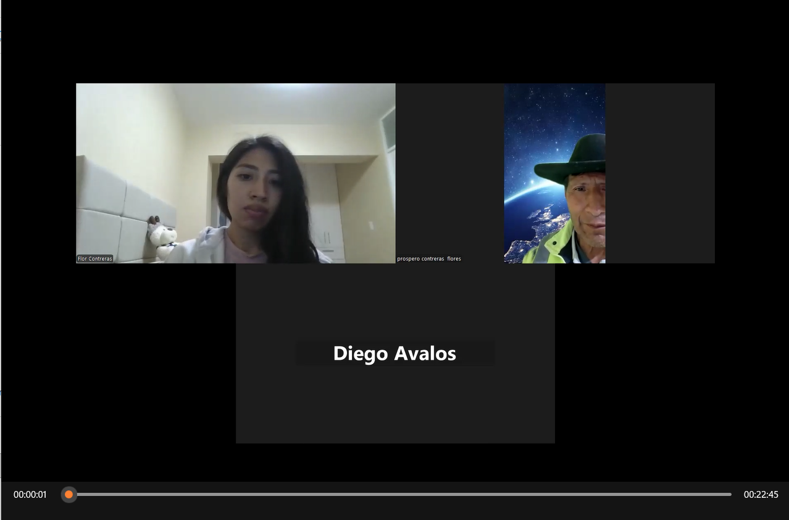

> **Video: (Inicio: 0:01)** https://drive.google.com/file/d/1Tz6K-Vu25Nc11ntZIFu9OCg2jnBY6UVq/view?usp=sharing

> **Resumen:**
> La entrevista realizada a Próspero Contreras Flores, ganadero ubicado en la región de Apurímac, describe la dinámica operativa y los desafíos clave en la gestión de un predio con aproximadamente 100 cabezas de ganado bajo un régimen de pastoreo extensivo. Actualmente, la administración del inventario y el registro de eventos de salud se realizan de forma rudimentaria mediante hojas de cálculo en Excel y cuadernos de notas, lo que genera vacíos significativos en la trazabilidad médica individual del hato y propicia pérdidas económicas por partos prematuros no supervisados y casos de abigeato (robo de ganado). La infraestructura local presenta una cobertura de internet intermitente (aproximadamente 50% de señal en los potreros), por lo que el productor requiere una herramienta digital multidispositivo (smartphone en campo y laptop en oficina) con capacidad de almacenamiento offline. La solución ideal demandada debe centralizar las fichas clínicas individuales, emitir notificaciones preventivas ajustadas al calendario sanitario andino (vacunación contra carbúnculo, desparasitación), predecir eventos reproductivos (detección de celos y proximidad de partos) y consolidar reportes administrativos de costos y mortalidad bajo un modelo de suscripción anual.

##### Entrevista 2

> **Entrevistado:** Meikoll Morell Bosa Cárdenas
> **Cargo/Rol:** Ingeniero zootecnista, propietario de la Hacienda del Marqués
> **Ubicación:** Pampa de Anta, Cusco, Perú
> **Duración:** 00:15:17
> **Entrevistador:** Flor Contreras

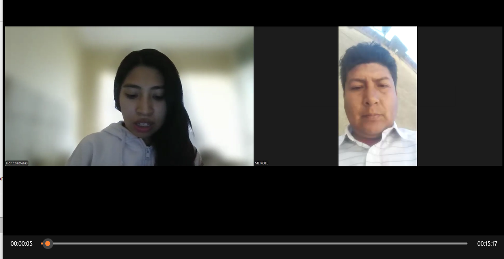

> **Video: (Inicio: 6:01)** https://drive.google.com/file/d/1Tz6K-Vu25Nc11ntZIFu9OCg2jnBY6UVq/view?usp=sharing

> **Resumen:**
> El ingeniero zootecnista Meikoll Morell Bosa Cárdenas, propietario de la Hacienda del Marqués en Pampa de Anta (Cusco), maneja 40 cabezas de ganado Brown Swiss bajo un régimen semi-extensivo, 20 toros en engorde intensivo y caballos peruanos de paso. Su principal canal de control actual consiste en fichas individuales ingresadas en Excel desde su laptop y smartphone, pero identifica que el mayor problema en su gestión es la falta de hábito para registrar las intervenciones inmediatamente después del trabajo de campo, lo que deriva en pérdida de historial clínico y de trazabilidad. Respecto a pérdidas económicas, señala eventos de negligencia en partos y accidentes en equinos, además de vulnerabilidad ante el abigeato, donde la geolocalización por microchip ha fallado por falta de señal en zonas rurales. Para optimizar su toma de decisiones, Meikoll muestra interés en adoptar una solución de software bajo suscripción anual, priorizando que funcione desde el teléfono en modo offline para actualizar datos automáticamente al recuperar conexión. Entre las funciones clave que exige destacan las notificaciones automáticas para campañas sanitarias (dosificación, vacunas y vitaminas), alertas sobre el tiempo y peso estimado en ganadería de engorde, módulos de control de costos por alimento y medicinas por cabeza para evaluar la rentabilidad de los ciclos trimestrales, y la capacidad de adjuntar fotografías de los animales como evidencia del estado físico y respaldo ante robos.

##### Entrevista 3

> **Entrevistado:** Grober Barrientos Talaverano
> **Cargo/Rol:** Médico veterinario zootecnista, encargado de la asistencia técnica en sanidad, manejo, alimentación y registros
> **Ubicación:** Fundo Agropecuario Yavi Yavi, Cusco, Perú
> **Duración:** 00:23:02
> **Entrevistador:** Flor Contreras

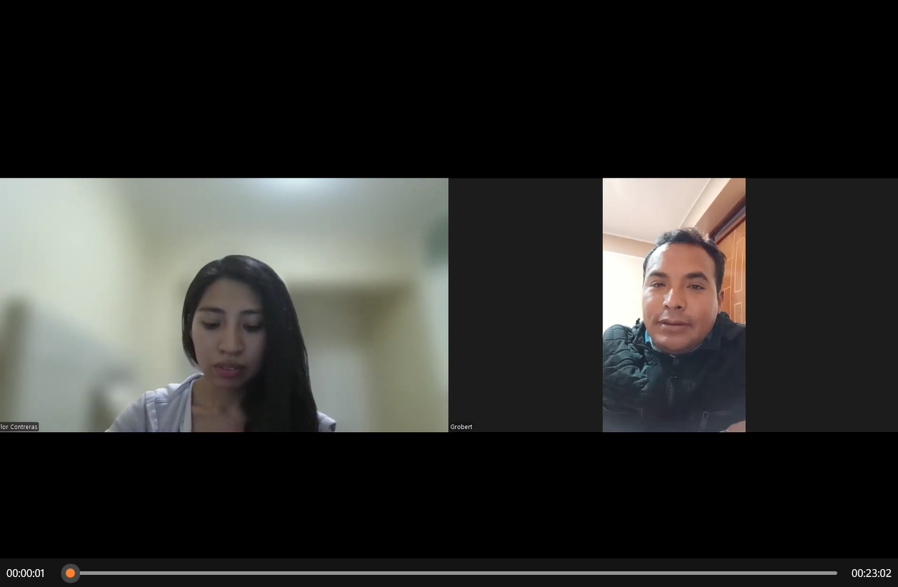

> **Video: (Inicio: 12:43)** https://drive.google.com/file/d/1Tz6K-Vu25Nc11ntZIFu9OCg2jnBY6UVq/view?usp=sharing

> **Resumen:**
> Grober Barrientos Talaverano, un médico veterinario zootecnista de 34 años. Grober trabaja en el Fundo Agropecuario Yavi Yavi (Cusco), donde se encarga de brindar asistencia técnica en sanidad, manejo, alimentación y registros de ganado. Durante la charla, Grober explicó que manejan animales criollos, cruzados y un lote de 65 cabezas productoras de leche (Brown Swiss y Fleckvieh). Actualmente utiliza Excel en su computadora para llevar sus registros, aunque enfrenta problemas de conectividad intermitente en la zona de pastoreo. Indicó que la principal causa de mortalidad bovina en su zona es el mal de altura en terneros, cuyos primeros signos suelen evidenciarse en la reducción del movimiento y del tiempo de pastoreo. Por ello, destacó que le sería de gran utilidad una plataforma o sistema que registre y alerte sobre variaciones en las constantes fisiológicas (temperatura, frecuencias) y patrones de desplazamiento, además de permitir el filtrado por categorías, el control de costos e inventario y la generación de reportes e historiales de salud, sanidad y reproducción en tiempo real.

#### Segmento 2: Zootecnistas y Médicos Veterinarios

##### Entrevista 1

> **Entrevistado:** Darwin Carbajal Vilca
> **Cargo/Rol:** Médico veterinario zootecnista, criador de ganado Brown Swiss
> **Ubicación:** Puno, Perú
> **Duración:** 00:21:28
> **Entrevistador:** Flor Contreras

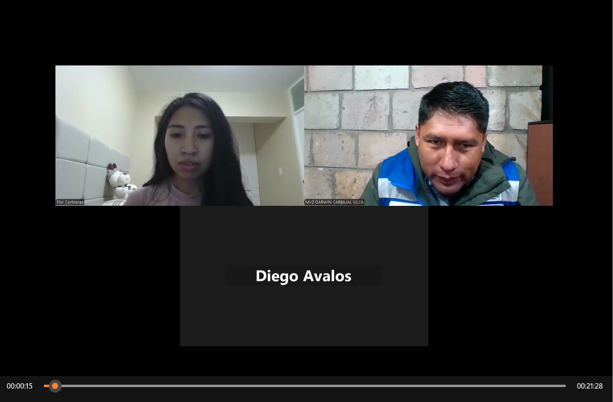

> **Video: (Inicio: 18:07)** https://drive.google.com/file/d/1Tz6K-Vu25Nc11ntZIFu9OCg2jnBY6UVq/view?usp=sharing

> **Resumen:**
> Darwin Carbajal Vilca, médico veterinario zootecnista y criador de ganado vacuno Brown Swiss en Puno con más de 18 años de experiencia en inseminación artificial, administra el fundo "Flores de Coña" con 26 animales de pedigree y PPC. Su jornada combina labor de campo e inspección en establo en primeras y últimas horas del día con trabajo de escritorio e investigación clínica. En su práctica médica identifica desafíos clave como la detección tardía del celo silencioso, reconocible habitualmente al segundo o tercer día por sangrado vulvar, y el impacto fatal de trastornos metabólicos de rápida evolución como el timpanismo o la intoxicación por ensilado alterado. Para optimizar su gestión, requiere una solución tecnológica integrada que permita registrar historias clínicas digitales en campo para validar fármacos administrados, recibir alertas preventivas sobre caídas en la rumia o alzas térmicas, analizar curvas epidemiológicas a nivel de hato y adjuntar evidencia ecográfica para agilizar los registros de gestación ante ASCRIGAR Perú.

##### Entrevista 2

> **Entrevistado:** Eliseo Ramírez Mena
> **Cargo/Rol:** Bachiller en Medicina Veterinaria y Zootecnia
> **Ubicación:** Perú
> **Duración:** 00:17:24
> **Entrevistador:** Flor Contreras

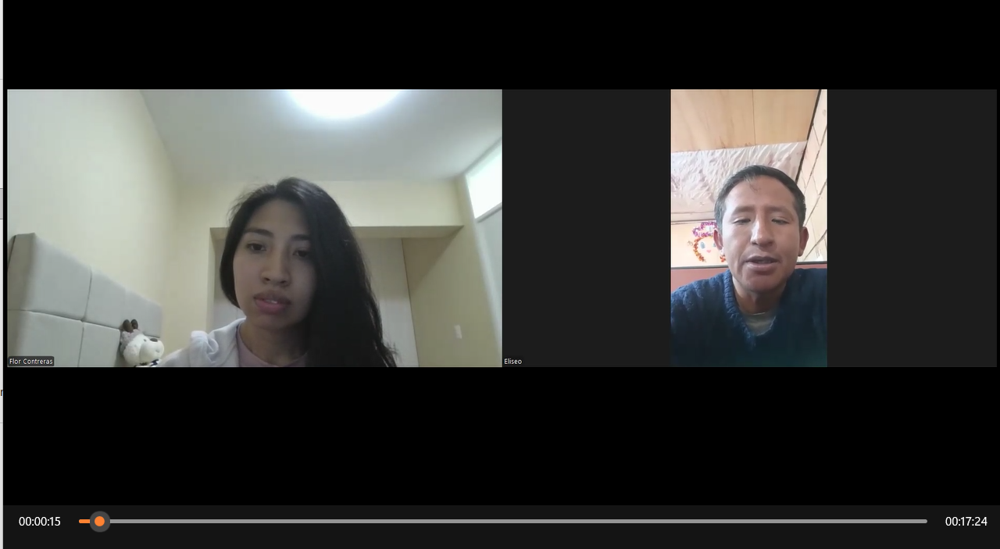

> **Video: (Inicio: 24:01)** https://drive.google.com/file/d/1Tz6K-Vu25Nc11ntZIFu9OCg2jnBY6UVq/view?usp=sharing

> **Resumen:**
> La entrevista expone la rutina laboral y las necesidades tecnológicas de Eliseo Ramírez Mena, bachiller en Medicina Veterinaria y Zootecnia con más de dos años de experiencia en el manejo de ganado vacuno y ovino. Su jornada diaria distribuye la mañana en labores de campo con los animales y la tarde en trabajo de oficina, registro de datos en computadora e impresión de informes para clientes. En el aspecto sanitario y reproductivo, Eliseo enfatiza que los tratamientos dependen del diagnóstico clínico observable, como la variación de temperatura, el apetito, la alteración de rumiación o conductas en celo, y del apoyo de colegas en casos complejos, así como del uso de intervenciones inmediatas ante emergencias metabólicas como el timpanismo gaseoso. Frente a la propuesta de un software y una aplicación móvil veterinaria, el especialista prioriza la utilidad de sincronizar imágenes de ecógrafos para evaluar la gestación en tiempo real desde el celular, la emisión de alertas rojas automáticas cuando decaen las constantes vitales del animal, la automatización de reportes ejecutivos para sustituir el llenado manual en Excel, y la integración de módulos nutricionales que identifiquen deficiencias minerales o de nutrientes en la dieta del ganado.

##### Entrevista 3

> **Entrevistado:** Dionisio Rodríguez
> **Cargo/Rol:** Zootecnista
> **Ubicación:** Chile (con trabajo de campo en Perú)
> **Duración:** 00:16:31
> **Entrevistador:** Flor Contreras

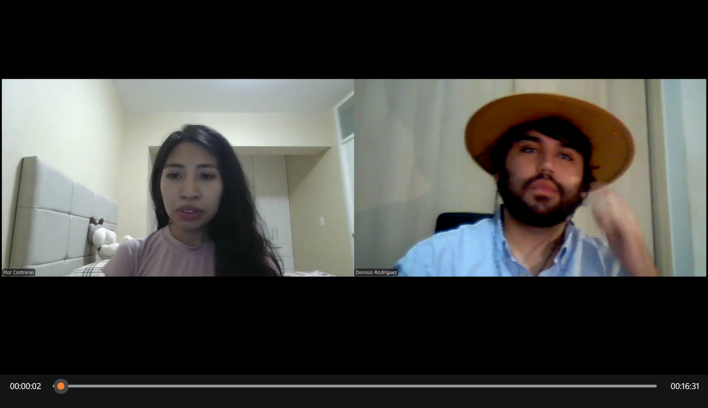

> **Video: (Inicio: 29:32)** https://drive.google.com/file/d/1Tz6K-Vu25Nc11ntZIFu9OCg2jnBY6UVq/view?usp=sharing

> **Resumen:**
> Esta entrevista explora las necesidades operativas y tecnológicas de Dionisio Rodríguez, zootecnista chileno con trabajo de campo en Perú, para guiar el desarrollo de la plataforma ganadera ICHU de SmartFarm. Rodríguez explica que pasa la mayor parte de su jornada en el terreno registrando datos y fotos en su teléfono inteligente, reservando la computadora de oficina para la elaboración de informes. Para la detección temprana de enfermedades metabólicas o infecciosas y la identificación de celos silenciosos, fundamenta su diagnóstico en el seguimiento continuo de la temperatura corporal, la inactividad, la disminución de la rumia y los cambios de conducta, recurriendo a exámenes de laboratorio solo en casos complejos. En cuanto al diseño de la plataforma, solicita alertas automáticas ante fiebres o partos, reportes exportables a Excel o PDF, e integración directa con equipos de campo como ecógrafos portátiles y software de nutrición para evitar la duplicidad en el registro de información.

### 2.2.3. Análisis de entrevistas.

#### Análisis de entrevistas del Segmento 1: Medianos y Grandes Ganaderos

Para complementar las entrevistas en profundidad del Segmento 1, se aplicó un cuestionario estructurado a 2 ganaderos (propietarios y administradores de estancias de Apurímac y Cusco) con el objetivo de cuantificar su contexto operativo, sus pérdidas económicas actuales y sus preferencias sobre el modelo de negocio y las funcionalidades del software. A continuación, se presenta el análisis porcentual de los resultados y, posteriormente, el análisis cualitativo según los resúmenes de las entrevistas realizadas.

##### Análisis porcentual según los gráficos del cuestionario

**1. ¿Qué herramientas utiliza actualmente para el control del inventario de animales? (2 respuestas)**

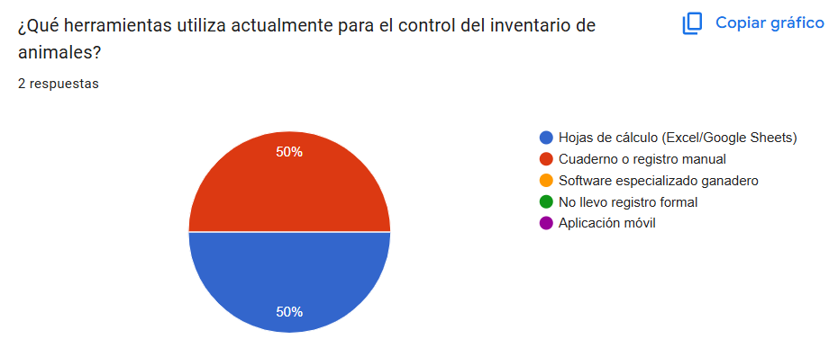

*Figura 1. Elaboración propia a partir de los datos recolectados. Startup SmartFarm.*

Como muestra el gráfico, el **50% utiliza hojas de cálculo (Excel/Google Sheets) y el 50% restante cuaderno o registro manual**; ningún ganadero emplea software especializado ganadero ni aplicación móvil. Este patrón confirma que el 100% del segmento digitaliza de forma rudimentaria o no digitaliza nada, sin ningún uso de herramientas especializadas. Además, el registro se divide entre lo semi-digital (Excel) y lo totalmente análogo (cuaderno), lo que genera trazabilidad fragmentada. En consecuencia, ICHU debe incorporar una **migración simple desde Excel y cuadernos hacia la ficha digital por animal**, sin exigir competencias técnicas avanzadas a usuarios acostumbrados a registrar en papel.

**2. Si existiera una plataforma web que centralizara el historial de salud, ubicación y alertas de cada animal, ¿qué tan útil sería para su negocio? (2 respuestas)**

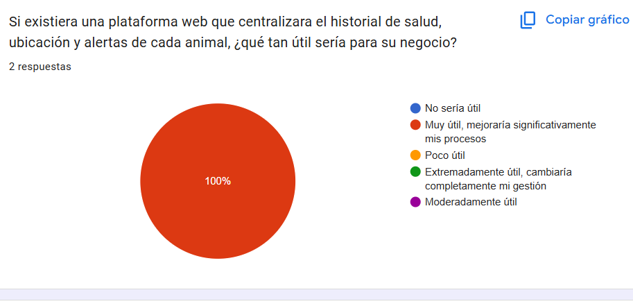

*Figura 2. Elaboración propia a partir de los datos recolectados. Startup SmartFarm.*

El gráfico evidencia una validación total de la propuesta de valor: el **100% de los ganaderos calificó la plataforma centralizada como "Muy útil, mejoraría significativamente mis procesos"**, sin ninguna respuesta neutra o negativa. Este dato porcentual respalda directamente el núcleo del producto ICHU: la centralización del historial de salud, la ubicación y las alertas por animal en un único sistema, frente a la dispersión actual en Excel y cuadernos que los propios entrevistados identifican como su principal debilidad de gestión.

##### Contexto operativo del segmento (respuestas complementarias)

Las respuestas del cuestionario complementan el perfil del segmento con los siguientes datos cuantificados:

- **Escala y manejo:** el 100% maneja entre **51 y 200 cabezas** (coincide con los 100 cabezas de Próspero y las 40 + 20 de engorde de Meikoll); el **50% trabaja bajo pastoreo extensivo y el 50% bajo régimen mixto**, confirmando que el modo offline es obligatorio.
- **Conectividad:** el **100% califica la conectividad en las zonas de pastoreo como regular (solo en algunas zonas)**, evidencia directa que sostiene la conectividad híbrida LoRaWAN/celular con sincronización retrasada del collar.
- **Pérdidas económicas:** el **100% reportó pérdidas del 5-10% del valor del hato en el último año** por enfermedades no detectadas a tiempo, y el **100% califica el abigeato como un problema frecuente y costoso**. Ambos datos dimensionan el retorno esperado de la solución.
- **Modelo de suscripción:** el **100% prefiere el pago anual con tarifa fija**, validando el modelo comercial definido en la estrategia 3 y coincidiendo con lo declarado por Próspero y Meikoll en sus entrevistas.
- **Notificaciones deseadas:** el **100% desea recibir todas las notificaciones automáticas** (alertas de temperatura anormal, recordatorios de revacunación, alertas de parto y celo, avisos de cuarentena), con énfasis explícito en las alertas de parto y celo como grupo prioritario.
- **Tablero de control:** las preferencias se dividen entre **inventario actualizado y movimientos (50%)** y **horas de actividad y alertas de celo (50%)**; ambas vías corresponden a los contextos de Gestión del Hato y Monitoreo Biométrico.
- **Monitoreo individual vs. por lotes:** el segmento valora ambos enfoques (50% menciona monitoreo por lote, 50% monitoreo individual), concluyendo que el monitoreo individual "ayuda a tomar mejores decisiones y corregir en el momento oportuno": la individualización por animal es la apuesta correcta del producto.

##### Análisis cualitativo según los resúmenes de entrevistas

El cruce de los tres resúmenes del Segmento 1 (Próspero Contreras Flores, Meikoll Morell Bosa Cárdenas y Grober Barrientos Talaverano) revela un patrón de necesidades convergente:

- **Registro fragmentado y sin trazabilidad.** Los tres trabajan con Excel y/o cuadernos (Próspero: Excel + cuaderno; Meikoll: fichas individuales en Excel; Grober: Excel en computadora), coincidiendo con el gráfico de herramientas (50% Excel / 50% cuaderno). Próspero lo resume: los servicios veterinarios son "puntuales" y no existe ficha clínica por animal; Meikoll identifica que el problema raíz es la **falta de hábito de registro** inmediato tras el trabajo de campo, lo que deriva en pérdida de historial clínico.

- **Conectividad intermitente como restricción de diseño.** Próspero reporta señal en solo el 50% de sus potreros, Grober enfrenta conectividad intermitente en la zona de pastoreo, y Meikoll, aunque tiene buena señal con Movistar y Claro, experimentó fallas de señal durante la propia entrevista en Apurímac. El 100% del cuestionario lo confirma ("regular, solo en algunas zonas"). Los tres exigen que la aplicación funcione **offline y sincronice automáticamente al recuperar conexión**.

- **Alertas sanitarias y reproductivas como demanda común.** Próspero pide notificaciones ajustadas al calendario sanitario andino (carbúnculo, desparasitación) y predicción de partos con una semana de anticipación; Meikoll exige notificaciones para campañas sanitarias y alertas de tiempo/peso en engorde; Grober solicita alertas sobre variaciones de constantes fisiológicas y patrones de desplazamiento (el mal de altura en terneros, primera causa de mortalidad en su zona, se manifiesta primero como reducción del movimiento y del tiempo de pastoreo). El cuestionario lo cuantifica: el 100% desea el paquete completo de notificaciones, con prioridad en parto y celo.

- **Abigeato y geolocalización como dolor patrimonial.** Próspero ha sufrido robos de 15-20 ganados y lo califica de "golpe a la ganadería"; Meikoll no pudo recuperar 2 de 3 caballos robados pese a tener microchip por falta de señal rural; ambos ganaderos del cuestionario lo califican como problema "frecuente y costoso". Las respuestas abiertas proponen la solución: GPS en el animal con monitoreo automático de movimiento, reemplazando al microchip que ya falló por falta de señal.

- **Control de costos y rentabilidad como lenguaje gerencial.** Próspero pide presupuesto por campaña sanitaria y reportes mensuales de muertes, enfermos, celos e inseminaciones; Meikoll exige control de costo por kilo y balance trimestral del engorde; Grober solicita control de costos e inventario con filtrado por categorías. Los reportes ejecutivos deben incluir producción de leche por día, consumo de alimento y constantes fisiológicas, según las respuestas abiertas.

- **Suscripción anual y valor estratégico.** Los tres aceptan el modelo de suscripción, que Próspero y Meikoll declaran expresamente anual, y el 100% del cuestionario ratifica "pago anual con tarifa fija". Grober añade el potencial de certificaciones (mejoramiento genético por PPC y su base de datos) y mejoramiento genético a partir de registros multi-generacionales (días abiertos, índice de fertilidad, producción per cápita anual), que amplían el valor del sistema más allá del monitoreo diario.

En síntesis, las entrevistas del Segmento 1 validan los pilares de la solución: **ficha digital individual centralizada (migración desde Excel/cuaderno), conectividad híbrida con modo offline obligatorio, alertas sanitarias y reproductivas basadas en el calendario ganadero, geolocalización contra el abigeato, control de costos por cabeza y modelo de suscripción anual**.

#### Análisis de entrevistas del Segmento 2: Zootecnistas y Médicos Veterinarios

Para complementar las entrevistas en profundidad del Segmento 2, se aplicó un cuestionario estructurado a 3 profesionales del sector (zootecnistas y médicos veterinarios) con el objetivo de cuantificar sus prácticas diagnósticas, sus umbrales clínicos de referencia y sus preferencias sobre las funcionalidades del software. A continuación, se presenta el análisis porcentual de los resultados y, posteriormente, el análisis cualitativo según los resúmenes de las entrevistas realizadas.

##### Análisis porcentual según los gráficos del cuestionario

**1. ¿Qué dispositivos informáticos utiliza habitualmente para registrar el historial de tratamientos y diagnósticos? (3 respuestas)**

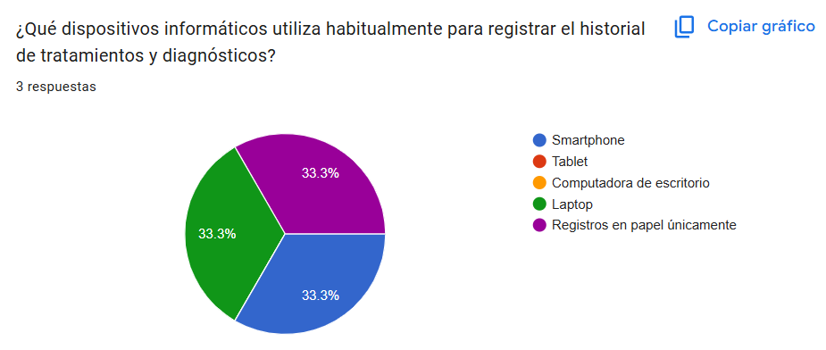

*Figura 3. Elaboración propia a partir de los datos recolectados. Startup SmartFarm.*

Como muestra el gráfico, los dispositivos de registro se distribuyen de forma exactamente equitativa: **33.3% smartphone, 33.3% laptop y 33.3% registros en papel únicamente**. Ningún profesional emplea tablet ni computadora de escritorio como dispositivo principal. Este patrón porcentual evidencia que un tercio del segmento aún no digitaliza su información clínica, mientras que los dos tercios restantes dependen de dispositivos móviles o portátiles. En consecuencia, la plataforma ICHU debe responder con una **aplicación móvil de primera clase** (compatible con smartphones y laptops) que además ofrezca un proceso de migración simple para trasladar los registros en papel hacia el sistema digital centralizado.

**2. ¿Qué tan confiables son los registros manuales de vacunación, inseminación y medicamentos en los establos que asesora? (3 respuestas)**

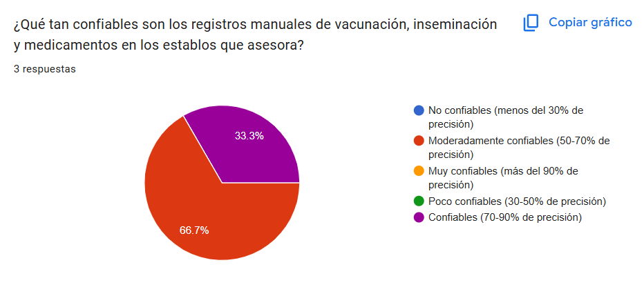

*Figura 4. Elaboración propia a partir de los datos recolectados. Startup SmartFarm.*

Según el gráfico, el **66.7% de los entrevistados califica los registros manuales como moderadamente confiables (50-70% de precisión)** y el **33.3% restante como confiables (70-90% de precisión)**. Es destacable que **ningún profesional los considera muy confiables ni confiables al 100%**, es decir, el 100% reconoce un margen de error de al menos un 10% en la información clínica que hoy sostiene sus decisiones. Este dato porcentual valida directamente la propuesta de valor de ICHU: historias clínicas digitales con trazabilidad completa (qué se aplicó, cuándo y quién), reduciendo riesgos ya observados por los propios entrevistados, como intoxicaciones por dosificación repetida o fallos de preñez por vacunación omitida.

**3. ¿Qué parámetro cuantitativo continuo desearía conocer del animal pero que actualmente le es imposible medir de forma manual? (3 respuestas)**

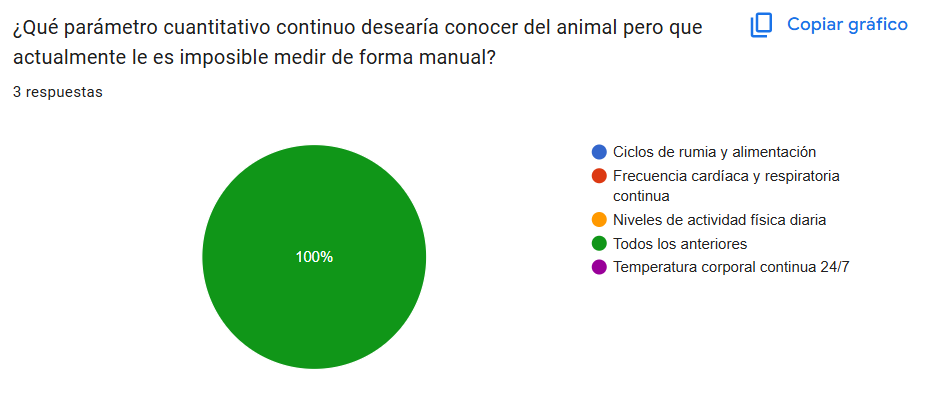

*Figura 5. Elaboración propia a partir de los datos recolectados. Startup SmartFarm.*

El gráfico evidencia un resultado unánime: el **100% de los entrevistados seleccionó "Todos los anteriores"**, es decir, desea medir de forma continua los **ciclos de rumia y alimentación, la frecuencia cardíaca y respiratoria, los niveles de actividad física diaria y la temperatura corporal continua 24/7**. La unanimidad absoluta del segmento convierte a estos cuatro parámetros en el **núcleo obligatorio de telemetría biométrica** que el collar inteligente de ICHU debe capturar, ya que constituyen variables que la observación manual no logra registrar de manera precisa y sostenida.

##### Análisis cualitativo según los resúmenes de entrevistas

El cruce de los tres resúmenes del Segmento 2 (Darwin Carbajal Vilca, Eliseo Ramírez Mena y Dionisio Rodríguez) revela un patrón de necesidades convergente:

- **Trabajo bifásico campo-oficina.** Los tres profesionales dividen su jornada: labor de campo e inspección en establo en primeras y últimas horas del día (Darwin), mañana en campo y tarde en oficina con registro en computadora (Eliseo), y registro en el terreno desde el smartphone reservando la oficina para informes (Dionisio). Esto confirma el hallazgo porcentual de dispositivos y exige que ICHU ofrezca **sincronización bidireccional entre la app móvil en campo y la plataforma web de oficina**.

- **Diagnóstico basado en variables continuas no medibles a mano.** Darwin fundamenta su práctica en la detección de celo silencioso (reconocido tardíamente al segundo o tercer día por sangrado vulvar) y en trastornos metabólicos de evolución fatal como el timpanismo; Eliseo diagnostica según la variación de temperatura, apetito, alteración de rumiación y conductas de celo; Dionisio realiza seguimiento continuo de temperatura corporal, inactividad, disminución de rumia y cambios de conducta. Los tres coinciden con el gráfico de parámetros (100% "Todos los anteriores"): **necesitan monitoreo biométrico continuo** que anticipe lo que hoy solo detectan visualmente cuando el cuadro ya está avanzado.

- **Alertas preventivas como prioridad compartida.** Darwin pide alertas por caídas de rumia o alzas térmicas; Eliseo solicita alertas rojas automáticas cuando decaen las constantes vitales; Dionisio requiere alertas ante fiebres o partos. Esta triple convergencia posiciona al **motor de alertas automáticas** como la funcionalidad más crítica del producto para este segmento, preferiblemente inmediata para cuadros graves y con resumen diario para cambios menores.

- **Historia clínica digital centralizada.** Darwin necesita registrar historias clínicas digitales en campo para validar fármacos administrados; Eliseo quiere sustituir el llenado manual en Excel por reportes automáticos; Dionisio busca evitar la duplicidad de registros. Los tres coinciden con el dato de confiabilidad (66.7% solo moderada) en que **el registro fragmentado y manual es el principal dolor operativo** del segmento.

- **Integración con equipos de campo y entidades oficiales.** Darwin requiere adjuntar evidencia ecográfica para agilizar registros de gestación ante ASCRIGAR Perú; Eliseo prioriza sincronizar imágenes de ecógrafos para evaluar gestación en tiempo real desde el celular; Dionisio pide integración directa con ecógrafos portátiles y software de nutrición. Además, Eliseo y Dionisio coinciden en demandar **módulos nutricionales** que identifiquen deficiencias minerales o de nutrientes. Esta convergencia define un requisito arquitectónico clave para la **API RESTful de ICHU**: interoperabilidad con dispositivos de diagnóstico por imagen y sistemas externos de nutrición.

- **Reportes ejecutivos comparativos.** Dionisio solicita reportes exportables a Excel o PDF y Eliseo automatización de reportes ejecutivos; ambos coinciden con la necesidad expresada en el cuestionario de graficar enfermedades por establecimiento, mortalidad y problemas reproductivos por mes, lo que sustenta el **módulo de analítica del ICHU Web Application**.

En síntesis, las entrevistas del Segmento 2 validan cuantitativa y cualitativamente los pilares de la solución: **telemetría biométrica continua (rumia, temperatura, actividad, frecuencias cardíaca y respiratoria), motor de alertas clínicas configurables, historia clínica digital centralizada con API abierta, soporte móvil offline y reportes exportables**.

## 2.3. Needfinding.

En esta sección se consolidan y sintetizan los hallazgos cualitativos y cuantitativos obtenidos durante la fase de investigación de campo, entrevistas en profundidad y análisis competitivo. El proceso de Needfinding nos permite transformar los datos brutos recolectados de los actores del sector ganadero en artefactos visuales y estructurados de diseño de experiencia de usuario (UX), garantizando que el desarrollo del ecosistema de software ICHU responda de manera directa a las necesidades reales, dolores operativos y metas estratégicas de cada perfil de usuario.

### 2.3.1. User Personas.

**Introducción y método de construcción**

Para la construcción de los arquetipos de usuario, el equipo procesó la información recolectada en la fase de entrevistas y el análisis del mercado ganadero. Se identificaron dos patrones de comportamiento que representan a los dos segmentos objetivo definidos para el ecosistema de software ICHU.

Del análisis de entrevistas se tomaron como insumo principal las herramientas de registro que utiliza cada segmento, el estado de la conectividad en sus zonas de trabajo, las pérdidas económicas declaradas, los dispositivos de preferencia y los parámetros que cada perfil necesita conocer del animal. Del análisis competitivo se incorporaron las expectativas de precio y de modalidad de contratación, junto con las funcionalidades que los competidores ya ofrecen y que condicionan lo que cada segmento espera encontrar.

**Segmento 1: Medianos y Grandes Ganaderos.** Propietarios y administradores de unidades productivas, enfocados en la rentabilidad, la reducción de pérdidas por mortalidad y abigeato, y la toma de decisiones a partir de indicadores del hato.

**User Persona 1: Cesar Flores**

Arquetipo del Segmento 1, construido a partir de los patrones identificados en las entrevistas a Próspero Contreras, Meikoll Morell y Grober Barrientos.

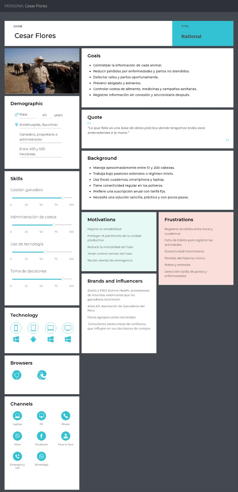

**Segmento 2: Zootecnistas y Médicos Veterinarios.** Profesionales orientados al monitoreo biométrico continuo, al diagnóstico clínico temprano y a la revisión de historiales de salud consolidados.

**User Persona 2: Leonardo Rosales**

Arquetipo del Segmento 2, construido a partir de los patrones identificados en las entrevistas a Darwin Carbajal, Eliseo Ramírez y Dionisio Rodríguez.

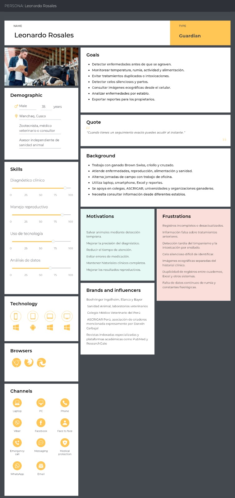

Ambas fichas fueron elaboradas en UXPressia y contemplan los atributos propios de un arquetipo: datos demográficos, biografía, personalidad, habilidades, objetivos, frustraciones, tecnología de preferencia, marcas e influencias, y canales de interacción.

### 2.3.2. User Task Matrix.

El User Task Matrix concentra las tareas que cada arquetipo ejecuta para cumplir sus objetivos. Se trata de actividades que ambos segmentos realizan hoy con independencia de que exista una solución de software, por lo que no deben confundirse con funcionalidades del sistema. Las tareas se identificaron a partir de las descripciones de jornada recogidas en las seis entrevistas.

La frecuencia expresa con qué regularidad se ejecuta la tarea y la importancia expresa cuánto afecta al objetivo del arquetipo que la tarea se realice mal o no se realice. Ambas se valoran en tres niveles: alta, media y baja.

| Tarea | Cesar Flores: frecuencia | Cesar Flores: importancia | Leonardo Rosales: frecuencia | Leonardo Rosales: importancia |
|---|---|---|---|---|
| Recorrer el potrero y contar las cabezas del hato | Alta | Alta | Baja | Baja |
| Observar el comportamiento del animal para detectar anomalías | Alta | Alta | Alta | Alta |
| Tomar constantes fisiológicas de un animal sospechoso | Media | Alta | Alta | Alta |
| Registrar un evento sanitario o reproductivo | Media | Alta | Alta | Alta |
| Consultar los antecedentes clínicos de un animal | Media | Alta | Alta | Alta |
| Identificar individualmente a un animal por su arete | Alta | Media | Alta | Media |
| Coordinar la visita de un profesional veterinario | Media | Alta | No aplica | No aplica |
| Desplazarse entre predios para atender a distintos clientes | Baja | Baja | Alta | Alta |
| Programar y ejecutar una campaña sanitaria | Baja | Alta | Media | Alta |
| Aplicar un tratamiento o una inseminación | Baja | Alta | Alta | Alta |
| Verificar el resultado de un tratamiento aplicado | Media | Alta | Alta | Alta |
| Buscar un animal extraviado en el terreno | Baja | Alta | Baja | Baja |
| Registrar costos de alimento, medicinas e insumos | Media | Alta | Baja | Media |
| Elaborar reportes para sustentar decisiones | Baja | Media | Alta | Alta |
| Consultar el calendario sanitario de la región | Baja | Media | Media | Alta |
| Interpretar imágenes ecográficas de gestación | No aplica | No aplica | Media | Alta |
| Evaluar la rentabilidad del ciclo productivo | Baja | Alta | Baja | Baja |

**Lectura del cuadro**

Las tareas de mayor frecuencia e importancia para Cesar Flores son el recorrido del potrero con el conteo de cabezas y la observación del comportamiento animal. Ambas son actividades de vigilancia que consumen buena parte de su jornada y cuyo resultado determina si un problema se detecta a tiempo. Le siguen en importancia, aunque con menor frecuencia, la coordinación de la visita veterinaria y la búsqueda de animales extraviados: son tareas esporádicas, pero cada ocurrencia tiene consecuencias económicas directas.

Para Leonardo Rosales, la concentración de frecuencia e importancia se desplaza hacia la consulta de antecedentes clínicos, la toma de constantes, la aplicación de tratamientos y la elaboración de reportes. Su jornada se reparte entre el trabajo de campo y el de oficina, y ambas mitades dependen de información que hoy está dispersa.

La coincidencia más relevante entre ambos arquetipos está en la observación del comportamiento animal y en el registro de eventos: los dos ejecutan estas tareas con alta frecuencia e importancia, pero las registran en soportes distintos y sin conexión entre sí, lo que explica la duplicidad de información que ambos segmentos reportaron.

La diferencia más marcada está en el alcance geográfico. Cesar Flores concentra todas sus tareas en una sola unidad productiva, mientras que Leonardo Rosales se desplaza entre varios predios, lo que convierte la portabilidad de la información en una necesidad exclusiva del Segmento 2. Una segunda diferencia es el eje económico: la evaluación de rentabilidad y el control de costos son tareas propias del administrador y resultan marginales para el profesional veterinario.

### 2.3.3. User Journey Mapping.

Los User Journey Maps que se presentan a continuación describen el recorrido actual de cada arquetipo, en la situación previa a la existencia de la solución. Se elaboran en su versión As-Is con el fin de evidenciar, sobre la secuencia real de actividades, en qué momentos se concentran los puntos de dolor identificados durante las entrevistas. Por esa razón, ninguna etapa incorpora la plataforma ICHU ni los dispositivos que forman parte de la propuesta: los canales representados son los medios que los entrevistados utilizan hoy, es decir cuadernos de campo, hojas de cálculo, comunicación telefónica, observación directa del animal y visita presencial.

El recorrido de Cesar Flores abarca el ciclo de gestión de su hato, desde el recorrido matinal de supervisión hasta el cierre económico de la campaña, e incluye los episodios críticos de detección tardía de enfermedad y de pérdida de animales por muerte o abigeato. El recorrido de Leonardo Rosales abarca la atención de una emergencia sanitaria en un establo que asesora, desde la recepción del aviso telefónico hasta el informe entregado al propietario y el seguimiento posterior del tratamiento aplicado.

Ambos mapas fueron elaborados en UXPressia y están vinculados a la ficha de User Persona correspondiente dentro de la misma herramienta.

**User Journey Map As-Is de Cesar Flores**

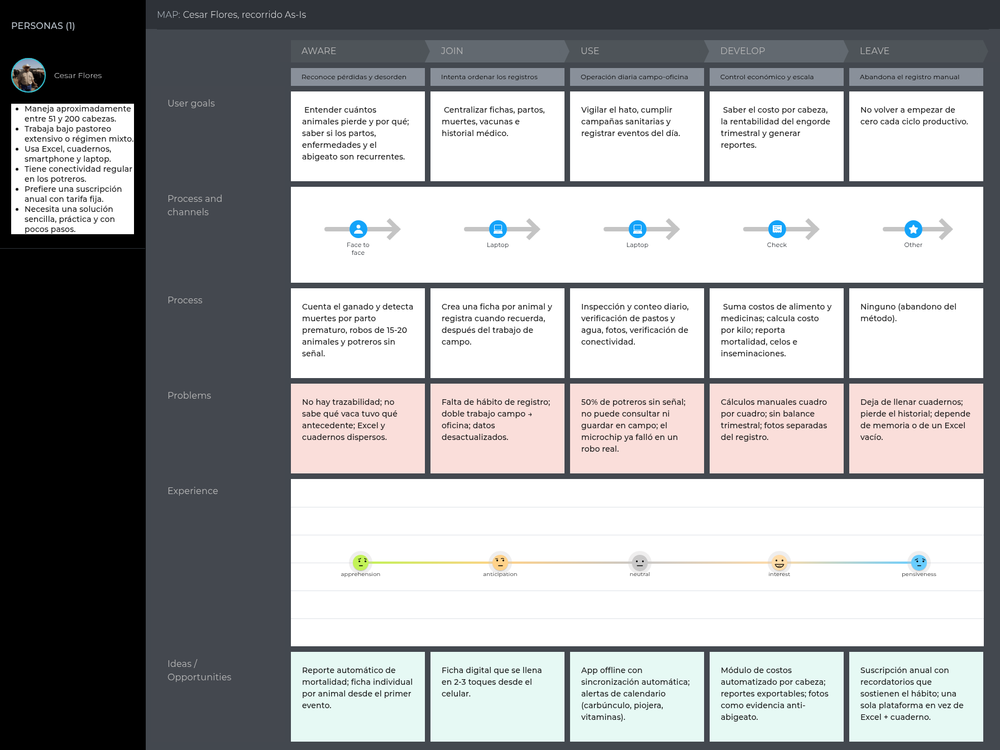

*Figura 6. Elaboración de creación propia por datos recolectados, startup SmartFarm.*

**User Journey Map As-Is de Leonardo Rosales**

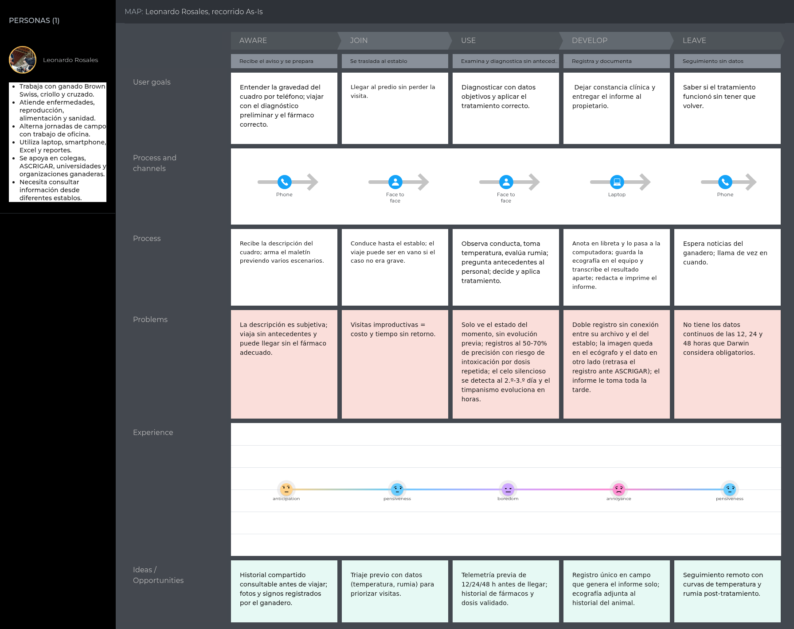

*Figura 7. Elaboración de creación propia por datos recolectados, startup SmartFarm.*

**Lectura de los recorridos**

En el recorrido de Cesar Flores, la emoción desciende en dos momentos concretos: cuando descubre que un animal lleva días enfermo sin que él lo advirtiera, y cuando constata una pérdida por muerte o robo. Ambos comparten la misma causa, que es la ausencia de información entre el instante en que el problema comienza y el instante en que se vuelve visible.

En el recorrido de Leonardo Rosales, el punto más bajo se sitúa en la consulta de antecedentes, porque es el momento en que comprueba que la información sobre la cual debe decidir es incompleta o poco confiable. Los tramos siguientes heredan esa limitación: el diagnóstico se emite con datos parciales y el seguimiento posterior queda sin verificación.

Ambos recorridos convergen en que el registro se realiza siempre después de la actividad, nunca durante, y en un soporte que no está disponible para la otra parte cuando lo necesita.

### 2.3.4. Empathy Mapping.

Para la elaboración de los Empathy Maps, el equipo partió de la ficha de cada User Persona y colocó al arquetipo en el centro del lienzo. A partir de ahí, cada integrante aportó observaciones derivadas de los resúmenes de entrevista, respondiendo de forma sucesiva a las preguntas que estructuran la herramienta: con quién se empatiza, qué necesita hacer, qué dice, qué ve, qué hace, qué escucha, y cómo se siente y qué piensa. La sesión cerró con la identificación de los Pains, a partir de la pregunta sobre qué le preocupa, y de los Gains, a partir de la pregunta sobre qué puede ayudar a resolver sus problemas y qué podría convencerlo de que la propuesta es la alternativa adecuada.

**Empathy Map de Cesar Flores**

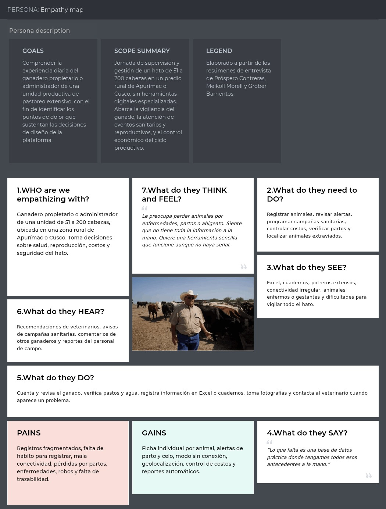

Se empatiza con un ganadero propietario o administrador de una unidad de 51 a 200 cabezas, ubicada en una zona rural de Apurímac o Cusco, que toma las decisiones sobre salud, reproducción, costos y seguridad del hato.

Necesita registrar animales, revisar alertas, programar campañas sanitarias, controlar costos, verificar partos y localizar animales extraviados. Lo que ve a diario son hojas de cálculo, cuadernos, potreros extensos, conectividad irregular y animales enfermos o gestantes cuya vigilancia completa le resulta inabordable. Escucha recomendaciones de veterinarios, avisos de campañas sanitarias, comentarios de otros ganaderos y reportes de su personal de campo. Lo que hace es contar y revisar el ganado, verificar pastos y agua, registrar información en hojas de cálculo o cuadernos, tomar fotografías y contactar al veterinario cuando aparece un problema. Lo resume en una frase: "Lo que falta es una base de datos práctica donde tengamos todos esos antecedentes a la mano".

Piensa y siente que le preocupa perder animales por enfermedades, partos o abigeato, y que no tiene toda la información a la mano. Aspira a una herramienta sencilla que funcione aunque no haya señal.

Sus **Pains** son los registros fragmentados, la falta de hábito para registrar, la mala conectividad, las pérdidas por partos, enfermedades y robos, y la ausencia de trazabilidad. Sus **Gains** son la ficha individual por animal, las alertas de parto y celo, el modo sin conexión, la geolocalización, el control de costos y los reportes automáticos.

**Empathy Map de Leonardo Rosales**

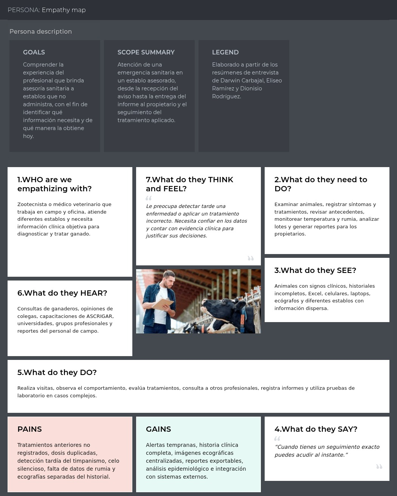

Se empatiza con un zootecnista o médico veterinario que trabaja en campo y en oficina, atiende diferentes establos y necesita información clínica objetiva para diagnosticar y tratar ganado.

Necesita examinar animales, registrar síntomas y tratamientos, revisar antecedentes, monitorear temperatura y rumia, analizar lotes y generar reportes para los propietarios. Lo que ve son animales con signos clínicos, historiales incompletos, hojas de cálculo, celulares, laptops, ecógrafos y establos distintos con información dispersa. Escucha consultas de ganaderos, opiniones de colegas, capacitaciones de la asociación de criadores, universidades, grupos profesionales y reportes del personal de campo. Lo que hace es realizar visitas, observar el comportamiento, evaluar tratamientos, consultar a otros profesionales, registrar informes y recurrir a pruebas de laboratorio en los casos complejos. Lo resume así: "Cuando tienes un seguimiento exacto puedes acudir al instante".

Piensa y siente que le preocupa detectar tarde una enfermedad o aplicar un tratamiento incorrecto. Necesita confiar en los datos y contar con evidencia clínica para justificar sus decisiones.

Sus **Pains** son los tratamientos anteriores no registrados, las dosis duplicadas, la detección tardía del timpanismo, el celo silencioso, la falta de datos de rumia y las ecografías separadas del historial. Sus **Gains** son las alertas tempranas, la historia clínica completa, las imágenes ecográficas centralizadas, los reportes exportables, el análisis epidemiológico y la integración con sistemas externos.

## 2.4. Big Picture EventStorming.

El Big Picture EventStorming permite al equipo construir una comprensión compartida del dominio ganadero antes de tomar cualquier decisión de diseño. A diferencia de las técnicas orientadas a la solución, esta sesión se concentra en los hechos relevantes que ocurren en el negocio, con independencia de qué sistema los registre.

**Desarrollo de la sesión**

La sesión se organizó en cuatro etapas sucesivas, siguiendo la secuencia habitual de la técnica.

En la **exploración caótica**, cada integrante escribió en notas de color naranja los hechos relevantes del dominio que había identificado en las entrevistas, redactados siempre en pasado y desde la perspectiva del negocio, sin discutir todavía su orden ni su pertinencia.

En el **ordenamiento temporal**, el equipo dispuso los eventos sobre una línea de tiempo que recorre el ciclo productivo del hato, desde la incorporación del animal hasta su baja, y resolvió los duplicados y las formulaciones ambiguas.

En la **identificación de eventos pivote**, se marcaron los hechos que separan fases claramente distintas del proceso de negocio y que, por lo tanto, anticipan las fronteras entre contextos.

En la **detección de hot spots**, se señalaron con notas rosadas las zonas de desacuerdo, de reglas de negocio no resueltas o de dependencia respecto de terceros, que requieren validación posterior con los usuarios.

**Pendiente:** capturas de las cuatro etapas de la sesión de Big Picture EventStorming elaboradas en la herramienta de pizarra colaborativa, junto con la fotografía del equipo durante la sesión.

**Domain Events identificados, ordenados temporalmente**

| Fase del negocio | Domain Events |
|---|---|
| Incorporación del animal | Animal registrado en el hato, Arete asignado al animal, Animal incorporado a un lote, Etapa productiva registrada |
| Asignación de dispositivos | Collar recibido por la unidad productiva, Collar vinculado al animal, Primera lectura recibida del collar |
| Vigilancia diaria | Lectura biométrica capturada, Lectura almacenada en el borde, Lectura sincronizada con el servicio central, Posición del animal registrada |
| Detección de anomalías | Umbral de temperatura superado, Caída de rumia detectada, Patrón de actividad inusual detectado, Animal ubicado fuera de la zona de pastoreo |
| Atención sanitaria | Alerta emitida al responsable, Alerta atendida, Animal examinado, Diagnóstico registrado, Tratamiento aplicado, Periodo de retiro iniciado, Periodo de retiro concluido |
| Ciclo reproductivo | Celo detectado, Servicio registrado, Preñez confirmada por ecografía, Parto registrado, Cría registrada en el hato |
| Planificación sanitaria | Campaña sanitaria programada, Recordatorio de campaña emitido, Aplicación registrada por animal, Campaña cerrada |
| Cierre del ciclo | Costo de campaña consolidado, Indicadores del periodo calculados, Reporte entregado al propietario |
| Salida del animal | Animal dado de baja por muerte, Animal dado de baja por venta, Robo de animal denunciado, Collar liberado |

**Eventos pivote**

El equipo identificó cuatro hechos que marcan cambios de fase en el proceso de negocio y que, por lo tanto, señalan fronteras candidatas entre contextos:

- **Collar vinculado al animal.** Separa la gestión del inventario de dispositivos de la vigilancia del animal. A partir de este hecho, la telemetría deja de pertenecer a un aparato y pasa a pertenecer a un ser vivo con historia.
- **Umbral de temperatura superado.** Separa la captura de datos de la respuesta sanitaria. Antes de este hecho el sistema observa, después interviene.
- **Diagnóstico registrado.** Separa la sospecha de la certeza clínica y habilita el tratamiento, el periodo de retiro y la trazabilidad de lo aplicado.
- **Animal dado de baja.** Cierra la historia del animal y determina qué información alimenta los indicadores de mortalidad del periodo.

**Hot spots**

| Zona de incertidumbre | Descripción | Cómo se resolverá |
|---|---|---|
| Umbrales por etapa productiva | No existe consenso sobre si el umbral térmico debe ser único o variar según edad, raza y etapa. Darwin propuso valores distintos para terneros y adultos | Validar con los tres profesionales del Segmento 2 antes de fijar los valores por defecto |
| Autoría del registro en campo | No está definido si el operario puede registrar un diagnóstico o únicamente una observación | Resolver como regla de negocio en la definición de roles |
| Dependencia de la asociación de criadores | El registro de gestación ante la asociación sigue un procedimiento externo que el equipo no controla | Verificar el procedimiento vigente antes de comprometer cualquier integración |
| Precisión de la ubicación | La lectura de posición tiene un margen de error que puede generar falsas salidas de zona | Definir una tolerancia configurable y validarla en el piloto |
| Conciliación de registros sin conexión | No está resuelto qué ocurre cuando un registro creado sin cobertura afecta a un animal que fue dado de baja entretanto | Definir la regla de conflicto durante el diseño táctico |

## 2.5. Ubiquitous Language.

El Lenguaje Ubicuo (Ubiquitous Language) es el vocabulario compartido y riguroso que utiliza tanto el equipo de desarrollo como los actores del dominio ganadero para referirse a los mismos conceptos sin ambigüedad, tal como lo describe Eric Evans en su libro *Domain-Driven Design: Tackling Complexity in the Heart of Software*. Este glosario fue construido a partir de las entrevistas realizadas a los dos segmentos objetivo y se organiza según los Bounded Contexts definidos para la plataforma ICHU. Recoge únicamente términos del dominio ganadero, es decir, conceptos que los propios ganaderos, zootecnistas y médicos veterinarios emplean en su actividad. No se incluyen términos técnicos del área de ingeniería de software, aunque algunos de ellos aparezcan más adelante en el diseño de la solución.

### Términos transversales del dominio

| Término | Español | Descripción |
|---|---|---|
| **Herd** | Hato | Conjunto total de ganado vacuno que posee una unidad productiva; unidad de supervisión y control del ganadero. |
| **Ear Tag** | Arete | Identificador físico visible colocado en la oreja del animal; número de identificación individual con el que los productores nombran a cada vaca. |
| **Cattle Rustling** | Abigeato | Robo de ganado; principal amenaza patrimonial identificada en las entrevistas del Segmento 1. |
| **Silent Heat** | Celo silencioso | Estado reproductivo en el que la vaca no manifiesta signos externos evidentes de celo; suele detectarse tardíamente (2-3 días después) por sangrado vulvar. |
| **Days Open** | Días abiertos | Intervalo entre el parto y la nueva preñez de una vaca; indicador clave de eficiencia reproductiva. |
| **Bloat** | Timpanismo | Trastorno metabólico digestivo de rápida evolución por acumulación de gases en el rumen, que puede causar la muerte del animal en horas. |
| **High Mountain Disease** | Mal de altura | Principal causa de mortalidad de terneros en zonas andinas; se manifiesta primero como reducción del movimiento y del tiempo de pastoreo. |
| **Breed Registry** | Registro de criadores / ASCRIGAR Perú | Asociación de criadores que registra la genealogía (pedigree) y los nacimientos del ganado vacuno; actúa como entidad de registro reproductivo ("la RENIEC de las vacas"). |
| **Purebred and Performance Certificate (PPC)** | Registro de Pureza Pedigrí y Crecimiento | Certificación de linaje de un animal gestionada por la asociación de criadores de registro. |
| **Livestock Calendar** | Calendario ganadero | Calendario sanitario regional preestablecido que determina las épocas de campañas (ej. vacunación contra carbúnculo entre mayo y julio, control de piojera en junio). |
| **Livestock Task** | Faena ganadera | Actividad operativa programada sobre el ganado: dosificación, vacunación, vitaminación, revisión. |

### Identity & Access Management

| Término | Español | Descripción |
|---|---|---|
| **Herd Advisory** | Asesoría del hato | Relación por la cual un profesional atiende de forma periódica el ganado de una unidad productiva que no administra; se inicia por acuerdo con el propietario y puede terminar cuando este lo decide. |
| **Advisory Scope** | Alcance de la asesoría | Conjunto de animales de una unidad productiva sobre los que el profesional tiene competencia para diagnosticar, prescribir y registrar intervenciones. |
| **Colegiatura** | Colegiatura | Número de registro del profesional ante el colegio médico veterinario, que acredita su habilitación para ejercer. |

### Profiles

| Término | Español | Descripción |
|---|---|---|
| **Cattle Rancher** | Ganadero propietario | Usuario del Segmento 1 que posee la unidad productiva, compra el plan y decide sobre la operación del hato. |
| **Farm Administrator** | Administrador de estancia | Usuario del Segmento 1 encargado de la gestión diaria y de los reportes de la unidad productiva. |
| **Veterinarian / Zootechnician** | Médico Veterinario / Zootecnista | Usuario del Segmento 2 que brinda asistencia técnica, diagnósticos y tratamientos sobre hatos de terceros. |
| **Ranch** | Fundo / Estancia / Hacienda | Unidad productiva ganadera identificada con nombre propio y ubicación geográfica (ej. Hacienda del Marqués, Fundo Flores de Coña). |

### Cattle Information

| Término | Español | Descripción |
|---|---|---|
| **Cattle** | Ganado vacuno | Entidad central del dominio; el conjunto de bovinos gestionados por una unidad productiva. |
| **Individual Record** | Ficha individual | Registro único por animal con su identificación, raza, etapa, sexo y datos reproductivos. |
| **Breed** | Raza | Clasificación genética del animal (Brown Swiss, Fleckvieh, criollo, cruzado). |
| **Life Stage** | Etapa | Fase de desarrollo del animal: ternero, vaquilla, vaquillona, vaca en producción, toro en engorde. |
| **Lot** | Lote | Agrupación de animales por criterio de manejo (edad, raza, potrero, categoría productiva). |
| **Paddock** | Potrero | Parcela de pastoreo donde se ubica un grupo de animales; define el régimen de pastoreo y los días de descanso del pasto. |
| **Genealogy** | Genealogía | Registro de ascendencia del animal (padre, madre) requerido para los registros de pedigree y PPC. |
| **Pregnancy Status** | Estado de preñez / gestación | Estado reproductivo de la vaca, con fecha probable de parto calculada desde la inseminación. |
| **Fertility Index** | Índice de fertilidad | Indicador derivado de los días abiertos y los ciclos de celo del animal. |
| **Physiological Baseline** | Constante fisiológica de referencia | Rango normal de temperatura (37-39.5 °C) y frecuencias cardíaca y respiratoria de una vaca adulta sana. |

### IoT Assets

| Término | Español | Descripción |
|---|---|---|
| **Smart Collar** | Collar inteligente | Dispositivo IoT físico colocado en el cuello del animal que captura temperatura, actividad, rumia y ubicación. |
| **Device Band** | Banda | Correa/accesorio del collar que se asigna a un animal específico y puede reemplazarse sin cambiar el dispositivo electrónico. |
| **Device Assignment** | Asignación de dispositivo | Relación entre un collar, un cliente y una vaca concreta, gestionada según el plan contratado. |
| **Battery Level** | Nivel de batería | Energía disponible del dispositivo; su vida útil promocionada es de hasta 3 años. |
| **Device Status** | Estado del collar | Condición operativa del collar según su última comunicación: en servicio, sin señal o con batería baja. |
| **Blind Zone** | Zona ciega | Área de pastoreo sin cobertura de red donde el collar almacena la información del animal en memoria local. |

### Operations & Monitoring

| Término | Español | Descripción |
|---|---|---|
| **Telemetry** | Telemetría | Datos capturados por el collar: temperatura corporal, ubicación, actividad física, ciclos de rumia y alimentación, frecuencias cardíaca y respiratoria. |
| **Rumination** | Rumia | Proceso de masticación regurgitada del bovino; su caída sostenida es la señal temprana más crítica de trastorno metabólico o intoxicación. |
| **Red Alert** | Alerta roja | Notificación inmediata de máxima prioridad enviada al celular cuando una constante vital decae o se cruza un umbral crítico (fiebre > 40 °C, hipotermia < 37 °C). |
| **Clinical Threshold** | Umbral clínico | Valor de referencia calibrado con los veterinarios (ej. neumonía a partir de 38.5-39 °C) que dispara las alertas del sistema. |
| **Last Known Location** | Última posición conocida | Dato de ubicación más reciente registrado por el collar, consultable incluso sin conexión. |
| **Geofence** | Geocerca | Límite virtual del potrero o del predio; su cruce genera una alerta de posible extravío o robo. |
| **Insemination Event** | Evento de inseminación | Registro con fecha del cruzamiento o inseminación artificial de una vaca, base para la predicción del parto. |
| **Time Since Insemination** | Tiempo desde la inseminación | Días transcurridos desde el evento reproductivo, usados para programar el diagnóstico de gestación y la alerta de parto (1 semana antes). |
| **Estrus Detection** | Detección de celo | Identificación algorítmica de celo a partir del cruce de picos de actividad, temperatura y caída de producción; incluye la variante silenciosa. |

### Planning

| Término | Español | Descripción |
|---|---|---|
| **Activity Planning** | Planificación de actividad | Programación de las faenas ganaderas sobre el calendario: vacunación, desparasitación, vitaminación, revisiones. |
| **Health Campaign** | Campaña sanitaria | Acción colectiva programada sobre el hato o parte de él, según la época del calendario ganadero (ej. campaña contra la piojera). |
| **Reminder** | Recordatorio | Notificación anticipada que avisa que una actividad programada se acerca ("te toca dosificar tal día"). |
| **Quarantine** | Cuarentena | Periodo de aislamiento programado ante una epidemia o el ingreso de nuevos animales. |
| **Gestation Window** | Periodo de gestación | Ventana estimada de parto por animal, generada automáticamente a partir del evento de inseminación. |
| **Fattening Cycle** | Ciclo de engorde | Programa de engorde intensivo con duración típica de tres meses, con seguimiento de días y peso estimado. |

### Dashboard & Analytics

| Término | Español | Descripción |
|---|---|---|
| **Key Performance Indicator (KPI)** | Indicador clave | Métrica de seguimiento: mortalidad mensual, animales enfermos, celos detectados, inseminaciones, producción de leche por día, costos por cabeza. |
| **Epidemiological Curve** | Curva epidemiológica | Gráfico de avance o control de una enfermedad en el hato a lo largo del tiempo. |
| **Executive Report** | Reporte ejecutivo | Documento exportable (Excel, PDF o Word) con los datos del hato: salud, sanidad, reproducción y finanzas. |
| **Fattening Balance** | Balance de engorde | Comparación de gasto vs. ganancia por ciclo trimestral y por cabeza. |
| **Trend** | Tendencia | Patrón histórico derivado de los datos consolidados del hato (enfermedades por época, días abiertos, producción per cápita anual). |

### Subscription Plans

| Término | Español | Descripción |
|---|---|---|
| **Plan** | Plan | Modalidad de suscripción contratada por el cliente, con límites de animales y dispositivos. |
| **Annual Subscription** | Suscripción anual | Modelo de pago anual con tarifa fija preferido por los entrevistados del Segmento 1. |
| **Device Limit** | Límite de dispositivos | Cantidad máxima de collares/bandas habilitadas según el plan, definida por el tamaño del hato. |
| **Plan Coverage** | Cobertura del plan | Conjunto de prestaciones incluidas en la modalidad contratada, como los reportes avanzados o el aviso por mensaje de texto. |
| **Renewal** | Renovación | Proceso de continuidad del servicio al finalizar el periodo contratado. |
