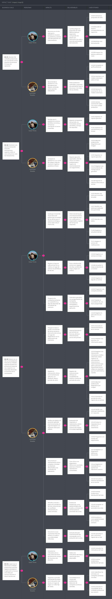
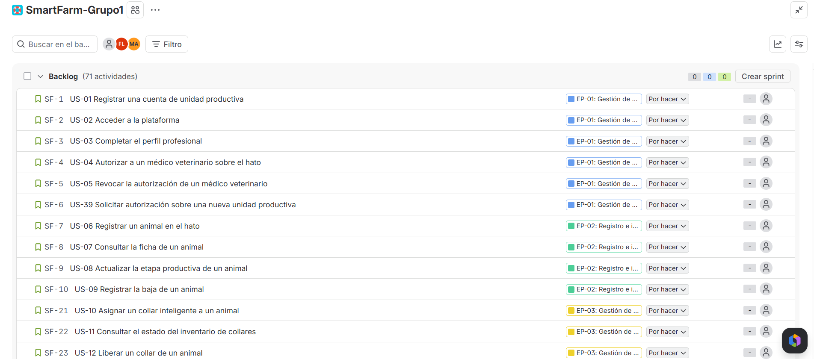

# Capítulo III: Requirements Specification
Los problemas, objetivos y necesidades identificados durante la investigación se traducen aquí en los requisitos de ICHU, el producto de la startup SmartFarm. La especificación abarca los dos segmentos objetivo, medianos y grandes ganaderos por un lado y zootecnistas y médicos veterinarios por otro, e incluye la Landing Page, las aplicaciones web y móvil, los servicios internos (RESTful API central y Edge API) y el dispositivo IoT.

**Roles considerados en la especificación**

Los dos segmentos objetivo agrupan a los usuarios por su relación con el negocio. Dentro del Segmento 1 conviven dos roles operativos que ejecutan tareas distintas sobre la misma unidad productiva, y que las entrevistas identificaron con claridad:

| Rol | Segmento | Sustento en la investigación |
|---|---|---|
| **Administrador ganadero** | Segmento 1 | Propietario o gestor de la unidad productiva. Decide la compra, evalúa costos y consulta indicadores. Corresponde a Próspero Contreras y Meikoll Morell. |
| **Operario de campo** | Segmento 1 | Personal que ejecuta las faenas en el potrero. No decide la compra, pero es quien registra los eventos y busca a los animales. Aparece en la entrevista de Meikoll, que señala la "falta de hábito para registrar las intervenciones inmediatamente después del trabajo de campo", y en la de Grober, responsable de "asistencia técnica en sanidad, manejo, alimentación y registros". |
| **Médico veterinario** | Segmento 2 | Profesional que diagnostica y prescribe. Corresponde a Darwin Carbajal, Eliseo Ramírez y Dionisio Rodríguez. |
| **Visitante** | No aplica | Rol base para el sitio web estático, sin cuenta en la plataforma. |
| **Desarrollador** | No aplica | Rol empleado en las Technical Stories, correspondientes a los productos sin interacción directa con el usuario final. |

El operario de campo no constituye un tercer segmento objetivo. Es un rol operativo dentro del Segmento 1, cuya adopción del producto depende de la decisión de compra del administrador, por lo que no se le construye un arquetipo propio.

**Criterios de especificación**

Los criterios de aceptación siguen la estructura Gherkin (Given-When-Then) y se redactan en tiempo presente y tercera persona. Cada criterio cumple tres condiciones:

- **Es independiente de la interfaz.** No se menciona ningún control, vista, color ni gesto de interacción, de modo que el criterio conserva su validez ante cualquier cambio en la propuesta visual.
- **Es comprobable.** Cada cláusula `Then` nombra la entidad del dominio afectada, los datos que quedan registrados, el estado al que transita el objeto o el umbral que se evalúa.
- **Aporta información adicional.** Cada escenario incorpora una condición verificable distinta de la descripción de la historia, e incluye un escenario alternativo o de error cuando el flujo lo admite.

## 3.1. User Stories

Los requisitos se organizan en doce Epics alineados con los Bounded Contexts definidos para la plataforma en el Ubiquitous Language. Esta correspondencia garantiza la trazabilidad entre lo que el negocio necesita y la manera en que se descompone la solución.

| Epic | Bounded Context asociado | Producto digital principal |
|---|---|---|
| EP-01 Gestión de cuenta y acceso | Identity & Access Management, Profiles | Web y móvil |
| EP-02 Registro e información del ganado | Cattle Information | Web y móvil |
| EP-03 Gestión de dispositivos IoT | IoT Assets | Web App |
| EP-04 Monitoreo y telemetría del ganado | Operations & Monitoring | Web y móvil |
| EP-05 Alertas preventivas y seguridad | Operations & Monitoring | Móvil y web |
| EP-06 Operación de campo sin conexión | Operations & Monitoring | Mobile App |
| EP-07 Historial y atención veterinaria | Cattle Information, Operations & Monitoring | Web y móvil |
| EP-08 Planificación del calendario ganadero | Planning | Web y móvil |
| EP-09 Análisis para la toma de decisiones | Dashboard & Analytics | Web App |
| EP-10 Landing Page y suscripciones | Subscription Plans | Landing Page |
| EP-11 Plataforma IoT e integración de servicios | Transversal (técnico) | Aplicación embebida, Edge API y RESTful API |
| EP-12 Control del abrevadero | Operations & Monitoring | Aplicación embebida, web y móvil |

**Epics, User Stories y Technical Stories**

| Epic / Story ID | Título | Descripción | Criterios de aceptación | Relacionado con (Epic ID) |
| --- | --- | --- | --- | --- |
| EP-01 | Gestión de cuenta y acceso | Agrupa las capacidades de registro, autenticación y autorización de acceso de terceros sobre la información de un hato. | No aplica | No aplica |
| US-01 | Registrar una cuenta de unidad productiva | Como administrador ganadero, deseo registrar mi unidad productiva en ICHU, para gestionar mi hato desde la plataforma. | Given que el correo indicado no está asociado a ninguna cuenta When se registra la unidad productiva con nombre, región, distrito y número estimado de cabezas Then la cuenta queda creada en estado `pendiente de verificación` y se asocia al administrador como propietario de la unidad.  Given que el correo indicado ya está asociado a una cuenta existente When se intenta registrar la unidad productiva Then el registro no se crea y el sistema informa que el correo ya está en uso. | EP-01 |
| US-02 | Acceder a la plataforma | Como usuario registrado, deseo acceder a la plataforma con mis credenciales, para operar sobre la información que me corresponde. | Given que las credenciales corresponden a una cuenta verificada When se solicita el acceso Then la sesión queda iniciada con el rol asociado a la cuenta y con el alcance de las unidades productivas a las que tiene acceso.  Given que se registran cinco intentos fallidos consecutivos sobre la misma cuenta When se solicita un nuevo acceso Then el sistema bloquea temporalmente la cuenta durante 15 minutos y registra el intento con su fecha y hora. | EP-01 |
| US-03 | Completar el perfil profesional | Como médico veterinario, deseo completar mi perfil con mi especialidad, número de colegiatura y años de experiencia, para que los ganaderos que me autoricen conozcan mis credenciales. | Given que el perfil profesional está incompleto When se registran especialidad, número de colegiatura y años de experiencia Then el perfil pasa a estado `completo` y sus datos quedan disponibles para los administradores que evalúen autorizarlo.  Given que el número de colegiatura ya figura en otro perfil verificado When se intenta guardar el perfil Then el sistema rechaza el registro e indica la duplicidad del número de colegiatura. | EP-01 |
| US-04 | Autorizar a un médico veterinario sobre el hato | Como administrador ganadero, deseo autorizar a un médico veterinario a consultar y registrar información clínica de mi hato, para que pueda atender a mis animales con datos completos. | Given que el médico veterinario tiene un perfil profesional completo When el administrador le concede autorización sobre su unidad productiva Then la autorización queda registrada con su fecha de inicio y el alcance concedido, y el veterinario accede únicamente a los animales de esa unidad.  Given que la autorización define una fecha de vencimiento When esa fecha se cumple Then la autorización pasa a estado `vencida` y las consultas posteriores del veterinario sobre ese hato son rechazadas. | EP-01 |
| US-05 | Revocar la autorización de un médico veterinario | Como administrador ganadero, deseo revocar la autorización concedida a un médico veterinario, para retirar su acceso cuando termina la relación de asesoría. | Given que existe una autorización vigente When el administrador la revoca Then la autorización pasa a estado `revocada` con la fecha del cambio, y los registros clínicos previamente creados por ese veterinario se conservan con su autoría original. | EP-01 |
| US-39 | Solicitar autorización sobre una nueva unidad productiva | Como médico veterinario, deseo solicitar autorización sobre el hato de un ganadero que acaba de contratarme, para acceder a su información sin depender de que él sepa dónde concederla. | Given que el veterinario tiene un perfil profesional completo y la unidad productiva existe When solicita autorización sobre ella indicando el motivo de la asesoría Then la solicitud queda registrada en estado `pendiente` y se pone a disposición del administrador de esa unidad para su decisión.  Given que ya existe una solicitud pendiente o una autorización vigente del mismo veterinario sobre esa unidad When se intenta registrar una nueva solicitud Then no se crea la solicitud y el sistema indica el estado de la relación existente.  Given que el administrador rechaza la solicitud When se registra la decisión Then la solicitud pasa a estado `rechazada` con su fecha, y el veterinario no accede a ningún dato de esa unidad productiva. | EP-01 |
| EP-02 | Registro e información del ganado | Agrupa las capacidades para mantener la identidad y los datos productivos de cada animal del hato. | No aplica | No aplica |
| US-06 | Registrar un animal en el hato | Como administrador ganadero, deseo registrar un animal con su identificación y sus datos productivos, para incorporarlo a la gestión del hato. | Given que el número de arete no está registrado en la unidad productiva When se registra el animal con número de arete, raza, sexo, fecha de nacimiento y etapa productiva Then el animal queda incorporado al hato en estado `activo` y se le asigna un identificador interno único.  Given que el número de arete ya existe en la misma unidad productiva When se intenta registrar el animal Then el registro no se crea y el sistema indica el animal que ya ocupa ese número de arete. | EP-02 |
| US-07 | Consultar la ficha de un animal | Como administrador ganadero, deseo consultar la ficha de un animal, para conocer su identificación, su etapa productiva y el collar que tiene asignado. | Given que el animal pertenece a una unidad productiva sobre la que se tiene acceso When se consulta su ficha Then el sistema entrega el número de arete, la raza, el sexo, la etapa productiva, el estado del animal, el collar asignado y la fecha de la última lectura recibida.  Given que el animal no tiene un collar asignado When se consulta su ficha Then el sistema entrega los datos de identificación e indica la ausencia de dispositivo asociado, sin datos de telemetría. | EP-02 |
| US-08 | Actualizar la etapa productiva de un animal | Como administrador ganadero, deseo actualizar la etapa productiva de un animal, para que los indicadores del hato reflejen su situación real. | Given que el animal se encuentra en estado `activo` When se registra un cambio de etapa productiva con su fecha de vigencia Then la nueva etapa queda registrada y la etapa anterior se conserva en el historial del animal con su periodo de vigencia.  Given que la fecha de vigencia indicada es posterior a la fecha actual When se intenta registrar el cambio Then el sistema rechaza la operación e indica que la fecha de vigencia no puede ser futura. | EP-02 |
| US-09 | Registrar la baja de un animal | Como administrador ganadero, deseo registrar la baja de un animal por muerte, venta o robo, para mantener el inventario del hato actualizado y medir la mortalidad real. | Given que el animal se encuentra en estado `activo` When se registra su baja con el motivo (muerte, venta, robo o descarte) y la fecha del evento Then el animal pasa a estado `inactivo`, deja de considerarse en el conteo del hato y el motivo queda disponible para el cálculo de la tasa de mortalidad.  Given que el animal tiene un collar asignado When se registra su baja Then el collar queda liberado y disponible para asignarse a otro animal. | EP-02 |
| EP-03 | Gestión de dispositivos IoT | Agrupa las capacidades para administrar el inventario de collares inteligentes y su asignación a los animales del hato. | No aplica | No aplica |
| US-10 | Asignar un collar inteligente a un animal | Como administrador ganadero, deseo asignar un collar inteligente a un animal, para que su telemetría quede vinculada a la ficha correspondiente. | Given que el collar está registrado en la unidad productiva y no tiene animal asignado When se asigna al animal indicado Then la asignación queda registrada con su fecha de inicio y las lecturas posteriores de ese collar se atribuyen a dicho animal.  Given que la cantidad de collares asignados alcanza el límite del plan contratado When se intenta asignar un collar adicional Then la asignación es rechazada y el sistema indica el límite del plan vigente. | EP-03 |
| US-11 | Consultar el estado del inventario de collares | Como administrador ganadero, deseo consultar el estado de mis collares, para identificar cuáles están sin señal o con batería baja antes de que dejen de reportar. | Given que la unidad productiva tiene collares registrados When se consulta el inventario de dispositivos Then el sistema entrega, por cada collar, el animal asignado, el nivel de batería de la última lectura y la fecha de la última comunicación recibida.  Given que un collar no reporta lecturas durante más de 48 horas When se consulta el inventario Then el collar figura en estado `sin comunicación` junto a la fecha de su última lectura. | EP-03 |
| US-12 | Liberar un collar de un animal | Como administrador ganadero, deseo liberar un collar del animal que lo porta, para reasignarlo cuando el animal causa baja o el dispositivo requiere mantenimiento. | Given que el collar tiene un animal asignado When se registra su liberación con el motivo correspondiente Then la asignación se cierra con su fecha de término, el collar pasa a estado `disponible` y la telemetría registrada durante el periodo de asignación se conserva vinculada al animal. | EP-03 |
| EP-04 | Monitoreo y telemetría del ganado | Agrupa las capacidades para consultar la información biométrica y de ubicación capturada por los collares. | No aplica | No aplica |
| US-13 | Consultar la telemetría reciente de un animal | Como administrador ganadero, deseo consultar la temperatura, la actividad y la ubicación reciente de un animal, para detectar oportunamente posibles anomalías. | Given que el collar asignado al animal ha transmitido lecturas válidas en las últimas 24 horas When se consulta su telemetría reciente Then el sistema entrega la temperatura corporal, el índice de actividad, las coordenadas y la fecha y hora de cada lectura del periodo.  Given que la última lectura válida tiene más de 24 horas de antigüedad When se consulta la telemetría reciente Then el sistema entrega la última lectura disponible e indica el tiempo transcurrido desde su registro. | EP-04 |
| US-14 | Consultar el historial biométrico de un animal | Como médico veterinario, deseo consultar la evolución de la temperatura, la actividad y la rumia de un animal en un periodo determinado, para sustentar mi diagnóstico con datos y no con una observación puntual. | Given que el veterinario cuenta con una autorización vigente sobre la unidad productiva When consulta el historial del animal para un periodo determinado Then el sistema entrega las lecturas del periodo junto con las alertas y los eventos clínicos registrados en las mismas fechas.  Given que el periodo solicitado excede la antigüedad de los datos conservados When se realiza la consulta Then el sistema entrega los datos disponibles e indica la fecha de la lectura más antigua conservada.  Given que la autorización del veterinario está vencida o revocada When intenta consultar el historial Then la consulta es rechazada y el intento queda registrado con su fecha y el motivo del rechazo. | EP-04 |
| US-15 | Definir las zonas de pastoreo permitidas | Como administrador ganadero, deseo delimitar las zonas de pastoreo permitidas de mi predio, para que el sistema pueda determinar cuándo un animal se encuentra fuera de ellas. | Given que se define un área cerrada de al menos tres vértices dentro del predio When se guarda la zona con su nombre y el lote de animales al que aplica Then la zona queda registrada y las lecturas de ubicación de esos animales se evalúan contra sus límites.  Given que el área definida no es un polígono cerrado o presenta lados que se cruzan When se intenta guardarla Then el sistema rechaza la definición e indica que el área no es válida para la evaluación de límites. | EP-04 |
| EP-05 | Alertas preventivas y seguridad | Agrupa las capacidades para detectar automáticamente anomalías de salud, eventos reproductivos y riesgos de robo o extravío. | No aplica | No aplica |
| US-16 | Recibir una alerta por anomalía de salud | Como administrador ganadero, deseo recibir una alerta cuando la temperatura o la actividad de un animal se desvíe de sus valores normales, para intervenir antes de que el cuadro se agrave. | Given que existe un umbral configurado para la especie y la etapa productiva del animal When una lectura supera ese umbral Then el sistema genera una alerta asociada al animal, con el tipo de anomalía, el valor detectado, el umbral superado y la fecha y hora de la lectura que la originó.  Given que existe una alerta abierta del mismo tipo para el mismo animal When se reciben nuevas lecturas que también superan el umbral dentro de las 6 horas siguientes Then el sistema incorpora las lecturas a la alerta existente y no genera una alerta adicional.  Given que el animal se encuentra en estado `inactivo` When se recibe una lectura que supera el umbral Then el sistema no genera alerta y descarta la lectura por corresponder a un animal dado de baja. | EP-05 |
| US-17 | Recibir una alerta por salida del área permitida | Como administrador ganadero, deseo recibir una alerta cuando un animal salga de la zona de pastoreo asignada, para reducir el riesgo de abigeato o extravío. | Given que el animal pertenece a un lote con una zona de pastoreo definida When su ubicación registrada se sitúa fuera de los límites de esa zona Then el sistema genera una alerta de seguridad con las coordenadas, la distancia respecto al límite más cercano y la fecha y hora del evento.  Given que el animal regresa a la zona permitida When se recibe la lectura que lo confirma Then la alerta registra el retorno con su fecha y hora, y conserva la duración total de la salida.  Given que la lectura de ubicación tiene una precisión declarada mayor al margen de tolerancia configurado When se evalúa contra los límites de la zona Then el sistema no genera alerta y registra la lectura como no concluyente. | EP-05 |
| US-18 | Identificar un posible evento reproductivo | Como administrador ganadero, deseo que el sistema identifique variaciones de actividad y temperatura compatibles con un celo, para no depender de la observación visual que hoy detecta el celo silencioso con dos o tres días de retraso. | Given que existen lecturas continuas de actividad y temperatura de los últimos siete días para una hembra en edad reproductiva When el patrón de las últimas 24 horas se desvía del patrón base del animal según el criterio configurado Then el sistema registra un indicador de posible evento reproductivo con la fecha estimada de inicio y las lecturas que lo sustentan.  Given que el animal registra menos de siete días de lecturas continuas When se evalúa el patrón reproductivo Then el sistema no genera el indicador e informa que no existe línea base suficiente para el análisis. | EP-05 |
| US-19 | Atender una alerta | Como administrador ganadero, deseo dejar constancia de que atendí una alerta y de lo que encontré, para medir nuestro tiempo de respuesta y conservar el antecedente del animal. | Given que existe una alerta en estado `abierta` When se registra su atención con el hallazgo y la acción tomada Then la alerta pasa a estado `atendida`, queda registrado el tiempo transcurrido entre su generación y su atención, y el hallazgo se incorpora al historial del animal.  Given que una alerta permanece en estado `abierta` más allá del plazo definido para su severidad When se evalúa su antigüedad Then el sistema la marca como `vencida sin atención` y conserva el registro para el cálculo de indicadores de respuesta. | EP-05 |
| US-40 | Recibir una alerta por tratamiento sin respuesta | Como médico veterinario, deseo recibir una alerta cuando un animal que traté no mejora dentro del plazo esperado, para reevaluar el diagnóstico antes de que el cuadro se agrave. | Given que existe una intervención clínica con un plazo de respuesta esperado definido When transcurre ese plazo y las constantes del animal no retornan al rango normal de su etapa productiva Then el sistema genera una alerta dirigida al veterinario que aplicó la intervención, con el tratamiento administrado, el plazo vencido y la evolución de las constantes durante el periodo.  Given que las constantes del animal retornan al rango normal antes de vencer el plazo When se evalúa la evolución Then no se genera alerta y la intervención se marca como `con respuesta favorable` junto a la fecha en que se normalizaron las constantes.  Given que el animal deja de transmitir lecturas durante el periodo de seguimiento When vence el plazo Then el sistema genera la alerta indicando que la evaluación es no concluyente por ausencia de telemetría. | EP-05 |
| EP-06 | Operación de campo sin conexión | Agrupa las capacidades que permiten al operario consultar y registrar información durante sus faenas en zonas con conectividad intermitente. | No aplica | No aplica |
| US-20 | Localizar un animal extraviado | Como operario de campo, deseo consultar la última ubicación registrada de un animal, para reducir el tiempo de búsqueda en el potrero. | Given que el animal tiene al menos una lectura de ubicación registrada When el operario consulta su ubicación Then la aplicación entrega las coordenadas de la última lectura, la fecha y hora de su registro y la distancia respecto a la posición actual del operario.  Given que el animal no tiene ninguna lectura de ubicación registrada When el operario realiza la consulta Then la aplicación informa la ausencia de ubicación y entrega la fecha de la última comunicación recibida del collar. | EP-06 |
| US-21 | Registrar un evento de salud durante la faena | Como operario de campo, deseo registrar lo que observo en el animal en el momento en que lo observo, para que la información no se pierda al terminar la jornada. | Given que el operario identifica un evento de salud When registra el animal, el tipo de evento, la fecha y una observación Then el evento queda registrado con el animal, el tipo, la fecha, el autor y su estado de sincronización, y se incorpora al historial del animal.  Given que el registro no incluye la identificación del animal o el tipo de evento When se intenta guardarlo Then el evento no se registra y la aplicación indica cuáles de los datos obligatorios faltan. | EP-06 |
| US-22 | Operar sin cobertura y sincronizar al recuperarla | Como operario de campo, deseo consultar fichas y registrar eventos sin cobertura celular, para mantener la continuidad de mis faenas en las zonas donde no hay señal. | Given que el dispositivo móvil no tiene cobertura When el operario consulta una ficha descargada previamente o registra un evento Then la aplicación entrega la información local indicando la fecha de su última actualización, y los registros creados quedan en estado `pendiente de sincronizar`.  Given que existen registros en estado `pendiente de sincronizar` y el dispositivo recupera la cobertura When se ejecuta la sincronización Then los registros se envían en el orden en que fueron creados y cada uno pasa a estado `sincronizado` o conserva el estado pendiente junto al motivo del fallo.  Given que un registro pendiente afecta a un animal que fue dado de baja mientras el dispositivo estaba sin cobertura When se ejecuta la sincronización Then el registro no se aplica, se conserva como conflicto y se informa el motivo para su revisión manual. | EP-06 |
| EP-07 | Historial y atención veterinaria | Agrupa las capacidades para centralizar la información clínica del animal y sustentar la atención profesional. | No aplica | No aplica |
| US-23 | Registrar una intervención clínica | Como médico veterinario, deseo registrar las vacunaciones, tratamientos e inseminaciones que aplico, para que el historial del animal refleje con exactitud qué se le administró y cuándo. | Given que el veterinario cuenta con autorización vigente sobre la unidad productiva When registra una intervención con su tipo, fecha, producto administrado, dosis y observación Then la intervención queda registrada en el historial del animal con la identificación del profesional que la aplicó.  Given que se registra un tratamiento cuyo periodo de retiro aún no ha vencido para ese animal When se intenta registrar una nueva aplicación del mismo producto Then el sistema advierte el periodo de retiro vigente y su fecha de término antes de admitir el registro.  Given que la intervención carece de fecha o de tipo When se intenta guardarla Then no se registra y el sistema indica los datos obligatorios faltantes. | EP-07 |
| US-24 | Preparar una atención con información previa | Como médico veterinario, deseo revisar de forma remota la telemetría y los eventos recientes de un animal antes de desplazarme al predio, para llegar con un diagnóstico preliminar. | Given que el veterinario cuenta con autorización vigente y el animal registra una alerta abierta When consulta su información previa a la atención Then el sistema entrega las lecturas del periodo de la alerta, los eventos registrados por el operario, las intervenciones clínicas previas y los periodos de retiro vigentes.  Given que el animal no registra intervenciones clínicas previas When se consulta su información Then el sistema entrega la telemetría y los eventos disponibles e indica la ausencia de antecedentes clínicos. | EP-07 |
| US-25 | Adjuntar evidencia de diagnóstico por imagen | Como médico veterinario, deseo adjuntar la imagen ecográfica al registro de una intervención reproductiva, para sustentar el diagnóstico de gestación sin duplicar el registro en otro sistema. | Given que existe una intervención reproductiva registrada para el animal When se adjunta una imagen de diagnóstico con su fecha de captura Then la imagen queda vinculada a esa intervención y disponible en el historial reproductivo del animal.  Given que el archivo adjunto excede el tamaño máximo admitido o no corresponde a un formato de imagen soportado When se intenta adjuntarlo Then el adjunto es rechazado y el sistema indica el límite o el formato admitido. | EP-07 |
| US-41 | Consultar el periodo de retiro vigente de un animal | Como médico veterinario, deseo conocer si un animal se encuentra dentro del periodo de retiro de algún producto, para indicar al ganadero si su leche o su carne pueden destinarse al consumo. | Given que el animal registra intervenciones con productos que declaran periodo de retiro When se consulta su situación de retiro Then el sistema entrega los productos con retiro vigente, la fecha de término de cada uno y el destino de producción restringido en cada caso.  Given que el animal no registra periodos de retiro vigentes When se realiza la consulta Then el sistema informa que su producción no presenta restricción e indica la fecha del último periodo de retiro concluido. | EP-07 |
| US-42 | Evaluar la respuesta de un animal a un tratamiento | Como médico veterinario, deseo comparar las constantes del animal antes y después de aplicar un tratamiento, para confirmar con datos si el protocolo está funcionando. | Given que existe una intervención clínica registrada y telemetría del animal anterior y posterior a su aplicación When se consulta la evaluación de respuesta Then el sistema entrega la temperatura, la actividad y la rumia promedio de las 48 horas previas y de las 12, 24 y 48 horas posteriores a la aplicación, junto con la variación entre ambos periodos.  Given que la telemetría posterior a la aplicación abarca menos de 12 horas When se solicita la evaluación Then el sistema entrega los datos disponibles e indica que el periodo mínimo de comparación aún no se cumple. | EP-07 |
| US-43 | Registrar un diagnóstico diferencial descartado | Como médico veterinario, deseo dejar constancia de las hipótesis diagnósticas que descarté y por qué, para que otro profesional que atienda al animal no repita el mismo análisis. | Given que existe un caso clínico abierto para el animal When se registra una hipótesis descartada con el motivo y el hallazgo que la descarta Then la hipótesis queda incorporada al caso clínico con la fecha y la autoría, y se presenta a cualquier profesional autorizado que consulte el caso.  Given que el caso clínico se cierra con un diagnóstico confirmado When se registra el cierre Then las hipótesis descartadas se conservan asociadas al caso y no pueden modificarse. | EP-07 |
| US-44 | Registrar el resultado de un examen de laboratorio externo | Como médico veterinario, deseo incorporar al historial del animal el resultado del laboratorio al que derivé la muestra, para que el diagnóstico quede sustentado en un solo lugar. | Given que existe un caso clínico abierto para el animal When se registra el resultado con el laboratorio de origen, la fecha de la toma de muestra, la fecha del resultado y el hallazgo Then el resultado queda vinculado al caso clínico y disponible en el historial del animal.  Given que la fecha de la toma de muestra es posterior a la fecha del resultado When se intenta registrar Then la operación es rechazada indicando la inconsistencia entre ambas fechas. | EP-07 |
| US-45 | Consultar el historial reproductivo de un animal | Como médico veterinario, deseo consultar los servicios, partos e intervalos reproductivos de una hembra, para decidir si continúa en el programa reproductivo o pasa a descarte. | Given que la hembra registra al menos un servicio o un parto When se consulta su historial reproductivo Then el sistema entrega los servicios con su fecha y método, los partos registrados, los días abiertos de cada intervalo y el número de servicios por preñez lograda.  Given que la hembra no registra eventos reproductivos When se realiza la consulta Then el sistema informa la ausencia de historial reproductivo y entrega su edad y etapa productiva actual. | EP-07 |
| US-46 | Consultar el plan nutricional vigente de un lote | Como médico veterinario, deseo conocer la ración que recibe el lote, para descartar una causa nutricional antes de atribuir el cuadro a una enfermedad infecciosa. | Given que el lote tiene un plan nutricional registrado y vigente When se consulta junto con la telemetría del lote Then el sistema entrega la composición de la ración, su fecha de vigencia y la evolución del promedio de rumia del lote durante ese periodo.  Given que el lote registró un cambio de ración dentro del periodo consultado When se realiza la consulta Then el sistema identifica la fecha del cambio y separa los promedios de rumia anteriores y posteriores a esa fecha. | EP-07 |
| US-47 | Registrar una recomendación de manejo para el ganadero | Como médico veterinario, deseo dejar registrada una recomendación dirigida al administrador de la unidad productiva, para que la indicación no se pierda al terminar la visita. | Given que el veterinario cuenta con autorización vigente sobre la unidad productiva When registra una recomendación con su alcance, el plazo sugerido y los animales o el lote afectados Then la recomendación queda registrada en estado `pendiente` con la autoría del profesional y se pone a disposición del administrador.  Given que el administrador registra la ejecución de la recomendación When se guarda la respuesta Then la recomendación pasa a estado `atendida` con su fecha y se conserva el tiempo transcurrido desde su emisión. | EP-07 |
| US-48 | Exportar el informe clínico de un animal | Como médico veterinario, deseo exportar el informe clínico de un animal con mis datos profesionales, para entregarlo al ganadero como sustento de mi atención. | Given que el animal registra intervenciones clínicas del periodo solicitado When se solicita la exportación del informe Then el sistema genera el documento con la identificación del animal, las intervenciones del periodo, los resultados de laboratorio vinculados, el diagnóstico registrado y los datos profesionales del veterinario que lo emite.  Given que el periodo solicitado no registra intervenciones clínicas When se solicita la exportación Then el informe no se genera y el sistema informa la ausencia de intervenciones en el periodo. | EP-07 |
| US-49 | Comparar un animal con el promedio de su lote | Como médico veterinario, deseo contrastar las constantes de un animal con las de su lote en el mismo periodo, para distinguir un problema individual de una condición que afecta a todo el grupo. | Given que el lote registra telemetría de al menos cinco animales durante el periodo consultado When se compara un animal contra su lote Then el sistema entrega los valores del animal, el promedio del lote y la desviación del animal respecto a ese promedio para temperatura, actividad y rumia.  Given que el lote registra menos de cinco animales con telemetría en el periodo When se solicita la comparación Then el sistema no entrega el contraste e informa que la cantidad de animales es insuficiente para establecer un promedio de referencia. | EP-07 |
| EP-08 | Planificación del calendario ganadero | Agrupa las capacidades para programar las faenas sanitarias y reproductivas del hato y dar seguimiento a su ejecución. | No aplica | No aplica |
| US-26 | Programar una campaña sanitaria | Como administrador ganadero, deseo programar las campañas de vacunación y desparasitación de mi hato, para ajustarlas al calendario sanitario de mi región y no depender de recordarlas de memoria. | Given que se define una campaña con su tipo, fecha programada y el lote de animales al que aplica When se guarda la programación Then la campaña queda registrada en estado `programada` y cada animal del lote queda asociado a ella como pendiente de aplicación.  Given que la fecha programada se superpone con el periodo de retiro vigente de alguno de los animales del lote When se guarda la programación Then la campaña se registra y el sistema identifica los animales afectados por el periodo de retiro. | EP-08 |
| US-27 | Recibir el recordatorio de una faena programada | Como administrador ganadero, deseo recibir un recordatorio antes de cada faena programada, para preparar los insumos y el personal con anticipación. | Given que existe una campaña en estado `programada` y un plazo de aviso configurado When la fecha actual alcanza ese plazo de anticipación Then el sistema genera un recordatorio con el tipo de campaña, la fecha programada y la cantidad de animales pendientes.  Given que la campaña ya fue registrada como ejecutada When se alcanza el plazo de aviso Then el sistema no genera el recordatorio. | EP-08 |
| US-28 | Registrar la ejecución de una faena | Como operario de campo, deseo registrar qué animales recibieron efectivamente la aplicación durante la faena, para que el avance de la campaña refleje el trabajo realizado. | Given que existe una campaña en estado `programada` o `en ejecución` When se registran los animales atendidos con la fecha de aplicación Then esos animales pasan a estado `aplicado` dentro de la campaña y la campaña actualiza su porcentaje de avance.  Given que todos los animales del lote figuran como aplicados When se registra la última aplicación Then la campaña pasa a estado `ejecutada` con su fecha de cierre. | EP-08 |
| US-50 | Programar una revisión de seguimiento | Como médico veterinario, deseo programar la revisión posterior de un animal que traté, para verificar su evolución sin depender de que el ganadero me avise. | Given que existe una intervención clínica registrada para el animal When se programa una revisión de seguimiento con su fecha y el objetivo de la evaluación Then la revisión queda registrada en estado `programada`, vinculada a la intervención que la origina, y se incorpora al calendario de la unidad productiva.  Given que el animal causa baja antes de la fecha programada When se alcanza esa fecha Then la revisión pasa a estado `no aplicable` conservando el motivo de baja del animal. | EP-08 |
| US-51 | Identificar los animales con campañas sanitarias vencidas | Como médico veterinario, deseo conocer qué animales de los hatos que asesoro tienen campañas vencidas, para priorizar mi visita y reducir el riesgo sanitario del grupo. | Given que existen campañas cuya fecha programada ya transcurrió y conservan animales sin aplicación registrada When se consulta la situación sanitaria de las unidades productivas autorizadas Then el sistema entrega los animales pendientes agrupados por unidad productiva y tipo de campaña, con los días transcurridos desde la fecha programada.  Given que todas las campañas de las unidades autorizadas figuran como ejecutadas When se realiza la consulta Then el sistema informa que no existen campañas vencidas e indica la fecha de la próxima campaña programada. | EP-08 |
| EP-09 | Análisis para la toma de decisiones | Agrupa las capacidades para visualizar indicadores agregados del hato y sustentar decisiones productivas y sanitarias. | No aplica | No aplica |
| US-29 | Consultar los indicadores del hato | Como administrador ganadero, deseo consultar los indicadores agregados de mi hato, para conocer el estado del negocio sin recorrer el predio. | Given que la unidad productiva registra animales activos con telemetría del periodo consultado When se consulta el tablero de indicadores Then el sistema entrega la cantidad de animales monitoreados, las alertas abiertas por tipo, los animales fuera de su zona asignada y la tasa de mortalidad del periodo, indicando el rango de fechas empleado en el cálculo.  Given que el periodo consultado no registra lecturas para una parte de los animales When se calculan los indicadores Then el sistema entrega los valores disponibles e indica cuántos animales quedaron excluidos del cálculo por ausencia de datos. | EP-09 |
| US-30 | Analizar tendencias y distribución del hato | Como médico veterinario, deseo analizar la evolución de la temperatura, la actividad y la distribución de alertas del hato, para identificar un brote antes de que se extienda. | Given que existen lecturas históricas válidas para el periodo y el lote seleccionados When se consulta la tendencia de un indicador Then el sistema entrega la serie de valores del periodo, el valor promedio del lote y los animales cuyos valores se apartan del promedio más allá del criterio configurado.  Given que el periodo seleccionado abarca animales con lecturas incompletas When se genera el análisis Then el sistema entrega el resultado e indica la cantidad de lecturas faltantes que lo condicionan. | EP-09 |
| US-31 | Exportar un reporte ejecutivo | Como administrador ganadero, deseo exportar un reporte del periodo con los indicadores de salud, reproducción y mortalidad de mi hato, para sustentar decisiones y compartirlo con mi veterinario. | Given que existen datos para el periodo y el alcance seleccionados When se solicita la exportación del reporte en un formato disponible Then el sistema genera el archivo con los indicadores del periodo, el rango de fechas empleado y la fecha de generación.  Given que el periodo seleccionado no registra datos When se solicita la exportación Then el reporte no se genera y el sistema informa la ausencia de datos para el periodo. | EP-09 |
| US-52 | Analizar la curva epidemiológica de un evento sanitario | Como médico veterinario, deseo seguir la evolución de los casos de un mismo cuadro dentro del hato, para decidir si corresponde aislar un lote o levantar una cuarentena. | Given que existen al menos dos casos clínicos del mismo tipo registrados en la unidad productiva durante el periodo When se consulta la curva epidemiológica de ese cuadro Then el sistema entrega la cantidad de casos nuevos por fecha, los animales afectados, el lote al que pertenecen y la fecha del primer caso registrado.  Given que la cantidad de casos nuevos es cero durante un periodo igual o mayor al tiempo de incubación configurado para el cuadro When se consulta la curva Then el sistema identifica ese periodo sin casos nuevos como criterio disponible para evaluar el levantamiento de la restricción.  Given que existe un único caso registrado del cuadro consultado When se solicita la curva Then el sistema no la construye e informa que un solo caso no permite establecer una progresión. | EP-09 |
| US-53 | Consultar el consolidado de las unidades productivas que asesoro | Como médico veterinario, deseo revisar en una sola consulta el estado de todos los hatos que atiendo, para decidir a cuál acudir primero en la jornada. | Given que el veterinario tiene autorizaciones vigentes sobre varias unidades productivas When consulta el consolidado de su cartera Then el sistema entrega, por cada unidad productiva, las alertas abiertas por severidad, los animales en tratamiento sin respuesta y las campañas vencidas, ordenadas por severidad de la situación.  Given que una autorización se encuentra vencida o revocada When se construye el consolidado Then esa unidad productiva se excluye del resultado sin exponer ninguno de sus datos. | EP-09 |
| EP-10 | Landing Page y suscripciones | Agrupa las capacidades del sitio web estático para comunicar la propuesta de valor, orientar a cada segmento y presentar el modelo de suscripción. | No aplica | No aplica |
| US-32 | Conocer la propuesta de ICHU | Como visitante, deseo conocer el problema que resuelve ICHU, sus productos y sus beneficios, para evaluar si la solución se adapta a mi unidad productiva. | Given que el visitante ingresa a la Landing Page When recorre sus secciones principales Then encuentra descritos el problema abordado, la solución IoT, los beneficios por segmento y los productos digitales que componen la plataforma.  Given que el visitante accede desde un dispositivo con ancho de pantalla menor a 768 píxeles When consulta cualquier sección Then el contenido se presenta completo y legible sin desplazamiento horizontal. | EP-10 |
| US-33 | Acceder al destino correspondiente a mi segmento | Como visitante, deseo encontrar una acción dirigida a mi perfil, para llegar al producto digital o al punto de contacto que me corresponde. | Given que la Landing Page presenta una acción diferenciada por segmento When el visitante del segmento ganadero selecciona la acción correspondiente Then es dirigido al acceso de la Web Application; y el visitante del segmento veterinario es dirigido al registro de perfil profesional.  Given que el destino de un segmento aún no está disponible When el visitante selecciona esa acción Then la Landing Page ofrece un canal de contacto alternativo vigente. | EP-10 |
| US-34 | Solicitar una demostración | Como visitante del segmento ganadero, deseo solicitar una demostración, para evaluar la plataforma con mi propio caso antes de contratarla. | Given que la solicitud incluye nombre, región, número de cabezas y un correo con formato válido When se envía Then la solicitud queda registrada con su fecha y el segmento del solicitante, y el visitante recibe el plazo de contacto comprometido.  Given que la solicitud omite un dato obligatorio o el correo tiene un formato inválido When se envía Then la solicitud no se registra y se indican los datos que deben corregirse. | EP-10 |
| US-35 | Comparar los planes y estimar el costo | Como administrador ganadero, deseo comparar los planes según el tamaño de mi hato, para evaluar si la inversión es rentable antes de contratar. | Given que la sección de planes presenta las modalidades disponibles When el visitante las compara Then encuentra, por cada plan, el límite de dispositivos, las funcionalidades incluidas y la modalidad de cobro.  Given que el visitante indica su cantidad de cabezas When selecciona un plan Then se presenta el costo estimado para esa cantidad bajo la modalidad de cobro del plan.  Given que la cantidad indicada excede el límite del plan seleccionado When se calcula el costo Then se indica el límite excedido y se identifica el plan que cubre esa cantidad. | EP-10 |
| US-36 | Consultar los términos y condiciones del servicio | Como visitante, deseo acceder a los términos y condiciones, para conocer las responsabilidades y las condiciones de uso antes de entregar mis datos. | Given que el visitante se encuentra en cualquier sección de la Landing Page When consulta el pie de página Then encuentra el acceso a los términos y condiciones del servicio.  Given que el visitante accede al documento When este se presenta Then incluye las condiciones de uso, el tratamiento de los datos recolectados por los dispositivos y la fecha de su última actualización. | EP-10 |
| US-37 | Consultar la experiencia en mi idioma | Como visitante, deseo consultar el contenido en inglés o en español latinoamericano, para comprender la propuesta en el idioma que domino. | Given que la experiencia se presenta en inglés (en_US) de manera predeterminada When el visitante selecciona el español latinoamericano (es_419) Then la totalidad del contenido, incluidos los mensajes de error y los formatos de fecha y número, se presenta en es_419.  Given que el visitante seleccionó previamente un idioma When regresa a la experiencia en una sesión posterior Then el contenido se presenta en el idioma seleccionado anteriormente. | EP-10 |
| US-38 | Acceder a la experiencia con tecnología de asistencia | Como visitante que utiliza un lector de pantalla, deseo recorrer la Landing Page y comprender su contenido, para evaluar la propuesta en igualdad de condiciones. | Given que la experiencia se recorre mediante un lector de pantalla When se navega por sus secciones Then cada sección expone su función y su nombre accesible, y el contenido no textual cuenta con una alternativa textual equivalente.  Given que la experiencia se recorre únicamente mediante el teclado When se avanza por los elementos interactivos Then todos resultan alcanzables en un orden coherente con la secuencia del contenido y el elemento con el foco es identificable. | EP-10 |
| EP-11 | Plataforma IoT e integración de servicios | Agrupa las capacidades técnicas necesarias para capturar, transmitir, validar, almacenar y distribuir la telemetría entre el dispositivo, el Edge Service y la API central. | No aplica | No aplica |
| TS-01 | Capturar biometría y ubicación en el collar | Como desarrollador, deseo que el collar capture temperatura, actividad y ubicación a intervalos configurables, para disponer de telemetría confiable en el Edge Service. | Given que el dispositivo se encuentra operativo y se cumple el intervalo de muestreo configurado When se ejecuta la lectura Then genera un paquete con el identificador del dispositivo, la temperatura, el índice de actividad, la latitud, la longitud, el nivel de batería y la marca de tiempo de la captura.  Given que un sensor devuelve un valor fuera del rango físico admisible When se conforma el paquete Then el campo correspondiente se marca como inválido, se incluye el código de error del sensor y el resto de los campos se transmite. | EP-11 |
| TS-02 | Operar el collar en modo de bajo consumo | Como desarrollador, deseo que el collar reduzca su frecuencia de transmisión cuando el animal está en reposo, para prolongar la autonomía de la batería. | Given que el acelerómetro no detecta movimiento significativo durante el periodo configurado When se evalúa el estado del dispositivo Then el módulo de posicionamiento y el transmisor pasan a modo de suspensión profunda y el intervalo de muestreo se amplía al valor definido para el estado de reposo.  Given que el dispositivo se encuentra en suspensión profunda When detecta actividad inusual, una variación térmica que supera el umbral local o una posición fuera de la zona asignada Then reanuda la operación y transmite la lectura de forma prioritaria. | EP-11 |
| TS-03 | Conservar las lecturas no transmitidas en el collar | Como desarrollador, deseo que el collar almacene en memoria las lecturas que no pudo transmitir, para no perder datos mientras el animal permanece en zonas sin cobertura. | Given que el dispositivo no logra comunicarse con el Edge Service When genera una lectura válida Then la almacena en memoria en orden cronológico junto a su marca de tiempo de captura.  Given que existen lecturas almacenadas y se restablece la comunicación When se ejecuta la transmisión Then las lecturas se envían en lote conservando su orden y la memoria se libera únicamente tras la confirmación del Edge Service.  Given que la memoria disponible se agota antes de restablecerse la comunicación When se genera una nueva lectura Then se descarta la lectura más antigua, se conserva la más reciente y se registra la cantidad de lecturas descartadas. | EP-11 |
| TS-04 | Recibir telemetría en el Edge Service | Como desarrollador, deseo exponer en el Edge Service un endpoint de recepción de telemetría, para que las lecturas del collar queden almacenadas localmente en el predio. | Given que se recibe `POST /api/v1/telemetry` con `deviceId`, `temperature`, `activityIndex`, `latitude`, `longitude`, `batteryLevel` y `recordedAt` When el Edge Service valida el contenido y reconoce el dispositivo Then persiste la lectura en el almacenamiento local y responde `201 Created` con el recurso creado.  Given que se recibe `POST /api/v1/telemetry` con un `deviceId` no registrado en el Edge Service When se procesa la solicitud Then responde `401 Unauthorized`, no persiste la lectura y registra el intento.  Given que la solicitud omite un campo obligatorio o `recordedAt` no cumple el formato ISO 8601 When se procesa Then responde `400 Bad Request` indicando el campo que originó el rechazo. | EP-11 |
| TS-05 | Evaluar umbrales y generar alertas en el Edge Service | Como desarrollador, deseo que el Edge Service evalúe cada lectura contra los umbrales configurados, para que las alertas se generen aunque el predio esté sin conexión con la nube. | Given que se recibe una lectura cuya temperatura supera el umbral configurado para la etapa productiva del animal When el Edge Service la procesa Then genera una alerta local de severidad `CRITICAL`, consultable mediante `GET /api/v1/alerts?status=PENDING`.  Given que se recibe una lectura cuya posición se sitúa fuera del área asignada al animal When el Edge Service la evalúa Then genera una alerta local de tipo `GEOFENCE` con la distancia respecto al límite más cercano.  Given que el Edge Service no dispone de la configuración de umbrales del animal When procesa la lectura Then la persiste sin evaluar y la marca como pendiente de evaluación hasta recibir la configuración. | EP-11 |
| TS-06 | Sincronizar el Edge Service con la API central | Como desarrollador, deseo que el Edge Service envíe en lote la telemetría y las alertas pendientes a la API central, para que las aplicaciones consulten información consistente. | Given que existen registros pendientes y hay conectividad con la API central When el Edge Service envía `POST /api/v1/telemetry/batch` Then la API responde `201 Created` y los registros enviados pasan a estado `sincronizado` con su fecha de confirmación.  Given que la API central no responde o devuelve un error de la serie 5xx When se intenta la sincronización Then los registros conservan el estado pendiente y el envío se reintenta en el siguiente ciclo con un intervalo creciente.  Given que un registro del lote es rechazado por la API central When se procesa la respuesta Then ese registro se marca como rechazado con el motivo recibido y los registros restantes del lote conservan su resultado individual. | EP-11 |
| TS-07 | Validar y persistir la telemetría en la API central | Como desarrollador, deseo validar las lecturas recibidas antes de persistirlas, para que las aplicaciones no consulten datos inconsistentes. | Given que la lectura recibida tiene una estructura válida y referencia a un dispositivo asignado a un animal activo When se ejecuta la validación Then la telemetría se persiste asociada a ese animal y la operación se confirma con el identificador del registro creado.  Given que la lectura referencia un dispositivo sin animal asignado When se ejecuta la validación Then la lectura se persiste asociada al dispositivo y no al animal, y queda excluida de los indicadores del hato.  Given que la lectura tiene una marca de tiempo posterior a la fecha de recepción o anterior a la fecha de asignación del collar When se ejecuta la validación Then la operación es rechazada indicando la inconsistencia temporal detectada. | EP-11 |
| TS-08 | Exponer la telemetría de un animal | Como desarrollador, deseo consultar la telemetría de un animal en un rango de fechas a través de la API central, para construir el historial biométrico de la Web Application y la última posición de la Mobile Application. | Given que se recibe `GET /api/v1/animals/{animalId}/telemetry?from={from}&to={to}` con un token válido y autorización sobre la unidad productiva When la API localiza el animal Then responde `200 OK` con la colección de lecturas del rango, cada una con `id`, `animalId`, `temperature`, `activityIndex`, `latitude`, `longitude` y `recordedAt`.  Given que se recibe la solicitud con un `animalId` inexistente When la API no localiza el animal Then responde `404 Not Found` con un cuerpo de error en inglés.  Given que el token no tiene autorización vigente sobre la unidad productiva del animal When se procesa la solicitud Then responde `403 Forbidden` sin exponer datos del animal. | EP-11 |
| TS-09 | Registrar y actualizar alertas | Como desarrollador, deseo crear alertas y actualizar su estado a través de la API central, para implementar el flujo de recepción y atención de alertas en las aplicaciones. | Given que se recibe `POST /api/v1/alerts` con `animalId`, `type` (`TEMPERATURE`, `GEOFENCE`, `ACTIVITY`, `REPRODUCTIVE`), `severity` y `value` When la API valida y persiste la alerta Then responde `201 Created` con el recurso creado y solicita la notificación al destinatario configurado.  Given que se recibe `PATCH /api/v1/alerts/{alertId}` con `status = ACKNOWLEDGED` When la API localiza la alerta en estado `PENDING` Then responde `200 OK` con la alerta actualizada y la marca de tiempo de atención.  Given que se recibe `PATCH /api/v1/alerts/{alertId}` sobre una alerta ya atendida When se procesa la solicitud Then responde `409 Conflict` conservando la marca de tiempo de la atención original. | EP-11 |
| TS-10 | Gestionar las suscripciones y sus límites | Como desarrollador, deseo administrar la suscripción de una unidad productiva a través de la API central, para habilitar las funcionalidades que corresponden al plan contratado. | Given que se recibe `POST /api/v1/subscriptions` con `ranchId`, `planType` (`BASIC`, `PREMIUM`) y `headCount` When la API valida y persiste la suscripción Then responde `201 Created` con el plan, el límite de dispositivos, el monto, el estado y las funcionalidades habilitadas.  Given que la unidad productiva tiene una suscripción `BASIC` vigente When se recibe una solicitud dirigida a una funcionalidad exclusiva del plan `PREMIUM` Then la API responde `403 Forbidden` indicando el plan requerido.  Given que la solicitud omite `planType` o `headCount`, o `headCount` no es un entero positivo When se procesa Then responde `400 Bad Request` indicando el campo inválido. | EP-11 |
| TS-11 | Integrar el servicio de notificaciones | Como desarrollador, deseo integrar un servicio externo de mensajería, para que las alertas críticas alcancen al responsable aunque no tenga la aplicación abierta. | Given que se genera una alerta de severidad crítica y existe un destinatario configurado When se solicita el envío de la notificación Then el sistema registra la solicitud con el destinatario, el canal empleado y el estado de entrega devuelto por el servicio.  Given que el servicio externo no está disponible o devuelve un error When se intenta el envío Then el error queda registrado con su motivo, la alerta conserva su estado y el envío se reintenta según la política configurada. | EP-11 |
| TS-12 | Integrar un servicio meteorológico externo | Como desarrollador, deseo incorporar las condiciones meteorológicas de la ubicación del predio, para contextualizar las variaciones térmicas del hato y enriquecer las alertas sanitarias. | Given que la unidad productiva tiene coordenadas registradas When se consulta el servicio meteorológico externo para esa ubicación Then las condiciones obtenidas se asocian al periodo correspondiente y quedan disponibles para el análisis conjunto con la telemetría del hato.  Given que el servicio externo no responde dentro del tiempo de espera configurado When se procesa la consulta Then el sistema conserva la última información meteorológica obtenida, indica su antigüedad y no interrumpe el procesamiento de la telemetría. | EP-11 |
| EP-12 | Control del abrevadero | Agrupa las capacidades para vigilar la temperatura del agua de bebida y mantenerla dentro del rango en que el ganado la consume sin afectar su rendimiento. | No aplica | No aplica |
| US-54 | Consultar la temperatura del agua del abrevadero | Como administrador ganadero, deseo conocer la temperatura del agua de mis abrevaderos, para dejar de depender de la comprobación manual durante el recorrido del predio. | Given que el abrevadero tiene un controlador asignado que ha transmitido lecturas When se consulta su estado Then el sistema entrega la temperatura del agua, la fecha y hora de la lectura y el estado del actuador de calentamiento.  Given que el controlador no reporta lecturas durante más de 6 horas When se consulta el abrevadero Then el sistema lo presenta en estado `sin comunicación` junto a la fecha de su última lectura. | EP-12 |
| US-55 | Recibir una alerta por agua fuera del rango de consumo | Como administrador ganadero, deseo recibir una alerta cuando el agua se enfríe por debajo del rango en que el ganado bebe con normalidad, para evitar la caída de consumo que reduce la producción. | Given que existe un rango de temperatura configurado para el abrevadero When una lectura se sitúa fuera de ese rango durante más de 30 minutos continuos Then el sistema genera una alerta con la temperatura registrada, el rango configurado y la duración de la desviación.  Given que el actuador de calentamiento se encuentra activo y la temperatura no retorna al rango en el plazo definido When se evalúa la siguiente lectura Then la alerta escala su severidad e incorpora la sospecha de falla del actuador.  Given que la temperatura retorna al rango configurado When se recibe la lectura que lo confirma Then la alerta registra la normalización con su fecha y hora, y conserva la duración total de la desviación. | EP-12 |
| US-56 | Verificar el estado del abrevadero durante la faena | Como operario de campo, deseo verificar el estado de los abrevaderos desde el potrero, para priorizar cuáles reviso físicamente en lugar de recorrerlos todos. | Given que el predio registra varios abrevaderos con controlador asignado When el operario consulta su estado Then la aplicación entrega, por cada abrevadero, la temperatura de la última lectura, su condición respecto al rango configurado y la distancia desde la posición del operario.  Given que la aplicación no tiene cobertura When el operario realiza la consulta Then se entregan las últimas lecturas descargadas indicando la fecha de esa información. | EP-12 |
| US-57 | Relacionar la temperatura del agua con el consumo del lote | Como médico veterinario, deseo contrastar la temperatura del agua con la actividad y la rumia del lote, para descartar la causa hídrica antes de atribuir una caída de consumo a un cuadro clínico. | Given que existen lecturas del abrevadero y telemetría del lote que abreva en él durante el mismo periodo When se consulta el análisis conjunto Then el sistema entrega la serie de temperatura del agua y el promedio de rumia y actividad del lote en ese periodo.  Given que el lote no tiene abrevadero asignado When se solicita el análisis Then el sistema informa que no es posible establecer la relación por ausencia de asignación. | EP-12 |
| TS-13 | Capturar la temperatura del agua y accionar el calentamiento | Como desarrollador, deseo que el controlador del abrevadero mida la temperatura del agua y accione el calentador según el rango configurado, para sostener la temperatura sin intervención manual. | Given que el dispositivo se encuentra operativo y se cumple el intervalo de muestreo When ejecuta la lectura Then genera un paquete con el identificador del controlador, la temperatura del agua, el estado del actuador y la marca de tiempo de la captura.  Given que la temperatura desciende por debajo del límite inferior del rango configurado When el dispositivo evalúa la lectura Then activa el actuador de calentamiento y registra el evento de activación con su marca de tiempo.  Given que el sensor devuelve un valor fuera del rango físico admisible When se evalúa la lectura Then el actuador no se acciona, la lectura se marca como inválida y se incluye el código de error del sensor. | EP-12 |
| TS-14 | Registrar los eventos del controlador del abrevadero | Como desarrollador, deseo exponer en la API central la recepción de lecturas y eventos del controlador del abrevadero, para que las aplicaciones consulten el estado del agua junto con el resto de la telemetría. | Given que se recibe `POST /api/v1/water-controllers/{controllerId}/readings` con `waterTemperature`, `actuatorState` y `recordedAt` When la API valida el contenido y reconoce el controlador Then persiste la lectura asociada al abrevadero y responde `201 Created` con el recurso creado.  Given que se recibe la solicitud con un `controllerId` no registrado When se procesa Then responde `404 Not Found` y no persiste la lectura.  Given que se recibe `GET /api/v1/water-controllers/{controllerId}/readings?from={from}&to={to}` con un token autorizado When la API localiza el controlador Then responde `200 OK` con la colección de lecturas del rango solicitado. | EP-12 |

**Criterios de calidad aplicados a las User Stories**

- Cada historia tiene un identificador único y pertenece a una sola Epic.
- Cada historia representa una necesidad del negocio o una capacidad técnica concreta, trazable a un hallazgo de los capítulos I y II.
- Los criterios de aceptación describen comportamientos comprobables: nombran la entidad del dominio afectada, los datos que quedan registrados y el estado resultante.
- Ningún criterio de aceptación hace referencia a controles, pantallas, colores ni gestos de interacción.
- Las historias que admiten un flujo alternativo incluyen al menos un escenario de error o de excepción.
- Las Technical Stories se mantienen separadas de las historias dirigidas a usuarios y especifican el verbo HTTP, la ruta del endpoint y el código de respuesta esperado.
- Las historias de la Landing Page forman parte del alcance del primer sprint.
- Las historias de internacionalización (US-37) y accesibilidad (US-38) cubren los requisitos de i18n y a11y exigidos para la Landing Page y las Web Applications.

**Cobertura por User Persona**

Cada arquetipo de usuario cuenta con al menos 21 User Stories redactadas desde su rol. Ambos segmentos objetivo reciben así una especificación de requisitos equivalente en profundidad, sin que ninguno quede representado como un usuario secundario de la plataforma.

| Rol en la redacción | User Persona asociado | Segmento | User Stories |
|---|---|---|---|
| Administrador ganadero | Cesar Flores | Segmento 1 | 23 |
| Médico veterinario | Leonardo Rosales | Segmento 2 | 22 |
| Operario de campo | No aplica, es un rol operativo | Segmento 1 | 5 |
| Visitante | No aplica, es el rol base del sitio web estático | No aplica | 6 |
| Usuario registrado | No aplica, es un rol transversal de acceso | No aplica | 1 |
| Desarrollador | No aplica, corresponde a las Technical Stories | No aplica | 14 |

**Cobertura por producto digital**

| Producto digital | Historias | Identificadores |
|---|---|---|
| Landing Page | 7 | US-32 a US-38 |
| Web Application | 35 | US-01 a US-18, US-23 a US-31, US-39 a US-53 (vistas de gestión y análisis) |
| Mobile Application | 10 | US-13, US-19, US-20, US-21, US-22, US-27, US-40, US-47, US-55, US-56 |
| RESTful API central | 7 | TS-07 a TS-12, TS-14 |
| Edge API | 3 | TS-04, TS-05, TS-06 |
| Embedded Application | 4 | TS-01, TS-02, TS-03, TS-13 |

Cada producto digital del alcance cuenta con al menos tres historias propias. El Edge API se sitúa en ese mínimo y es el primer candidato a ampliarse conforme avance el diseño de la solución de borde.

**Trazabilidad con los hallazgos de la investigación**

| Hallazgo de la investigación | Historias que lo atienden |
|---|---|
| Registro fragmentado entre Excel y cuadernos, sin ficha clínica por animal (Próspero, Meikoll, Grober) | US-06, US-07, US-21, US-23 |
| Conectividad intermitente en las zonas de pastoreo: el 100% del cuestionario la califica como regular | US-22, TS-03, TS-05, TS-06 |
| Abigeato calificado como problema frecuente y costoso; microchip que falló por falta de señal (Meikoll) | US-15, US-17, US-20 |
| Celo silencioso detectado con dos o tres días de retraso (Darwin) | US-18 |
| Mal de altura en terneros, que se manifiesta primero como reducción del movimiento (Grober) | US-13, US-16, TS-01 |
| Necesidad unánime de medir rumia, temperatura, actividad y frecuencias de forma continua | TS-01, US-14, US-30 |
| Alertas rojas automáticas ante caída de constantes vitales (Darwin, Eliseo, Dionisio) | US-16, US-19, TS-09, TS-11 |
| Integración con ecógrafos y registro ante ASCRIGAR (Darwin, Eliseo, Dionisio) | US-25 |
| Reportes exportables a Excel o PDF para sustituir el llenado manual (Eliseo, Dionisio) | US-31 |
| Campañas sanitarias según el calendario andino: carbúnculo, desparasitación (Próspero, Meikoll) | US-26, US-27, US-28 |
| Preferencia unánime por el pago anual con tarifa fija | US-35, TS-10 |
| Control de costos y rentabilidad por cabeza (Próspero, Meikoll, Grober) | US-29, US-31 |
| Verificación manual de pastos y agua durante el recorrido diario del predio (Empathy Map de Cesar Flores) | US-54, US-55, US-56, TS-13, TS-14 |
| Caída del consumo y de la rumia como signo previo a un cuadro clínico (Darwin, Eliseo, Dionisio) | US-57 |
| Riesgo de intoxicación por dosificación repetida y de fallo de preñez por vacunación omitida | US-41, US-43, US-51 |
| Seguimiento obligatorio de constantes a las 12, 24 y 48 horas tras un protocolo de antibióticos (Darwin) | US-40, US-42 |
| Uso de exámenes de laboratorio en casos complejos (Eliseo, Dionisio) | US-44 |
| Mejoramiento genético a partir de días abiertos, índice de fertilidad y registros multigeneracionales (Grober) | US-45 |
| Módulos nutricionales que identifiquen deficiencias en la dieta (Eliseo, Dionisio) | US-46 |
| Justificación de tratamientos ante el dueño de la estancia mediante reportes (Eliseo) | US-47, US-48 |
| Análisis epidemiológico por lote y decisión de cuarentena (Darwin) | US-49, US-52 |
| Atención de múltiples establos con visitas programadas y de emergencia (Darwin, Eliseo, Dionisio) | US-39, US-50, US-53 |

## 3.2. Impact Mapping

El Impact Mapping relaciona las metas de negocio de SmartFarm con los cambios de comportamiento esperados en los actores, los entregables que la solución debe producir para provocarlos y las User Stories que los implementan. La técnica permite verificar que cada historia del backlog contribuye a una meta y descartar aquellas que no lo hacen.

Los Business Goals se formulan siguiendo los criterios SMART y toman como referencia las metas declaradas en los Business Outcome Assumptions del Lean UX Process. Son metas iniciales del modelo de negocio, no resultados comprobados, y serán contrastadas durante las entrevistas de validación.

**Business Goals**

| ID | Business Goal (SMART) | Origen |
|---|---|---|
| BG-01 | Alcanzar 150 unidades productivas con suscripción activa durante los primeros 12 meses de operación. | Business Outcome Assumption B.1 |
| BG-02 | Mantener una tasa de renovación anual de suscripciones superior al 92% al cierre del primer ciclo de renovaciones. | Business Outcome Assumption B.2 |
| BG-03 | Reducir en un 15% la mortalidad del hato de las unidades productivas suscritas durante los primeros 6 meses de uso continuo, respecto a su línea base declarada al momento de la contratación. | Business Assumption A.1 y pérdidas declaradas de entre 5% y 10% del hato |
| BG-04 | Lograr que el 60% de las unidades productivas suscritas registre actividad en la aplicación al menos cinco días por semana durante el tercer mes de uso. | Criterio de éxito del Problem Statement |

**Impact Map elaborado en UXPressia**

*Figura 9. Elaboración de creación propia por datos recolectados, startup SmartFarm.*

URL pública del proyecto de UXPressia con las fichas de User Persona y el Impact Map: https://uxpressia.com/w/v8FzI/i/luaWW

### Primer segmento objetivo

**Actor: Cesar Flores, administrador ganadero (arquetipo del Segmento 1)**

| Business Goal | Impact: cambio de comportamiento esperado | Deliverable: elemento que lo provoca | User Stories |
|---|---|---|---|
| BG-01 | Reconoce en el sitio web que la plataforma resuelve su problema y solicita una demostración sin intermediarios. | Landing Page con propuesta de valor diferenciada por segmento, comparador de planes con estimación de costo y canal de solicitud de demostración. | US-32, US-33, US-34, US-35 |
| BG-03 | Sustituye el recorrido visual diario del potrero por la revisión de las alertas que el sistema le entrega, y actúa sobre ellas el mismo día. | Motor de alertas por anomalía biométrica y por salida de zona, con notificación al responsable y registro del tiempo de respuesta. | US-16, US-17, US-19, TS-09, TS-11 |
| BG-03 | Registra la baja de cada animal con su motivo, en lugar de estimar las pérdidas a fin de año. | Ficha individual del animal con registro de altas, cambios de etapa y bajas con motivo. | US-06, US-08, US-09 |
| BG-03 | Programa las campañas sanitarias en la plataforma y deja de depender de recordarlas de memoria. | Calendario ganadero con programación de campañas, recordatorios anticipados y seguimiento de ejecución. | US-26, US-27, US-28 |
| BG-04 | Consulta los indicadores de su hato antes de tomar decisiones de compra de insumos o de descarte. | Tablero de indicadores del hato y reporte ejecutivo exportable. | US-29, US-31 |
| BG-02 | Percibe que la plataforma le ahorra pérdidas concretas y renueva su suscripción al vencer el periodo. | Reporte comparativo del periodo con mortalidad, alertas atendidas y tiempo de respuesta. | US-31, TS-10 |

**Actor: operario de campo (rol operativo del Segmento 1)**

| Business Goal | Impact: cambio de comportamiento esperado | Deliverable: elemento que lo provoca | User Stories |
|---|---|---|---|
| BG-04 | Registra lo que observa en el animal durante la faena, en lugar de intentar recordarlo al terminar la jornada. | Aplicación móvil con registro de eventos en campo y operación sin cobertura con sincronización posterior. | US-21, US-22 |
| BG-03 | Localiza al animal extraviado con la última posición registrada, en lugar de recorrer el predio completo. | Consulta de última ubicación con distancia respecto a la posición del operario. | US-20 |
| BG-03 | Deja constancia de qué animales recibieron efectivamente la aplicación durante la campaña. | Registro de ejecución de faenas con avance por animal. | US-28 |

### Segundo segmento objetivo

**Actor: Leonardo Rosales, médico veterinario (arquetipo del Segmento 2)**

| Business Goal | Impact: cambio de comportamiento esperado | Deliverable: elemento que lo provoca | User Stories |
|---|---|---|---|
| BG-03 | Prepara la visita al predio consultando de forma remota la telemetría del animal, en lugar de diagnosticar con la observación del momento. | Historial biométrico por animal con lecturas, alertas e intervenciones previas del periodo. | US-14, US-24 |
| BG-03 | Registra la intervención clínica en el momento de aplicarla, con producto, dosis y periodo de retiro. | Registro de intervenciones clínicas con trazabilidad de autoría y control de periodos de retiro. | US-23, US-25, US-41 |
| BG-03 | Verifica con datos si el protocolo aplicado está funcionando, en lugar de esperar a la siguiente visita para saberlo. | Evaluación de respuesta al tratamiento y alerta automática ante ausencia de mejora en el plazo esperado. | US-40, US-42, US-50 |
| BG-03 | Documenta el razonamiento clínico completo, incluidas las hipótesis descartadas y los resultados de laboratorio. | Caso clínico con diagnóstico diferencial, resultados externos e historial reproductivo consolidado. | US-43, US-44, US-45 |
| BG-03 | Identifica el brote a partir de la tendencia del lote, antes de que se manifieste clínicamente en varios animales. | Análisis de tendencias, curva epidemiológica del cuadro y contraste del animal contra el promedio de su lote. | US-30, US-49, US-52 |
| BG-03 | Descarta la causa nutricional antes de atribuir el cuadro a una enfermedad infecciosa. | Consulta del plan nutricional del lote contrastado con la evolución de la rumia. | US-46 |
| BG-04 | Organiza su jornada priorizando los hatos con la situación más severa, en lugar de seguir un orden fijo de visitas. | Consolidado de la cartera del profesional y detección de campañas sanitarias vencidas. | US-51, US-53 |
| BG-01 | Recomienda la plataforma a los ganaderos que asesora, actuando como canal de adquisición. | Perfil profesional verificable y esquema de autorización que le da acceso a los hatos de sus clientes. | US-03, US-04, US-05, US-39 |
| BG-02 | Incorpora la plataforma a su rutina de trabajo y deja de mantener registros paralelos en Excel. | Reporte ejecutivo exportable, informe clínico con datos profesionales y registro de recomendaciones con seguimiento. | US-25, US-31, US-47, US-48 |

**Lectura del Impact Map**

Tres conclusiones orientan la priorización del Product Backlog:

1. **El motor de alertas es el entregable de mayor impacto acumulado.** Aparece vinculado a BG-03 en los tres actores y es la funcionalidad que los seis entrevistados solicitaron de forma independiente. Ningún otro entregable concentra tanta contribución a las metas.
2. **La Landing Page es la única vía de contribución a BG-01.** Sin ella no hay adquisición, lo que confirma que sus historias pertenecen al primer sprint y no al final del backlog.
3. **El veterinario actúa como canal de adquisición, no solo como usuario.** Su impacto sobre BG-01 justifica invertir en el esquema de perfiles y autorizaciones (US-03 a US-05) pese a que no es el segmento que paga la suscripción.

## 3.3. Product Backlog

El Product Backlog ordena las User Stories y Technical Stories según su valor para el negocio, medido por su contribución a los Business Goals del Impact Map, y considerando las dependencias técnicas que habilitan cada capacidad.

**Criterios de ordenamiento**

1. **Contribución a los Business Goals.** Las historias vinculadas a BG-01 (adquisición) y BG-03 (reducción de mortalidad) encabezan el backlog, por ser las metas que sostienen el modelo de negocio.
2. **Habilitación del flujo de datos extremo a extremo.** Sin captura en el collar, recepción en el Edge y persistencia en la API central, ninguna capacidad de monitoreo, alerta o análisis puede entregarse. Esas Technical Stories se anticipan a las historias que dependen de ellas.
3. **Alcance del primer sprint.** Las historias de la Landing Page se ubican al inicio, dado que el sitio web estático es el primer punto de contacto del modelo de negocio y debe estar disponible desde la primera iteración.
4. **Las historias de acceso y autenticación no encabezan el backlog.** Son habilitadores transversales, no valor de negocio en sí mismos, por lo que se ubican inmediatamente antes de las capacidades que las requieren para operar con datos reales de usuarios.
5. **Capacidades de mantenimiento del inventario al final.** Las historias de actualización y baja del ganado o de administración del inventario de collares aportan valor una vez que existe información que mantener.

La estimación emplea únicamente los valores 1, 2, 3, 5 y 8 Story Points.

**Alcance comprometido y roadmap**

La columna *Sprint previsto* distingue las historias que el equipo se compromete a implementar durante el ciclo de las que quedan registradas como evolución posterior del producto. Esta distinción responde a la capacidad real del equipo y no a la importancia de cada historia: todas las que figuran en el roadmap conservan su valor para el negocio y su trazabilidad con la investigación, pero su desarrollo excede el tiempo disponible.

El criterio de asignación es el siguiente:

- **Sprint 1.** La Landing Page completa, incluidas la internacionalización y la accesibilidad, junto con el acceso a la plataforma y la ficha del animal. Al cierre de esta iteración el modelo de negocio es comunicable y existe una unidad productiva con ganado registrado.
- **Sprint 2.** El flujo de telemetría de extremo a extremo, desde la captura en el collar hasta la consulta en las aplicaciones, con el motor de alertas y la operación de campo sin conexión. Es la iteración que incorpora los productos embebido y de borde.
- **Sprint 3.** La analítica del hato, el calendario ganadero, el núcleo de la atención clínica veterinaria, la gestión de suscripciones y el controlador del abrevadero, que es el segundo dispositivo físico del alcance.
- **Roadmap.** Las integraciones con sistemas externos de laboratorio, nutrición y meteorología, el seguimiento clínico avanzado y las capacidades de mantenimiento del inventario.

**Distribución del esfuerzo**

| Alcance | Historias | Story Points |
|---|---|---|
| Sprint 1 | 13 | 47 |
| Sprint 2 | 15 | 88 |
| Sprint 3 | 21 | 96 |
| Comprometido en el ciclo | 49 | 231 |
| Roadmap posterior | 22 | 82 |
| **Total del Product Backlog** | **71** | **313** |

El Sprint 2 concentra la mayor carga porque reúne las historias de mayor complejidad técnica: la captura en el dispositivo, el procesamiento en el borde, la sincronización con el servicio central y la operación sin conectividad. El equipo reconoce este desbalance y establece dos medidas de control. La primera es validar la velocidad real al término del Sprint 1 y ajustar el alcance comprometido de las iteraciones siguientes con ese dato en lugar de con la estimación inicial. La segunda es tratar el flujo de telemetría como el objetivo indivisible del Sprint 2, de modo que, ante una desviación, se difieran primero las historias de alcance secundario antes que cualquier componente de ese flujo.

**Product Backlog priorizado**

| Orden | Story ID | Título | Descripción | Story Points | Sprint previsto |
| --- | --- | --- | --- | --- | --- |
| 1 | US-32 | Conocer la propuesta de ICHU | Presentar el problema, la solución IoT, los beneficios por segmento y los productos digitales. | 3 | Sprint 1 |
| 2 | US-33 | Acceder al destino correspondiente a mi segmento | Dirigir a cada visitante al producto digital o canal que le corresponde. | 2 | Sprint 1 |
| 3 | US-35 | Comparar los planes y estimar el costo | Presentar los planes con su límite de dispositivos y estimar el costo según el tamaño del hato. | 5 | Sprint 1 |
| 4 | US-34 | Solicitar una demostración | Registrar la solicitud del visitante con su segmento y su contexto productivo. | 3 | Sprint 1 |
| 5 | US-36 | Consultar los términos y condiciones del servicio | Exponer las condiciones de uso y el tratamiento de los datos recolectados. | 2 | Sprint 1 |
| 6 | US-06 | Registrar un animal en el hato | Incorporar el animal con su arete, raza, sexo, fecha de nacimiento y etapa productiva. | 5 | Sprint 1 |
| 7 | TS-01 | Capturar biometría y ubicación en el collar | Generar el paquete de telemetría con temperatura, actividad, posición, batería y marca de tiempo. | 8 | Sprint 2 |
| 8 | TS-04 | Recibir telemetría en el Edge Service | Exponer y validar el endpoint de recepción de lecturas en el predio. | 8 | Sprint 2 |
| 9 | US-10 | Asignar un collar inteligente a un animal | Vincular el dispositivo al animal respetando el límite del plan contratado. | 3 | Sprint 2 |
| 10 | TS-07 | Validar y persistir la telemetría en la API central | Validar estructura, referencias y consistencia temporal antes de persistir. | 8 | Sprint 2 |
| 11 | TS-06 | Sincronizar el Edge Service con la API central | Enviar en lote los registros pendientes y gestionar el resultado individual de cada uno. | 8 | Sprint 2 |
| 12 | TS-08 | Exponer la telemetría de un animal | Entregar las lecturas de un animal en un rango de fechas con control de autorización. | 5 | Sprint 2 |
| 13 | US-13 | Consultar la telemetría reciente de un animal | Entregar temperatura, actividad, ubicación y antigüedad de la última lectura. | 3 | Sprint 2 |
| 14 | TS-05 | Evaluar umbrales y generar alertas en el Edge Service | Generar alertas locales por umbral térmico y por salida de zona sin conexión con la nube. | 8 | Sprint 2 |
| 15 | US-16 | Recibir una alerta por anomalía de salud | Generar la alerta con el valor detectado, el umbral superado y evitar duplicados del mismo evento. | 8 | Sprint 2 |
| 16 | TS-09 | Registrar y actualizar alertas | Crear alertas y gestionar su transición de estado a través de la API central. | 5 | Sprint 2 |
| 17 | TS-11 | Integrar el servicio de notificaciones | Entregar la alerta crítica al responsable y registrar el estado de entrega. | 5 | Sprint 2 |
| 18 | US-19 | Atender una alerta | Registrar el hallazgo y la acción, y medir el tiempo de respuesta. | 3 | Sprint 2 |
| 19 | US-15 | Definir las zonas de pastoreo permitidas | Delimitar las áreas del predio contra las que se evalúa la ubicación del ganado. | 5 | Sprint 3 |
| 20 | US-17 | Recibir una alerta por salida del área permitida | Generar la alerta de seguridad con distancia al límite y registrar el retorno. | 5 | Sprint 3 |
| 21 | US-20 | Localizar un animal extraviado | Entregar la última posición registrada y la distancia respecto al operario. | 5 | Sprint 2 |
| 22 | US-21 | Registrar un evento de salud durante la faena | Registrar el animal, el tipo de evento, la fecha, el autor y su estado de sincronización. | 3 | Sprint 2 |
| 23 | US-22 | Operar sin cobertura y sincronizar al recuperarla | Mantener la operación local y resolver la sincronización con control de conflictos. | 8 | Sprint 2 |
| 24 | TS-03 | Conservar las lecturas no transmitidas en el collar | Almacenar en memoria las lecturas pendientes y reenviarlas en lote ordenado. | 5 | Sprint 3 |
| 25 | TS-02 | Operar el collar en modo de bajo consumo | Ajustar el intervalo de muestreo y la suspensión según el estado del animal. | 5 | Sprint 3 |
| 26 | US-07 | Consultar la ficha de un animal | Entregar identificación, etapa productiva, collar asignado y última lectura. | 3 | Sprint 1 |
| 27 | US-01 | Registrar una cuenta de unidad productiva | Crear la cuenta de la unidad productiva con su ubicación y escala. | 3 | Sprint 1 |
| 28 | US-02 | Acceder a la plataforma | Iniciar sesión con el rol y el alcance de unidades productivas correspondiente. | 3 | Sprint 1 |
| 29 | US-04 | Autorizar a un médico veterinario sobre el hato | Conceder acceso acotado y temporal al profesional sobre la unidad productiva. | 5 | Sprint 1 |
| 30 | US-39 | Solicitar autorización sobre una nueva unidad productiva | Permitir al veterinario iniciar la relación de asesoría con un hato. | 3 | Sprint 3 |
| 31 | US-23 | Registrar una intervención clínica | Registrar tipo, fecha, producto, dosis y autoría, con control de periodo de retiro. | 5 | Sprint 3 |
| 32 | US-41 | Consultar el periodo de retiro vigente de un animal | Determinar si la producción del animal presenta restricción de destino. | 3 | Sprint 3 |
| 33 | US-24 | Preparar una atención con información previa | Consolidar telemetría, eventos, intervenciones y periodos de retiro del animal. | 3 | Sprint 3 |
| 34 | US-14 | Consultar el historial biométrico de un animal | Entregar la evolución del periodo junto con alertas y eventos concurrentes. | 5 | Sprint 3 |
| 35 | US-42 | Evaluar la respuesta de un animal a un tratamiento | Contrastar las constantes previas y posteriores a las 12, 24 y 48 horas. | 5 | Roadmap |
| 36 | US-40 | Recibir una alerta por tratamiento sin respuesta | Avisar al veterinario cuando el animal tratado no retorna al rango normal. | 5 | Roadmap |
| 37 | US-43 | Registrar un diagnóstico diferencial descartado | Conservar las hipótesis descartadas con su motivo y su autoría. | 3 | Roadmap |
| 38 | US-29 | Consultar los indicadores del hato | Entregar animales monitoreados, alertas por tipo, salidas de zona y mortalidad del periodo. | 5 | Sprint 3 |
| 39 | US-26 | Programar una campaña sanitaria | Programar la faena con su lote y detectar superposición con periodos de retiro. | 5 | Sprint 3 |
| 40 | US-27 | Recibir el recordatorio de una faena programada | Generar el aviso anticipado con el tipo de campaña y los animales pendientes. | 3 | Sprint 3 |
| 41 | US-50 | Programar una revisión de seguimiento | Vincular la revisión posterior a la intervención que la origina. | 3 | Roadmap |
| 42 | US-51 | Identificar los animales con campañas sanitarias vencidas | Priorizar la visita según los días transcurridos desde la fecha programada. | 3 | Roadmap |
| 43 | US-18 | Identificar un posible evento reproductivo | Detectar la desviación respecto a la línea base del animal y sustentarla con lecturas. | 8 | Sprint 3 |
| 44 | US-30 | Analizar tendencias y distribución del hato | Entregar la serie del periodo, el promedio del lote y los animales atípicos. | 5 | Sprint 3 |
| 45 | US-52 | Analizar la curva epidemiológica de un evento sanitario | Seguir los casos nuevos por fecha y sustentar el aislamiento o su levantamiento. | 8 | Roadmap |
| 46 | US-45 | Consultar el historial reproductivo de un animal | Entregar servicios, partos, días abiertos y servicios por preñez lograda. | 5 | Roadmap |
| 47 | US-53 | Consultar el consolidado de las unidades productivas que asesoro | Ordenar la cartera del veterinario por severidad de la situación de cada hato. | 5 | Roadmap |
| 48 | US-31 | Exportar un reporte ejecutivo | Generar el archivo del periodo con indicadores, rango de fechas y fecha de generación. | 5 | Sprint 3 |
| 49 | US-48 | Exportar el informe clínico de un animal | Generar el sustento de la atención con los datos profesionales del veterinario. | 3 | Roadmap |
| 50 | US-47 | Registrar una recomendación de manejo para el ganadero | Dejar constancia de la indicación y dar seguimiento a su ejecución. | 3 | Roadmap |
| 51 | US-37 | Consultar la experiencia en mi idioma | Presentar la totalidad del contenido en en_US o es_419 y conservar la preferencia. | 5 | Sprint 1 |
| 52 | US-38 | Acceder a la experiencia con tecnología de asistencia | Exponer nombre y función accesibles, alternativas textuales y recorrido por teclado. | 5 | Sprint 1 |
| 53 | TS-10 | Gestionar las suscripciones y sus límites | Crear la suscripción y habilitar las funcionalidades del plan contratado. | 5 | Sprint 3 |
| 54 | US-28 | Registrar la ejecución de una faena | Registrar los animales atendidos y actualizar el avance de la campaña. | 3 | Roadmap |
| 55 | US-25 | Adjuntar evidencia de diagnóstico por imagen | Vincular la imagen a la intervención reproductiva del animal. | 3 | Roadmap |
| 56 | US-44 | Registrar el resultado de un examen de laboratorio externo | Incorporar el hallazgo del laboratorio al caso clínico del animal. | 3 | Roadmap |
| 57 | US-49 | Comparar un animal con el promedio de su lote | Distinguir el problema individual de la condición que afecta al grupo. | 5 | Roadmap |
| 58 | US-46 | Consultar el plan nutricional vigente de un lote | Descartar la causa nutricional contrastando la ración con la rumia del lote. | 3 | Roadmap |
| 59 | US-08 | Actualizar la etapa productiva de un animal | Registrar el cambio de etapa conservando el historial de vigencias. | 2 | Sprint 3 |
| 60 | US-09 | Registrar la baja de un animal | Registrar el motivo y la fecha, y liberar el collar asignado. | 3 | Sprint 3 |
| 61 | US-11 | Consultar el estado del inventario de collares | Entregar batería, animal asignado y detección de dispositivos sin comunicación. | 3 | Roadmap |
| 62 | US-12 | Liberar un collar de un animal | Cerrar la asignación conservando la telemetría del periodo. | 2 | Roadmap |
| 63 | US-03 | Completar el perfil profesional | Registrar especialidad, colegiatura y experiencia con control de duplicidad. | 3 | Sprint 1 |
| 64 | US-05 | Revocar la autorización de un médico veterinario | Retirar el acceso conservando la autoría de los registros previos. | 2 | Roadmap |
| 65 | TS-12 | Integrar un servicio meteorológico externo | Incorporar las condiciones meteorológicas del predio al análisis de la telemetría. | 5 | Roadmap |
| 66 | TS-13 | Capturar la temperatura del agua y accionar el calentamiento | Medir la temperatura del abrevadero y accionar el calentador según el rango configurado. | 8 | Sprint 3 |
| 67 | TS-14 | Registrar los eventos del controlador del abrevadero | Recibir y exponer las lecturas del abrevadero a través de la API central. | 5 | Sprint 3 |
| 68 | US-54 | Consultar la temperatura del agua del abrevadero | Entregar temperatura, estado del actuador y antigüedad de la última lectura. | 3 | Sprint 3 |
| 69 | US-55 | Recibir una alerta por agua fuera del rango de consumo | Alertar la desviación sostenida y escalar ante sospecha de falla del actuador. | 5 | Roadmap |
| 70 | US-56 | Verificar el estado del abrevadero durante la faena | Priorizar qué abrevaderos revisar físicamente desde el potrero. | 2 | Roadmap |
| 71 | US-57 | Relacionar la temperatura del agua con el consumo del lote | Descartar la causa hídrica antes de atribuir la caída de consumo a un cuadro clínico. | 3 | Roadmap |

**Resumen de la estimación**

| Concepto | Valor |
|---|---|
| User Stories | 57 |
| Technical Stories | 14 |
| Total de historias | 71 |
| Suma de Story Points | 313 |

**Evidencia del Product Backlog en la herramienta de control**

El equipo gestiona el Product Backlog en **Jira**, herramienta que se mantendrá para los Sprint Backlogs a fin de conservar la continuidad del seguimiento entre iteraciones.

*Figura 8. Elaboración de creación propia por datos recolectados, startup SmartFarm.*

URL del board de Jira con el Product Backlog: https://upc-team-experimentos.atlassian.net/jira/software/projects/SF/boards/35/backlog?visitedUserSeg=true&atlOrigin=eyJpIjoiNDUwMmQ3OWMzNmI2NGRlYWFiNWUxYWZlNjNhOTg0MGIiLCJwIjoiaiJ9
