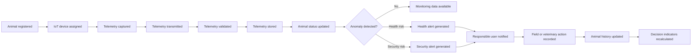
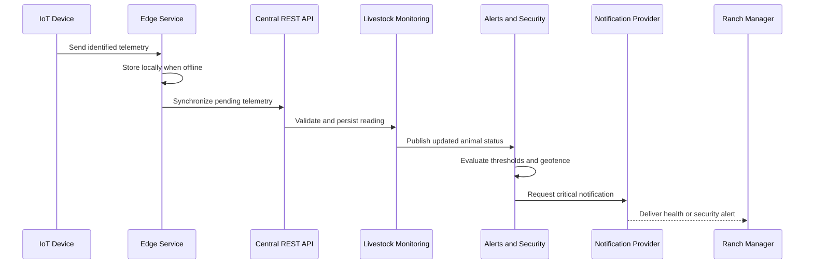

# Capítulo IV: Solution Software Design

## 4.1. Strategic-Level Domain-Driven Design

### 4.1.1. Design-Level EventStorming

El Design-Level EventStorming se utiliza para construir una primera representación compartida del dominio de SmartFarm. El modelo parte de los problemas y segmentos identificados en los capítulos I y II y de las User Stories y Technical Stories especificadas en el capítulo III. El objetivo de esta sesión no es definir todavía clases o tablas, sino descubrir los eventos relevantes del negocio, las capacidades que los producen, los actores involucrados y los límites naturales que posteriormente se convertirán en bounded contexts.

El dominio principal de SmartFarm es el monitoreo preventivo y la gestión operativa de ganado mediante dispositivos IoT, un servicio de borde, un servicio central y aplicaciones web y móviles. El flujo debe responder a tres necesidades principales: conocer el estado del animal, actuar frente a riesgos de salud o seguridad y conservar información confiable para las decisiones del administrador y del médico veterinario.

Como buena práctica, los eventos del dominio se expresan como hechos que ya ocurrieron y se mantienen independientes de la tecnología. Los eventos técnicos, como la recepción de un mensaje o la sincronización de datos, se conservan como soporte del flujo, pero no reemplazan a los eventos de negocio que representan cambios relevantes para los usuarios.

#### 4.1.1.1. Candidate Context Discovery

La identificación de candidate bounded contexts se realizó aplicando tres heurísticas recomendadas para el descubrimiento: `start-with-value`, para comenzar por las capacidades con mayor valor para el negocio; `start-with-simple`, para observar el proceso como una secuencia de pasos; y `look-for-pivotal-events`, para localizar eventos que cambian el estado del animal, de la alerta o de la operación.

El punto de partida es el valor establecido en el capítulo I: reducir pérdidas prevenibles, responder oportunamente a alertas y facilitar decisiones basadas en telemetría. Los capítulos II y III agregan las necesidades de los tres actores principales: administrador ganadero, operario de campo y médico veterinario.

| Candidate Bounded Context | Capacidad principal | Evidencia en los capítulos I-III | Clasificación inicial |
| --- | --- | --- | --- |
| Livestock Monitoring | Mantener la identidad, el estado y la telemetría reciente de cada animal. | US-01, US-02, US-03; telemetría de temperatura, actividad y ubicación. | Core |
| Health and Veterinary Care | Mantener eventos clínicos, tratamientos y consultas autorizadas del historial animal. | EP-04, US-10, US-11 y US-12; entrevistas a médicos veterinarios. | Core |
| Alerts and Security | Evaluar anomalías de salud, comportamiento y geolocalización, y notificar a los responsables. | EP-02, US-04, US-05, US-06 y TS-05; metas de respuesta ante alertas. | Core |
| Field Operations | Permitir localizar animales y registrar eventos durante recorridos con conectividad intermitente. | EP-03, US-07, US-08 y US-09; necesidades del operario de campo. | Supporting |
| Analytics and Reporting | Calcular indicadores, tendencias y distribuciones para apoyar decisiones. | EP-05, US-13 y US-14; solicitudes de paneles y reportes exportables. | Supporting |
| IoT Data Integration | Capturar, validar, almacenar y sincronizar telemetría desde los dispositivos. | EP-06, TS-01 a TS-05; collares, aretes y servicio de borde. | Enabling |
| Landing Page and Subscriptions | Comunicar la propuesta de valor, planes y condiciones del servicio. | EP-07, US-15 a US-18. | Supporting, fuera del core operativo |

Identity and Access Management aparece como una capacidad transversal pendiente de formalizar. Las User Stories ya exigen autorización para consultar o modificar información clínica, pero el capítulo III todavía no contiene un epic independiente para identidad, roles y permisos. Esta observación se mantiene como una decisión abierta para la siguiente iteración del EventStorming y no se convierte todavía en un bounded context definitivo.

El siguiente timeline resume el flujo de negocio inicial desde el registro del animal hasta la toma de decisiones. Los eventos en color conceptual representan hechos del dominio; los pasos de integración se muestran únicamente para hacer visible la relación entre el dispositivo, el servicio de borde y el servicio central.

El descubrimiento identifica tres eventos pivote que ayudan a separar responsabilidades: `Telemetry stored`, porque establece la información confiable que consumen otros contextos; `Health alert generated` o `Security alert generated`, porque inicia una respuesta operativa; y `Field or veterinary action recorded`, porque incorpora evidencia humana al historial del animal. Estos eventos sirven como puntos de discusión para confirmar o modificar los límites candidatos.

#### 4.1.1.2. Domain Message Flows Modeling

El modelado de Domain Message Flows representa cómo los bounded contexts colaboran para resolver escenarios del negocio. De acuerdo con la guía, se utiliza Domain Storytelling para explicar quién actúa, qué información utiliza, qué decisión toma y qué resultado se produce. En esta primera versión se modelan tres flujos que concentran las User Stories con mayor prioridad del Product Backlog: captura de telemetría y alerta, operación offline y atención veterinaria.

**Flow A: telemetry capture and preventive alert**

The flow makes explicit that the Edge Service is responsible for continuity of capture, while the central service validates and persists information. Livestock Monitoring owns the interpretation of the animal state, and Alerts and Security owns the decision to generate an alert. This separation avoids placing clinical or notification rules inside the device integration layer.

**Flow B: offline field operation**

1. El operario consulta el perfil o la última ubicación disponible del animal.
2. Si no existe cobertura, la aplicación móvil utiliza la información previamente descargada.
3. El operario registra un evento de salud con el animal, tipo, fecha y observación.
4. La aplicación almacena el cambio localmente con un estado de sincronización.
5. Cuando vuelve la conectividad, el cambio se envía al servicio central de manera idempotente.
6. Field Operations publica el evento registrado para que Health and Veterinary Care y Analytics and Reporting actualicen sus vistas.

**Flow C: veterinary attention**

1. El médico veterinario recibe o consulta una alerta asociada con un animal autorizado.
2. Health and Veterinary Care solicita telemetría, alertas y eventos recientes mediante contratos definidos.
3. El médico registra una vacunación, tratamiento, inseminación u otra observación clínica.
4. El sistema actualiza el historial clínico y conserva quién realizó la modificación.
5. Un servicio autorizado puede consultar o exportar la información, respetando las reglas de acceso y trazabilidad.

Estos flujos muestran mensajes de negocio y no constituyen todavía contratos técnicos definitivos. En una iteración posterior se deberán validar nombres, ownership, eventos duplicados, políticas de reintento, autorización y consistencia entre los contextos.

#### 4.1.1.3. Bounded Context Canvases

La selección de bounded contexts debe seguir un proceso iterativo. Para cada candidato se documentarán el contexto, sus reglas, el ubiquitous language, las capacidades, las dependencias y los riesgos. La siguiente tabla constituye el primer resumen de canvas y se refinará después de la crítica de diseño.

| Context | Business purpose | Core domain language | Main capabilities | Dependencies to validate |
| --- | --- | --- | --- | --- |
| Livestock Monitoring | Provide a reliable view of each animal and its current state. | Animal, telemetry, reading, status, device assignment. | Register animal, associate device, query recent telemetry, maintain individual history. | IoT Data Integration, Identity and Access, Analytics. |
| Health and Veterinary Care | Support prevention, diagnosis and traceable clinical actions. | Clinical event, treatment, vaccination, diagnosis, authorization. | Record clinical information, review history, share authorized data. | Livestock Monitoring, Alerts and Security, Identity and Access. |
| Alerts and Security | Detect risks early and route actionable notifications. | Threshold, anomaly, health alert, geofence, security alert, notification. | Evaluate rules, avoid duplicate alerts, notify responsible users. | Livestock Monitoring, IoT Data Integration, Notification Provider. |
| Field Operations | Maintain operational continuity in the field. | Field event, last location, offline record, synchronization. | Locate animal, record field event, synchronize pending changes. | Livestock Monitoring, Alerts and Security, Mobile Application. |
| Analytics and Reporting | Turn reliable events into decisions and evidence. | Indicator, trend, distribution, missing data, report. | Calculate group indicators, show trends, export reports. | Livestock Monitoring, Health and Veterinary Care, Alerts. |
| IoT Data Integration | Make device data available to the domain safely. | Device reading, edge buffer, synchronization, validation. | Receive, buffer, synchronize, validate and persist telemetry. | IoT devices, central API, data storage. |
| Landing Page and Subscriptions | Explain and support acquisition of the service. | Visitor, plan, subscription, terms and conditions. | Present value proposition, plans, contact actions and legal information. | Public website, future identity or billing services. |

The first design critique identifies the following business rules that must remain explicit during the transition to tactical design:

- A telemetry reading must identify the animal and include a valid timestamp before it becomes part of the trusted history.
- A health or security alert must be associated with the animal, the detected value or location, the rule that triggered it and the event time.
- Repeated readings for the same active condition must not create duplicate alerts without preserving the history of the condition.
- Clinical information may be viewed or modified only by an authorized user, and the request must be traceable.
- Offline field events must be synchronized without creating duplicate records after a retry.
- Group indicators must identify insufficient or missing data instead of presenting an unsupported conclusion.

The current recommendation is to treat Livestock Monitoring, Health and Veterinary Care, and Alerts and Security as the core business contexts. Field Operations and Analytics and Reporting are supporting contexts, while IoT Data Integration is an enabling context. This classification is a candidate decision and must be confirmed by the team during the next EventStorming iteration.

### 4.1.2. Context Mapping

### 4.1.3. Software Architecture

#### 4.1.3.1. Software Architecture System Landscape Diagram

#### 4.1.3.2. Software Architecture Context Level Diagrams

#### 4.1.3.3. Software Architecture Container Level Diagrams

#### 4.1.3.4. Software Architecture Deployment Diagrams

## 4.2. Tactical-Level Domain-Driven Design

### 4.2.X. Bounded Context: &lt;Bounded Context Name&gt;

#### 4.2.X.1. Domain Layer

#### 4.2.X.2. Interface Layer

#### 4.2.X.3. Application Layer

#### 4.2.X.4. Infrastructure Layer

#### 4.2.X.5. Bounded Context Software Architecture Component Level Diagrams

#### 4.2.X.6. Bounded Context Software Architecture Code Level Diagrams

##### 4.2.X.6.1. Bounded Context Domain Layer Class Diagrams

##### 4.2.X.6.2. Bounded Context Database Design Diagram
