# Capítulo IV: Solution Software Design

## 4.1. Strategic-Level Domain-Driven Design

### 4.1.1. Design-Level EventStorming

El Design-Level EventStorming construye una vista compartida del dominio de SmartFarm a partir de los capítulos I-III. Identifica eventos de negocio, capacidades, actores y límites de bounded contexts para el monitoreo preventivo, la respuesta ante riesgos y la gestión operativa del ganado. Los eventos se redactan como hechos independientes de la tecnología; los eventos técnicos solo sirven como soporte del flujo.

#### 4.1.1.1. Candidate Context Discovery

La identificación de candidate bounded contexts aplica start-with-value, start-with-simple y look-for-pivotal-events. Así se conectan el valor del capítulo I -reducir pérdidas, responder alertas y apoyar decisiones- con las necesidades del administrador, el operario y el médico veterinario descritas en los capítulos II y III.

| Candidate Bounded Context | Capacidad principal | Evidencia en los capítulos I-III | Clasificación inicial |
| --- | --- | --- | --- |
| Livestock Monitoring | Mantener la identidad, el estado y la telemetría reciente de cada animal. | US-01, US-02, US-03; telemetría de temperatura, actividad y ubicación. | Core |
| Health and Veterinary Care | Mantener eventos clínicos, tratamientos y consultas autorizadas del historial animal. | EP-04, US-10, US-11 y US-12; entrevistas a médicos veterinarios. | Core |
| Alerts and Security | Evaluar anomalías de salud, comportamiento y geolocalización, y notificar a los responsables. | EP-02, US-04, US-05, US-06 y TS-05; metas de respuesta ante alertas. | Core |
| Field Operations | Permitir localizar animales y registrar eventos durante recorridos con conectividad intermitente. | EP-03, US-07, US-08 y US-09; necesidades del operario de campo. | Supporting |
| Analytics and Reporting | Calcular indicadores, tendencias y distribuciones para apoyar decisiones. | EP-05, US-13 y US-14; solicitudes de paneles y reportes exportables. | Supporting |
| IoT Data Integration | Capturar, validar, almacenar y sincronizar telemetría desde los dispositivos. | EP-06, TS-01 a TS-05; collares, aretes y servicio de borde. | Enabling |
| Landing Page and Subscriptions | Comunicar la propuesta de valor, planes y condiciones del servicio. | EP-07, US-15 a US-18. | Supporting, fuera del core operativo |

Identity and Access Management aparece como una capacidad transversal. Las User Stories ya exigen autorización para consultar o modificar información clínica, mientras que el capítulo III contempla esta necesidad dentro de sus reglas de acceso y permisos. La capacidad se mantiene diferenciada durante el modelado del dominio y no se convierte todavía en un bounded context definitivo.

El timeline resume el flujo desde el registro del animal hasta la toma de decisiones y distingue eventos de negocio de pasos de integración.

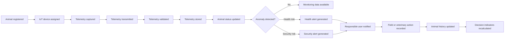

Los eventos pivote son Telemetry stored, Health alert generated o Security alert generated, y Field or veterinary action recorded. Separan la información confiable, la respuesta operativa y la evidencia humana que actualiza el historial.

#### 4.1.1.2. Domain Message Flows Modeling

Los Domain Message Flows aplican Domain Storytelling para mostrar actores, información, decisiones y resultados en tres escenarios prioritarios: alerta preventiva, operación offline y atención veterinaria.

**Flow A: telemetry capture and preventive alert**

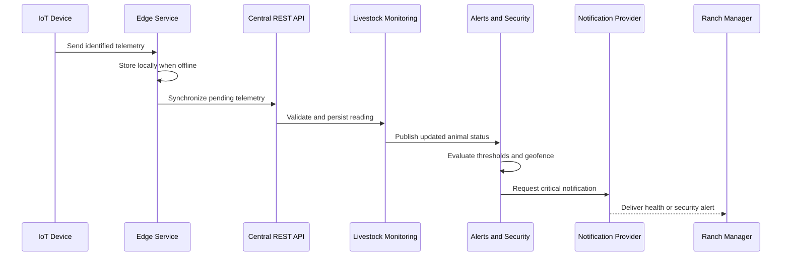

El Edge Service conserva la captura durante una interrupción; el servicio central valida y persiste. Livestock Monitoring interpreta el estado y Alerts and Security decide cuándo generar una alerta.

**Flow B: offline field operation**

1. El operario consulta el perfil o la última ubicación disponible del animal.
2. Si no existe cobertura, la aplicación móvil utiliza la información previamente descargada.
3. El operario registra un evento de salud con el animal, tipo, fecha y observación.
4. La aplicación almacena el cambio localmente con un estado de sincronización.
5. Cuando vuelve la conectividad, el cambio se envía al servicio central de manera idempotente.
6. Field Operations publica el evento registrado para que Health and Veterinary Care y Analytics and Reporting actualicen sus vistas.

**Flow C: veterinary attention**

1. El médico veterinario recibe o consulta una alerta asociada con un animal autorizado.
2. Health and Veterinary Care solicita telemetría, alertas y eventos recientes mediante contratos definidos.
3. El médico registra una vacunación, tratamiento, inseminación u otra observación clínica.
4. El sistema actualiza el historial clínico y conserva quién realizó la modificación.
5. Un servicio autorizado puede consultar o exportar la información, respetando las reglas de acceso y trazabilidad.

Estos flujos son una base de validación; los contratos, ownership, reintentos, autorización e idempotencia se confirmarán en la siguiente iteración.

#### 4.1.1.3. Bounded Context Canvases

La tabla resume el primer Bounded Context Canvas: propósito, lenguaje, capacidades y dependencias. Cada canvas debe refinarse mediante crítica de diseño.

| Context | Business purpose | Core domain language | Main capabilities | Dependencies to validate |
| --- | --- | --- | --- | --- |
| Livestock Monitoring | Provide a reliable view of each animal and its current state. | Animal, telemetry, reading, status, device assignment. | Register animal, associate device, query recent telemetry, maintain individual history. | IoT Data Integration, Identity and Access, Analytics. |
| Health and Veterinary Care | Support prevention, diagnosis and traceable clinical actions. | Clinical event, treatment, vaccination, diagnosis, authorization. | Record clinical information, review history, share authorized data. | Livestock Monitoring, Alerts and Security, Identity and Access. |
| Alerts and Security | Detect risks early and route actionable notifications. | Threshold, anomaly, health alert, geofence, security alert, notification. | Evaluate rules, avoid duplicate alerts, notify responsible users. | Livestock Monitoring, IoT Data Integration, Notification Provider. |
| Field Operations | Maintain operational continuity in the field. | Field event, last location, offline record, synchronization. | Locate animal, record field event, synchronize pending changes. | Livestock Monitoring, Alerts and Security, Mobile Application. |
| Analytics and Reporting | Turn reliable events into decisions and evidence. | Indicator, trend, distribution, missing data, report. | Calculate group indicators, show trends, export reports. | Livestock Monitoring, Health and Veterinary Care, Alerts. |
| IoT Data Integration | Make device data available to the domain safely. | Device reading, edge buffer, synchronization, validation. | Receive, buffer, synchronize, validate and persist telemetry. | IoT devices, central API, data storage. |
| Landing Page and Subscriptions | Explain and support acquisition of the service. | Visitor, plan, subscription, terms and conditions. | Present value proposition, plans, contact actions and legal information. | Public website, future identity or billing services. |

The first design critique identifies the following business rules that must remain explicit during the transition to tactical design:

- A telemetry reading must identify the animal and include a valid timestamp before it becomes part of the trusted history.
- A health or security alert must be associated with the animal, the detected value or location, the rule that triggered it and the event time.
- Repeated readings for the same active condition must not create duplicate alerts without preserving the history of the condition.
- Clinical information may be viewed or modified only by an authorized user, and the request must be traceable.
- Offline field events must be synchronized without creating duplicate records after a retry.
- Group indicators must identify insufficient or missing data instead of presenting an unsupported conclusion.

La clasificación propuesta es: core, Livestock Monitoring, Health and Veterinary Care y Alerts and Security; supporting, Field Operations y Analytics and Reporting; enabling, IoT Data Integration. Debe validarse en la siguiente sesión.

### 4.1.2. Context Mapping

El Context Mapping hace explícitos los límites, dependencias, contratos y patrones de integración identificados en 4.1.1. Livestock Monitoring concentra el estado del animal; los demás contextos reciben información mediante contratos, eventos o adaptadores propios.

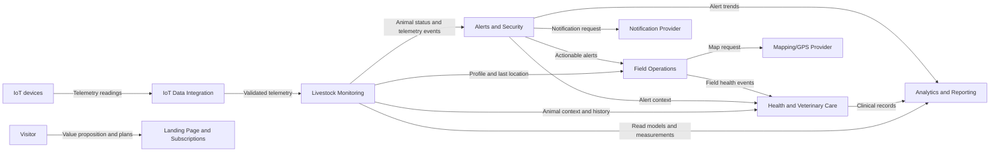

Las flechas indican proveedor y consumidor. Los proveedores externos permanecen fuera de SmartFarm y Landing Page and Subscriptions queda aislada del flujo operativo.

**Initial context relationships**

| Upstream context or system | Downstream context | Candidate pattern | Contract or information exchanged | Design rationale |
| --- | --- | --- | --- | --- |
| IoT Data Integration | Livestock Monitoring | Customer/Supplier with Published Language | TelemetryReading, animal identifier, timestamp and source status. | The domain context receives normalized data without depending on device protocols or edge storage. |
| Livestock Monitoring | Alerts and Security | Customer/Supplier with Published Language | Animal status changes, measurements, thresholds and location events. | Alert rules consume trusted domain information and do not own telemetry ingestion. |
| Livestock Monitoring | Health and Veterinary Care | Anti-corruption Layer | Clinical view of animal identity, history and relevant measurements. | The clinical model must not inherit the technical structure of telemetry storage. |
| Livestock Monitoring | Field Operations | Customer/Supplier | Animal profile, last known location and operational status. | Field work consumes a stable operational view while preserving offline behavior locally. |
| Alerts and Security | Field Operations | Customer/Supplier | Actionable alert, severity, animal, location and event time. | The field application reacts to an alert but does not decide the alert policy. |
| Field Operations | Health and Veterinary Care | Anti-corruption Layer | Field health event, observation, actor and synchronization status. | Field records are translated into clinical events with validation and authorization. |
| Livestock Monitoring, Health and Veterinary Care, Alerts and Security | Analytics and Reporting | Open Host Service with Published Language | Read models for indicators, trends, alert distributions and data quality. | Analytics remains downstream and cannot modify transactional domain state. |
| Alerts and Security | Notification Provider | Anti-corruption Layer | Notification request, recipient, channel, status and provider error. | External provider details stay outside the alerting model. |
| Field Operations | Mapping/GPS Provider | Anti-corruption Layer | Map tiles, coordinates and geospatial query results. | Provider-specific APIs are isolated from field operations. |

**Patterns and boundaries**

The recommended integration strategy uses the following principles:

- Published Language is reserved for stable domain messages such as telemetry, animal status and actionable alerts. The message contract must use terms from the ubiquitous language and must not expose persistence details.
- Anti-corruption Layer is required when a downstream context has a different model or when an external provider controls the contract. The translation protects the clinical, alerting and field models from changes in technical schemas.
- Customer/Supplier is used when the downstream context depends on a capability delivered by an upstream context. The supplier must negotiate a contract that supports the consumer's needs without transferring ownership of the consumer's model.
- Open Host Service is appropriate for Analytics and Reporting when several consumers need consistent read access. Its views should be optimized for analysis and should not become a shared transactional database.
- Shared Kernel is not recommended in the initial design because shared code or tables would couple the contexts and make clinical, operational and telemetry changes harder to evolve independently.
- Conformist should be used only for an external service whose contract cannot be influenced by SmartFarm. The adapter must still keep the external vocabulary out of the core domain model.

**Alternatives considered**

| Alternative | Advantage | Risk | Decision |
| --- | --- | --- | --- |
| One context for telemetry, health, alerts and field operations | Simple initial deployment and fewer interfaces. | Combines technical ingestion, clinical rules and field concerns; changes propagate to every capability. | Rejected for the strategic design. |
| Livestock Monitoring and Health and Veterinary Care as one context | Easier access to the animal history. | A clinical model becomes coupled to telemetry shape and authorization rules. | Rejected; use an Anti-corruption Layer. |
| Separate contexts connected by shared database tables | Fast read access for dashboards. | Creates hidden coupling, weak ownership and inconsistent business rules. | Rejected; use contracts and downstream read models. |
| Separate core contexts with explicit messages and adapters | Preserves domain boundaries and supports independent evolution. | Requires contract versioning, observability and synchronization handling. | Selected as the current direction. |

El mapa prohíbe escrituras directas entre bases de datos. La comunicación usa comandos, eventos publicados o contratos de consulta; los primeros contratos a refinar son TelemetryReading, AnimalStatusUpdated, HealthAlertGenerated, SecurityAlertGenerated, FieldHealthEventRecorded y ClinicalInformationUpdated.

**Open decisions for the next iteration**

1. Confirm whether animal identity belongs entirely to Livestock Monitoring or to a future Identity and Access context that also manages users, roles and permissions.
2. Define which context owns alert thresholds and geofences when they vary by ranch, animal or user role.
3. Confirm whether Analytics consumes events asynchronously or reads a materialized reporting model refreshed by scheduled synchronization.
4. Define the authorization contract for clinical data, including audit information and export restrictions.
5. Validate the external notification and mapping providers before freezing adapter interfaces.

Este mapa es una fuente versionable; para la entrega formal debe exportarse con la herramienta aprobada, incluir leyenda, supuestos y explicación.

### 4.1.3. Software Architecture

La arquitectura de software traduce los límites de 4.1.2 mediante el C4 Model y responde a las restricciones de SmartFarm: conectividad rural intermitente, alertas oportunas, trazabilidad clínica, integración IoT y acceso web/móvil. Las decisiones priorizan continuidad operativa, separación de responsabilidades, seguridad, observabilidad e idempotencia.

Los siguientes principios orientan la arquitectura:

- Las reglas de negocio permanecen dentro de los bounded contexts y no se delegan a la interfaz ni a los dispositivos.
- El servicio de borde permite capturar y conservar datos cuando la conexión con el servicio central no está disponible.
- El servicio central expone contratos RESTful y valida toda información antes de incorporarla a los modelos de dominio.
- Las notificaciones y las actualizaciones de analítica se procesan mediante mensajes o tareas desacopladas cuando el caso de uso lo permita.
- Cada contexto conserva la propiedad de sus datos; ningún otro contexto escribe directamente en su almacenamiento.
- Las operaciones de sincronización y reintento deben ser idempotentes y observables.
- La autorización, la privacidad de la información clínica, la internacionalización y la accesibilidad se consideran preocupaciones transversales desde el diseño.

Para la entrega formal, cada diagrama debe exportarse desde la herramienta aprobada con leyenda y explicación. Mermaid funciona aquí como fuente versionable y trazable.

#### 4.1.3.1. Software Architecture System Landscape Diagram

El System Landscape ubica SmartFarm en su entorno y muestra personas, dispositivos y sistemas externos sin detallar containers internos. Su objetivo es fijar el alcance y separar dependencias externas de responsabilidades propias.

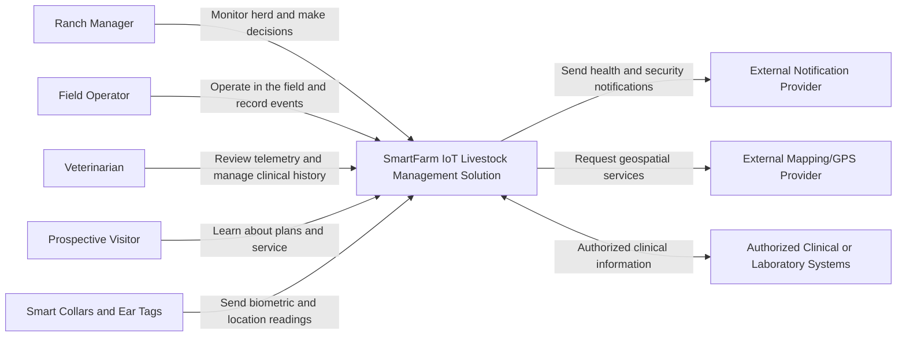

SmartFarm recibe telemetría, procesa información y atiende a los actores del negocio. Dispositivos IoT, notificaciones, mapas y sistemas clínicos son externos y se aíslan mediante adapters. La Landing Page pertenece al entorno del producto, pero permanece separada del monitoreo y de sus datos sensibles.

#### 4.1.3.2. Software Architecture Context Level Diagrams

El Context Diagram muestra SmartFarm como un sistema único, sus actores y sus dependencias externas. Las relaciones usan verbos y propósito de intercambio, sin revelar implementación interna.

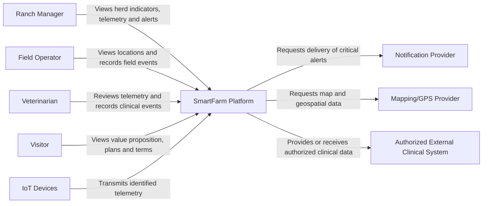

El administrador prioriza indicadores y seguridad; el operario, continuidad en campo; y el veterinario, información histórica, clínica y autorizada. Por eso el Context Diagram no muestra tablas, frameworks, endpoints ni clases. Su explicación debe relacionarlo con US-01 a US-18 y TS-01 a TS-05.

#### 4.1.3.3. Software Architecture Container Level Diagrams

En C4, un container es una unidad ejecutable o almacenable con responsabilidad clara y despliegue independiente. El diseño cubre captura IoT, operación web/móvil, flujos de dominio y vistas analíticas; los bounded contexts se organizan principalmente dentro del Central REST API.

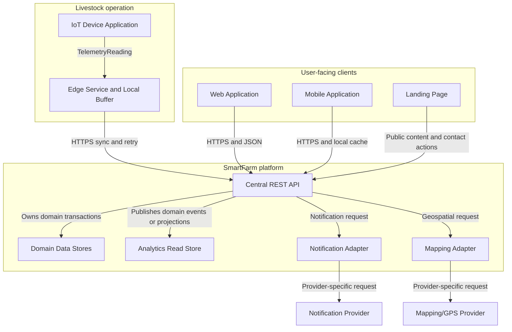

| Container | Responsibility | Main bounded contexts or capabilities | Communication |
| --- | --- | --- | --- |
| IoT Device Application | Capture temperature, activity, location and identification data; adapt transmission frequency to the animal state. | IoT Data Integration, TS-01 and TS-03. | Device protocol to Edge Service. |
| Edge Service and Local Buffer | Receive readings, store pending data during outages and synchronize without duplicates. | IoT Data Integration and Field Operations, TS-02 and US-09. | Local storage plus HTTPS synchronization with Central REST API. |
| Central REST API | Authenticate requests, execute application use cases, validate data and expose domain contracts. | Livestock Monitoring, Health and Veterinary Care, Alerts and Security and Field Operations. | HTTPS/JSON for clients; commands and events internally. |
| Domain Data Stores | Persist animal, telemetry, alert, field and clinical information under explicit ownership. | Transactional data for the corresponding bounded contexts. | Access only through the owning application module. |
| Analytics Read Store | Store projections optimized for indicators, trends, distributions and reports. | Analytics and Reporting. | Consumes published events or scheduled projections. |
| Web Application | Provide dashboards, history, indicators, alerts and administrative actions. | Ranch Manager and Veterinarian use cases. | RESTful API over HTTPS. |
| Mobile Application | Provide field views, last known locations, event capture and offline operation. | Field Operations and selected alert actions. | RESTful API plus local cache and synchronization queue. |
| Notification Adapter | Translate domain notification requests into the external provider contract and manage delivery status. | Alerts and Security, TS-05. | Asynchronous requests with retry and idempotency keys. |
| Mapping Adapter | Isolate provider-specific geospatial APIs from Field Operations. | Field Operations and location queries. | Provider API through an adapter boundary. |
| Landing Page | Present the value proposition, plans, contact actions and terms. | Landing Page and Subscriptions, EP-07. | Public web content and optional API integration. |

Las tecnologías candidatas deben registrarse como decisiones justificadas y mantenerse consistentes con los diagramas. Analytics Read Store se separa de los datos transaccionales para evitar que los reportes afecten el modelo operativo y para hacer visibles datos incompletos, retrasos y fallas de proyección.

#### 4.1.3.4. Software Architecture Deployment Diagrams

El Deployment Diagram muestra la ubicación y comunicación de los containers en condiciones normales y de falla. Los dispositivos, el servicio de borde y la caché móvil operan en la unidad ganadera; los servicios centrales pueden ejecutarse en la nube y sincronizarse cuando vuelve la conectividad.

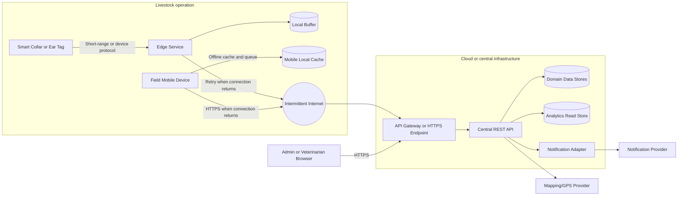

| Deployment concern | Architectural response | Evidence to include later |
| --- | --- | --- |
| Intermittent rural connectivity | Edge Service and Mobile Application buffer permitted operations and retry synchronization. | Sequence or deployment annotation showing offline and recovery paths. |
| Duplicate delivery after retry | Stable identifiers, synchronization status and idempotency keys are required for telemetry, field events and notifications. | Contract or sequence example showing duplicate protection. |
| Sensitive clinical information | Encrypted transport, authorization by role and auditable clinical access. | Context explanation and security assumptions. |
| Notification provider failure | Notification Adapter records delivery status and preserves the alert for later consultation. | Failure path and retry policy. |
| Reporting load | Analytics Read Store isolates indicators and trends from transactional writes. | Container relationship and refresh policy. |
| Independent evolution | Containers communicate through documented contracts and do not share internal persistence structures. | C4 legend and context map consistency check. |

El diagrama es tecnológico-neutral hasta aprobar proveedor cloud, motor de base de datos, plataforma móvil y hardware de borde. Después debe mostrar nodos, redes, secretos, monitoreo y recuperación. Los niveles C4 deben conservar trazabilidad: cada dependencia del contexto debe explicarse en containers y cada container debe tener una ubicación de despliegue.

## 4.2. Tactical-Level Domain-Driven Design

El diseño táctico traduce las decisiones estratégicas en modelos internos. Esta sección desarrolla Livestock Monitoring como core context: mantiene identidad, estado y telemetría del animal, y publica cambios relevantes. Las reglas clínicas, de alertas y de almacenamiento en el borde pertenecen a sus respectivos contextos.

### 4.2.1. Bounded Context: Livestock Monitoring

#### 4.2.1.1. Domain Layer

La Domain Layer contiene el estado confiable del animal y sus lecturas. Es independiente de frameworks, bases de datos y proveedores; recibe telemetría identificada, aplica invariantes de monitoreo y publica eventos para consumidores autorizados.

**Domain language**

| Term | Meaning in Livestock Monitoring | Ownership |
| --- | --- | --- |
| Animal | Monitored livestock subject with a stable identity and current monitoring status. | Livestock Monitoring. |
| Device Assignment | Active or historical association between an animal and an IoT device. | Livestock Monitoring. |
| Telemetry Reading | Valid measurement identified by animal, device and capture time. | Livestock Monitoring after structural validation. |
| Animal Status | Current monitoring state derived from trusted readings and domain policies. | Livestock Monitoring. |
| Monitoring History | Ordered collection of accepted readings and status changes. | Livestock Monitoring. |

**Tactical model**

| Type | Candidate class | Responsibility |
| --- | --- | --- |
| Aggregate Root | Animal | Protect animal identity, active assignment and current monitoring status. |
| Entity | DeviceAssignment | Record which device is associated with an animal and during which period. |
| Entity | TelemetryReading | Preserve an accepted reading and its provenance. |
| Value Object | AnimalId | Guarantee the format and identity semantics of an animal reference. |
| Value Object | DeviceId | Represent the identity of a collar or ear tag without device-protocol details. |
| Value Object | Temperature | Represent a temperature measurement with unit and valid range. |
| Value Object | ActivityLevel | Represent normalized activity data used by monitoring views. |
| Value Object | GeoCoordinate | Represent latitude and longitude with geospatial validation. |
| Value Object | CapturedAt | Represent the timestamp of the measurement and its temporal rules. |
| Domain Service | AnimalStatusPolicy | Derive monitoring status from accepted readings without creating alert policies. |
| Domain Service | TelemetryAcceptancePolicy | Check monitoring-specific invariants before a reading is attached to the animal. |
| Repository Port | AnimalRepository | Define persistence operations required by the aggregate. |
| Repository Port | TelemetryReadingRepository | Define history queries without coupling the domain to a database. |
| Domain Event | TelemetryRecorded | Announce that an accepted reading was added to monitoring history. |
| Domain Event | AnimalStatusUpdated | Announce a change in the monitoring status. |

**Domain invariants**

- Every Animal has one stable AnimalId; the identity cannot be replaced by a device identifier.
- An active DeviceAssignment cannot be active for two animals at the same time.
- A TelemetryReading must contain an animal identifier, device identifier, capture timestamp and valid measurement data.
- A reading received more than once with the same source identifier must be handled idempotently.
- A reading that violates the monitoring range or provenance rules is rejected and does not update the animal status.
- Livestock Monitoring publishes the status change but does not decide whether it is a clinical or security alert.
- Historical readings are append-oriented; corrections must be represented as traceable domain actions rather than silent overwrites.

El modelo se limita al monitoreo. Los procedimientos clínicos, umbrales de alerta, canales de notificación y metadatos offline se traducen en sus propios contextos para mantener cohesivo el aggregate.

#### 4.2.1.2. Interface Layer

La Interface Layer expone Livestock Monitoring a clientes y consumidores de eventos. Valida entradas, resuelve seguridad, invoca casos de uso y traduce resultados a contratos estables; no contiene reglas de negocio ni accede directamente a repositorios.

**Inbound interfaces**

| Interface component | Type | Candidate interaction | Consumer and traceability |
| --- | --- | --- | --- |
| AnimalQueryController | REST controller | GET /api/v1/animals/{animalId} | Web Application and Mobile Application; US-01. |
| TelemetryQueryController | REST controller | GET /api/v1/animals/{animalId}/telemetry?from=&to= | Web Application and Mobile Application; US-02 and US-03. |
| TelemetryValidatedConsumer | Domain-event consumer | Receives a validated telemetry message from IoT Data Integration. | Central integration flow; TS-04. |
| AnimalStatusUpdatedConsumer | Internal event consumer | Receives a status update for projection or downstream publication. | Alerts and Security and Analytics and Reporting. |
| AnimalHistoryQueryMapper | DTO mapper | Converts domain results into stable response representations. | Web and mobile clients. |
| MonitoringErrorHandler | Error translator | Converts validation, authorization and not-found failures into documented errors. | All API consumers. |

**Candidate API contracts**

| Operation | Input | Output | Validation and authorization |
| --- | --- | --- | --- |
| Get animal profile | animalId and user context. | Animal identity, device assignment, current status and last reading timestamp. | The animal must exist and belong to the user's authorized ranch scope. |
| Get recent telemetry | animalId, time range and pagination. | Ordered readings with temperature, activity, location and capture time. | The time range is bounded; the user must be authorized to view the animal. |
| Get individual history | animalId, period and filters. | Readings and status events for the selected period. | The query must preserve data completeness information and access auditability. |
| Receive validated telemetry | Message identifier, animal identifier, device identifier and measurement data. | Accepted, rejected or duplicate result. | The message source must be trusted and duplicate processing must be idempotent. |

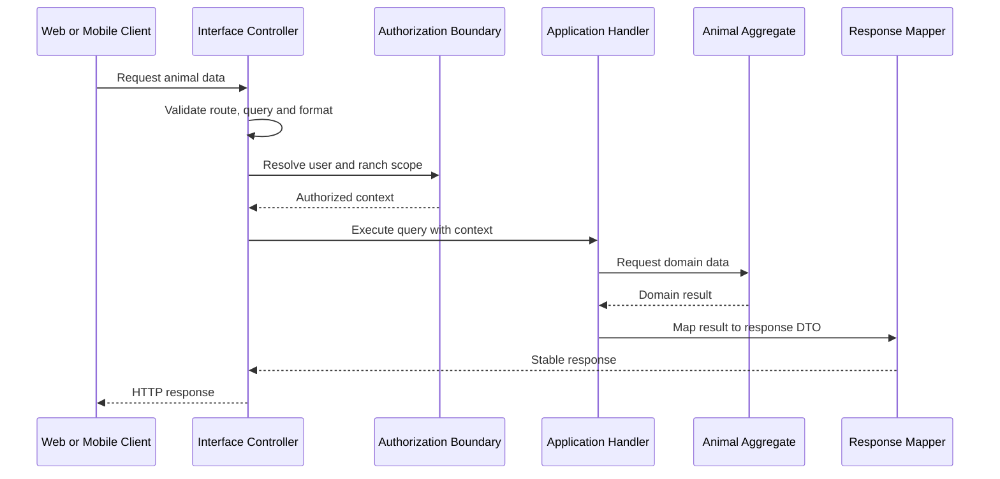

**Interface rules**

- Controllers validate required fields, formats, ranges, pagination limits and supported content types before invoking the application layer.
- Authorization is evaluated with the user, role and ranch scope; a valid identifier alone is not sufficient to expose animal or clinical information.
- Response DTOs expose business concepts and not ORM entities, database keys that are not part of the contract or internal event metadata.
- Error responses must distinguish invalid input, missing resource, denied access, duplicate message and temporary infrastructure failure.
- Consumers must read a message identifier and preserve the idempotency result before acknowledging a delivery.
- Versioned API paths and event schemas permit evolution without silently breaking the web, mobile or edge clients.
- Observability metadata such as correlation identifier, source and processing time must be available without leaking sensitive clinical content.

La Interface Layer protege el dominio: web y móvil consultan vistas estables, e IoT Data Integration envía mensajes normalizados sin depender de la implementación del aggregate.

#### 4.2.1.3. Application Layer

La Application Layer coordina los casos de uso: recibe solicitudes o eventos, valida autorización, carga objetos, invoca el dominio y coordina persistencia y publicación. Define el orden de las operaciones, no el significado de las reglas de dominio.

**Use cases and handlers**

| Use case | Handler type | Main steps | Related stories |
| --- | --- | --- | --- |
| GetAnimalProfile | Query handler | Authorize scope, load Animal, obtain active assignment and map a read model. | US-01. |
| GetRecentTelemetry | Query handler | Validate period, query ordered readings and report the last available timestamp. | US-02. |
| GetAnimalHistory | Query handler | Authorize clinical or operational view, query readings and status events, preserve missing-data information. | US-03 and US-11. |
| AcceptTelemetry | Command handler | Validate message identity, load the aggregate, accept the reading idempotently, save and publish domain events. | TS-04 and US-02. |
| UpdateAnimalStatus | Event handler | React to an accepted reading, evaluate the monitoring policy and publish AnimalStatusUpdated when the status changes. | US-01, US-02 and EP-02 integration. |
| PublishMonitoringEvents | Application service | Deliver status and telemetry events through the port without depending on a broker implementation. | Alerts and Security and Analytics and Reporting. |

Las queries no cambian el aggregate ni publican eventos; los commands sí gestionan la transacción y distinguen resultados accepted, rejected y duplicate.

**Application ports**

| Port | Direction | Purpose |
| --- | --- | --- |
| AnimalRepository | Output | Load and save the Animal aggregate. |
| TelemetryReadingRepository | Output | Append accepted readings and query history by animal and period. |
| DomainEventPublisher | Output | Publish TelemetryRecorded and AnimalStatusUpdated. |
| AuthorizationContext | Input | Provide user, role, ranch scope and audit identity. |
| IdempotencyStore | Output | Record processed message identifiers and their outcome. |
| Clock | Output | Provide a testable current time for temporal policies and audit records. |

**Command processing flow**

```mermaid
flowchart LR
    Message[Validated telemetry message] --> Handler[AcceptTelemetry Command Handler]
    Handler --> Auth[Authorization and source validation]
    Auth --> Idempotency[Check message identity]
    Idempotency --> Aggregate[Load Animal aggregate]
    Aggregate --> Policy[Apply TelemetryAcceptancePolicy]
    Policy --> Save[Save aggregate and reading]
    Save --> Publish[Publish TelemetryRecorded]
    Publish --> Status[UpdateAnimalStatus Handler]
    Status --> Event[Publish AnimalStatusUpdated]
```

El command handler confirma el mensaje solo después de persistir el resultado y la idempotencia. Un outbox conserva eventos si falla la entrega posterior.

**Application responsibilities and limits**

- Coordinate transaction boundaries and define the order in which repositories and domain services are invoked.
- Enforce authorization at the use-case boundary before returning animal or historical data.
- Translate domain outcomes into application results such as Accepted, Rejected and Duplicate.
- Preserve correlation identifiers and audit metadata across commands, queries and published events.
- Apply pagination, time-window limits and projection selection for history queries.
- Keep external provider retries, ORM details, HTTP status codes and broker clients outside the application layer.
- Avoid calling another bounded context's repository directly; use a documented contract or published event.

**Consistency strategy**

La actualización del animal y la aceptación de lecturas son consistentes dentro del contexto; la propagación de TelemetryRecorded y AnimalStatusUpdated es eventualmente consistente y debe informar reintentos. Así, US-01, US-02 y US-03 se atienden con queries, TS-04 con AcceptTelemetry y los eventos habilitan US-04, US-05, US-13 y US-14.

#### 4.2.1.4. Infrastructure Layer

La Infrastructure Layer implementa los puertos y conecta el contexto con base de datos, mensajería, observabilidad y servicios externos. Sus dependencias no deben filtrarse al dominio ni a los casos de uso.

**Adapters and infrastructure components**

| Component | Implements or supports | Responsibility |
| --- | --- | --- |
| SqlAnimalRepository | AnimalRepository | Persist and retrieve the Animal aggregate using the selected relational technology. |
| SqlTelemetryReadingRepository | TelemetryReadingRepository | Append accepted readings and execute bounded history queries. |
| MonitoringPersistenceMapper | Persistence adapter | Translate between domain objects and persistence records without exposing ORM annotations in the domain. |
| IdempotencyRecordRepository | IdempotencyStore | Store message identifiers, processing outcomes and retention metadata. |
| OutboxEventStore | DomainEventPublisher support | Persist events in the same transaction before asynchronous delivery. |
| MonitoringEventPublisher | DomainEventPublisher | Publish normalized events to the integration mechanism selected by the team. |
| AuthorizationContextAdapter | AuthorizationContext | Translate authenticated identity and ranch scope into the application contract. |
| SystemClock | Clock | Provide production time while keeping domain tests deterministic through a replaceable port. |
| AuditLogWriter | Infrastructure service | Record access and changes required for traceability without altering domain behavior. |
| MonitoringTelemetry | Observability support | Emit correlation, latency, rejection, duplicate and synchronization metrics. |

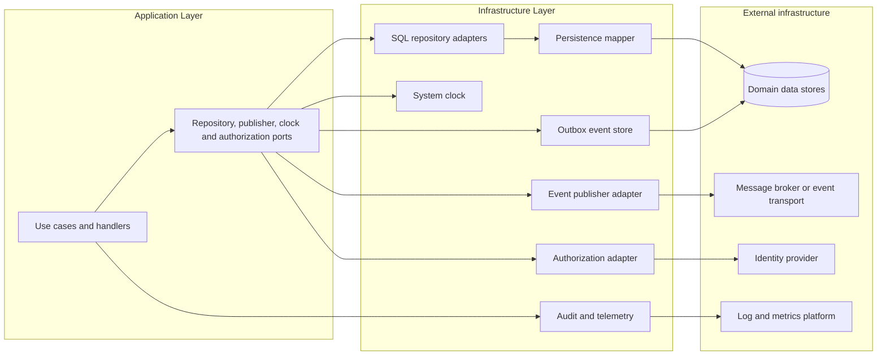

**Persistence and ownership rules**

- The repository implementation may use a relational database, but the domain layer must not know table names, ORM entities or SQL syntax.
- SqlAnimalRepository and SqlTelemetryReadingRepository are the only adapters allowed to write Livestock Monitoring records.
- Clinical, alerting, field and analytics data are not persisted through this context's repositories. Consumers use their own models and storage.
- The persistence mapper must preserve value-object validation and must reject records that cannot be reconstructed as valid domain objects.
- History queries must use bounded periods and indexes appropriate for the expected telemetry volume; pagination is part of the application contract.
- Database transactions cover aggregate changes, idempotency records and the outbox entry required to publish a resulting domain event.

**Reliability and integration rules**

- Event publication uses an outbox or equivalent mechanism so an accepted reading is not lost when the broker is temporarily unavailable.
- Consumers can retry a message safely because the message identifier is recorded before an acknowledgement is confirmed.
- External provider failures are represented as infrastructure errors and are translated into application outcomes; provider-specific exceptions do not cross the boundary.
- Correlation identifiers connect device ingestion, API requests, persistence, event publication and downstream processing.
- Logs must avoid raw clinical data and secrets; identifiers should be sufficient to investigate an operation without exposing unnecessary personal or health information.

La tecnología final del API, edge service, base de datos y mensajería debe registrarse como una decisión arquitectónica con justificación e impacto de despliegue.

#### 4.2.1.5. Bounded Context Software Architecture Component Level Diagrams

El Component Level Diagram descompone el container Central REST API en componentes de entrada, aplicación, dominio, persistencia y publicación de eventos, con responsabilidades y dependencias explícitas.

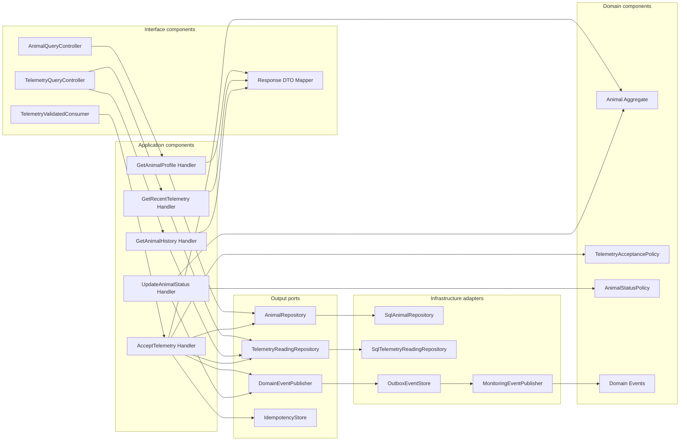

| Component | Category | Responsibility | Does not own |
| --- | --- | --- | --- |
| AnimalQueryController | Interface | Receive profile requests and invoke GetAnimalProfile. | Aggregate rules or SQL queries. |
| TelemetryQueryController | Interface | Receive recent and historical telemetry requests. | Authorization policy implementation or persistence mapping. |
| TelemetryValidatedConsumer | Interface | Convert an integration message into an application command. | Device protocol handling or alert generation. |
| Response DTO Mapper | Interface | Produce stable representations for web and mobile clients. | Domain state changes. |
| GetAnimalProfile Handler | Application | Coordinate profile retrieval and access context. | Animal identity rules. |
| GetRecentTelemetry Handler | Application | Validate the query window and obtain recent readings. | Telemetry acceptance or status interpretation. |
| GetAnimalHistory Handler | Application | Coordinate bounded history queries and completeness metadata. | Clinical authorization rules owned by another context. |
| AcceptTelemetry Handler | Application | Orchestrate idempotency, aggregate update, persistence and event publication. | Device buffering or external notifications. |
| UpdateAnimalStatus Handler | Application | Invoke the status policy after an accepted reading. | Health or security alert policy. |
| Animal Aggregate | Domain | Protect identity, active assignment and monitoring status invariants. | HTTP, ORM or broker details. |
| TelemetryAcceptancePolicy | Domain | Apply monitoring-specific acceptance rules. | Clinical interpretation. |
| AnimalStatusPolicy | Domain | Derive monitoring status changes from trusted data. | Notification delivery. |
| AnimalRepository and TelemetryReadingRepository | Output ports | Abstract persistence required by use cases. | Concrete database technology. |
| DomainEventPublisher | Output port | Abstract reliable publication of domain events. | Provider-specific transport. |
| SQL repositories and outbox adapters | Infrastructure | Implement persistence and reliable event delivery. | Domain decisions. |

El diagrama confirma la dirección de dependencias: interfaces llaman a handlers, handlers usan dominio y puertos, e infrastructure implementa esos puertos. Cada container relevante debe tener su propio component diagram; por ahora, el Central REST API es el principal.

#### 4.2.1.6. Bounded Context Software Architecture Code Level Diagrams

Los Code Level Diagrams detallan los componentes del bounded context. Esta versión documenta el Domain Layer mediante UML Class Diagram con clases, interfaces, enumeraciones, miembros, visibilidad, relaciones y multiplicidades; los detalles de ORM pertenecen a Infrastructure Layer.

##### 4.2.1.6.1. Bounded Context Domain Layer Class Diagrams

El modelo representa Animal, sus value objects y los puertos de aceptación de telemetría. TelemetryReading conserva el historial y DeviceAssignment permite como máximo una asignación activa por animal.

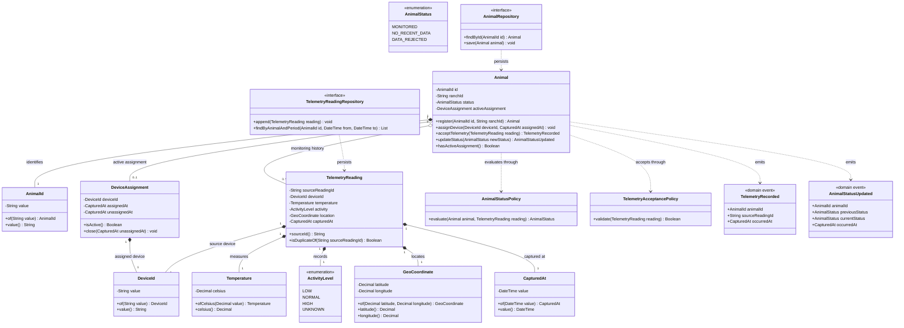

| Element | Attributes or members | Domain design decision |
| --- | --- | --- |
| Animal | Private identity, ranch scope, current status and active assignment; public behavior for registration, assignment, telemetry and status. | Aggregate root that protects invariants and is the only entry point for changing monitoring state. |
| TelemetryReading | Source identifier, device, temperature, activity, location and capture time. | Append-oriented historical entity; source identifier supports idempotency. |
| DeviceAssignment | Device identity and assignment interval. | Preserves device history and prevents concurrent active assignment. |
| AnimalId and DeviceId | Private string value with factory and accessor. | Value objects prevent mixing animal and device identities. |
| Temperature | Private Celsius value with factory validation. | Unit is explicit and range rules remain in the domain. |
| ActivityLevel and AnimalStatus | Enumerated domain values. | Avoids arbitrary strings in status and activity decisions. |
| GeoCoordinate | Latitude and longitude with factory validation. | Encapsulates geospatial constraints without depending on a map provider. |
| CapturedAt | Timestamp with controlled construction. | Preserves the temporal meaning of a reading. |
| AnimalStatusPolicy | Public evaluation operation. | Derives monitoring status but does not generate clinical or security alerts. |
| TelemetryAcceptancePolicy | Public validation operation. | Keeps monitoring invariants separate from transport validation. |
| TelemetryRecorded and AnimalStatusUpdated | Immutable event data with animal identity and occurrence time. | Publish facts for Alerts and Security and Analytics and Reporting. |
| AnimalRepository and TelemetryReadingRepository | Public interfaces with domain-oriented operations. | Ports keep persistence technology outside the Domain Layer. |

Las relaciones usan composición para elementos dependientes y agregación para el historial; sus nombres y multiplicidades forman parte del contrato UML.

##### 4.2.1.6.2. Bounded Context Database Design Diagram

El Database Design Diagram representa el almacenamiento lógico de Livestock Monitoring: identidad, asignaciones y telemetría. Las tablas clínicas, de alertas, de campo y de analítica pertenecen a otros bounded contexts.

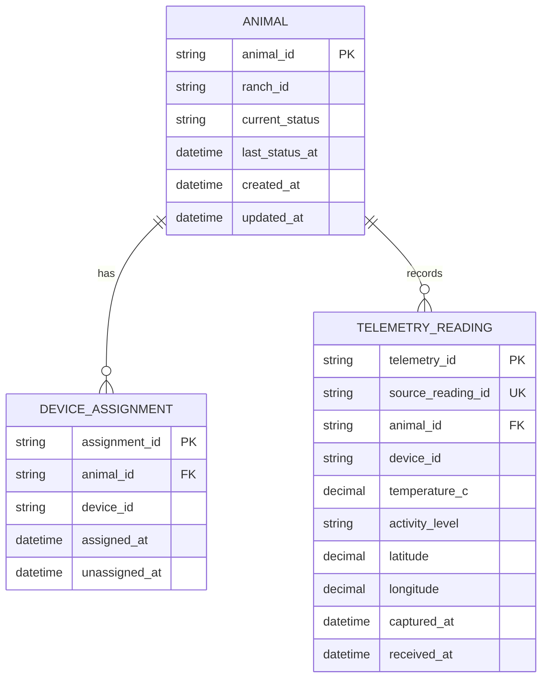

**Logical schema and constraints**

| Table | Purpose | Key constraints and indexes |
| --- | --- | --- |
| ANIMAL | Store the stable identity and current monitoring summary of a monitored animal. | animal_id is the primary key; ranch_id is required for authorization scope; current_status uses the domain enumeration; last_status_at cannot precede the accepted event that produced it. |
| DEVICE_ASSIGNMENT | Preserve the active and historical association between an animal and a device. | assignment_id is the primary key; animal_id references ANIMAL; assigned_at is required; unassigned_at must be later than assigned_at; at most one active assignment is allowed per animal. |
| TELEMETRY_READING | Append accepted measurements with source and capture provenance. | telemetry_id is the primary key; source_reading_id is unique for idempotency; animal_id references ANIMAL; coordinates and temperature require valid ranges; indexes support (animal_id, captured_at) and source_reading_id. |

device_id se conserva como referencia porque el registro y ciclo de vida del dispositivo pertenecen a IoT Data Integration; no es una FK implícita entre contextos. El esquema cubre los casos actuales sin diagnósticos ni alertas derivados, que se proyectan en sus propios almacenes. El diseño físico deberá añadir motor, índices, retención, migraciones, respaldos y estrategia para volumen y reintentos.
