# Capítulo IV: Solution Software Design

Este capítulo presenta las decisiones de diseño de la solución ICHU, tomadas a partir de los requisitos especificados en el capítulo anterior. El diseño se aborda en dos niveles. El nivel estratégico delimita el dominio en contextos acotados y define cómo se relacionan entre sí y con los sistemas externos. El nivel táctico detalla, para cada contexto, las clases que conforman sus cuatro capas y la estructura de datos que las respalda.

## 4.1. Strategic-Level Domain-Driven Design

El punto de partida es el modelo de dominio construido durante la investigación. El Big Picture EventStorming del capítulo anterior dejó identificados los hechos relevantes del negocio ganadero y el Ubiquitous Language fijó los términos con los que el equipo y los usuarios se refieren a ellos. Sobre esa base, esta sección profundiza el modelado hasta identificar los límites naturales del sistema.

### 4.1.1. Design-Level EventStorming

El Design-Level EventStorming retoma el modelo general y lo lleva al nivel de detalle necesario para diseñar. Mientras el Big Picture buscaba entender el negocio, esta sesión busca entender qué debe hacer el software: qué comandos originan cada hecho, quién los ejecuta, qué reglas se disparan como consecuencia y qué información necesita consultarse para decidir.

**Desarrollo de la sesión**

La sesión se organizó en una única jornada de dos horas, con la participación de los seis integrantes del equipo y el material del Big Picture como punto de partida. Se trabajó sobre el mismo lienzo, respetando el código de colores habitual de la técnica.

En la primera fase se enriquecieron los Domain Events ya identificados con sus **Commands**, en azul, y los **Actors** que los ejecutan, en amarillo pequeño. El ejercicio reveló que varios eventos del Big Picture carecían de comando: nadie los provocaba de forma explícita, sino que resultaban de una evaluación automática del sistema.

En la segunda fase se incorporaron las **Policies**, en lila, que representan precisamente esas reacciones automáticas. Cada una responde al patrón "cuando ocurre este hecho, entonces se dispara esta consecuencia", y son el mecanismo que conecta la telemetría con la respuesta sanitaria.

En la tercera fase se añadieron los **Read Models**, en verde, es decir la información que un actor necesita tener a la vista para poder decidir antes de emitir un comando.

En la cuarta fase se agruparon los elementos alrededor de los **Aggregates**, en amarillo grande, identificando qué objeto del dominio es responsable de garantizar la consistencia de cada conjunto de reglas.

**Pendiente:** capturas de las cuatro fases de la sesión de Design-Level EventStorming elaboradas en la herramienta de pizarra colaborativa.

**Modelo resultante**

| Command | Actor | Domain Event | Policy que se dispara | Read Model consultado | Aggregate responsable |
|---|---|---|---|---|---|
| Registrar animal | Administrador ganadero | Animal registrado | Ninguna | Hato actual, aretes en uso | Cattle |
| Asignar collar a animal | Administrador ganadero | Collar vinculado al animal | Verificar límite del plan | Inventario de collares, límite del plan | IoTDevice |
| Transmitir lectura | Cattle Band | Lectura biométrica capturada | Evaluar umbrales de la etapa productiva | Umbrales vigentes | TelemetryReading |
| Sincronizar lote de lecturas | Edge Gateway | Lecturas sincronizadas | Reevaluar reglas no aplicadas en el borde | Estado de sincronización | TelemetryReading |
| Ninguno, es automático | Sistema | Umbral de temperatura superado | Generar alerta si no existe una abierta del mismo tipo | Alertas abiertas del animal | MonitoringAlert |
| Ninguno, es automático | Sistema | Animal fuera de la zona de pastoreo | Generar alerta de seguridad con distancia al límite | Geocerca del lote | MonitoringAlert |
| Ninguno, es automático | Sistema | Patrón reproductivo detectado | Registrar indicador de posible celo | Línea base del animal | MonitoringAlert |
| Atender alerta | Administrador ganadero | Alerta atendida | Registrar tiempo de respuesta e incorporar hallazgo al historial | Detalle de la alerta y telemetría asociada | MonitoringAlert |
| Registrar evento de campo | Operario de campo | Evento de salud registrado | Encolar para sincronización si no hay cobertura | Ficha descargada del animal | LivestockOperation |
| Registrar intervención clínica | Médico veterinario | Intervención registrada | Iniciar periodo de retiro del producto aplicado | Antecedentes clínicos y retiros vigentes | LivestockOperation |
| Ninguno, es automático | Sistema | Plazo de respuesta al tratamiento vencido | Alertar al veterinario si las constantes no retornan al rango | Evolución posterior a la intervención | MonitoringAlert |
| Programar campaña sanitaria | Administrador ganadero | Campaña programada | Detectar superposición con periodos de retiro | Calendario del predio, retiros vigentes | HealthCampaign |
| Ninguno, es automático | Sistema | Plazo de aviso alcanzado | Emitir recordatorio de campaña | Campañas programadas y su avance | HealthCampaign |
| Registrar aplicación | Operario de campo | Aplicación registrada | Cerrar campaña cuando todos los animales figuran aplicados | Avance de la campaña | HealthCampaign |
| Contratar plan | Administrador ganadero | Suscripción activada | Habilitar funcionalidades y límite de dispositivos del plan | Planes disponibles y su cobertura | Subscription |
| Solicitar acceso a un hato | Médico veterinario | Asesoría solicitada | Notificar al administrador para su decisión | Perfil profesional del solicitante | HerdAdvisory |
| Conceder acceso | Administrador ganadero | Asesoría concedida | Habilitar consulta acotada al hato concedido | Solicitudes pendientes | HerdAdvisory |
| Dar de baja animal | Administrador ganadero | Animal dado de baja | Liberar el collar asignado y excluirlo de los indicadores | Ficha del animal, collar asignado | Cattle |
| Ninguno, es automático | Sistema | Temperatura del agua fuera de rango | Activar calentamiento y alertar si no retorna al rango | Rango configurado del abrevadero | MonitoringAlert |

**Hot spots resueltos en esta sesión**

Tres de las incertidumbres que el Big Picture dejó marcadas quedaron resueltas al modelar a este nivel de detalle. La primera es que **el umbral debe ser por etapa productiva y no único**, lo que obligó a modelar `Threshold` como Value Object con la etapa como parte de su identidad. La segunda es que **el operario registra observaciones pero no diagnósticos**, distinción que se refleja en el tipo de operación y en las reglas de autorización. La tercera es que **un registro creado sin conexión sobre un animal dado de baja no se aplica**, sino que se conserva como conflicto para revisión manual, lo que exigió incorporar el estado de sincronización al agregado correspondiente.

#### 4.1.1.1. Candidate Context Discovery

Para identificar los contextos acotados se aplicó la técnica **look-for-pivotal-events**, que consiste en buscar los hechos del negocio que marcan un cambio de estado entre fases distintas del proceso. Se eligió esta técnica sobre las alternativas porque el Big Picture ya había dejado ordenados los eventos sobre una línea de tiempo, y porque el dominio ganadero presenta transiciones nítidas: un animal pasa de ser un registro administrativo a ser un sujeto vigilado, y de ahí a ser un paciente en tratamiento.

**Pendiente:** capturas de los tres estados progresivos del EventStorm durante la sesión de Candidate Context Discovery, mostrando cómo se fueron trazando los límites.

**Eventos pivote y fronteras que revelan**

| Evento pivote | Antes del evento | Después del evento | Frontera que sugiere |
|---|---|---|---|
| Collar vinculado al animal | La telemetría pertenece a un aparato del inventario | La telemetría pertenece a un ser vivo con historia | Separa IoT Assets de Operations & Monitoring |
| Umbral de temperatura superado | El sistema observa y almacena | El sistema interviene y exige respuesta | Separa la captura de la respuesta sanitaria |
| Diagnóstico registrado | Existe una sospecha sustentada en datos | Existe una certeza clínica con trazabilidad | Separa el monitoreo del historial clínico |
| Suscripción activada | El predio es un prospecto comercial | El predio es un cliente con límites y capacidades | Separa Subscription Plans del resto de la operación |
| Animal dado de baja | El animal alimenta los indicadores | El animal cierra su historia y sale del conteo | Delimita qué información alimenta la analítica |

**Contextos candidatos identificados**

El recorrido de los eventos pivote produjo ocho contextos candidatos, que coinciden con la organización que el Ubiquitous Language ya había adoptado en el capítulo anterior:

| Contexto candidato | Responsabilidad | Tipo de subdominio |
|---|---|---|
| Identity & Access Management | Cuentas, autenticación, roles y autorización de acceso de terceros sobre un hato | Genérico |
| Profiles | Datos personales y profesionales de los actores | Soporte |
| Cattle Information | Identidad y datos productivos de cada animal | Core |
| IoT Assets | Inventario de dispositivos y su asignación a animales y abrevaderos | Soporte |
| Operations & Monitoring | Captura de telemetría, evaluación de reglas, alertas y eventos de campo | **Core** |
| Planning | Calendario ganadero, campañas sanitarias y recordatorios | Soporte |
| Dashboard & Analytics | Indicadores, tendencias y reportes derivados | Soporte |
| Subscription Plans | Planes, límites, facturación y renovación | Genérico |

**Operations & Monitoring es el core domain** de la solución. Es el contexto que concentra la propuesta de valor, el que resuelve el problema central identificado en las entrevistas, la detección tardía, y el único que no puede sustituirse por una alternativa comercial sin perder la razón de ser del producto. Cattle Information lo acompaña como core secundario, porque sin la ficha individual del animal la telemetría carece de sujeto.

#### 4.1.1.2. Domain Message Flows Modeling

Para visualizar cómo colaboran los contextos en los casos reales del negocio se aplicó **Domain Storytelling**. Cada historia se narra con actores, actividades numeradas y objetos de trabajo, siguiendo la secuencia en que ocurren. Se modelaron tres historias que atraviesan la mayor cantidad de contextos y que representan los flujos de mayor valor.

**Historia 1. Incorporación de un animal al hato monitoreado**

| # | Actor | Actividad | Objeto de trabajo | Destinatario | Contexto |
|---|---|---|---|---|---|
| 1 | Administrador ganadero | registra | el animal con su arete y datos productivos | Cattle Information | Cattle Information |
| 2 | Cattle Information | publica | el hecho "animal registrado" | IoT Assets | Cattle Information |
| 3 | Administrador ganadero | solicita | la asignación de un collar disponible | IoT Assets | IoT Assets |
| 4 | IoT Assets | consulta | el límite de dispositivos del plan vigente | Subscription Plans | IoT Assets |
| 5 | Subscription Plans | responde | el límite y los dispositivos ya asignados | IoT Assets | Subscription Plans |
| 6 | IoT Assets | confirma | la asignación del collar al animal | Administrador ganadero | IoT Assets |
| 7 | IoT Assets | publica | el hecho "collar vinculado al animal" | Operations & Monitoring | IoT Assets |
| 8 | Cattle Band | transmite | la primera lectura biométrica | Operations & Monitoring | Operations & Monitoring |
| 9 | Operations & Monitoring | atribuye | la lectura al animal correspondiente | Cattle Information | Operations & Monitoring |

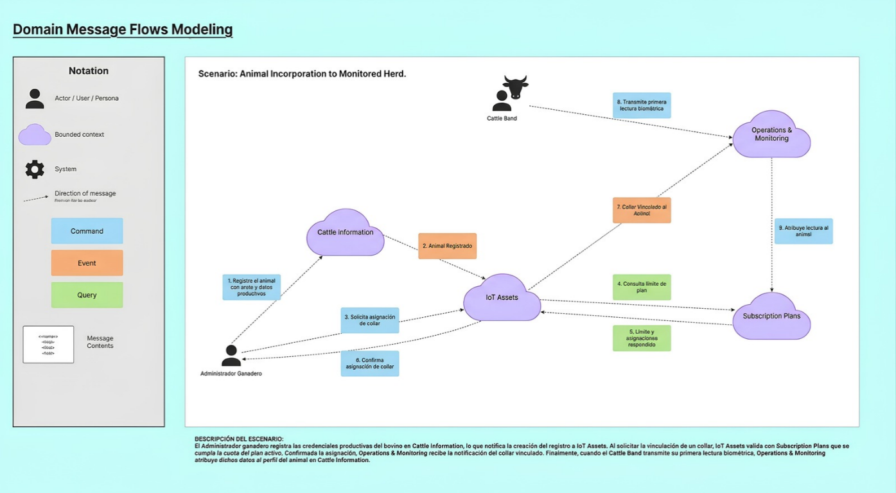

*Figura 10. Elaboración de creación propia por datos recolectados, startup SmartFarm.*

**Historia 2. Detección de fiebre durante el pastoreo sin cobertura**

| # | Actor | Actividad | Objeto de trabajo | Destinatario | Contexto |
|---|---|---|---|---|---|
| 1 | Cattle Band | transmite por BLE | la lectura de temperatura y posición | Portable Edge Gateway | Borde |
| 2 | Portable Edge Gateway | almacena | la lectura con su estado de sincronización | base local | Borde |
| 3 | Portable Edge Gateway | evalúa | la lectura contra los umbrales en caché | regla local | Borde |
| 4 | Portable Edge Gateway | genera | la alerta local de severidad crítica | Mobile Application | Borde |
| 5 | Operario de campo | recibe | la alerta en el potrero sin Internet | alerta | Borde |
| 6 | Operario de campo | registra | el evento de salud observado | Mobile Application | Operations & Monitoring |
| 7 | Portable Edge Gateway | sincroniza al recuperar señal | el lote de lecturas y alertas pendientes | Operations & Monitoring | Operations & Monitoring |
| 8 | Operations & Monitoring | valida y persiste | la telemetría y el evento del operario | base central | Operations & Monitoring |
| 9 | Operations & Monitoring | solicita | la notificación al responsable | Firebase Cloud Messaging | Operations & Monitoring |
| 10 | Médico veterinario | consulta | la telemetría y los antecedentes del animal | Operations & Monitoring | Operations & Monitoring |
| 11 | Operations & Monitoring | verifica | la autorización vigente del profesional | Identity & Access Management | Identity & Access Management |
| 12 | Médico veterinario | registra | la intervención con producto y dosis | Operations & Monitoring | Operations & Monitoring |
| 13 | Operations & Monitoring | inicia | el periodo de retiro del producto aplicado | Planning | Planning |

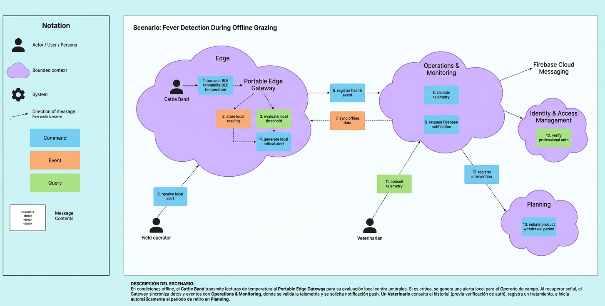

*Figura 11. Elaboración de creación propia por datos recolectados, startup SmartFarm.*

**Historia 3. Contratación de un plan y habilitación de capacidades**

| # | Actor | Actividad | Objeto de trabajo | Destinatario | Contexto |
|---|---|---|---|---|---|
| 1 | Visitante | compara | los planes y estima el costo de su hato | Landing Page | Subscription Plans |
| 2 | Visitante | solicita | una demostración con su contexto productivo | Landing Page | Subscription Plans |
| 3 | Administrador ganadero | contrata | el plan para su unidad productiva | Subscription Plans | Subscription Plans |
| 4 | Subscription Plans | solicita | el cobro del periodo | Payment Provider | Subscription Plans |
| 5 | Payment Provider | confirma | la aceptación del pago | Subscription Plans | Subscription Plans |
| 6 | Subscription Plans | publica | el hecho "suscripción activada" | IoT Assets, Dashboard & Analytics | Subscription Plans |
| 7 | IoT Assets | habilita | el límite de dispositivos del plan | Administrador ganadero | IoT Assets |
| 8 | Dashboard & Analytics | habilita | los reportes incluidos en el plan | Administrador ganadero | Dashboard & Analytics |

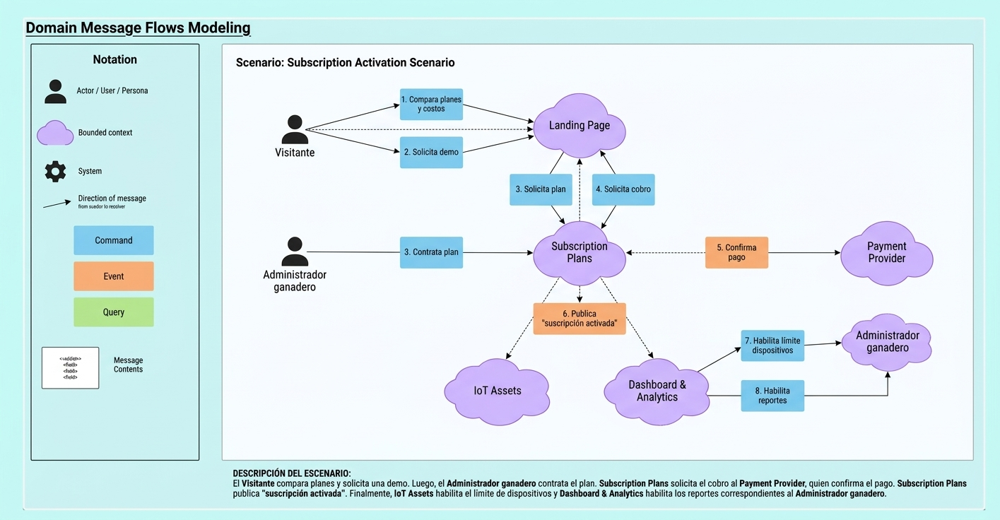

*Figura 12. Elaboración de creación propia por datos recolectados, startup SmartFarm.*

**Lectura de los flujos**

Las tres historias confirman que **Operations & Monitoring es el punto de convergencia** del sistema: participa en las tres y es el único contexto que recibe información tanto de los dispositivos como de las personas. También muestran que **Subscription Plans actúa como habilitador transversal**: no interviene en la operación diaria, pero condiciona lo que los demás contextos pueden hacer. Finalmente, la historia 2 evidencia que el borde debe poder **decidir por sí mismo** cuando no hay cobertura, lo que obliga a replicar en el Edge una porción de las reglas que pertenecen al contexto de monitoreo.

#### 4.1.1.3. Bounded Context Canvases

Cada contexto candidato se diseñó mediante un Bounded Context Canvas, siguiendo el proceso iterativo de definición del panorama, destilación de reglas de negocio y captura del lenguaje ubicuo, análisis de capacidades, estratificación, captura de dependencias y crítica del diseño. Se presentan ordenados por importancia para el negocio, empezando por el core domain.

**Canvas 1. Operations & Monitoring**

| Bloque | Contenido |
|---|---|
| **Propósito** | Convertir la telemetría capturada por los dispositivos en decisiones oportunas sobre la salud, la reproducción y la seguridad del ganado. |
| **Clasificación estratégica** | Core domain. Diferenciador del producto y razón de compra declarada por los seis entrevistados. |
| **Modelo de negocio** | Centro de valor. Su rendimiento determina la reducción de mortalidad que sostiene la propuesta comercial. |
| **Evolución** | En desarrollo activo. Se espera que sus reglas se refinen con cada ciclo de validación. |
| **Reglas de negocio destiladas** | El umbral depende de la etapa productiva del animal. No se genera una segunda alerta del mismo tipo para el mismo animal dentro de la ventana de 6 horas. Una lectura cuya precisión de posición excede la tolerancia no es concluyente. Un animal inactivo no genera alertas. El tiempo de respuesta se mide entre la generación y la atención de la alerta. |
| **Lenguaje ubicuo** | Telemetry, Rumination, Red Alert, Clinical Threshold, Geofence, Last Known Location, Estrus Detection, Insemination Event |
| **Capacidades entrantes** | Recibir telemetría del dispositivo y del borde. Recibir eventos de campo del operario. Recibir intervenciones clínicas del veterinario. Entregar configuración de umbrales y geocercas al borde. |
| **Capacidades salientes** | Publicar alertas generadas. Solicitar notificaciones. Exponer telemetría e historial a las aplicaciones y a Analytics. |
| **Dependencias** | Consume identidad de IAM, ficha del animal de Cattle Information y asignación de dispositivo de IoT Assets. Depende de Firebase Cloud Messaging para notificar. |
| **Crítica del diseño** | Es el contexto con mayor superficie. Se evaluó dividirlo en Telemetry y Alerting, y se descartó porque la regla de deduplicación exige que ambos compartan la misma transacción. |

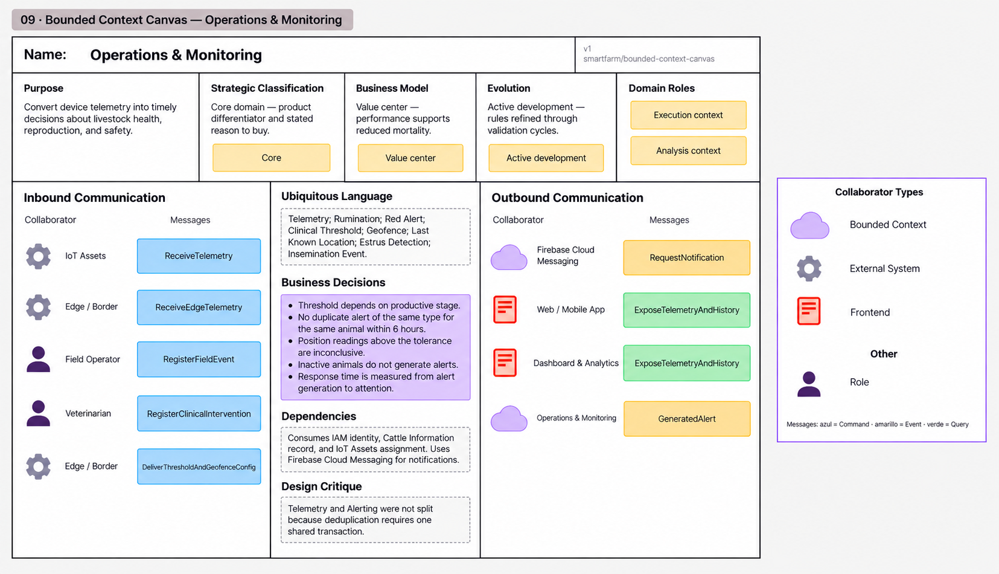

*Canvas 1. Bounded Context Canvas de Operations & Monitoring. Elaboración propia.*

**Canvas 2. Cattle Information**

| Bloque | Contenido |
|---|---|
| **Propósito** | Mantener la identidad y los datos productivos de cada animal del hato, y ser la fuente única de verdad sobre qué animales existen y en qué estado. |
| **Clasificación estratégica** | Core secundario. Sin ficha individual la telemetría carece de sujeto. |
| **Modelo de negocio** | Habilitador. Su calidad determina la confiabilidad de todo lo demás. |
| **Evolución** | Estable. El modelo del animal cambia poco una vez definido. |
| **Reglas de negocio destiladas** | El arete es único dentro de la unidad productiva, no globalmente. La etapa productiva se historia con periodos de vigencia. La fecha de vigencia de un cambio de etapa no puede ser futura. Un animal dado de baja conserva su historia pero sale del conteo del hato. |
| **Lenguaje ubicuo** | Cattle, Herd, Ear Tag, Breed, Life Stage, Lot, Paddock, Genealogy, Individual Record |
| **Capacidades entrantes** | Registrar animal. Actualizar etapa productiva. Registrar baja con motivo. Agrupar en lotes. |
| **Capacidades salientes** | Exponer la ficha y el estado del animal. Publicar el alta y la baja de animales. |
| **Dependencias** | Consume la identidad del predio de IAM. Es consumido por IoT Assets, Operations & Monitoring, Planning y Analytics. |
| **Crítica del diseño** | Se evaluó incorporar aquí el historial clínico y se descartó: la intervención clínica pertenece al flujo de monitoreo y atención, no a la identidad del animal. |

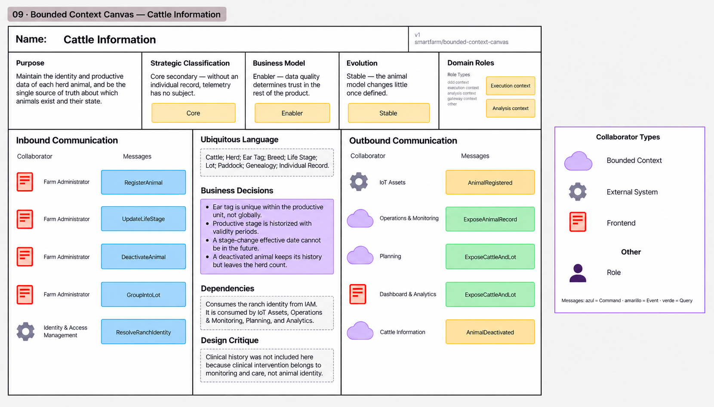

*Canvas 2. Bounded Context Canvas de Cattle Information. Elaboración propia.*

**Canvas 3. IoT Assets**

| Bloque | Contenido |
|---|---|
| **Propósito** | Administrar el inventario de dispositivos físicos y controlar a qué animal o abrevadero está asignado cada uno en cada momento. |
| **Clasificación estratégica** | Soporte. Necesario pero no diferenciador. |
| **Modelo de negocio** | Control de activos. Vincula la capacidad contratada con la capacidad efectivamente usada. |
| **Evolución** | Estable, con crecimiento asociado a nuevos tipos de dispositivo. |
| **Reglas de negocio destiladas** | Un dispositivo solo puede tener una asignación abierta a la vez. No se puede asignar más allá del límite del plan contratado. Al dar de baja el animal, su collar queda liberado. La telemetría del periodo de asignación se conserva vinculada al animal aunque el collar se reasigne. Un dispositivo sin comunicación durante más de 48 horas cambia de estado. |
| **Lenguaje ubicuo** | Smart Collar, Device Band, Device Assignment, Battery Level, Device Status, Blind Zone, Water Trough |
| **Capacidades entrantes** | Registrar dispositivo. Asignar y liberar. Consultar inventario y estado. |
| **Capacidades salientes** | Exponer la asignación vigente. Publicar el vínculo y la liberación del dispositivo. |
| **Dependencias** | Consulta el límite del plan a Subscription Plans y la existencia del animal a Cattle Information, ambas mediante Anti-corruption Layer. |
| **Crítica del diseño** | Se evaluó fusionarlo con Cattle Information y se descartó: el dispositivo tiene un ciclo de vida propio, se compra, se asigna, se libera y se da de baja con independencia del animal. |

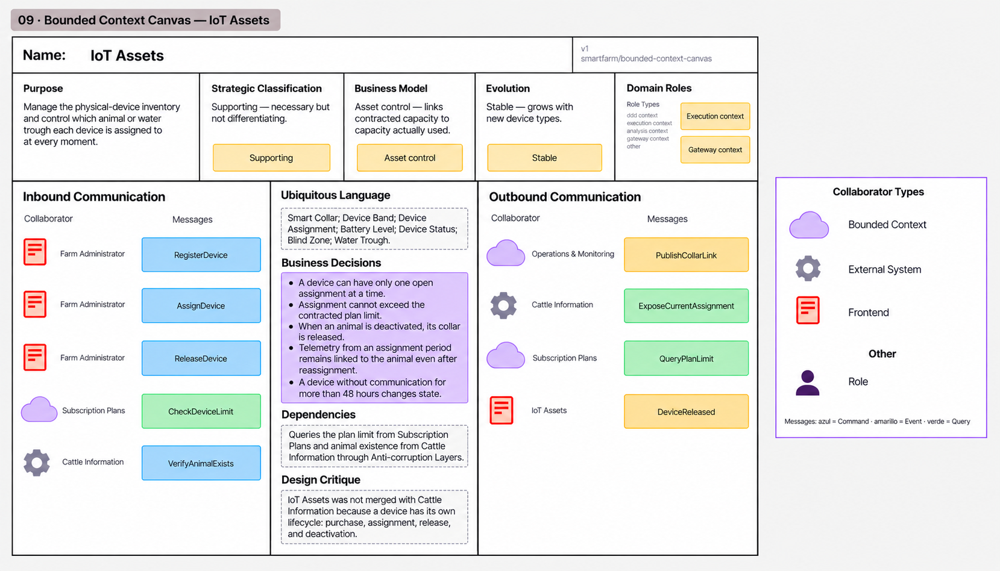

*Canvas 3. Bounded Context Canvas de IoT Assets. Elaboración propia.*

**Canvas 4. Planning**

| Bloque | Contenido |
|---|---|
| **Propósito** | Programar las faenas sanitarias y reproductivas del hato y dar seguimiento a su ejecución, sustituyendo la dependencia de la memoria. |
| **Clasificación estratégica** | Soporte con alto valor percibido. Fue solicitado de forma independiente por Próspero, Meikoll y Grober. |
| **Modelo de negocio** | Retención. Es la funcionalidad que convierte la plataforma en parte de la rutina. |
| **Evolución** | En desarrollo. El calendario regional varía por zona. |
| **Reglas de negocio destiladas** | Una campaña programada se superpone con un periodo de retiro si su fecha cae dentro de él. El recordatorio se emite una sola vez, al alcanzar el plazo de aviso. La campaña se cierra automáticamente cuando todos los animales del lote figuran aplicados. Una revisión de seguimiento sobre un animal dado de baja pasa a no aplicable. |
| **Lenguaje ubicuo** | Livestock Calendar, Livestock Task, Health Campaign, Reminder, Quarantine, Gestation Window, Fattening Cycle |
| **Capacidades entrantes** | Programar campaña. Registrar aplicación por animal. Programar revisión de seguimiento. Configurar el plazo de aviso. |
| **Capacidades salientes** | Emitir recordatorios. Exponer campañas vencidas. Exponer periodos de retiro vigentes. |
| **Dependencias** | Consume el lote y el animal de Cattle Information, y las intervenciones de Operations & Monitoring para calcular los periodos de retiro. |
| **Crítica del diseño** | Se evaluó modelar el periodo de retiro dentro de Operations & Monitoring, donde se origina, y se decidió ubicarlo aquí porque su consulta principal es de planificación y no de vigilancia. |

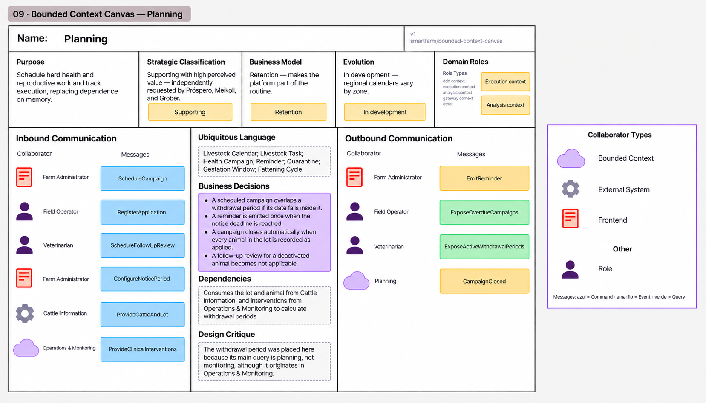

*Canvas 4. Bounded Context Canvas de Planning. Elaboración propia.*

**Canvas 5. Dashboard & Analytics**

| Bloque | Contenido |
|---|---|
| **Propósito** | Transformar los datos acumulados en indicadores y tendencias que sustenten decisiones productivas y sanitarias. |
| **Clasificación estratégica** | Soporte. Consume información de otros contextos sin producir hechos propios del negocio. |
| **Modelo de negocio** | Diferenciador comercial por plan. Los reportes avanzados son la funcionalidad exclusiva del plan superior. |
| **Evolución** | En crecimiento. Cada ciclo agrega indicadores. |
| **Reglas de negocio destiladas** | Todo indicador declara el periodo y la cantidad de animales excluidos del cálculo. Una curva epidemiológica requiere al menos dos casos del mismo cuadro. La comparación de un animal contra su lote requiere un mínimo de cinco animales con telemetría. Un reporte sin datos en el periodo no se genera. |
| **Lenguaje ubicuo** | Key Performance Indicator, Epidemiological Curve, Executive Report, Fattening Balance, Trend |
| **Capacidades entrantes** | Solicitar indicadores del hato. Solicitar tendencias por lote. Solicitar curva epidemiológica. Exportar reporte. |
| **Capacidades salientes** | Entregar series, promedios y valores atípicos. Entregar el archivo del reporte. |
| **Dependencias** | Lee de Operations & Monitoring, Cattle Information y Planning bajo relación Conformist. |
| **Crítica del diseño** | Es un contexto de solo lectura. Se decidió no permitirle escribir en los contextos de origen, de modo que un error en la analítica nunca corrompa el dato operativo. |

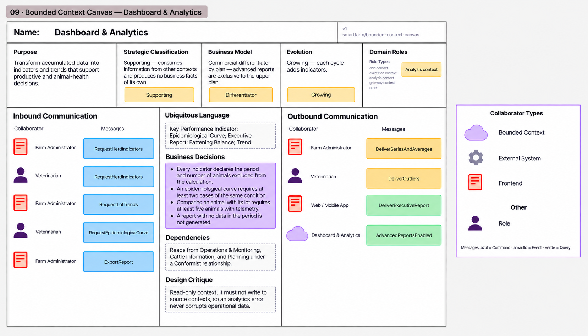

*Canvas 5. Bounded Context Canvas de Dashboard & Analytics. Elaboración propia.*

**Canvas 6. Identity & Access Management**

| Bloque | Contenido |
|---|---|
| **Propósito** | Establecer quién es cada usuario, a qué unidades productivas puede acceder y con qué alcance, incluida la relación de asesoría entre un profesional y un hato ajeno. |
| **Clasificación estratégica** | Genérico en lo técnico, con una porción de dominio propia. La asesoría del hato es una relación del negocio ganadero, no un concepto de infraestructura. |
| **Modelo de negocio** | Habilitador y canal. La asesoría convierte al veterinario en promotor de la plataforma. |
| **Evolución** | Estable. |
| **Reglas de negocio destiladas** | Un profesional accede únicamente a los hatos sobre los que tiene una asesoría vigente. La asesoría puede tener fecha de vencimiento y expira sola. Al revocarla, los registros clínicos previos conservan su autoría. Cinco intentos fallidos consecutivos bloquean la cuenta 15 minutos. El número de colegiatura es único entre perfiles verificados. |
| **Lenguaje ubicuo** | Herd Advisory, Advisory Scope, Colegiatura, Cattle Rancher, Farm Administrator, Veterinarian, Ranch |
| **Capacidades entrantes** | Registrar unidad productiva. Autenticar. Completar perfil profesional. Solicitar, conceder y revocar asesoría. |
| **Capacidades salientes** | Resolver la identidad y el alcance de acceso de cada solicitud. |
| **Dependencias** | Delega la verificación de credenciales en Firebase Authentication mediante Anti-corruption Layer. |
| **Crítica del diseño** | Aquí se tomó la decisión de **absorber el contexto candidato Profiles**, que se detalla en la sección de Context Mapping. |

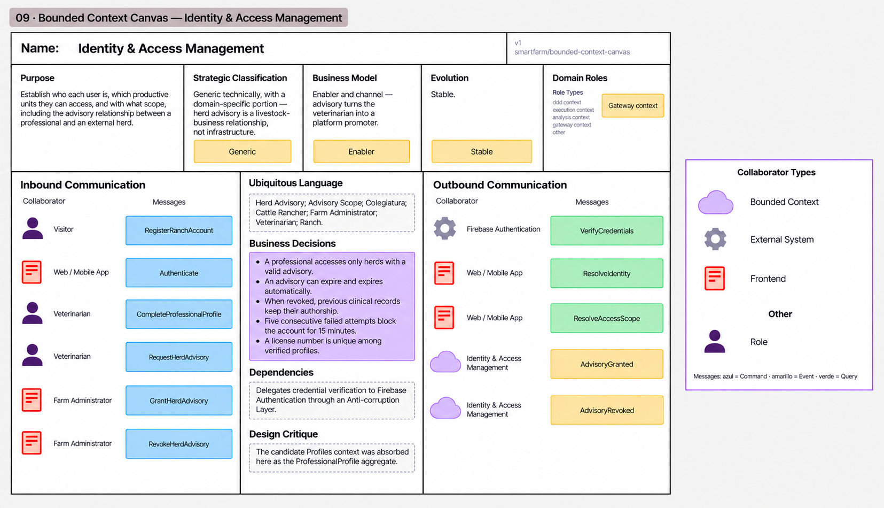

*Canvas 6. Bounded Context Canvas de Identity & Access Management. Elaboración propia.*

**Canvas 7. Subscription Plans**

| Bloque | Contenido |
|---|---|
| **Propósito** | Administrar los planes contratados, sus límites y su facturación, y determinar qué capacidades tiene habilitada cada unidad productiva. |
| **Clasificación estratégica** | Genérico. Su mecánica es común a cualquier plataforma bajo suscripción. |
| **Modelo de negocio** | Fuente de ingresos. Sostiene los Business Goals de captación y renovación. |
| **Evolución** | Estable, con cambios asociados a la política comercial. |
| **Reglas de negocio destiladas** | El plan define el límite de dispositivos y el conjunto de funcionalidades habilitadas. Una solicitud dirigida a una funcionalidad no incluida se rechaza indicando el plan requerido. La modalidad preferida por el segmento es el pago anual con tarifa fija. Una suscripción cancelada conserva su historial de pagos. |
| **Lenguaje ubicuo** | Plan, Annual Subscription, Device Limit, Plan Coverage, Renewal |
| **Capacidades entrantes** | Contratar plan. Renovar. Cancelar. Consultar cobertura y límites. |
| **Capacidades salientes** | Exponer el límite de dispositivos y las funcionalidades habilitadas. Publicar la activación y la cancelación. |
| **Dependencias** | Delega el cobro en el proveedor de pagos mediante Anti-corruption Layer. |
| **Crítica del diseño** | Se evaluó adoptar una plataforma de suscripciones de terceros. Se descartó para esta fase por la necesidad de vincular el límite de dispositivos con el inventario propio, que es una regla específica del producto. |

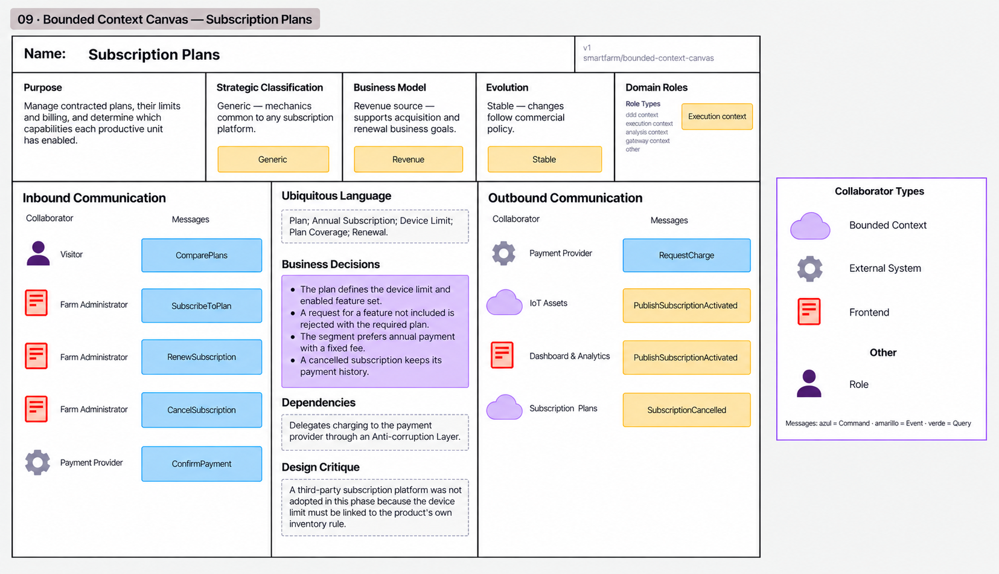

*Canvas 7. Bounded Context Canvas de Subscription Plans. Elaboración propia.*

**Canvas 8. Profiles, contexto candidato descartado**

| Bloque | Contenido |
|---|---|
| **Propósito original** | Mantener los datos demográficos y profesionales de los actores del sistema. |
| **Resultado del análisis** | El análisis de capacidades mostró que todas sus reglas dependen de la identidad del usuario y que ninguna capacidad podía ejercerse sin consultar Identity & Access Management en la misma transacción. |
| **Decisión** | Absorbido por Identity & Access Management como el agregado `ProfessionalProfile`. La justificación completa se desarrolla en la sección siguiente. |

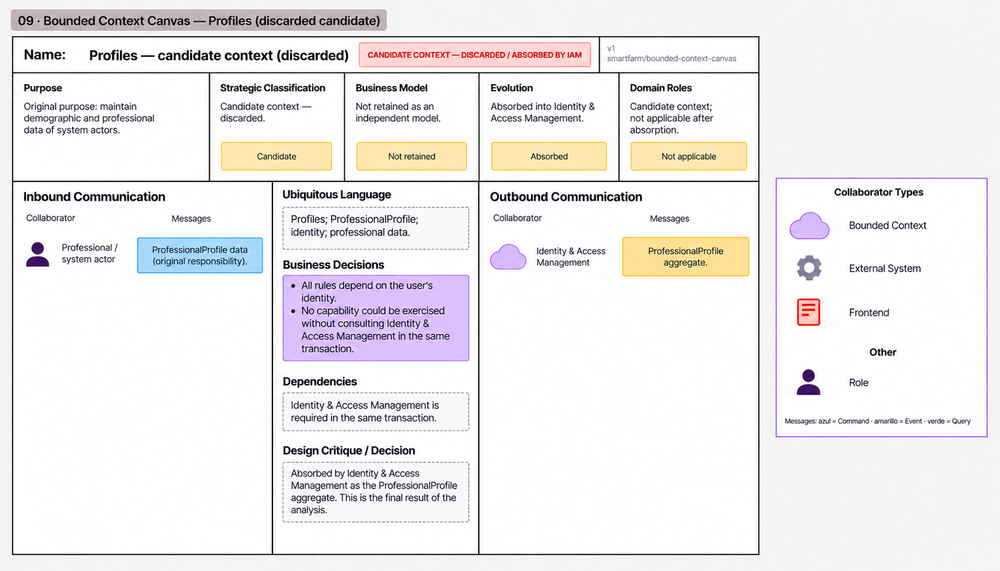

*Canvas 8. Bounded Context Canvas de Profiles, contexto candidato descartado. Elaboración propia.*

### 4.1.2. Context Mapping

El Context Mapping documenta las relaciones estructurales entre los contextos acotados y deja constancia de las alternativas que el equipo evaluó antes de llegar al diseño final.

El mapa se presenta en dos vistas. La primera muestra las relaciones entre los contextos acotados del backend, ordenadas de arriba hacia abajo desde el contexto upstream hacia el downstream. La segunda muestra las integraciones con el borde, los dispositivos y los servicios externos. Separarlas evita el cruce de relaciones que hacía ilegible una única vista con todos los elementos.

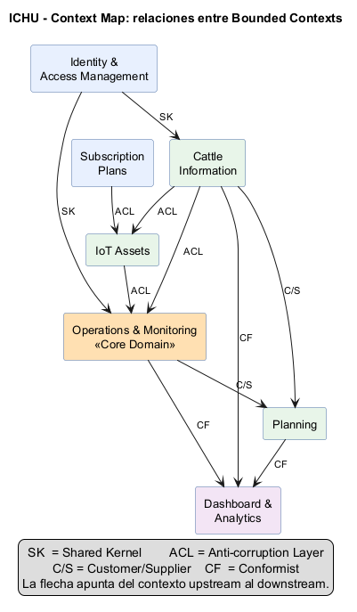

*Figura 4.1. Context Map de los Bounded Contexts. Elaboración propia con PlantUML.*

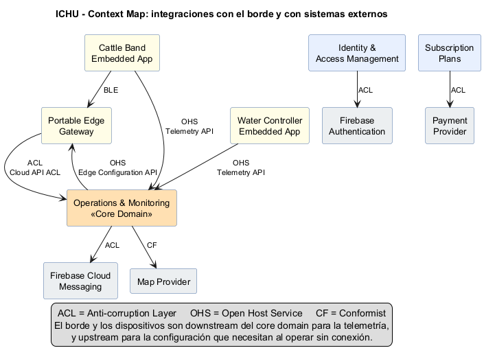

*Figura 4.2. Integraciones con el borde y con sistemas externos. Elaboración propia con PlantUML.*

**Patrones aplicados**

| Relación | Patrón | Justificación |
|---|---|---|
| Identity & Access Management con Cattle, Monitoring, Planning y Analytics | Shared Kernel | Los identificadores de unidad productiva y de usuario son compartidos por todos los contextos. Se trata de un núcleo mínimo y deliberadamente pequeño: solo identificadores, nunca comportamiento. |
| Cattle Information hacia Operations & Monitoring | Customer/Supplier con Anti-corruption Layer | Monitoring necesita saber si el animal existe y en qué etapa productiva está para elegir el umbral. El ACL `Cattle Lookup` traduce la ficha completa a lo mínimo que la regla necesita. |
| Cattle Information hacia IoT Assets | Customer/Supplier con Anti-corruption Layer | El ACL `Cattle Assignment` valida la existencia del animal sin acoplar el inventario de dispositivos al modelo del ganado. |
| IoT Assets hacia Operations & Monitoring | Customer/Supplier con Anti-corruption Layer | El ACL `IoT Assets Lookup` resuelve a qué animal pertenece cada lectura sin exponer el ciclo de vida del dispositivo. |
| Subscription Plans hacia IoT Assets | Customer/Supplier con Anti-corruption Layer | El ACL `Subscription Entitlement` traduce el plan comercial a un número de dispositivos permitidos, que es lo único que la regla de asignación necesita. |
| Monitoring, Cattle y Planning hacia Dashboard & Analytics | Conformist | Analytics consume los modelos tal como los publican los contextos de origen, sin negociar cambios ni traducir. Es aceptable porque su relación es de solo lectura y un cambio aguas arriba solo obliga a recalcular. |
| Operations & Monitoring hacia Portable Edge Gateway | Open Host Service | El `Edge Configuration API` publica un contrato estable de umbrales, geocercas y asignaciones que cualquier dispositivo de borde puede consumir. |
| Portable Edge Gateway hacia Operations & Monitoring | Anti-corruption Layer | El `ICHU Cloud API ACL` traduce el modelo local del borde, orientado a la supervivencia sin conexión, al contrato de la nube. |
| Identity con Firebase Authentication, Subscription con el proveedor de pagos, Monitoring con Firebase Cloud Messaging | Anti-corruption Layer | Tres servicios externos sobre los que el equipo no tiene control. El ACL aísla el dominio de cualquier cambio en sus contratos. |
| Monitoring con el proveedor de mapas | Conformist | La visualización cartográfica se adapta al contrato del proveedor, porque no hay reglas de negocio propias que proteger. |

**Alternativas evaluadas y descartadas**

El equipo discutió cinco alternativas de organización antes de fijar el mapa anterior.

**¿Qué pasaría si dividimos Operations & Monitoring en Telemetry y Alerting?** La separación resultaba atractiva porque la ingesta de datos y la generación de alertas tienen ritmos distintos. Se descartó porque la regla que impide duplicar alertas dentro de una ventana de seis horas exige leer las alertas abiertas en el mismo instante en que se evalúa la lectura entrante. Separarlos obligaría a una consulta entre contextos en el camino crítico de cada lectura recibida.

**¿Qué pasaría si movemos el periodo de retiro de Planning a Operations & Monitoring?** El periodo de retiro nace de una intervención clínica, que pertenece a Monitoring. Sin embargo, sus dos consultas principales son de planificación: verificar si una campaña se superpone con un retiro vigente, y saber si la producción de un animal tiene restricción. Se decidió ubicarlo en Planning y que Monitoring publique el hecho que lo origina.

**¿Qué pasaría si duplicamos la ficha del animal en Operations & Monitoring para romper la dependencia?** La duplicación eliminaría el ACL y aceleraría la evaluación de reglas. Se descartó porque introduciría dos fuentes de verdad sobre la etapa productiva, que es justamente el dato del que depende la elección del umbral. Un desfase entre ambas copias produciría alertas incorrectas.

**¿Qué pasaría si creamos un contexto compartido de Notificaciones?** Tres contextos necesitan notificar: Monitoring por alertas, Planning por recordatorios y Subscription por vencimientos. Se evaluó extraer esa capacidad a un contexto propio. Se descartó para esta fase porque el contenido de cada notificación pertenece al dominio que la origina, y un contexto compartido terminaría conociendo las reglas de los tres. La duplicación del adaptador de mensajería resultó preferible al acoplamiento.

**¿Qué pasaría si mantenemos Profiles como contexto independiente?** Esta es la alternativa que sí cambió el diseño, y se resuelve a continuación.

**Decisión sobre el contexto Profiles**

El análisis de capacidades de Profiles mostró que ninguna de sus operaciones podía completarse sin consultar Identity & Access Management dentro de la misma transacción. Completar un perfil profesional requiere validar que el usuario existe y tiene rol de veterinario. Consultar un perfil requiere resolver antes si el solicitante tiene derecho a verlo. La única regla propia, la unicidad del número de colegiatura entre perfiles verificados, depende del estado de verificación que gestiona Identity.

En consecuencia, **Profiles se absorbe dentro de Identity & Access Management** como el agregado `ProfessionalProfile`, y la solución implementa **siete contextos acotados** en lugar de los ocho candidatos. Esta decisión es la que explica que el componente de interfaz del contexto se denomine `Identity & Profile API` en el modelo de arquitectura.

El Ubiquitous Language del capítulo anterior conserva ambos bloques separados porque documenta el vocabulario del negocio, donde el perfil profesional y la cuenta de acceso son conceptos distintos para los usuarios. La fusión es una decisión de diseño de la solución, no una fusión conceptual del dominio.

### 4.1.3. Software Architecture

La arquitectura de la solución se representa aplicando el C4 Model, elaborado como Diagram-as-Code en Structurizr DSL. El modelo completo reúne cuatro personas, seis sistemas externos, nueve containers, setenta y tres componentes clasificados por capa y veinticinco vistas.

El código fuente de todos los diagramas de este capítulo forma parte del repositorio. El modelo C4 se encuentra en `diagrams/structurizr/workspace-ichu-c4.dsl` y los diagramas UML y de base de datos en `diagrams/puml/`.

La solución se organiza como un **monolito modular** en la nube, en el que cada contexto acotado es un módulo interno con su propio esquema de base de datos, acompañado de un servicio de borde y dos aplicaciones embebidas. Se eligió el monolito modular sobre una arquitectura de microservicios porque el equipo tiene seis integrantes y un ciclo de quince semanas: el aislamiento por módulos preserva los límites de los contextos sin pagar el costo operativo de desplegar y coordinar siete servicios independientes. La modularidad interna deja abierta la extracción posterior de cualquier módulo que lo justifique.

#### 4.1.3.1. Software Architecture System Landscape Diagram

El System Landscape presenta el panorama completo en el que se inserta la solución: las cuatro personas que interactúan con ella, los dos dispositivos físicos que la alimentan y los cuatro servicios externos de los que depende. A diferencia del diagrama de contexto, incluye los elementos que rodean al sistema aunque no todos se comuniquen directamente con él.

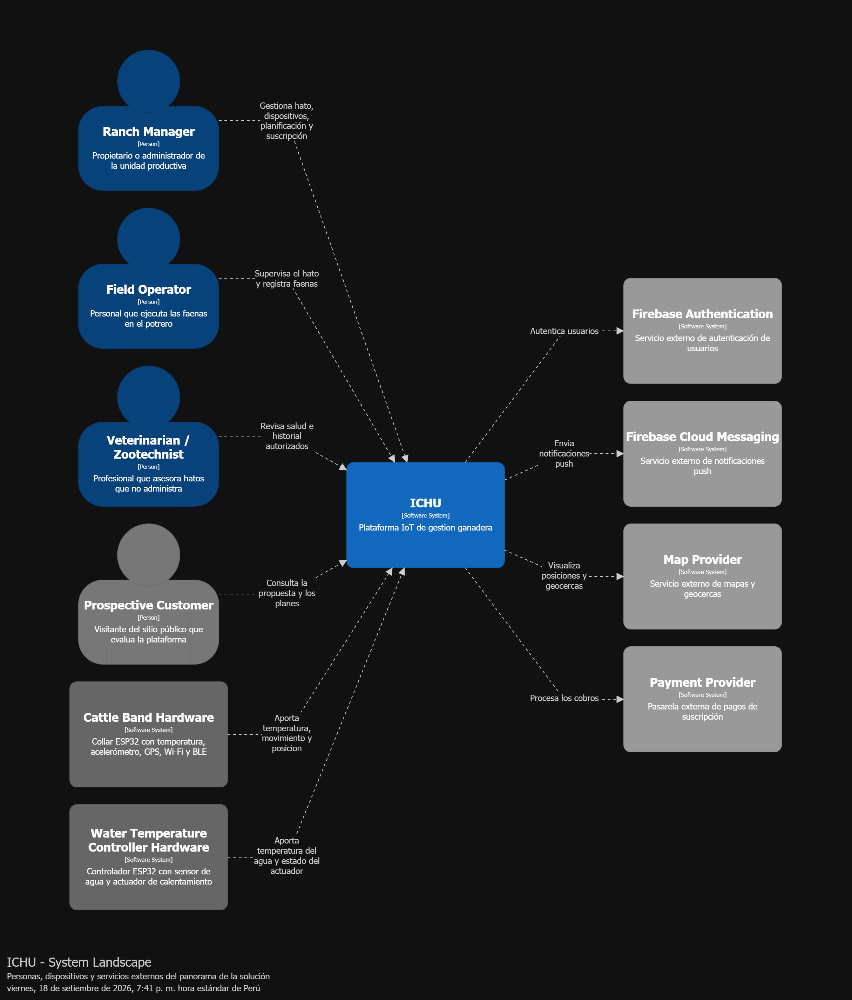

*Figura 4.3. System Landscape. Elaboración propia con Structurizr.*

#### 4.1.3.2. Software Architecture Context Level Diagram

El Context Diagram sitúa a ICHU como una caja única en el centro, rodeada por sus usuarios y por los sistemas con los que intercambia información. Permite discutir el alcance de la solución sin entrar en decisiones de implementación.

Los actores representados son el **administrador ganadero**, que gestiona el ganado, los dispositivos, la planificación y la suscripción; el **operario de campo**, que supervisa el ganado durante las faenas y opera con o sin cobertura; el **médico veterinario**, que revisa la información autorizada de los hatos que asesora; y el **visitante**, que consulta la propuesta y los planes en el sitio público.

Los sistemas externos son el **hardware del collar inteligente** y el **hardware del controlador del abrevadero**, que aportan telemetría; **Firebase Authentication**, que verifica credenciales; **Firebase Cloud Messaging**, que entrega notificaciones; el **proveedor de mapas**, que permite visualizar posiciones y geocercas; y el **proveedor de pagos**, que procesa los cobros de la suscripción.

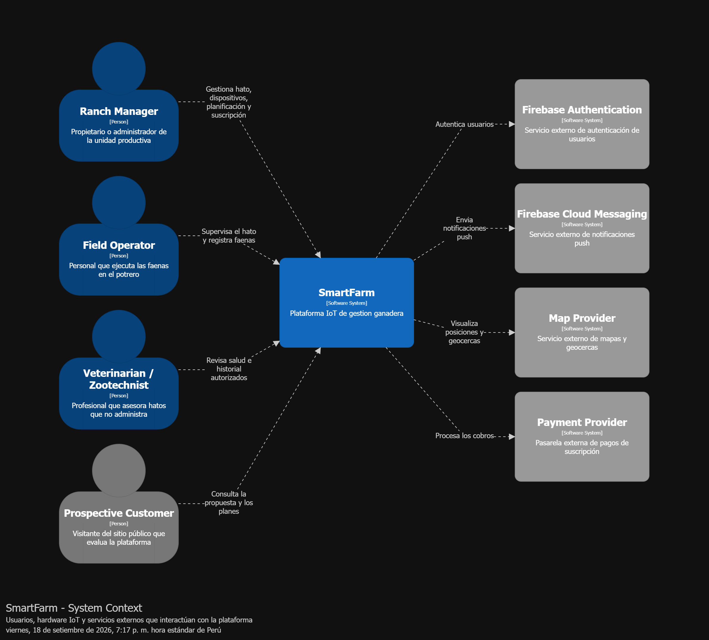

*Figura 4.4. System Context. Elaboración propia con Structurizr.*

#### 4.1.3.3. Software Architecture Container Level Diagram

El Container Diagram descompone la solución en sus unidades de despliegue independientes y muestra las decisiones tecnológicas y los protocolos de comunicación entre ellas.

| Container | Tecnología | Responsabilidad |
|---|---|---|
| Landing Page | HTML5, CSS3 y JavaScript | Sitio público con la propuesta de valor, los planes y el canal de contacto |
| Web Application | Angular con TypeScript | Gestión del ganado, dispositivos, planificación, analítica y suscripciones |
| Mobile Application | Flutter con Dart | Monitoreo, alertas y operación de campo, con funcionamiento sin cobertura |
| Cattle Band Embedded Application | C++ sobre ESP32 | Captura de temperatura, movimiento y posición, con transmisión por Wi-Fi o BLE |
| Water Controller Embedded Application | C++ sobre ESP32 | Medición de la temperatura del agua y accionamiento del calentador |
| Portable Edge Gateway | Flask con Peewee ORM sobre Python | Recepción por BLE, almacenamiento local, evaluación de reglas críticas y sincronización |
| Edge Database | SQLite | Telemetría sin conexión, estado de alertas, umbrales y geocercas en caché |
| ICHU Modular Monolith | ASP.NET Core Web API sobre .NET 8 | Backend en la nube con los siete contextos como módulos internos |
| ICHU Cloud Database | PostgreSQL 16 | Persistencia relacional con un esquema por contexto acotado |

Las aplicaciones cliente consumen el RESTful API sobre HTTPS con JSON. El collar transmite directamente al backend cuando hay Wi-Fi e Internet, y por Bluetooth Low Energy al Edge Gateway durante el pastoreo sin cobertura. El Edge Gateway entrega alertas locales a la aplicación móvil por red local, sin depender de Internet. El backend accede a PostgreSQL mediante Entity Framework Core con el proveedor Npgsql.

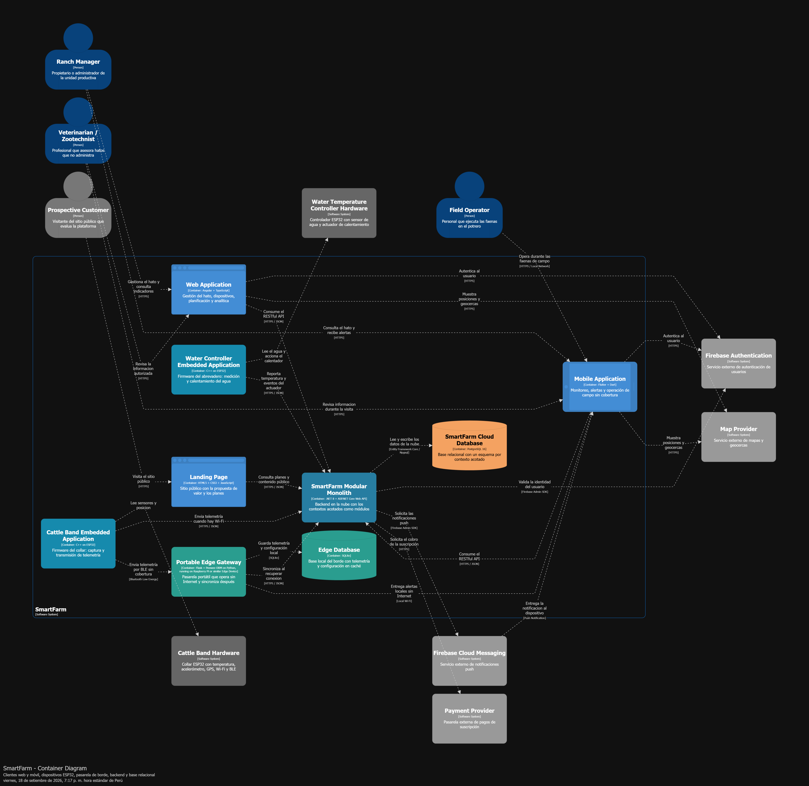

*Figura 4.5. Container Diagram. Elaboración propia con Structurizr.*

#### 4.1.3.4. Software Architecture Deployment Diagrams

El Deployment Diagram describe dónde se ejecuta cada container en el entorno de producción.

| Nodo de despliegue | Contiene | Observación |
|---|---|---|
| Entorno del predio y zona de pastoreo | Cattle Band Device, Water Temperature Controller Device, Portable Edge Gateway Device, dispositivo móvil del operario | Opera con conectividad intermitente por diseño |
| Computadora del usuario | Navegador con la Landing Page y la Web Application | Acceso desde la oficina del predio o desde la ciudad |
| Plataforma en la nube | Runtime .NET con el monolito modular, instancia de PostgreSQL, servicios de Firebase | Único punto con conectividad permanente garantizada |

El reparto responde directamente al hallazgo de conectividad del capítulo anterior: el 100% de los encuestados calificó la cobertura en las zonas de pastoreo como regular. Por eso el Edge Gateway y su base local se despliegan en el predio y no en la nube, y por eso las reglas críticas se evalúan en el borde.

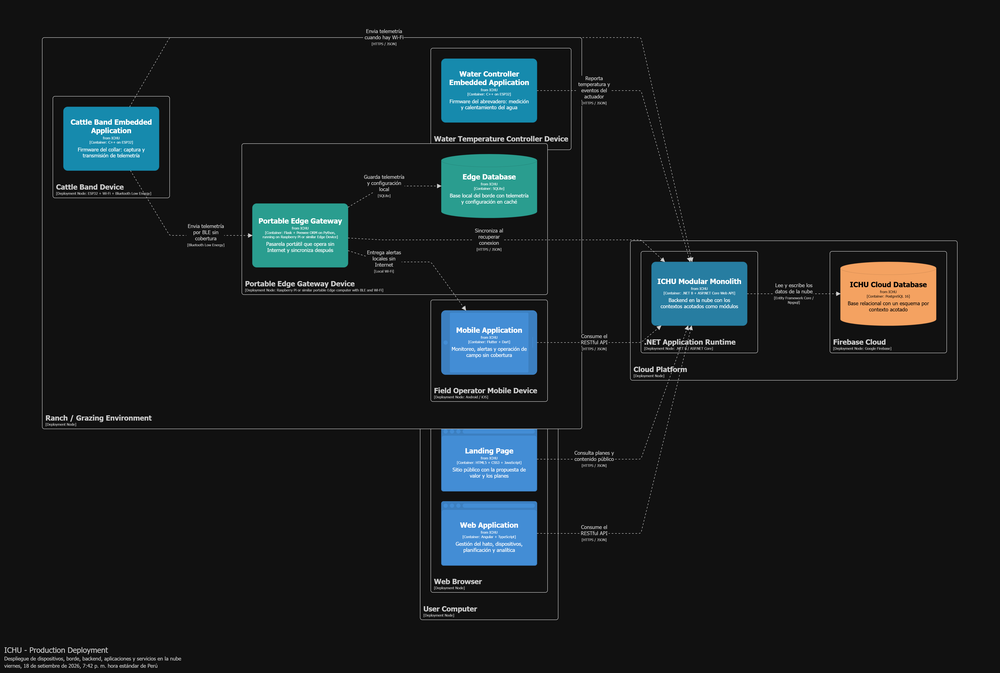

*Figura 4.6. Deployment Diagram del entorno de producción. Elaboración propia con Structurizr.*

## 4.2. Tactical-Level Domain-Driven Design

Esta sección detalla el diseño interno de cada contexto acotado. Los siete contextos se implementan como módulos del monolito modular y comparten la misma organización en cuatro capas, de modo que un integrante del equipo que conoce un módulo puede orientarse en cualquier otro.

La **Domain Layer** contiene las reglas del negocio: Aggregates, Entities, Value Objects, Domain Services y las interfaces de los Repositories. No depende de ninguna otra capa. La **Interface Layer** expone las capacidades del contexto mediante Controllers, y es la única que conoce el protocolo HTTP. La **Application Layer** orquesta los casos de uso mediante Command Handlers y Event Handlers, sin contener reglas de negocio propias. La **Infrastructure Layer** implementa los Repositories definidos en el dominio y contiene los adaptadores hacia servicios externos y los Anti-corruption Layers.

Los contextos se presentan en orden de importancia para el negocio, empezando por el core domain.

### 4.2.1. Bounded Context: Operations & Monitoring

Es el core domain de la solución. Recibe la telemetría de los dispositivos y del borde, evalúa las reglas que determinan cuándo una lectura representa un problema, genera las alertas, registra los eventos de campo y las intervenciones clínicas, y entrega al borde la configuración que necesita para operar sin conexión.

#### 4.2.1.1. Domain Layer

| Clase | Categoría | Propósito | Miembros destacados |
|---|---|---|---|
| `TelemetryReading` | Aggregate Root | Representa una lectura recibida de un dispositivo, con su origen y su instante de captura. | Atributos: `bodyTemperature`, `activityIndex`, `ruminationMinutes`, `position`, `recordedAt`, `origin`. Métodos: `IsValid()`, `IsStale(now)`. |
| `MonitoringAlert` | Aggregate Root | Concentra la regla de generación, deduplicación y atención de una alerta. Es el agregado que garantiza que no se dupliquen alertas del mismo tipo dentro de la ventana definida. | Métodos: `Raise(value, threshold)`, `Absorb(reading)`, `Acknowledge(finding, at)`, `ExpireWithoutAttention()`, `ResponseTime()`. |
| `Geofence` | Aggregate Root | Delimita el área de pastoreo permitida y resuelve si una posición está dentro o fuera de ella. | Métodos: `IsClosedPolygon()`, `Contains(position)`, `DistanceToBoundary(position)`. |
| `LivestockOperation` | Aggregate Root | Registra un evento de campo o una intervención clínica, con su autoría y su estado de sincronización. | Métodos: `Register()`, `MarkSynchronized()`, `MarkConflict(reason)`. |
| `Threshold` | Value Object | Rango válido de una métrica para una etapa productiva. Es inmutable y su identidad la componen la etapa y la métrica. | Método: `IsExceededBy(value)`. |
| `GeoPosition` | Value Object | Coordenada con su precisión declarada. La precisión es parte del valor porque determina si la lectura es concluyente. | Método: `DistanceTo(other)`. |
| `AlertType`, `AlertSeverity`, `AlertStatus`, `OperationType`, `ReadingOrigin`, `SyncState` | Enumeraciones | Fijan los valores admitidos de cada clasificación del contexto. | |
| `MonitoringRulesDomainService` | Domain Service | Concentra las reglas que involucran a más de un agregado y que no pertenecen a ninguno en particular. | Métodos: `EvaluateTemperature()`, `EvaluateGeofence()`, `DetectReproductivePattern()`, `IsDuplicateWithinWindow()`. |
| `IMonitoringRepository`, `IGeofenceRepository` | Repository (interfaz) | Abstraen la persistencia. Se definen en el dominio y se implementan en la infraestructura. | |

#### 4.2.1.2. Interface Layer

| Clase | Categoría | Propósito |
|---|---|---|
| `TelemetryController` | Controller | Recibe las lecturas del collar y del Edge Gateway, y expone la consulta de telemetría por animal y rango de fechas. |
| `AlertsController` | Controller | Expone la creación de alertas, la consulta por estado y la transición a atendida. |
| `OperationsController` | Controller | Recibe los eventos de campo del operario y las intervenciones clínicas del veterinario. |
| `GeofencesController` | Controller | Expone la definición y consulta de las zonas de pastoreo. |
| `EdgeConfigurationController` | Controller | Entrega al borde los umbrales, geocercas y asignaciones vigentes, y recibe los lotes de sincronización. |
| `WaterControllerReadingsController` | Controller | Recibe las lecturas del controlador del abrevadero y expone su consulta. |

#### 4.2.1.3. Application Layer

| Clase | Categoría | Propósito |
|---|---|---|
| `IngestTelemetryCommandHandler` | Command Handler | Valida la lectura, resuelve el animal asociado, la persiste y solicita la evaluación de reglas. |
| `SynchronizeEdgeBatchCommandHandler` | Command Handler | Procesa un lote del borde, devuelve el resultado individual de cada registro y conserva los rechazados con su motivo. |
| `AcknowledgeAlertCommandHandler` | Command Handler | Registra la atención de una alerta y calcula el tiempo de respuesta. |
| `RegisterFieldEventCommandHandler` | Command Handler | Registra el evento observado y resuelve el conflicto cuando el animal fue dado de baja. |
| `RegisterClinicalInterventionCommandHandler` | Command Handler | Registra la intervención, verifica la autorización del profesional y publica el hecho que origina el periodo de retiro. |
| `DefineGeofenceCommandHandler` | Command Handler | Valida que el polígono sea cerrado y lo asocia al lote. |
| `ThresholdExceededEventHandler` | Event Handler | Reacciona al hecho de umbral superado generando o absorbiendo la alerta según la ventana de deduplicación. |
| `AlertRaisedEventHandler` | Event Handler | Solicita la notificación al responsable configurado. |
| `CattleDeactivatedEventHandler` | Event Handler | Descarta las lecturas posteriores a la baja del animal. |

#### 4.2.1.4. Infrastructure Layer

| Clase | Categoría | Propósito |
|---|---|---|
| `MonitoringRepository` | Repository | Implementa `IMonitoringRepository` con Entity Framework Core sobre el esquema `monitoring`. |
| `GeofenceRepository` | Repository | Implementa `IGeofenceRepository`, incluida la persistencia ordenada de los vértices del polígono. |
| `CattleLookupAcl` | Anti-corruption Layer | Traduce la ficha del animal publicada por Cattle Information a la etapa productiva que la regla necesita. |
| `IoTAssetsLookupAcl` | Anti-corruption Layer | Resuelve a qué animal está asignado un dispositivo en el instante de la lectura. |
| `FirebaseMessagingAdapter` | Adapter | Solicita la notificación push y registra el estado de entrega devuelto por el servicio. |
| `MapProviderAdapter` | Adapter | Traduce las posiciones al contrato del proveedor cartográfico. |
| `InternalDomainEventDispatcher` | Infrastructure | Publica los eventos de dominio hacia los handlers de los demás módulos dentro del mismo proceso. |

#### 4.2.1.5. Bounded Context Software Architecture Component Level Diagrams

La vista `MonitoringComponents` del workspace representa la descomposición interna de este módulo dentro del container del monolito, mostrando las tres interfaces HTTP, los tres servicios de aplicación, los dos agregados, el servicio de dominio, los dos Anti-corruption Layers y el repositorio.

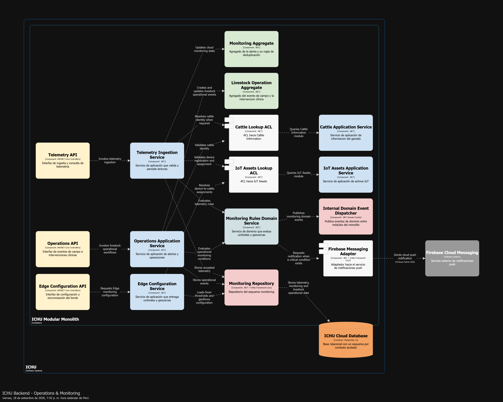

*Figura 4.7. Componentes del módulo Operations & Monitoring. Elaboración propia con Structurizr.*

Este contexto se realiza además en tres containers fuera del backend: las dos aplicaciones embebidas que capturan la telemetría y la pasarela de borde que la recibe y evalúa sin conexión. Sus diagramas de componentes se presentan a continuación.

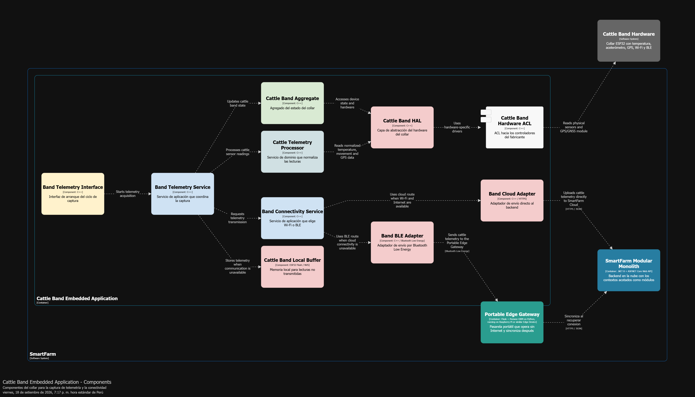

*Figura 4.8. Componentes del firmware del collar inteligente. Elaboración propia con Structurizr.*

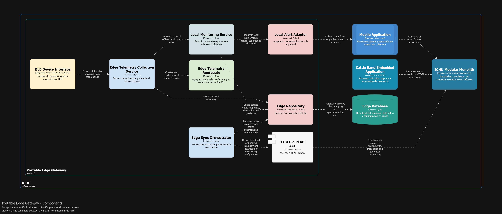

*Figura 4.9. Componentes de la pasarela de borde. Elaboración propia con Structurizr.*

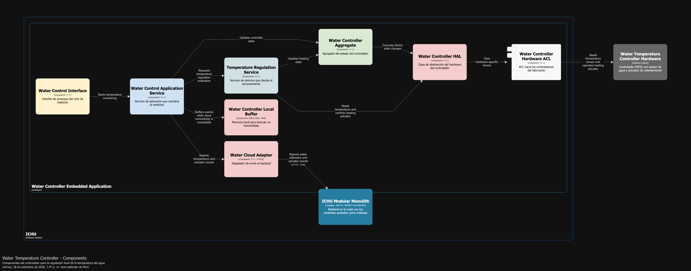

*Figura 4.10. Componentes del firmware del controlador del abrevadero. Elaboración propia con Structurizr.*

**Flujos dinámicos del contexto**

Los diagramas dinámicos ilustran la secuencia de colaboración entre componentes en los tres escenarios de conectividad que la solución debe cubrir.

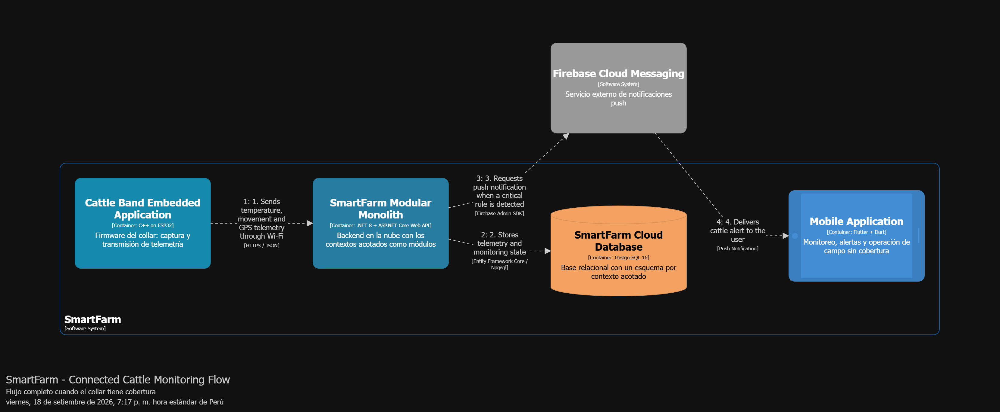

*Figura 4.11. Flujo completo cuando el collar tiene cobertura. Elaboración propia con Structurizr.*

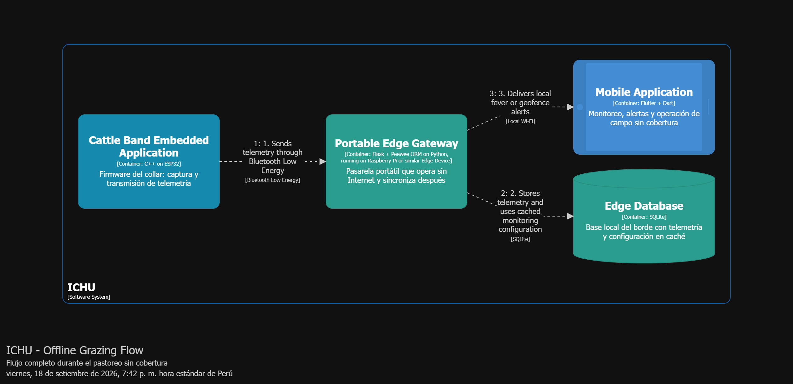

*Figura 4.12. Flujo completo durante el pastoreo sin cobertura. Elaboración propia con Structurizr.*

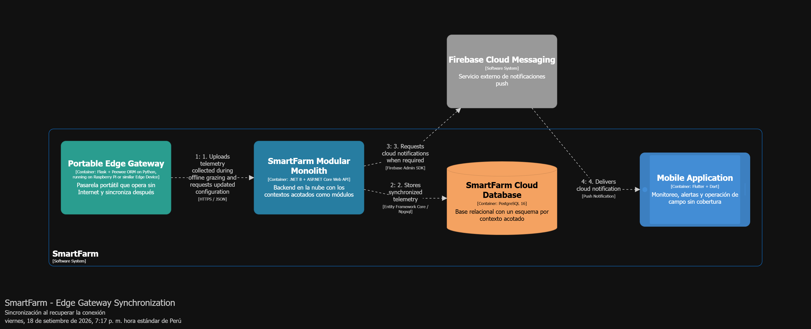

*Figura 4.13. Sincronización al recuperar la conexión. Elaboración propia con Structurizr.*

#### 4.2.1.6. Bounded Context Software Architecture Code Level Diagrams

##### 4.2.1.6.1. Bounded Context Domain Layer Class Diagrams

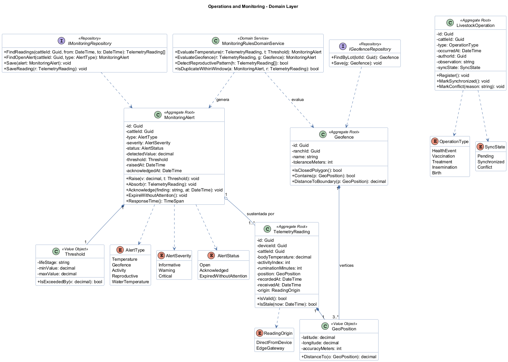

*Figura 4.14. Domain Layer de Operations & Monitoring. Elaboración propia con PlantUML.*

El diagrama muestra la composición de `MonitoringAlert` con su `Threshold` y su agregación con las lecturas que la sustentan, con multiplicidad de uno a muchos. `Geofence` compone al menos tres vértices, que es la condición mínima para que el polígono sea cerrado. `TelemetryReading` compone su posición, de modo que la precisión viaja junto a la coordenada.

##### 4.2.1.6.2. Bounded Context Database Design Diagram

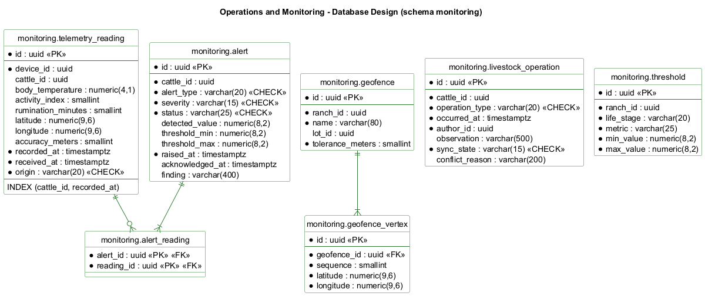

*Figura 4.15. Esquema `monitoring`. Elaboración propia con PlantUML.*

La tabla `alert_reading` resuelve la relación de muchos a muchos entre alertas y lecturas con una clave primaria compuesta. Los vértices de la geocerca se almacenan con su número de secuencia para preservar el orden del polígono. La tabla `telemetry_reading` lleva un índice compuesto por animal y fecha de captura, porque es el criterio de todas las consultas de historial.

### 4.2.2. Bounded Context: Cattle Information

Mantiene la identidad y los datos productivos de cada animal. Es la fuente única de verdad sobre qué animales existen, en qué etapa están y cuáles siguen activos en el hato.

#### 4.2.2.1. Domain Layer

| Clase | Categoría | Propósito | Miembros destacados |
|---|---|---|---|
| `Cattle` | Aggregate Root | Representa al animal como sujeto del dominio y garantiza la coherencia de su ciclo de vida. | Métodos: `Register(tag)`, `ChangeStage(stage, from)`, `Deactivate(reason, date)`, `AgeInMonths(at)`, `IsActive()`. |
| `StagePeriod` | Entity | Registra una etapa productiva con su periodo de vigencia, de modo que el historial quede completo. | Método: `IsCurrent()`. |
| `Lot` | Aggregate Root | Agrupa animales bajo un criterio de manejo y es la unidad sobre la que operan las campañas y las geocercas. | Métodos: `AddCattle()`, `RemoveCattle()`, `Size()`. |
| `Paddock` | Entity | Parcela de pastoreo donde se ubica un lote. | |
| `EarTag` | Value Object | Número de arete. Su unicidad se evalúa dentro de la unidad productiva, no globalmente. | Método: `Equals(other)`. |
| `Genealogy` | Value Object | Ascendencia del animal, requerida para los registros de pedigrí. | |
| `Breed`, `Sex`, `LifeStage`, `CattleStatus`, `ExitReason` | Enumeraciones | Fijan las clasificaciones admitidas del animal. | |
| `ICattleRepository`, `ILotRepository` | Repository (interfaz) | Abstraen la persistencia del animal y del lote. | |

#### 4.2.2.2. Interface Layer

| Clase | Categoría | Propósito |
|---|---|---|
| `CattleController` | Controller | Expone el registro, la consulta de ficha, el cambio de etapa y la baja del animal. |
| `LotsController` | Controller | Expone la creación de lotes y la incorporación o retiro de animales. |

#### 4.2.2.3. Application Layer

| Clase | Categoría | Propósito |
|---|---|---|
| `RegisterCattleCommandHandler` | Command Handler | Verifica la unicidad del arete dentro del predio y publica el alta del animal. |
| `ChangeLifeStageCommandHandler` | Command Handler | Cierra el periodo vigente, abre el nuevo y rechaza fechas futuras. |
| `DeactivateCattleCommandHandler` | Command Handler | Registra la baja con su motivo y publica el hecho que libera el collar asignado. |
| `AssignCattleToLotCommandHandler` | Command Handler | Incorpora el animal al lote validando que pertenezca al mismo predio. |
| `GetCattleProfileQueryHandler` | Query Handler | Compone la ficha con la identificación, la etapa vigente y el dispositivo asignado. |

#### 4.2.2.4. Infrastructure Layer

| Clase | Categoría | Propósito |
|---|---|---|
| `CattleRepository` | Repository | Implementa `ICattleRepository` con Entity Framework Core sobre el esquema `cattle`. |
| `LotRepository` | Repository | Implementa `ILotRepository`, incluida la tabla de asociación entre lote y animal. |
| `CattleEventPublisher` | Infrastructure | Publica el alta, el cambio de etapa y la baja hacia los demás módulos. |

#### 4.2.2.5. Bounded Context Software Architecture Component Level Diagrams

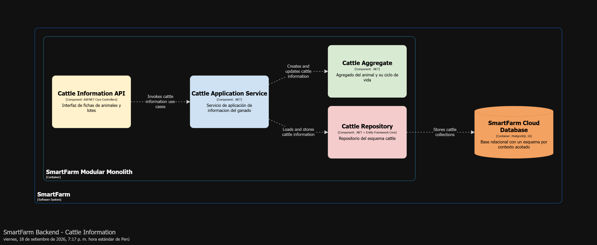

*Figura 4.16. Componentes del módulo Cattle Information. Elaboración propia con Structurizr.*

#### 4.2.2.6. Bounded Context Software Architecture Code Level Diagrams

##### 4.2.2.6.1. Bounded Context Domain Layer Class Diagrams

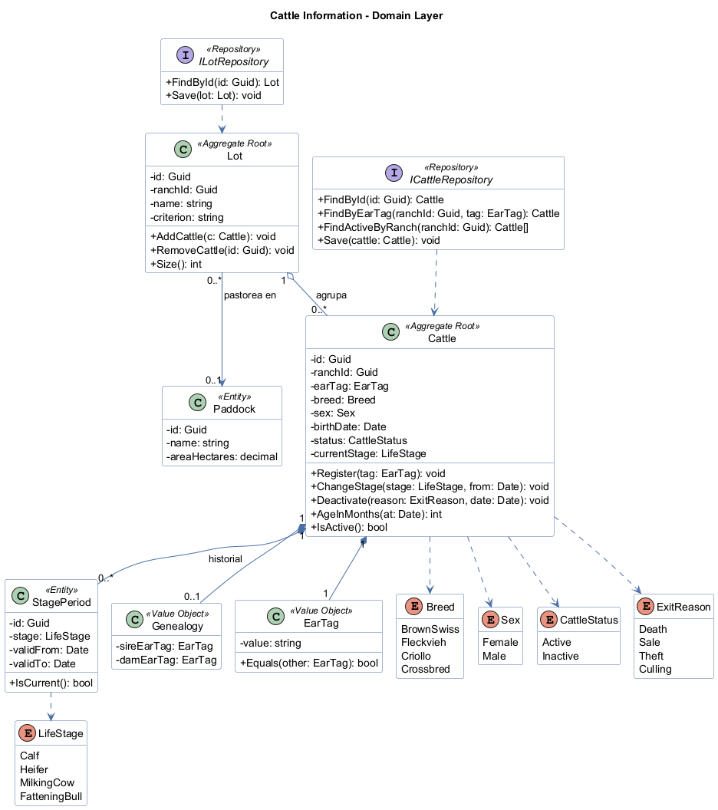

*Figura 4.17. Domain Layer de Cattle Information. Elaboración propia con PlantUML.*

`Cattle` compone su arete y su historial de etapas, y agrega opcionalmente su genealogía. `Lot` agrega animales sin poseerlos, porque un animal existe con independencia del lote al que pertenezca en un momento dado.

##### 4.2.2.6.2. Bounded Context Database Design Diagram

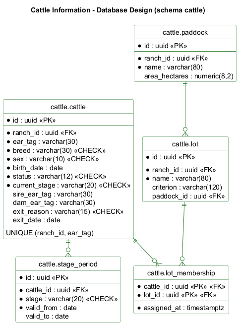

*Figura 4.18. Esquema `cattle`. Elaboración propia con PlantUML.*

La restricción `UNIQUE (ranch_id, ear_tag)` implementa en la base la regla de unicidad del arete dentro del predio. La tabla `lot_membership` resuelve la pertenencia de un animal a un lote con clave primaria compuesta y fecha de asignación.

### 4.2.3. Bounded Context: IoT Assets

Administra el inventario de dispositivos físicos y controla a qué animal o abrevadero está asignado cada uno en cada momento, respetando el límite del plan contratado.

#### 4.2.3.1. Domain Layer

| Clase | Categoría | Propósito | Miembros destacados |
|---|---|---|---|
| `IoTDevice` | Aggregate Root | Representa el dispositivo físico y garantiza que solo tenga una asignación abierta a la vez. | Métodos: `AssignTo(targetId, at)`, `Release(reason, at)`, `RegisterCommunication(at, battery)`, `IsAvailable()`, `HasLostCommunication(now)`. |
| `DeviceAssignment` | Entity | Periodo durante el cual el dispositivo estuvo asignado a un objetivo concreto. | Métodos: `IsOpen()`, `CoversInstant(at)`. |
| `DeviceSerial` | Value Object | Número de serie del dispositivo, único en el sistema. | |
| `BatteryLevel` | Value Object | Porcentaje de carga con la regla que determina cuándo es bajo. | Método: `IsLow()`. |
| `DeviceType`, `DeviceStatus` | Enumeraciones | Distinguen el collar del controlador de abrevadero, y las condiciones operativas del dispositivo. | |
| `DeviceAssignmentDomainService` | Domain Service | Concentra la regla que cruza el límite del plan con los dispositivos ya asignados. | Métodos: `CanAssign()`, `Assign()`. |
| `IIoTDeviceRepository` | Repository (interfaz) | Abstrae la persistencia del dispositivo y el conteo de asignaciones vigentes. | |
| `ISubscriptionEntitlementPort`, `ICattleLookupPort` | Port | Declaran en el dominio lo que el contexto necesita de otros contextos, sin conocer su implementación. | |

#### 4.2.3.2. Interface Layer

| Clase | Categoría | Propósito |
|---|---|---|
| `DevicesController` | Controller | Expone el registro del dispositivo, la consulta del inventario y su estado. |
| `DeviceAssignmentsController` | Controller | Expone la asignación y la liberación del dispositivo. |
| `WaterTroughsController` | Controller | Expone el registro de abrevaderos y su rango de temperatura configurado. |

#### 4.2.3.3. Application Layer

| Clase | Categoría | Propósito |
|---|---|---|
| `AssignDeviceCommandHandler` | Command Handler | Consulta el límite del plan, valida la disponibilidad y crea la asignación. |
| `ReleaseDeviceCommandHandler` | Command Handler | Cierra la asignación conservando la telemetría del periodo. |
| `GetDeviceInventoryQueryHandler` | Query Handler | Compone el inventario con batería, objetivo asignado y detección de dispositivos sin comunicación. |
| `CattleDeactivatedEventHandler` | Event Handler | Libera automáticamente el collar del animal dado de baja. |
| `SubscriptionActivatedEventHandler` | Event Handler | Actualiza el límite de dispositivos habilitados al activarse un plan. |

#### 4.2.3.4. Infrastructure Layer

| Clase | Categoría | Propósito |
|---|---|---|
| `IoTAssetsRepository` | Repository | Implementa `IIoTDeviceRepository` con Entity Framework Core sobre el esquema `iot`. |
| `SubscriptionEntitlementAcl` | Anti-corruption Layer | Traduce el plan comercial al número de dispositivos permitidos. |
| `CattleAssignmentAcl` | Anti-corruption Layer | Valida la existencia del animal sin acoplar el inventario al modelo del ganado. |

#### 4.2.3.5. Bounded Context Software Architecture Component Level Diagrams

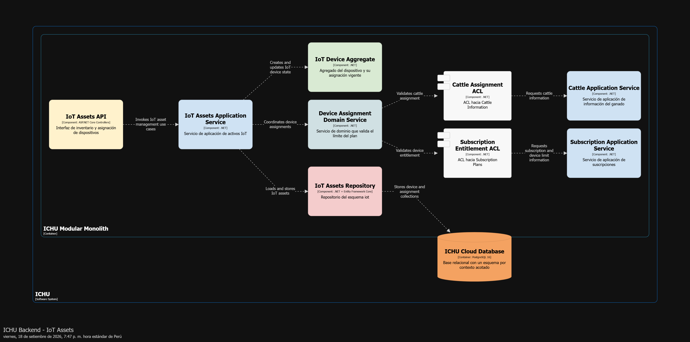

*Figura 4.19. Componentes del módulo IoT Assets. Elaboración propia con Structurizr.*

#### 4.2.3.6. Bounded Context Software Architecture Code Level Diagrams

##### 4.2.3.6.1. Bounded Context Domain Layer Class Diagrams

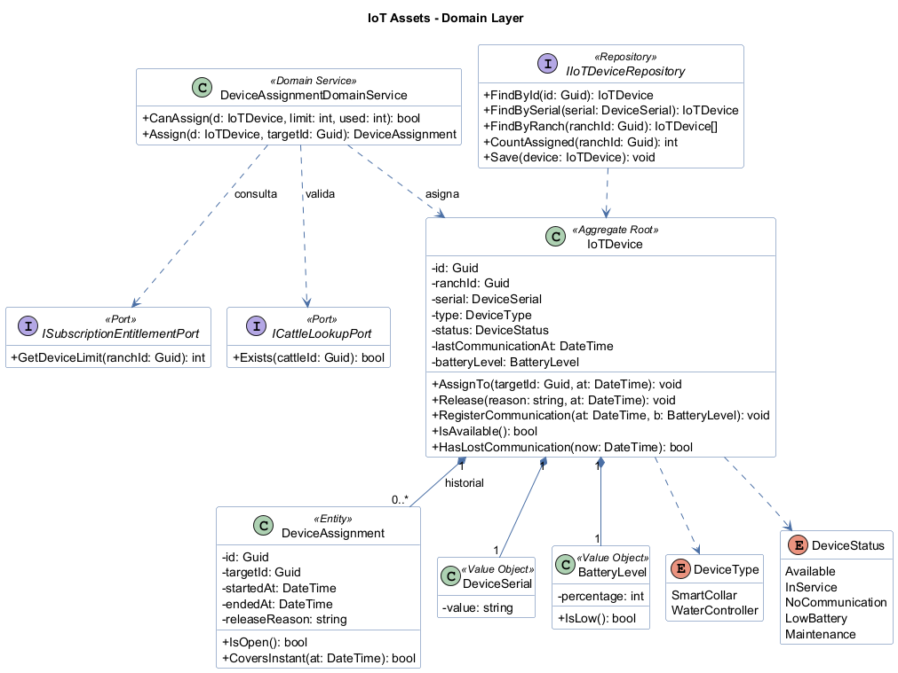

*Figura 4.20. Domain Layer de IoT Assets. Elaboración propia con PlantUML.*

El diagrama muestra los dos puertos que el dominio declara hacia otros contextos. Definirlos como interfaces dentro de la capa de dominio permite que la regla de asignación se pruebe sin depender de Subscription Plans ni de Cattle Information.

##### 4.2.3.6.2. Bounded Context Database Design Diagram

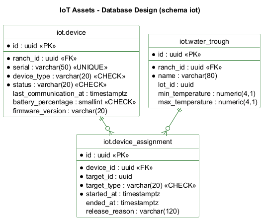

*Figura 4.21. Esquema `iot`. Elaboración propia con PlantUML.*

La tabla `device_assignment` conserva `target_id` junto a `target_type`, de modo que un mismo modelo de asignación sirve para el collar vinculado a un animal y para el controlador vinculado a un abrevadero.

### 4.2.4. Bounded Context: Planning

Programa las faenas sanitarias y reproductivas del hato, emite los recordatorios anticipados y da seguimiento a su ejecución. Custodia además los periodos de retiro que condicionan el destino de la producción.

#### 4.2.4.1. Domain Layer

| Clase | Categoría | Propósito | Miembros destacados |
|---|---|---|---|
| `LivestockCalendar` | Aggregate Root | Agrupa las campañas de una unidad productiva en un año y responde qué faenas se aproximan. | Métodos: `Schedule(campaign)`, `UpcomingWithin(days)`. |
| `HealthCampaign` | Aggregate Root | Concentra las reglas de programación, avance y cierre de una campaña sanitaria. | Métodos: `Schedule(date, lotId)`, `RegisterApplication(cattleId, at)`, `ProgressPercentage()`, `Close()`, `OverlapsWithdrawal(period)`. |
| `CampaignApplication` | Entity | Registra si un animal concreto recibió la aplicación y cuándo. | |
| `FollowUpReview` | Entity | Revisión posterior programada por el veterinario sobre un animal tratado. | Método: `MarkNotApplicable(reason)`. |
| `Reminder` | Entity | Aviso anticipado emitido una sola vez al alcanzarse el plazo configurado. | Método: `ShouldEmit(today, scheduled)`. |
| `WithdrawalPeriod` | Value Object | Periodo durante el cual la producción del animal tiene restricción por un producto aplicado. | Método: `IsActiveOn(date)`. |
| `CampaignType`, `CampaignStatus`, `ReviewStatus` | Enumeraciones | Fijan los tipos de faena y los estados de campaña y revisión. | |
| `ReminderDomainService` | Domain Service | Determina qué campañas alcanzaron su plazo de aviso y cuántos animales siguen pendientes. | Métodos: `EmitDue()`, `PendingCattle()`. |
| `IPlanningRepository` | Repository (interfaz) | Abstrae la persistencia del calendario y la consulta de campañas vencidas. | |

#### 4.2.4.2. Interface Layer

| Clase | Categoría | Propósito |
|---|---|---|
| `CampaignsController` | Controller | Expone la programación de campañas, el registro de aplicaciones y la consulta de avance. |
| `RemindersController` | Controller | Expone la consulta de recordatorios emitidos y la configuración del plazo de aviso. |
| `FollowUpReviewsController` | Controller | Expone la programación y consulta de revisiones de seguimiento. |
| `WithdrawalPeriodsController` | Controller | Expone la consulta de periodos de retiro vigentes por animal. |

#### 4.2.4.3. Application Layer

| Clase | Categoría | Propósito |
|---|---|---|
| `ScheduleCampaignCommandHandler` | Command Handler | Crea la campaña, asocia los animales del lote y detecta superposición con periodos de retiro. |
| `RegisterApplicationCommandHandler` | Command Handler | Registra la aplicación por animal, actualiza el avance y cierra la campaña cuando corresponde. |
| `ScheduleFollowUpReviewCommandHandler` | Command Handler | Vincula la revisión a la intervención que la origina. |
| `EmitDueRemindersCommandHandler` | Command Handler | Ejecuta periódicamente la emisión de recordatorios pendientes. |
| `ClinicalInterventionRegisteredEventHandler` | Event Handler | Abre el periodo de retiro del producto aplicado al recibir el hecho desde Monitoring. |
| `CattleDeactivatedEventHandler` | Event Handler | Marca como no aplicables las revisiones programadas del animal dado de baja. |

#### 4.2.4.4. Infrastructure Layer

| Clase | Categoría | Propósito |
|---|---|---|
| `PlanningRepository` | Repository | Implementa `IPlanningRepository` con Entity Framework Core sobre el esquema `planning`. |
| `CampaignNotificationAdapter` | Adapter | Entrega el recordatorio al responsable a través del servicio de mensajería. |
| `CattleLookupAcl` | Anti-corruption Layer | Resuelve la composición del lote al programar una campaña. |

#### 4.2.4.5. Bounded Context Software Architecture Component Level Diagrams

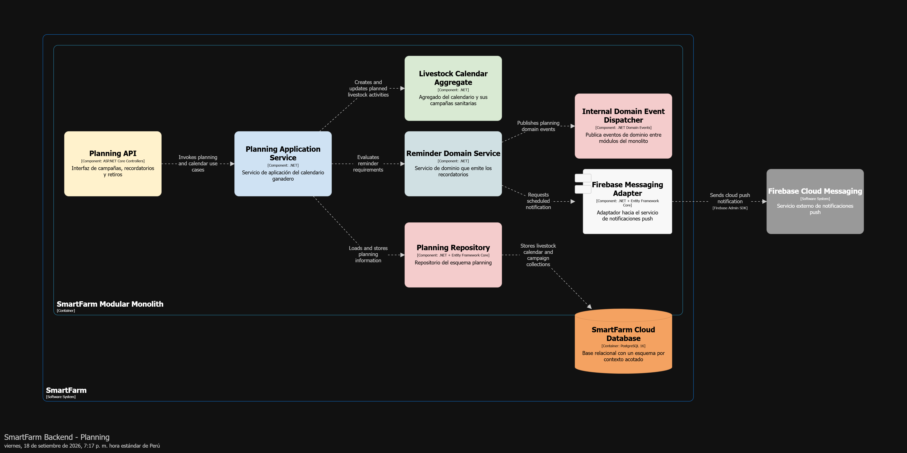

*Figura 4.22. Componentes del módulo Planning. Elaboración propia con Structurizr.*

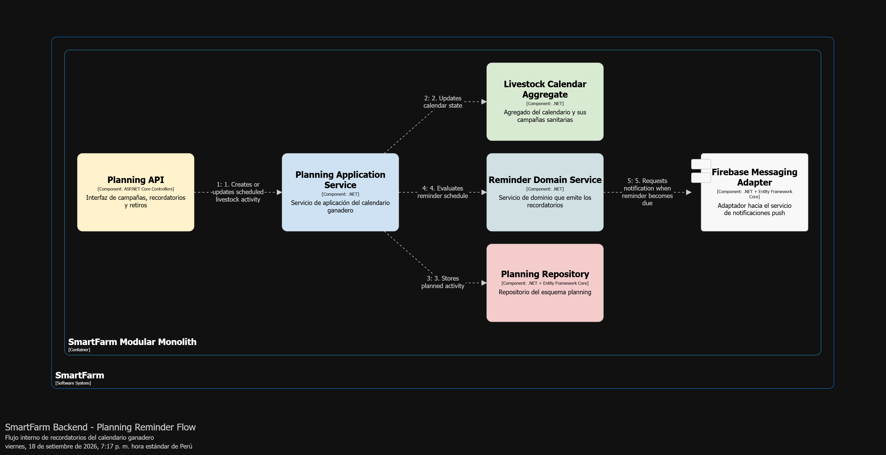

*Figura 4.23. Flujo interno de recordatorios del calendario ganadero. Elaboración propia con Structurizr.*

#### 4.2.4.6. Bounded Context Software Architecture Code Level Diagrams

##### 4.2.4.6.1. Bounded Context Domain Layer Class Diagrams

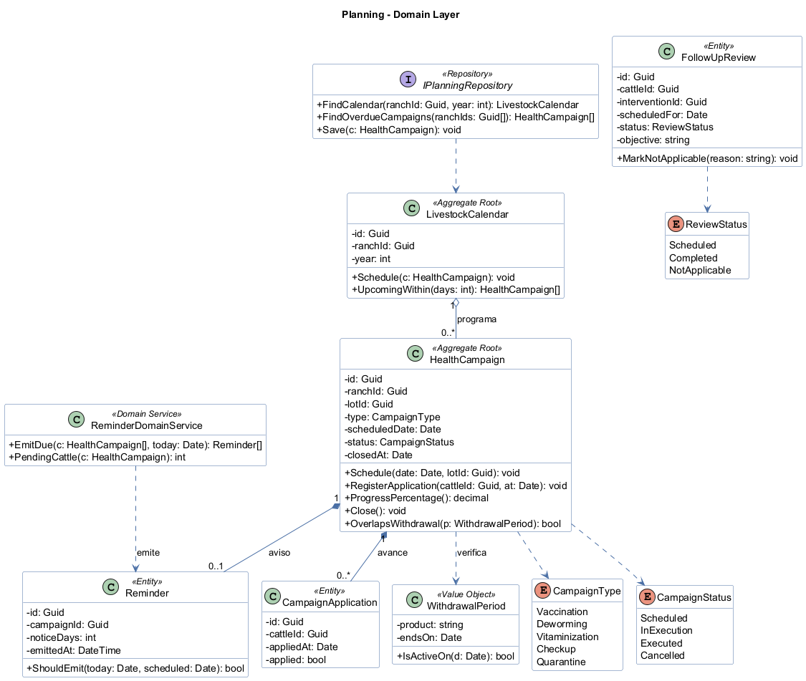

*Figura 4.24. Domain Layer de Planning. Elaboración propia con PlantUML.*

`HealthCampaign` compone sus aplicaciones y su recordatorio, porque ninguno de los dos tiene sentido fuera de la campaña. `WithdrawalPeriod` se modela como Value Object consultado por la campaña, no como entidad propia, porque su identidad la determinan el animal y el producto.

##### 4.2.4.6.2. Bounded Context Database Design Diagram

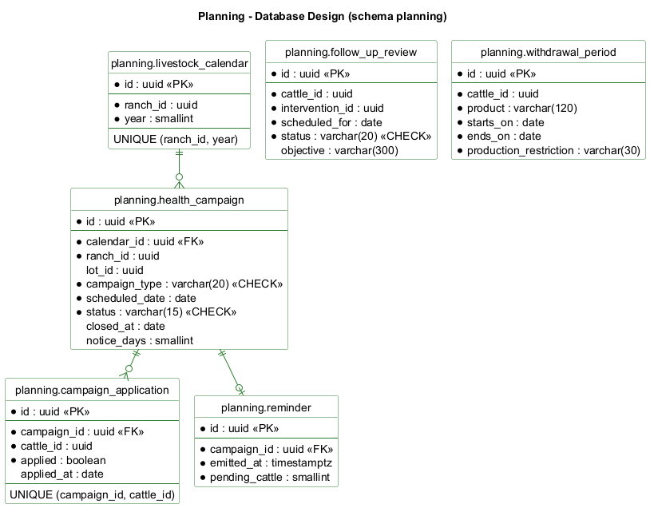

*Figura 4.25. Esquema `planning`. Elaboración propia con PlantUML.*

La restricción `UNIQUE (campaign_id, cattle_id)` impide registrar dos veces la aplicación sobre el mismo animal dentro de una campaña, que es el error que los entrevistados asociaron al riesgo de intoxicación por dosis repetida.

### 4.2.5. Bounded Context: Dashboard & Analytics

Transforma la información acumulada por los demás contextos en indicadores, tendencias y reportes. Es un contexto de solo lectura: no produce hechos del negocio ni escribe en los contextos de origen.

#### 4.2.5.1. Domain Layer

| Clase | Categoría | Propósito | Miembros destacados |
|---|---|---|---|
| `HerdIndicatorSet` | Aggregate Root | Conjunto de indicadores del hato para un periodo, con la declaración explícita de cuántos animales quedaron excluidos del cálculo. | Métodos: `Calculate()`, `HasSufficientData()`. |
| `TrendSeries` | Entity | Serie temporal de un indicador para un lote, con su promedio y sus valores atípicos. | Métodos: `Outliers(criterion)`, `MissingReadings()`. |
| `EpidemiologicalCurve` | Entity | Progresión de casos nuevos de un mismo cuadro, usada para sustentar el aislamiento o su levantamiento. | Métodos: `DaysWithoutNewCases()`, `SupportsRestrictionLifting()`, `IsBuildable()`. |
| `ExecutiveReport` | Entity | Documento exportable con los indicadores del periodo. | Método: `IsEmpty()`. |
| `TrendPoint` | Value Object | Par de fecha y valor dentro de una serie. | |
| `DateRange` | Value Object | Periodo de análisis. Aparece en todos los cálculos porque ningún indicador se entrega sin declarar su rango. | Métodos: `Days()`, `Contains(date)`. |
| `IndicatorType`, `ReportFormat` | Enumeraciones | Fijan los indicadores disponibles y los formatos de exportación. | |
| `AnalyticsDomainService` | Domain Service | Concentra la lógica de cálculo, que no pertenece a ningún agregado porque atraviesa varios contextos de origen. | Métodos: `BuildIndicators()`, `BuildTrend()`, `BuildCurve()`, `CompareAgainstLot()`. |
| `IAnalyticsRepository` | Repository (interfaz) | Abstrae la lectura consolidada de los datos de origen y la persistencia de los reportes generados. | |

#### 4.2.5.2. Interface Layer

| Clase | Categoría | Propósito |
|---|---|---|
| `DashboardController` | Controller | Expone los indicadores agregados del hato para un periodo. |
| `TrendsController` | Controller | Expone las tendencias por lote y la comparación de un animal contra su lote. |
| `EpidemiologicalCurveController` | Controller | Expone la curva de casos de un cuadro sanitario. |
| `ReportsController` | Controller | Expone la generación y descarga del reporte ejecutivo. |

#### 4.2.5.3. Application Layer

| Clase | Categoría | Propósito |
|---|---|---|
| `BuildHerdIndicatorsQueryHandler` | Query Handler | Compone los indicadores del periodo e informa los animales excluidos. |
| `BuildTrendQueryHandler` | Query Handler | Construye la serie, calcula el promedio del lote e identifica los valores atípicos. |
| `BuildEpidemiologicalCurveQueryHandler` | Query Handler | Construye la curva y evalúa el criterio de levantamiento de restricción. |
| `ExportExecutiveReportCommandHandler` | Command Handler | Genera el archivo del periodo y rechaza la exportación cuando no hay datos. |
| `SubscriptionActivatedEventHandler` | Event Handler | Habilita los reportes avanzados cuando el plan los incluye. |

#### 4.2.5.4. Infrastructure Layer

| Clase | Categoría | Propósito |
|---|---|---|
| `AnalyticsRepository` | Repository | Implementa `IAnalyticsRepository` con consultas de solo lectura sobre los esquemas de origen. |
| `ReportFileStorageAdapter` | Adapter | Persiste el archivo generado y devuelve su ruta de descarga. |

#### 4.2.5.5. Bounded Context Software Architecture Component Level Diagrams

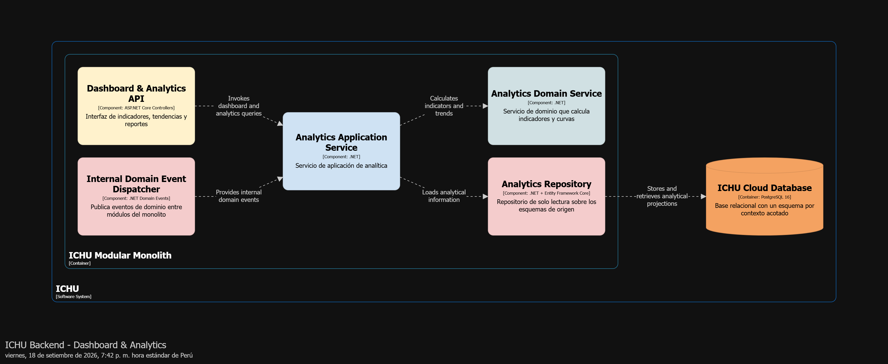

*Figura 4.26. Componentes del módulo Dashboard & Analytics. Elaboración propia con Structurizr.*

#### 4.2.5.6. Bounded Context Software Architecture Code Level Diagrams

##### 4.2.5.6.1. Bounded Context Domain Layer Class Diagrams

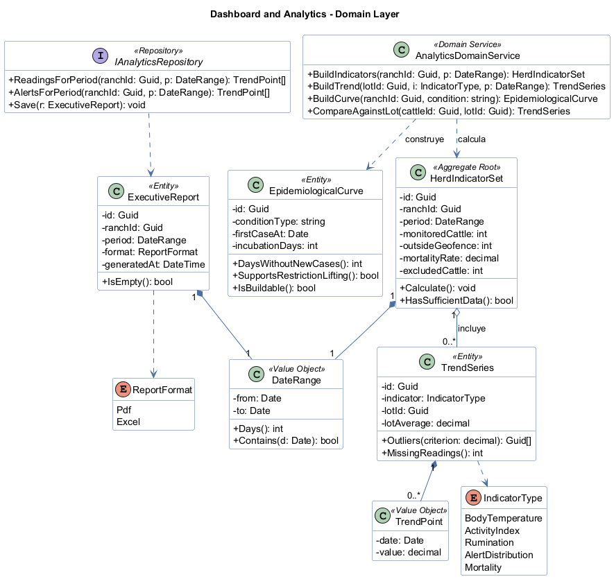

*Figura 4.27. Domain Layer de Dashboard & Analytics. Elaboración propia con PlantUML.*

`DateRange` aparece compuesto tanto en el conjunto de indicadores como en el reporte, lo que refleja la regla de que ningún resultado se entrega sin declarar el periodo sobre el que fue calculado.

##### 4.2.5.6.2. Bounded Context Database Design Diagram

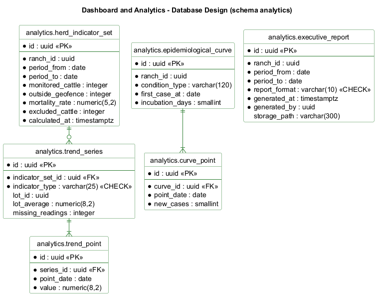

*Figura 4.28. Esquema `analytics`. Elaboración propia con PlantUML.*

Las tablas de este esquema almacenan resultados calculados, no datos operativos. Su contenido puede reconstruirse a partir de los esquemas de origen, lo que permite recalcular sin riesgo ante un cambio en la fórmula de un indicador.

### 4.2.6. Bounded Context: Identity & Access Management

Resuelve quién es cada usuario, sobre qué unidades productivas puede operar y con qué alcance. Incorpora el agregado de perfil profesional y la relación de asesoría entre un veterinario y un hato ajeno.

#### 4.2.6.1. Domain Layer

| Clase | Categoría | Propósito | Miembros destacados |
|---|---|---|---|
| `UserAccount` | Aggregate Root | Cuenta de acceso con su rol y su estado. Concentra la regla de bloqueo por intentos fallidos. | Métodos: `Verify()`, `ChangeRole(role)`, `Block(minutes)`, `IsActive()`. |
| `ProfessionalProfile` | Entity | Datos profesionales del veterinario. Procede del contexto candidato Profiles, absorbido durante el Context Mapping. | Método: `Complete(specialty, license, years)`. |
| `RanchMembership` | Entity | Vínculo del usuario con la unidad productiva a la que pertenece. | Método: `GrantsAccessTo(ranchId)`. |
| `HerdAdvisory` | Entity | Relación de asesoría entre un profesional y un hato que no administra, con su ciclo de vida completo. | Métodos: `Grant(expiresAt)`, `Revoke()`, `Expire()`, `IsValidOn(date)`. |
| `Email` | Value Object | Correo de la cuenta, con su regla de formato. | Método: `IsValid()`. |
| `LicenseNumber` | Value Object | Número de colegiatura, único entre perfiles verificados. | Método: `Equals(other)`. |
| `UserRole`, `AccountStatus`, `AdvisoryStatus`, `MembershipType` | Enumeraciones | Fijan los roles, estados de cuenta, estados de asesoría y tipos de vínculo. | |
| `AuthorizationDomainService` | Domain Service | Resuelve si una cuenta puede acceder a un predio o modificar un registro clínico, combinando pertenencia y asesoría. | Métodos: `CanAccessRanch()`, `CanModifyClinicalRecord()`. |
| `IUserAccountRepository`, `IHerdAdvisoryRepository` | Repository (interfaz) | Abstraen la persistencia de cuentas y asesorías. | |

#### 4.2.6.2. Interface Layer

| Clase | Categoría | Propósito |
|---|---|---|
| `AccountsController` | Controller | Expone el registro de la unidad productiva y el acceso a la plataforma. |
| `ProfilesController` | Controller | Expone la consulta y la actualización del perfil profesional. |
| `HerdAdvisoriesController` | Controller | Expone la solicitud, concesión y revocación de la asesoría sobre un hato. |

#### 4.2.6.3. Application Layer

| Clase | Categoría | Propósito |
|---|---|---|
| `RegisterRanchAccountCommandHandler` | Command Handler | Crea la cuenta y la unidad productiva, y rechaza correos ya registrados. |
| `AuthenticateCommandHandler` | Command Handler | Delega la verificación en el proveedor externo y aplica la regla de bloqueo por intentos fallidos. |
| `CompleteProfessionalProfileCommandHandler` | Command Handler | Completa el perfil verificando la unicidad del número de colegiatura. |
| `RequestHerdAdvisoryCommandHandler` | Command Handler | Registra la solicitud y evita duplicarla cuando ya existe una vigente. |
| `GrantHerdAdvisoryCommandHandler` | Command Handler | Concede el acceso con su alcance y su fecha de vencimiento. |
| `RevokeHerdAdvisoryCommandHandler` | Command Handler | Revoca el acceso conservando la autoría de los registros previos. |
| `ExpireAdvisoriesCommandHandler` | Command Handler | Ejecuta periódicamente la expiración de asesorías vencidas. |

#### 4.2.6.4. Infrastructure Layer

| Clase | Categoría | Propósito |
|---|---|---|
| `IdentityRepository` | Repository | Implementa `IUserAccountRepository` con Entity Framework Core sobre el esquema `iam`. |
| `HerdAdvisoryRepository` | Repository | Implementa `IHerdAdvisoryRepository`. |
| `FirebaseAuthenticationAcl` | Anti-corruption Layer | Traduce el modelo de identidad del proveedor externo al agregado propio, de modo que un cambio en su contrato no alcance al dominio. |

#### 4.2.6.5. Bounded Context Software Architecture Component Level Diagrams

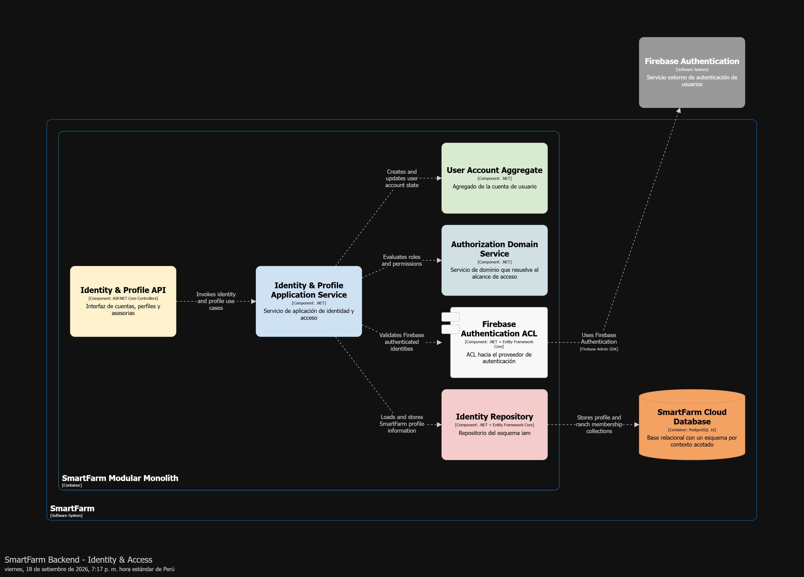

*Figura 4.29. Componentes del módulo Identity & Access Management. Elaboración propia con Structurizr.*

#### 4.2.6.6. Bounded Context Software Architecture Code Level Diagrams

##### 4.2.6.6.1. Bounded Context Domain Layer Class Diagrams

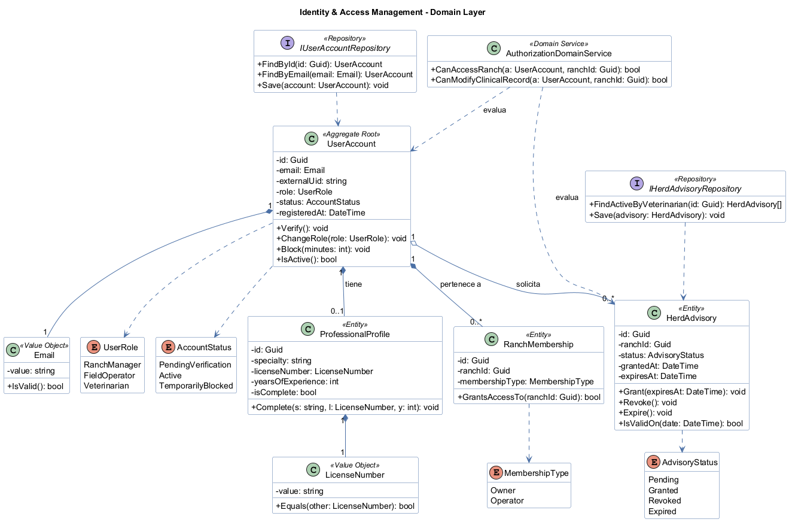

*Figura 4.30. Domain Layer de Identity & Access Management. Elaboración propia con PlantUML.*

`UserAccount` compone su perfil profesional y sus pertenencias, pero agrega las asesorías, porque una asesoría vincula a dos partes y su ciclo de vida no termina con la cuenta del solicitante.

##### 4.2.6.6.2. Bounded Context Database Design Diagram

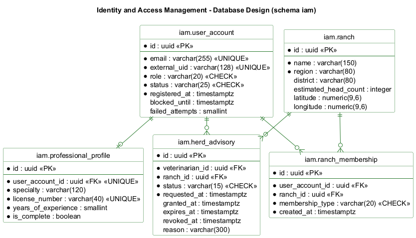

*Figura 4.31. Esquema `iam`. Elaboración propia con PlantUML.*

La tabla `herd_advisory` conserva las fechas de solicitud, concesión, vencimiento y revocación por separado, de modo que el historial completo de la relación quede auditable.

### 4.2.7. Bounded Context: Subscription Plans

Administra los planes contratados, sus límites y su facturación, y determina qué capacidades tiene habilitada cada unidad productiva.

#### 4.2.7.1. Domain Layer

| Clase | Categoría | Propósito | Miembros destacados |
|---|---|---|---|
| `Subscription` | Aggregate Root | Suscripción de una unidad productiva, con su plan, su vigencia y su estado. | Métodos: `Activate()`, `Renew(until)`, `Cancel(reason)`, `CoversFeature(feature)`, `DeviceLimitValue()`, `MonthlyAmount()`. |
| `Plan` | Entity | Modalidad comercial con su límite de dispositivos, su precio y sus funcionalidades. | Métodos: `EstimateFor(headCount)`, `Covers(headCount)`. |
| `Payment` | Entity | Intento de cobro con su resultado y su referencia externa. | Métodos: `MarkAccepted(ref)`, `MarkRejected(reason)`. |
| `Money` | Value Object | Importe con su moneda. Evita operar cantidades de monedas distintas. | Métodos: `Add(other)`, `Multiply(factor)`. |
| `DeviceLimit` | Value Object | Cantidad máxima de dispositivos del plan, con la regla que evalúa si admite uno más. | Método: `Allows(used)`. |
| `PlanType`, `SubscriptionStatus`, `PaymentStatus`, `FeatureCode` | Enumeraciones | Fijan las modalidades, los estados y el catálogo de funcionalidades habilitables. | |
| `ISubscriptionRepository` | Repository (interfaz) | Abstrae la persistencia de la suscripción. | |
| `IPaymentProviderPort` | Port | Declara en el dominio la operación de cobro, sin conocer al proveedor. | |

#### 4.2.7.2. Interface Layer

| Clase | Categoría | Propósito |
|---|---|---|
| `SubscriptionsController` | Controller | Expone la contratación, renovación, cancelación y consulta de la suscripción. |
| `PlansController` | Controller | Expone el catálogo público de planes y la estimación de costo por cantidad de cabezas. |
| `BillingController` | Controller | Expone el historial de pagos y la confirmación de cobro. |

#### 4.2.7.3. Application Layer

| Clase | Categoría | Propósito |
|---|---|---|
| `SubscribeCommandHandler` | Command Handler | Valida los datos, solicita el cobro y activa la suscripción, publicando el hecho hacia los contextos que dependen del plan. |
| `RenewSubscriptionCommandHandler` | Command Handler | Extiende la vigencia y registra el pago del nuevo periodo. |
| `CancelSubscriptionCommandHandler` | Command Handler | Cancela conservando el historial de pagos. |
| `EstimatePlanCostQueryHandler` | Query Handler | Calcula el costo estimado e identifica el plan adecuado cuando la cantidad excede el límite. |
| `CheckFeatureAccessQueryHandler` | Query Handler | Resuelve si una funcionalidad está incluida en el plan vigente. |
| `PaymentConfirmedEventHandler` | Event Handler | Activa la suscripción al confirmarse el cobro. |

#### 4.2.7.4. Infrastructure Layer

| Clase | Categoría | Propósito |
|---|---|---|
| `SubscriptionRepository` | Repository | Implementa `ISubscriptionRepository` con Entity Framework Core sobre el esquema `subscription`. |
| `PaymentProviderAcl` | Anti-corruption Layer | Traduce la operación de cobro del dominio al contrato del proveedor de pagos. |
| `SubscriptionEventPublisher` | Infrastructure | Publica la activación y la cancelación hacia IoT Assets y Dashboard & Analytics. |

#### 4.2.7.5. Bounded Context Software Architecture Component Level Diagrams

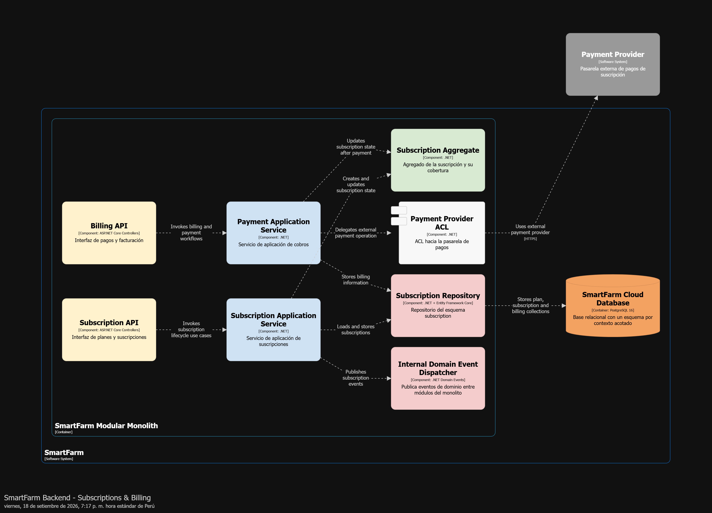

*Figura 4.32. Componentes del módulo Subscription Plans. Elaboración propia con Structurizr.*

#### 4.2.7.6. Bounded Context Software Architecture Code Level Diagrams

##### 4.2.7.6.1. Bounded Context Domain Layer Class Diagrams

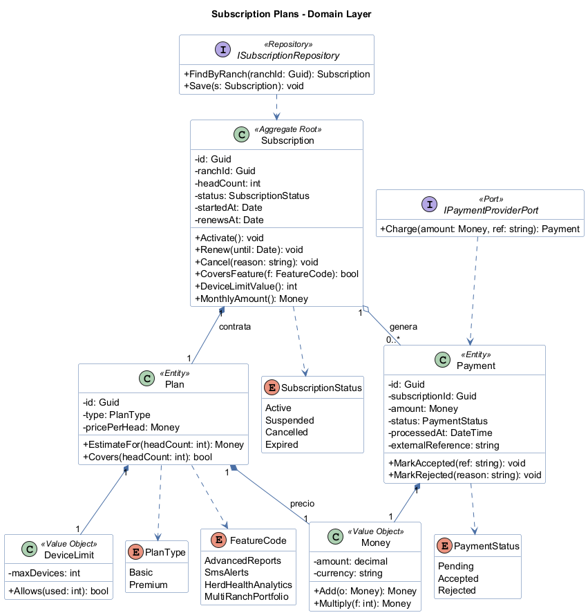

*Figura 4.33. Domain Layer de Subscription Plans. Elaboración propia con PlantUML.*

`Subscription` compone el plan contratado y agrega sus pagos. El puerto `IPaymentProviderPort` mantiene el dominio independiente del proveedor concreto, que puede cambiar sin afectar las reglas de cobertura y renovación.

##### 4.2.7.6.2. Bounded Context Database Design Diagram

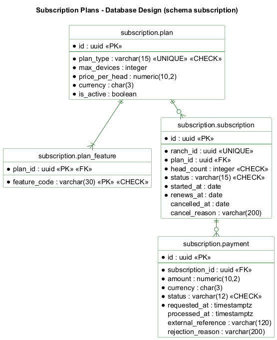

*Figura 4.34. Esquema `subscription`. Elaboración propia con PlantUML.*

La tabla `plan_feature` implementa la relación de muchos a muchos entre plan y funcionalidad con clave primaria compuesta, de modo que agregar una funcionalidad a un plan no requiere modificar el esquema.

## 4.3. Síntesis del diseño

| Contexto acotado | Tipo | Agregados | Esquema de base de datos |
|---|---|---|---|
| Operations & Monitoring | Core | TelemetryReading, MonitoringAlert, Geofence, LivestockOperation | `monitoring` |
| Cattle Information | Core secundario | Cattle, Lot | `cattle` |
| IoT Assets | Soporte | IoTDevice | `iot` |
| Planning | Soporte | LivestockCalendar, HealthCampaign | `planning` |
| Dashboard & Analytics | Soporte | HerdIndicatorSet | `analytics` |
| Identity & Access Management | Genérico con dominio propio | UserAccount | `iam` |
| Subscription Plans | Genérico | Subscription | `subscription` |

Los siete contextos suman quince agregados y se despliegan como módulos internos de un único ejecutable, cada uno con su esquema aislado dentro de la misma instancia de PostgreSQL. La comunicación entre módulos ocurre siempre a través de un Anti-corruption Layer o de eventos de dominio publicados en el proceso, nunca por acceso directo a las tablas de otro esquema. Esa restricción es la que hace posible extraer cualquier módulo como servicio independiente si el crecimiento del producto llegara a justificarlo.

