# Capítulo V: Solution UI/UX Design

## 5.1. Style Guidelines

### 5.1.1. General Style Guidelines

**SmartFarm** es la startup y **ICHU**, su producto. La identidad combina fondos cálidos, verdes y acentos ocres; usa el logotipo completo en espacios amplios y el monograma en espacios compactos. La interfaz prioriza datos legibles y acciones claras para ganaderos y veterinarios.

| Aspecto | Regla para ICHU |
|---|---|
| Color | Fondo `#F6F5F0`, superficie `#FFFFFF`, texto `#27271F` / `#6F6E60`, borde `#E1DED4`; marca `#22362A`, acciones `#33513E`, apoyo `#3F5F4A`, acentos `#A5813A` y `#E4B842`. |
| Estados | Éxito `#4C7A57`, advertencia `#96742C`, alerta `#A4463C` e información `#66716D`; comunicar cada estado también con texto o icono. |
| Tipografía | **Outfit** (600–700) para títulos y **Plus Jakarta Sans** (400–700) para lectura y controles; monoespaciada solo para datos técnicos. |
| Jerarquía y ritmo | Títulos 28–32 px, subtítulos 20–24 px, lectura 16 px y controles 14 px. Espaciado en escala de 4 px: 4, 8, 12, 16, 24 y 32 px. |
| Componentes | Bordes discretos, etiquetas claras y estados visibles de foco, selección y error. Verde para acciones operativas y dorado para la acción principal del onboarding. |

El mockup HTML aún usa una base de 14 px; se alineará con estos tokens. El tono será serio, cercano, profesional, respetuoso y sereno. Errores y alertas indicarán la situación y el siguiente paso sin diagnósticos no sustentados. Se validarán contraste WCAG (4.5:1 en texto normal; 3:1 en texto grande), foco visible y objetivos táctiles de 44 × 44 px [8].

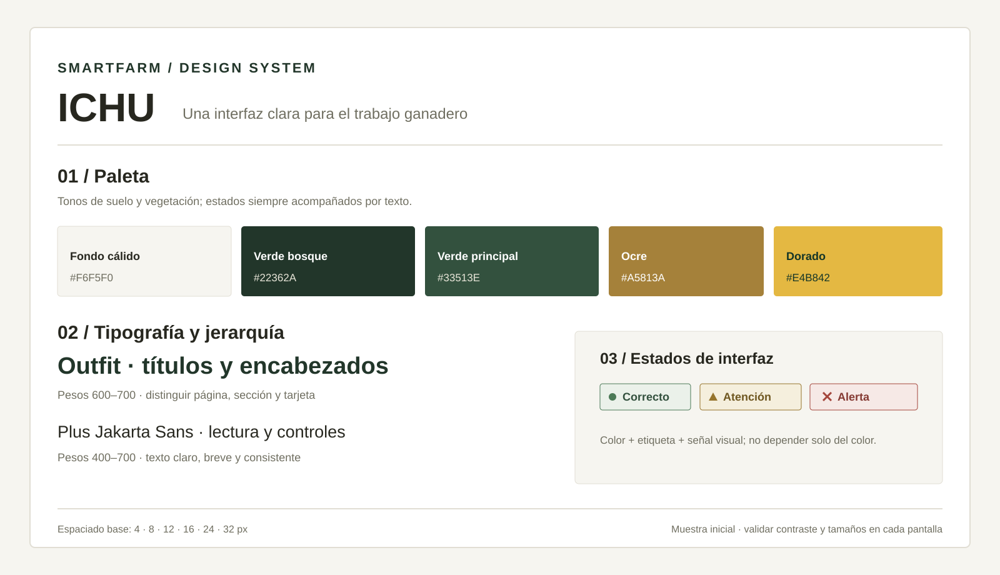

*Figura 5.1.1. Paleta, jerarquía tipográfica y estados iniciales de ICHU. Elaboración propia a partir de los mockups de interfaz recibidos.*

### 5.1.2. Web, Mobile and IoT Style Guidelines

La identidad y el significado de los estados se mantienen entre pantallas; la composición y la interacción se adaptan al dispositivo.

| Experiencia | Guía visual y de interacción |
|---|---|
| **Web responsiva** | Navegación y paneles se reorganizan al reducirse el ancho (1080, 720 y 560 px en el mockup); en móvil, una columna y desplazamiento independiente para tablas. |
| **Aplicación móvil** | Priorizar tarea y acción, tarjetas de una columna y controles táctiles amplios. Los wireframes nativos se documentarán en 5.4; la web responsiva no los sustituye. |
| **IoT digital** | Mostrar lectura, unidad, hora y vigencia; distinguir estados en línea, sin señal, almacenado y sincronizado, junto con batería y conectividad. |
| **IoT físico** | Indicadores inequívocos y coherentes con la app. La función de luces, botones y sonidos se especifica junto con el diseño físico en 5.6. |

El mockup recibido evidencia la web y su adaptación, pero no las vistas nativas de la aplicación. El diseño conceptual del collar, el receptor de alertas y el controlador del abrevadero se documenta en 5.6; las vistas nativas se incorporarán en 5.4.

> **Figura por añadir en 5.1.2:** una lámina comparativa con la web en escritorio y móvil, la app nativa y la interfaz física IoT (collar, receptor de alertas y controlador del abrevadero, descritos en 5.6).

## 5.2. Information Architecture

ICHU organiza la información según las tareas de César, administrador ganadero, y Leonardo, veterinario (2.3), las historias de usuario (3.1) y las experiencias web y móvil definidas en 4.1.3.3. Se propone una estructura común con acceso por rol: gestión del hato para el administrador, consulta clínica de hatos autorizados para el veterinario y tareas de campo en móvil. Las decisiones siguientes orientan los wireframes; no representan funcionalidades ya implementadas.

### 5.2.1. Organization Systems

| Grupo de información | Organización y sustento |
|---|---|
| Landing Page | Jerarquía de propuesta, beneficios, tecnología y contacto; contenido por audiencia: ganaderos y veterinarios. La explicación de uso es secuencial: conocer ICHU, entender su funcionamiento y solicitar una demo. |
| Hato y animales | Jerarquía hato → lote → animal → ficha. La ficha reúne identidad, historial, reproducción y monitoreo; potreros y nutrición se consultan desde el lote. Evita repetir datos entre módulos. |
| Monitoreo y atención | Por tópicos: lecturas, ubicación, alertas y registros de campo o clínicos. Alertas ordenadas por prioridad y fecha; historial y lecturas por fecha de captura, no de sincronización. |
| Calendario y reportes | Campañas y seguimientos en orden cronológico. Comparación matricial de animales, lotes e indicadores en escritorio; tarjetas y filtros equivalentes en móvil. |
| Dispositivos y cuenta | Inventario de collares y abrevaderos separado de las fichas animales. Perfil, asesorías y plan en un área secundaria; visibilidad según permisos. |

Los nombres de hatos, lotes y potreros se ordenan alfabéticamente; los animales se identifican por arete. Registro, vinculación de collar e intervención usan pasos breves: seleccionar, completar y confirmar. El veterinario selecciona primero un hato autorizado; el administrador trabaja sobre su unidad y el operario sobre las tareas habilitadas.

El [landing de referencia](https://github.com/SmartFarm-8733/LandingPageSmartFarm) contiene Inicio, Quiénes somos, Ganaderos, Veterinarios, Tecnología y Contacto, además de las páginas Cómo funciona y Web y Media. La propuesta incorpora Planes y Términos (US-35–US-36) y accesos diferenciados a la aplicación (US-33), sin confundir el arete de identificación con el collar IoT.

### 5.2.2. Labeling Systems

Las etiquetas nombran destinos y acciones, no componentes técnicos. Se mantienen entre encabezados, menús y botones, con iconos como apoyo y no como sustituto del texto.

| Etiqueta | Contenido o destino asociado |
|---|---|
| Inicio / Quiénes somos | Propuesta de ICHU / propósito y equipo SmartFarm. |
| Para ganaderos / Para veterinarios | Beneficios y acceso correspondiente a cada segmento. |
| Tecnología / Cómo funciona / Videos | Dispositivos y conectividad / pasos de uso / contenido audiovisual; Videos reemplaza la etiqueta ambigua Web y Media. |
| Planes / Contacto / Términos | Comparación de cobertura y límites / solicitud de demo / condiciones y tratamiento de datos. |
| Mi hato / Hatos autorizados | Resumen de la unidad propia / selector de unidades con acceso profesional vigente. |
| Animales / Ficha del animal | Inventario / identidad, lote, etapa, collar e historial del animal seleccionado. |
| Monitoreo / Alertas | Lecturas y última ubicación conocida / señales que requieren revisión y su estado de atención. |
| Historial / Reproducción / Nutrición | Registros e intervenciones / eventos reproductivos del animal / plan nutricional del lote. |
| Calendario / Reportes | Campañas, recordatorios y seguimientos / indicadores y exportación por periodo. |
| Dispositivos | Collares y abrevaderos, asignación, batería y última comunicación. |
| Perfil / Asesorías / Mi plan | Datos de cuenta y profesionales / solicitudes y permisos de acceso / suscripción, cobertura y límites. |

Las acciones usan verbo y objeto: **Registrar animal**, **Vincular collar**, **Atender alerta**, **Registrar intervención** y **Exportar reporte**. Arete identifica al animal; collar identifica el equipo de telemetría. Una lectura muestra unidad y hora; Sin datos no equivale a Normal, ni Sin conexión a Sin alertas.

Las etiquetas se localizan de forma consistente en `en_US` y `es_419`, incluido el contenido de ayuda, errores, fechas y números (US-37). El idioma inicial definido por la historia es `en_US`, con preferencia persistente; los ejemplos de esta sección usan `es_419`.

### 5.2.3. SEO Tags and Meta Tags

Se asignan los siguientes valores de diseño a las páginas principales. Title y Description se traducen junto con el contenido; los ejemplos corresponden a `es_419`.

| Página pública | Title | Meta Description |
|---|---|---|
| Inicio | ICHU · Ganadería inteligente | Conoce ICHU: monitoreo con collares IoT y gestión del hato para ganaderos y veterinarios. |
| Cómo funciona | Cómo funciona ICHU | Descubre cómo vincular un collar, consultar lecturas y revisar alertas del hato. |
| Videos | Videos de ICHU | Explora videos sobre la propuesta de ICHU y su uso en el trabajo ganadero. |
| Planes | Planes de ICHU | Compara cobertura, límites de dispositivos y condiciones de los planes de ICHU. |
| Términos | Términos de ICHU | Consulta las condiciones de uso, el tratamiento de datos y la fecha de actualización. |

Quiénes somos, los contenidos por segmento, Tecnología y Contacto son secciones de Inicio, no páginas independientes. Planes y Términos se proponen como páginas complementarias.

| Vista de la Web Application | Title | Meta Description |
|---|---|---|
| Acceso | Acceso · ICHU | Inicia sesión para acceder a tu espacio de trabajo en ICHU. |
| Mi hato / Hatos autorizados | Hatos · ICHU | Consulta el resumen de las unidades a las que tienes acceso. |
| Animales y ficha | Animales · ICHU | Consulta fichas, lotes e historial de los animales autorizados. |
| Monitoreo | Monitoreo · ICHU | Revisa lecturas y ubicaciones con su fecha de captura. |
| Alertas | Alertas · ICHU | Consulta señales, estados de atención y acciones registradas. |
| Calendario | Calendario · ICHU | Organiza campañas sanitarias, recordatorios y seguimientos. |
| Reportes | Reportes · ICHU | Consulta indicadores por periodo y exporta reportes autorizados. |
| Dispositivos | Dispositivos · ICHU | Consulta collares y abrevaderos, asignaciones y conectividad. |
| Cuenta | Cuenta · ICHU | Gestiona tu perfil, asesorías y plan según tus permisos. |

| Metadato compartido | Valor |
|---|---|
| Author, en todas las páginas | SmartFarm |
| Keywords, páginas públicas | ICHU, SmartFarm, ganadería inteligente, Perú, IoT |
| Keywords, aplicación web | ICHU, gestión ganadera, hato, monitoreo, historial veterinario |
| Robots, páginas públicas | index, follow |
| Robots, aplicación web | noindex, nofollow |

Los metadatos de la aplicación son genéricos: no incluyen nombres de animales, propietarios ni datos clínicos. La exclusión de indexación no sustituye la autenticación ni los permisos por hato. La vista previa pública reutiliza Title y Description; la URL canónica se configurará con el dominio definitivo.

Para la distribución de la aplicación móvil mediante una tienda, se propone esta ficha ASO, adaptable a los campos de la plataforma elegida; no implica una publicación existente.

| Campo ASO | Valor propuesto |
|---|---|
| App Title | ICHU: ganado y alertas |
| App keywords | ganado, ganadería, monitoreo, IoT, alertas, veterinario |
| App subtitle | Tu hato, cerca de ti |
| App description | Consulta fichas, lecturas y ubicaciones; revisa alertas y registra eventos de campo. Accede al historial clínico según tus permisos. Trabaja con fichas descargadas sin conexión y sincroniza los registros al recuperar cobertura. |

### 5.2.4. Searching Systems

El landing usa navegación directa y enlaces a secciones, sin buscador interno: su contenido informativo es reducido. En las aplicaciones, la búsqueda se limita al hato seleccionado y a los permisos vigentes; el veterinario puede seleccionar únicamente unidades autorizadas.

| Área | Búsqueda y filtros propuestos | Presentación del resultado |
|---|---|---|
| Animales | Arete; nombre si está registrado; lote, etapa y estado. | Lista con identificador, lote, etapa y collar; acceso a la ficha. El arete se interpreta dentro del hato. |
| Monitoreo | Animal, indicador y periodo. | Series de temperatura, actividad o rumia; mapa de última posición con hora de captura. |
| Historial | Animal, periodo y tipo de registro. | Cronología de eventos, intervenciones, resultados y reproducción; autor, fecha y retiro vigente. |
| Alertas | Animal, tipo, prioridad, estado y periodo. | Lista priorizada, fecha, condición de atención y acceso al detalle. |
| Calendario | Fecha, lote, tipo de campaña o seguimiento y estado. | Agenda con avance, recordatorios y días de atraso cuando corresponda. |
| Dispositivos | Identificador, animal asignado y estado de conexión. | Inventario con asignación, batería cuando esté disponible y última comunicación. |
| Abrevaderos | Identificador, condición y periodo. | Lista de temperatura, hora, estado del calentador y distancia disponible; detalle por abrevadero. |
| Reportes | Hato, lote, indicador y periodo. | Indicadores, tendencias y comparaciones; datos excluidos o incompletos identificados y opción de exportar. |

Web presenta tablas con paginación y filtros visibles; móvil, tarjetas con filtros desplegables y el mismo criterio de selección. Se conserva la consulta al regresar del detalle y se permite limpiar los filtros. El portafolio veterinario resume solo los hatos autorizados (US-53).

Sin coincidencias, Sin lecturas y Acceso no autorizado son estados distintos, con orientación para el siguiente paso. Sin conexión, la búsqueda móvil cubre únicamente fichas descargadas e informa la fecha de actualización y los registros por sincronizar (US-22); no presenta datos ausentes como valores cero ni ubicaciones antiguas como posiciones en tiempo real.

### 5.2.5. Navigation Systems

| Experiencia | Recorrido y técnica de navegación |
|---|---|
| Landing Page | Encabezado con enlaces a Inicio, Quiénes somos, los dos segmentos, Tecnología y Contacto. Cómo funciona y Videos abren páginas complementarias; en móvil, menú desplegable con los mismos destinos. Pie de página con Planes, Contacto y Términos. |
| Aplicación web | Menú lateral: Animales, Monitoreo, Alertas, Calendario y Reportes. Cabecera con hato activo y resumen; Dispositivos y cuenta en accesos secundarios. La ficha enlaza Historial y Reproducción; el lote, Nutrición. Se muestra la sección activa y una ruta de retorno al listado. |
| Aplicación móvil | Navegación inferior propuesta: Animales, Alertas, Calendario y Menú. Monitoreo se abre desde la ficha o el menú; los accesos secundarios conservan los nombres web. Las tareas de campo permanecen accesibles con datos descargados y muestran conectividad y sincronización. |

La acción del segmento ganadero lleva al acceso web; la del veterinario, al registro profesional. Si el destino no está disponible, se ofrece Contacto (US-33). Solicitar demo abre el formulario con nombre, región, número de cabezas y correo; la confirmación informa el plazo de contacto (US-34).

| Tarea | Ruta propuesta |
|---|---|
| Administrador: revisar un animal | Mi hato → Animales → Ficha del animal → Monitoreo; Vincular collar aparece según plan y permisos. |
| Operario: registrar un hallazgo | Animales → Ficha del animal → Registrar evento; también puede llegar desde el detalle de una alerta. |
| Veterinario: preparar y registrar atención | Hatos autorizados → Animales → Ficha del animal → Historial → Registrar intervención → Programar seguimiento. |
| Administrador: dar acceso al asesor | Cuenta → Asesorías → Revisar solicitud → Autorizar o rechazar; acceso revocable desde el mismo destino. |

El veterinario sin autorización permanece en Perfil y Asesorías hasta obtener acceso; ocultar un enlace no sustituye el control de permisos. Cambiar de hato actualiza el contexto sin mezclar registros. Volver conserva filtros y posición; abandonar un formulario modificado exige confirmar el descarte. El recorrido por teclado, el foco visible, los nombres accesibles y los controles táctiles siguen 5.1 y US-38.

## 5.3. Landing Page UI Design

### 5.3.1. Landing Page Wireframe

El wireframe organiza la propuesta de ICHU, la información para ganaderos y veterinarios, la explicación del servicio y el contacto. En escritorio conserva la navegación principal; en móvil prioriza un recorrido vertical y un menú compacto, manteniendo las mismas etiquetas y acciones.

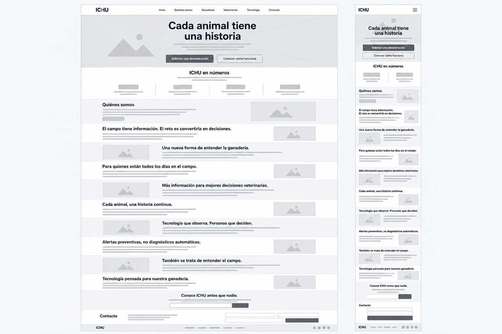

*Figura 5.3.1. Wireframes responsivos de ICHU. Elaboración propia a partir de la estructura del landing actual.*

### 5.3.2. Landing Page Mock-up

La composición reúne siete capturas originales de la landing actual de ICHU, desde la portada hasta el pie de página. Se presentan en cascada para mostrar el recorrido visual y la jerarquía de sus secciones, conservando el diseño y el contenido del sitio.

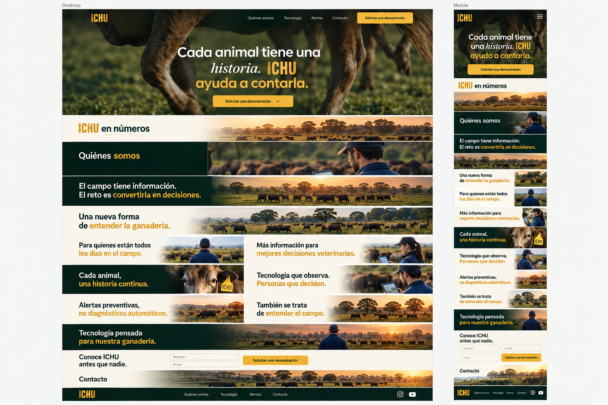

*Figura 5.3.2. Recorrido visual de la landing page de ICHU en siete capturas organizadas en cascada. Elaboración propia a partir del sitio actual.*

## 5.4. Applications UX/UI Design

La propuesta presenta la experiencia de la Web Application ICHU para el administrador ganadero y el médico veterinario. Las vistas traducen la arquitectura de información de 5.2 y las pautas visuales de 5.1, con contenido y acciones según el rol y sus permisos.

### 5.4.1. Applications Wireframes

Los wireframes de baja fidelidad organizan seis vistas de escritorio para las tareas del administrador ganadero y del médico veterinario, con navegación y jerarquía consistentes.

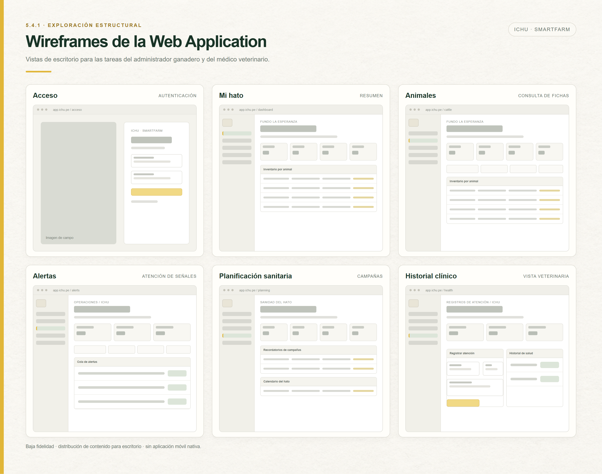

*Figura 5.4.1. Wireframes de escritorio de la Web Application ICHU. Elaboración propia.*

### 5.4.2. Applications Wireflow Diagrams

Cada wireflow representa una meta de usuario y muestra las acciones, decisiones y pantallas de baja fidelidad que resultan de cada interacción. Las metas se vinculan con las historias de usuario del alcance web:

| User Persona | Meta de usuario | Historias relacionadas |
|---|---|---|
| Cesar Flores, administrador ganadero | Revisar el hato y atender una alerta. | US-13, US-16, US-19 |
| Cesar Flores, administrador ganadero | Consultar animales y programar una campaña sanitaria. | US-06, US-07, US-26, US-27, US-28 |
| Cesar Flores, administrador ganadero | Revisar indicadores y exportar un reporte. | US-29, US-31 |
| Leonardo Rosales, médico veterinario | Consultar un hato autorizado, preparar una atención y registrar una intervención. | US-04, US-14, US-23, US-24, US-39 |

Cada meta cuenta con un flujo independiente, rotulado con su persona y explicado brevemente. Cuando una interacción cambia el contenido de una vista, el wireflow muestra el nuevo estado de pantalla.

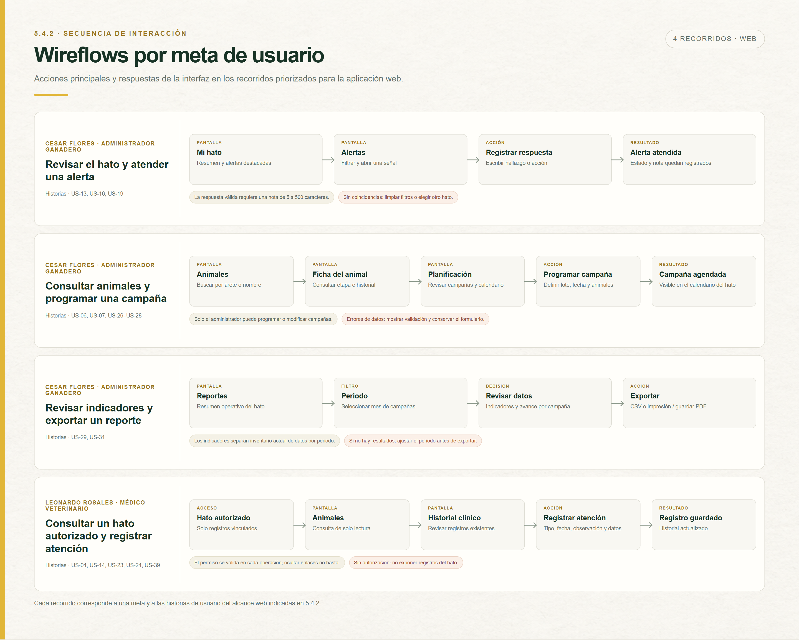

*Figura 5.4.2. Wireflows de la Web Application ICHU, vinculados con las personas y sus historias de usuario. Elaboración propia.*

### 5.4.3. Applications Mock-ups

Los mockups de alta fidelidad desarrollan las vistas web de los wireframes y aplican la paleta, tipografía y componentes definidos en 5.1. La propuesta conserva las etiquetas de 5.2, distingue los permisos por rol y contempla estados de validación, ausencia de resultados y acceso restringido, junto con los criterios de localización y accesibilidad de US-37 y US-38.

> **Espacio reservado para la Figura 5.4.3:** composición de mockups web de alta fidelidad para los flujos priorizados de administración ganadera y atención veterinaria.

*Figura 5.4.3. Mockups de la Web Application ICHU con el sistema visual y los estados de interfaz definidos para sus usuarios. Elaboración propia.*

### 5.4.4. Applications User Flow Diagrams

Los User Flows desarrollan las cuatro metas de 5.4.2 usando las pantallas de los mockups como pasos. Cada diagrama distingue la ruta esperada de las alternativas, las decisiones y condiciones de acceso, y la respuesta visible ante errores de validación o ausencia de resultados; incluye la meta y una explicación breve.

> **Espacio reservado para la Figura 5.4.4:** lámina de User Flows web, con las pantallas de alta fidelidad y las rutas esperadas y alternativas para cada meta.

*Figura 5.4.4. User Flows de la Web Application ICHU derivados de los wireflows y mockups de las metas priorizadas. Elaboración propia.*

## 5.5. Applications Prototyping

## 5.6. IoT Device Design

ICHU contempla tres elementos físicos relacionados: un collar de monitoreo para el animal, un receptor local que presenta alertas y un controlador IoT que calienta el agua del abrevadero. La separación permite ubicar la telemetría junto al animal, mostrar avisos al personal y controlar el calentamiento desde el bebedero. Los diseños de esta sección son propuestas de hardware y diagramas conceptuales; no acreditan la fabricación, la validación eléctrica ni una simulación ejecutada.

### 5.6.1. System Overview

El collar adquiere temperatura, movimiento y ubicación; el receptor convierte los avisos recibidos en señales visuales y sonoras. Por separado, el controlador del abrevadero mide la temperatura del agua y acciona una resistencia calefactora mediante un relé cuando corresponde. El controlador calienta el agua y no incluye una etapa de enfriamiento.

| Dispositivo | Función | Elementos representados |
|---|---|---|
| Collar IoT | Capturar lecturas y ubicación del animal. | ESP32-S3 DevKit, sonda DS18B20, sensor de movimiento MPU-6050, GPS NEO-6M, batería Li-ion de 3,7 V y módulo de carga/protección. |
| Receptor de alertas | Presentar el estado recibido del collar en el punto de atención. | ESP32 DevKitC, LCD I2C de 16 × 2, conversor de nivel lógico, tres LEDs con resistencias y buzzer activo KY-012. |
| Controlador del abrevadero | Medir la temperatura del agua y controlar su calentamiento. | ESP32 DevKitC, sonda impermeable DS18B20, módulo relé, resistencia calefactora y fuente de alimentación del calentador. |

La vista general reúne los tres circuitos en el lienzo de Cirkit Designer. Los bloques no comparten conexiones eléctricas entre sí: el envío de datos del collar al receptor es inalámbrico y se representa como relación funcional, no como un cable. La comunicación del controlador del agua con la aplicación tampoco está implementada en estos esquemas.

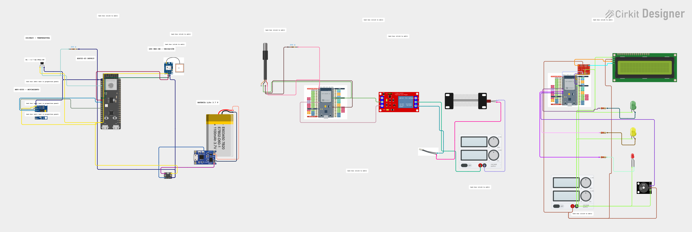

*Figura 5.6.1. Vista general de los tres subsistemas IoT en Cirkit Designer. Elaboración propia a partir del proyecto del equipo.*

### 5.6.2. Collar IoT

El collar se ajusta al cuello con una correa ergonómica y un cierre de seguridad. La carcasa electrónica se divide en tapas superior e inferior; esta última protege la electrónica y dispone de una superficie de contacto para la medición térmica. La antena GPS queda orientada hacia el cielo y el botón lateral se reserva para encendido o emparejamiento, con un LED indicador. La ilustración es un concepto de forma y ubicación de componentes, no un plano dimensional de fabricación.

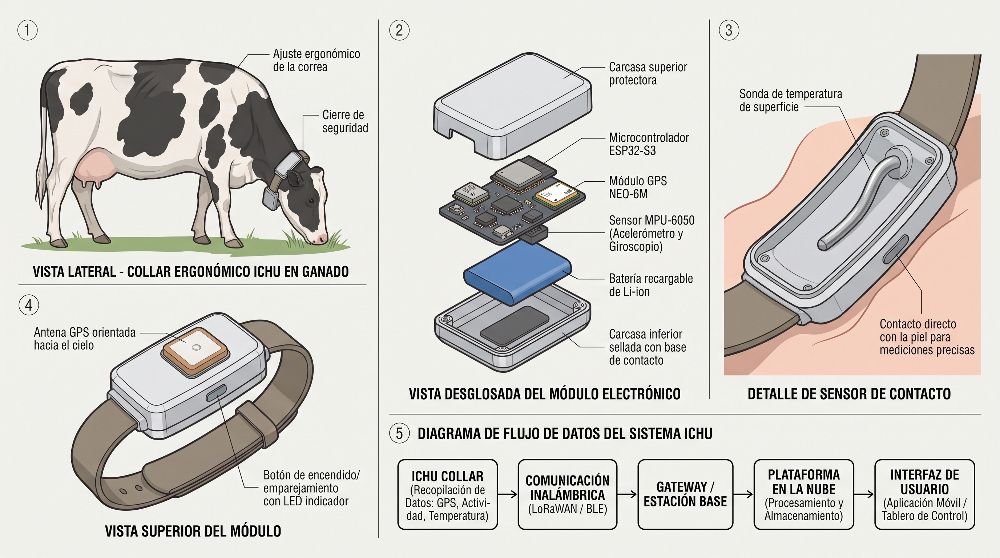

*Figura 5.6.2. Concepto físico del collar IoT ICHU. Ilustración generada con Gemini a partir de los componentes propuestos.*

En el diagrama eléctrico, el ESP32-S3 DevKit concentra las lecturas. La sonda DS18B20 se usa para medir temperatura; su línea de datos se representa con una resistencia pull-up de 4,7 kΩ. El MPU-6050 aporta aceleración y giroscopio como indicadores de movimiento, y el NEO-6M aporta coordenadas GPS. Una batería Li-ion de 3,7 V y el módulo de carga/protección alimentan el conjunto. La ubicación final de la sonda y su método de contacto deberán revisarse en el prototipo para evitar lecturas afectadas por el montaje o el pelaje.

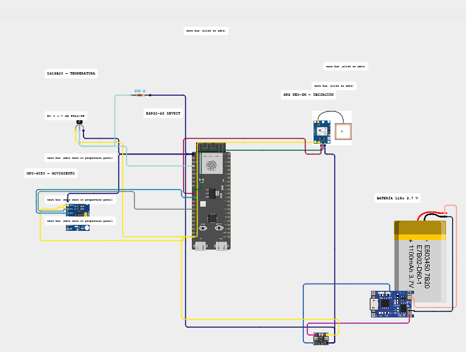

*Figura 5.6.3. Circuito conceptual del collar en Cirkit Designer, con temperatura, movimiento, GPS y alimentación.*

### 5.6.3. Alert Receiver and Indicators

El receptor es un módulo separado del collar. Recibe los avisos por un enlace inalámbrico pendiente de definir y muestra el estado en una pantalla LCD I2C de 16 × 2. Los indicadores visuales se asignan a los estados **Normal** (verde), **Atención** (amarillo) y **Urgencia** (rojo); el buzzer KY-012 complementa la alerta sonora. Los colores se acompañan con texto en la interfaz para no depender solo de la percepción del color.

En el esquema se asignan SDA y SCL de la pantalla a GPIO21 y GPIO22 del ESP32, a través de un conversor de nivel lógico para la interfaz I2C. Los LEDs verde, amarillo y rojo se conectan a GPIO25, GPIO26 y GPIO27, respectivamente, cada uno en serie con una resistencia de 220 Ω y retorno a tierra común. Para el módulo KY-012 se asignan PWM a GPIO14, VIN a 5 V y GND a tierra común.

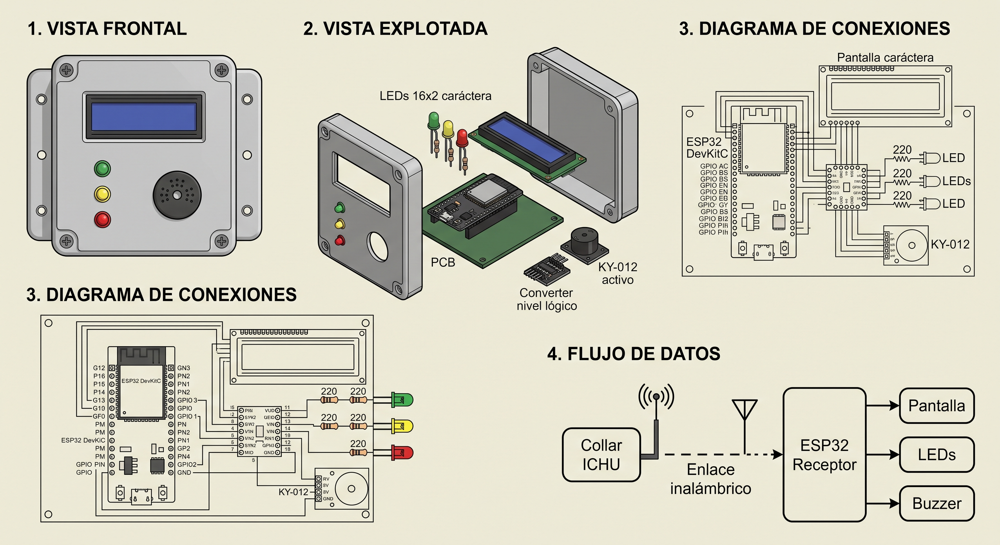

*Figura 5.6.4. Concepto físico del receptor de alertas. Ilustración generada con Gemini; sus vistas de conexiones son referenciales y la asignación de pines se documenta según el esquema Cirkit y el texto de esta sección.*

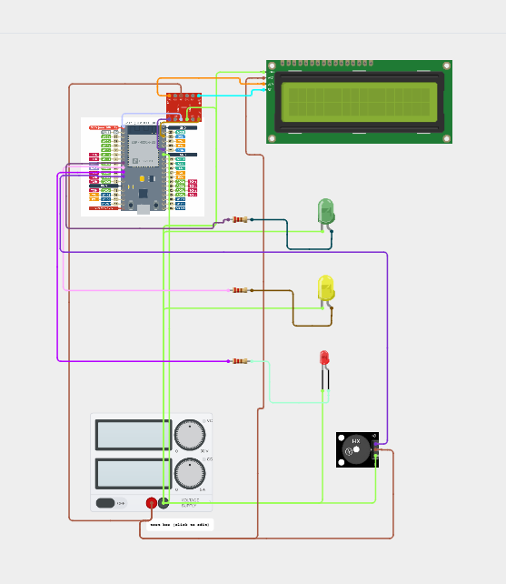

*Figura 5.6.5. Circuito conceptual del receptor de alertas en Cirkit Designer.*

### 5.6.4. Water Heating Controller

El controlador del abrevadero mide el agua con una sonda DS18B20 impermeable ubicada dentro del recipiente. El ESP32 DevKitC evalúa la lectura respecto de una temperatura objetivo configurable y activa el módulo relé para alimentar la resistencia calefactora. El comportamiento propuesto es de calentamiento únicamente; no se añade un actuador de enfriamiento ni se fija un umbral clínico o de operación en esta etapa.

El circuito representa por separado el sensor, la lógica de control, el relé y la alimentación del calentador. La selección final de fuente, relé, cableado y resistencia debe corresponder a la potencia de la carga y a la instalación prevista; los valores eléctricos no se especifican en el esquema conceptual.

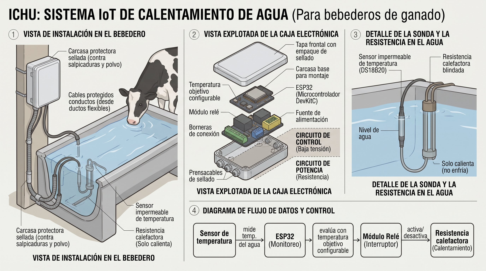

*Figura 5.6.6. Propuesta de instalación del sensor, la resistencia calefactora y la caja de control. Ilustración generada con Gemini.*

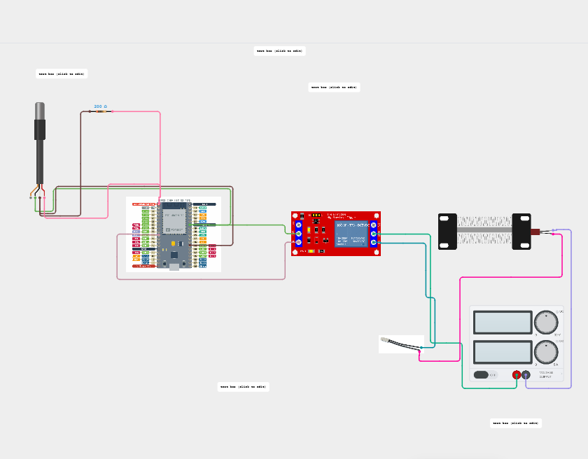

*Figura 5.6.7. Circuito conceptual del controlador de calentamiento del abrevadero en Cirkit Designer.*

### 5.6.5. Design Decisions and Edge Data Flow

Las ubicaciones y alimentaciones siguientes son decisiones de diseño propuestas. Los rieles regulados deben dimensionarse para los módulos finalmente comprados; la ilustración no sustituye las hojas de datos ni la validación eléctrica.

#### Wiring Color Convention

Para leer los diagramas con rapidez, se propone una convención cromática común para todos los circuitos ICHU. Es una leyenda gráfica del proyecto, no un código universal para instalaciones eléctricas. Los colores deben acompañarse con el nombre de la señal o el pin; el color por sí solo no identifica voltaje, sentido de datos ni conexión.

| Color de línea propuesto | Red o función | Etiquetas que deben acompañarla |
|---|---|---|
| Rojo `#D64545` | Positivo de alimentación DC. | `+3V3`, `+5V` o `VIN`, según el riel; no mezclar niveles sin indicarlos. |
| Negro `#2D3436` | Tierra común de baja tensión. | `GND`; indicar la unión común de ESP32, sensores y periféricos. |
| Verde `#27AE60` | Datos I2C. | `SDA`, por ejemplo entre LCD/MPU-6050 y ESP32. |
| Azul `#2F80ED` | Reloj I2C. | `SCL`, por ejemplo entre LCD/MPU-6050 y ESP32. |
| Amarillo `#E3B341` | Bus de datos OneWire del DS18B20. | `DQ` o `DATA`; señalar la resistencia pull-up de 4,7 kΩ en el esquema del collar. |
| Celeste `#35A7C8` | UART del GPS. | `TX` y `RX` en cada extremo, indicando su dirección. |
| Naranja `#F28C28` | Señales digitales de control del ESP32. | GPIO correspondiente, como `GPIO14 / PWM` para KY-012 o `GPIOxx / IN` para la entrada lógica del relé. |
| Morado `#8E63B0` | Rama de potencia conmutada hacia el calefactor, separada del control lógico. | `SALIDA RELÉ` y la tensión/corriente de carga una vez dimensionadas. No asignar este color a un valor eléctrico no definido. |
| Gris discontinuo `#68737D` | Enlace de comunicación inalámbrica; no es un conductor físico. | `BLE → Edge Gateway` o `Wi-Fi → API`, según el trayecto. |

El calefactor debe permanecer visualmente separado del circuito lógico del ESP32: la línea morada representa de forma conceptual la carga que conmuta el relé, no una recomendación de color para cableado de red eléctrica. La selección real de conductores y protecciones queda sujeta al voltaje, la corriente, el equipo adquirido y las reglas de instalación aplicables.

Las capturas Cirkit ya guardadas muestran colores asignados por la herramienta y aún no siguen esta leyenda de manera uniforme. Por tanto, la tabla define el estándar que se aplicará al recolorear y exportar los diagramas finales; no se debe inferir de esas capturas que, por ejemplo, un cable azul actual sea `SCL` o uno negro sea `GND` sin revisar sus pines.

| Componente | Qué mide o hace | Ubicación de montaje propuesta | Alimentación y transporte de datos |
|---|---|---|---|
| DS18B20 del collar | Registra temperatura superficial en el punto de contacto; no mide por sí solo temperatura corporal interna. | Fijado en la cara interna inferior de la carcasa, con la superficie sensible en contacto estable con el animal y protegida del agua. | Línea de datos al ESP32-S3 con resistencia pull-up de 4,7 kΩ, según el circuito. Riel regulado del conjunto Li-ion; nivel exacto por confirmar con el módulo. |
| MPU-6050 | Aporta aceleración y velocidad angular para estimar movimiento y actividad. | Fijado a la placa dentro de la carcasa, evitando que se mueva respecto del collar. | Bus I2C y riel regulado de baja tensión del ESP32-S3; sus lecturas forman el índice de actividad enviado en la telemetría. |
| GPS NEO-6M | Obtiene latitud y longitud cuando existe recepción satelital. | Dentro de la carcasa, con su antena orientada hacia el cielo y sin cubrirla con metal. | Riel regulado compatible con la placa del módulo; sus coordenadas se incorporan al paquete de telemetría. |
| ESP32-S3 y batería del collar | Lee sensores, marca los registros y administra el enlace. El nivel de batería del contrato requiere una medición de tensión aún no dibujada. | Placa y batería en la carcasa superior sellada, sujetas para resistir vibración. | Batería Li-ion de 3,7 V con módulo de carga/protección y regulación para cada componente; Wi-Fi o BLE integrado según la cobertura y la arquitectura de 4.1.3.3. |
| DS18B20 del abrevadero | Mide la temperatura del agua. | Sonda impermeable sumergida y asegurada; separada de la resistencia calefactora para medir el agua y no el elemento caliente. | Conectado al ESP32 DevKitC; alimentación desde su riel de baja tensión y pull-up conforme al circuito definitivo. |
| ESP32 DevKitC, relé y resistencia calefactora | El ESP32 compara la lectura con el objetivo configurable; el relé conmuta la resistencia y el controlador solo calienta. | ESP32 y relé dentro de una caja cerrada, fuera de la zona de salpicaduras; sonda y calefactor en el bebedero. | Alimentación lógica regulada y alimentación de potencia dimensionada para el calefactor, separadas a través del relé. La fuente y los valores se deben seleccionar para la carga real. Las lecturas tienen como destino la API central según TS-14; el canal físico y el paso por Edge están por definir. |
| ESP32 DevKitC del receptor, LCD, LEDs y KY-012 | Presenta los estados Normal, Atención y Urgencia en pantalla y luces, y emite sonido en una urgencia. | Caja del panel en un lugar seco y visible para el operario; LEDs y pantalla en el frente, salida acústica del buzzer despejada. | Se propone una fuente regulada de 5 V para la placa y periféricos; las señales del ESP32 operan a 3,3 V, con el conversor I2C del esquema para la pantalla. Se propone obtener alertas desde Edge por Wi-Fi en la red local; endpoint y contrato por definir, enlace aún no probado. |

Para el collar, el flujo diseñado es: **sensores → ESP32-S3 → Edge Gateway** por Bluetooth Low Energy cuando el pastoreo no tiene cobertura; el ESP32 conserva registros pendientes si no logra entregar el lote y los libera tras la confirmación de Edge. Cuando el collar dispone de Wi-Fi e Internet, la arquitectura del capítulo IV permite transmitir directamente al backend. El Edge Gateway almacena las lecturas en SQLite y evalúa las reglas críticas con la configuración local; al recuperar Internet sincroniza lotes con la API central por `POST /api/v1/telemetry/batch` (TS-03 a TS-06).

Cada registro del collar incluye `deviceId`, `temperature`, `activityIndex`, `latitude`, `longitude`, `batteryLevel` y `recordedAt` (TS-01). Una lectura inválida debe conservar el indicador de error del sensor en vez de presentarse como una medición normal. Las alertas locales de Edge se entregan a la aplicación móvil por la red local, de acuerdo con 4.1.3.3.

El controlador de agua tiene un contrato separado en TS-14: publica `waterTemperature`, `actuatorState` y `recordedAt` en `/api/v1/water-controllers/{controllerId}/readings`. La arquitectura actual no especifica que esas lecturas pasen por Edge; por ello, no se representa ese tránsito como una conexión existente. Para el panel LCD/LED se propone una consulta o entrega de alertas del Edge Gateway por Wi-Fi sobre la red local; la interfaz y su contrato siguen pendientes y el circuito no dibuja el transporte de radio. La lámina de Gemini que muestra una transmisión directa collar–receptor se considera ilustrativa; el flujo del sistema mantiene al Edge Gateway como punto local de recepción y evaluación.

El campo `batteryLevel` de la telemetría del collar también requiere una decisión de medición —por ejemplo, entrada ADC con acondicionamiento adecuado o una salida de monitor de batería del módulo de alimentación—, porque no aparece un circuito de medición en la captura Cirkit. Se conserva en el contrato de datos, pero su captura física queda como trabajo propuesto.

En el alcance definido hoy, **solo el trayecto del collar al Edge está establecido**: BLE al Portable Edge Gateway sin cobertura y Wi-Fi directo al backend cuando hay Internet. La integración propuesta del panel con Edge por Wi-Fi local y el eventual paso de lecturas del abrevadero por Edge necesitan cerrar contrato y requisitos antes de presentarse como conexiones implementadas.

### 5.6.6. Proposal and Verification Status

| Elemento | Estado | Evidencia disponible |
|---|---|---|
| Forma del collar, carcasa, ubicación de componentes y correa | Propuesta conceptual; no fabricada ni probada en un animal. | Lámina conceptual generada con Gemini, Figura 5.6.2. |
| Montaje del calentador, caja del controlador y posición de sonda | Propuesta conceptual; no hay instalación física. | Lámina de instalación generada con Gemini, Figura 5.6.6. |
| Carcasa y disposición del panel de alertas | Propuesta conceptual; no se probó con usuarios ni se integró con Edge. | Lámina generada con Gemini, Figura 5.6.4. Sus pines ilustrados no son referencia eléctrica. |
| Circuitos del collar, calentador y receptor | Diagramas guardados y revisados visualmente en Cirkit Designer; no se ejecutó la simulación ni se validó el cableado con hardware. | Figuras 5.6.1, 5.6.3, 5.6.5 y 5.6.7, más proyecto editable. |
| Flujo BLE/Wi-Fi hacia Edge y sincronización con la nube | Decisión arquitectónica descrita en los capítulos III y IV; no se implementó ni probó con estos dispositivos. | Technical Stories TS-01–TS-06 y arquitectura de 4.1.3.3. |
| Lecturas del controlador del agua y presentación de alertas | Contratos y comportamiento propuestos; no se enviaron lecturas reales ni se verificó una alerta de extremo a extremo. | TS-14 y diagramas conceptuales de esta sección. |

El https://app.cirkitdesigner.com/project/a07ab13c-8ded-4672-a786-deecb40e13c2 conserva el lienzo completo. 