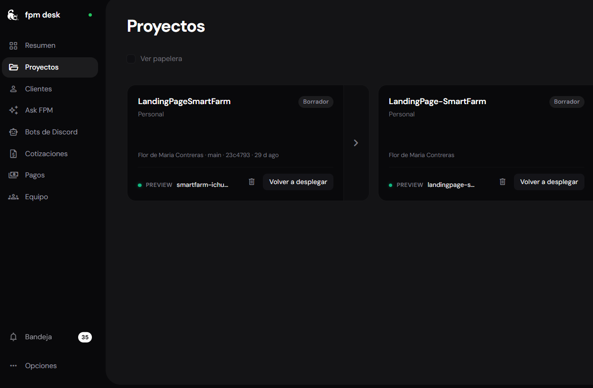
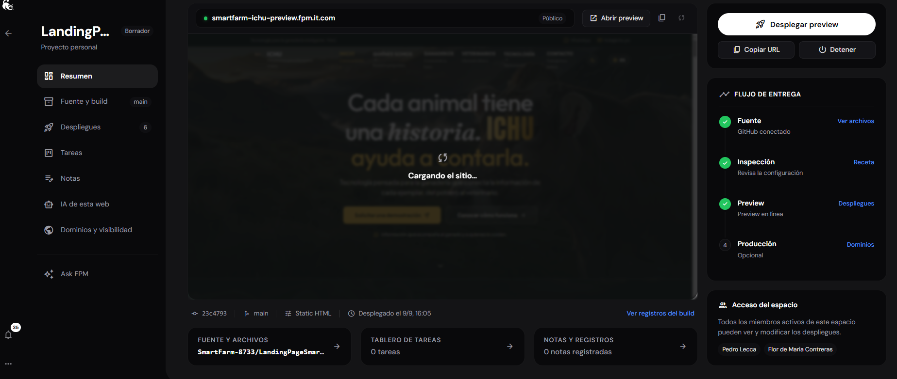
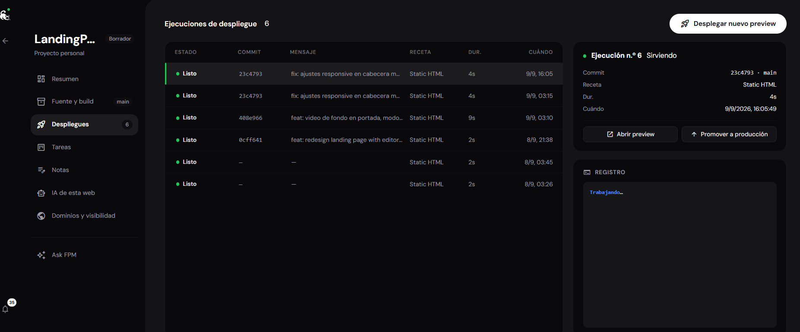
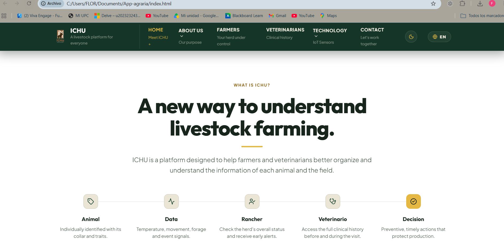
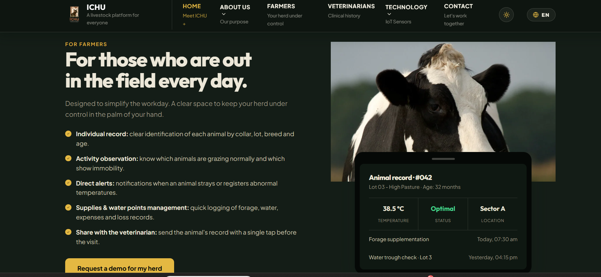
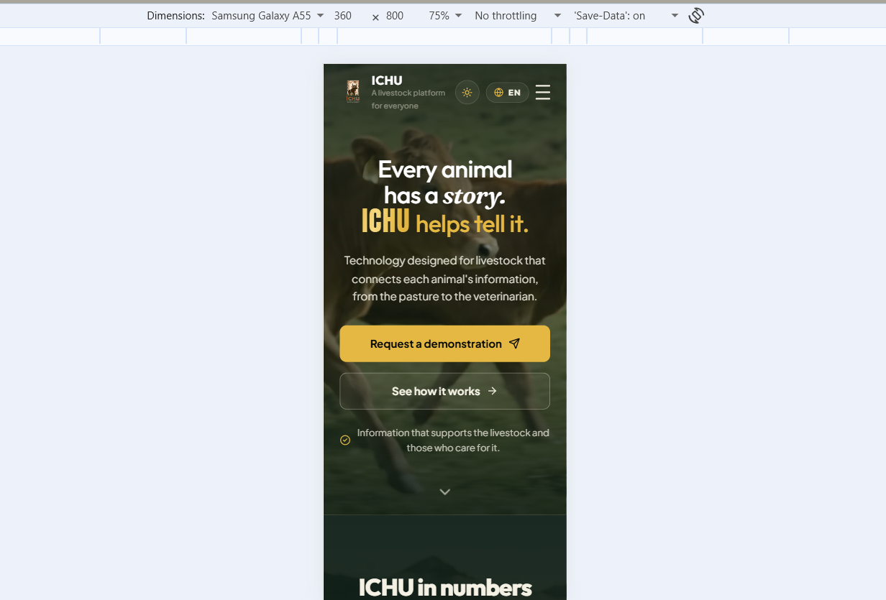
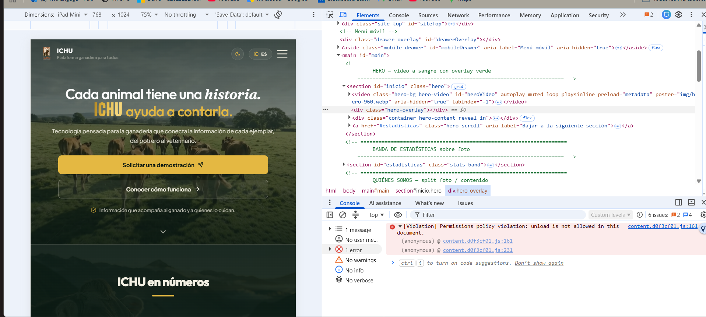
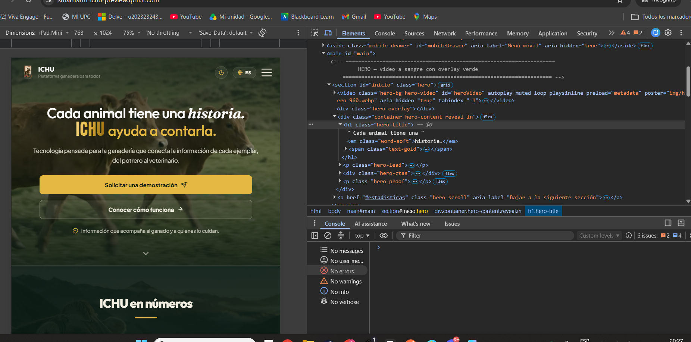
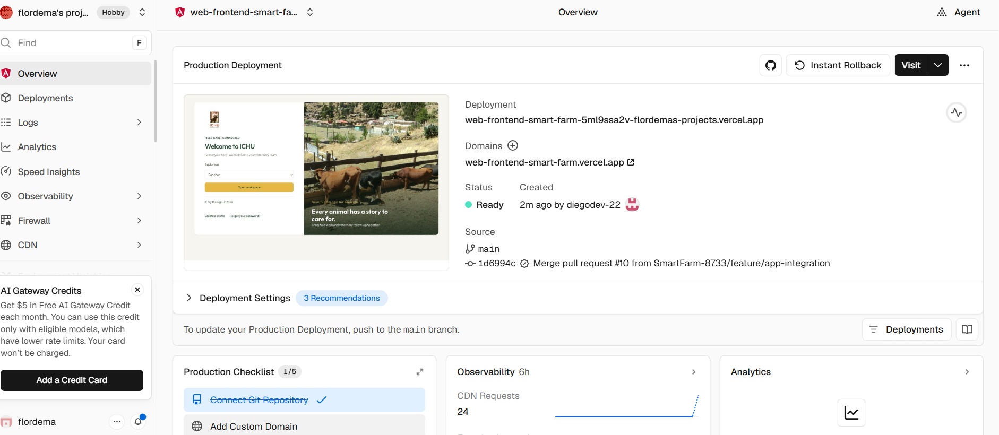
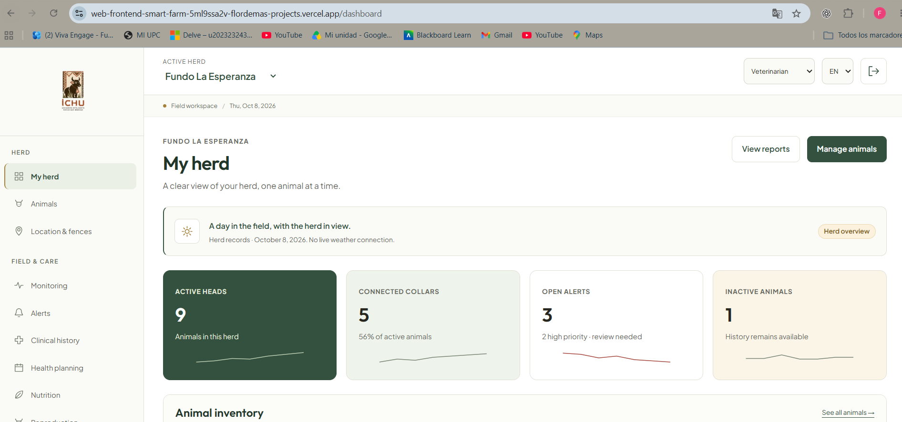

# Capítulo VI: Product Implementation, Validation & Deployment

Este capítulo registra la configuración del software y las evidencias disponibles del Sprint 1. El alcance desarrollado y documentado aquí comprende dos interfaces: la Landing Page de ICHU y el frontend web de la plataforma. No se implementó un backend; por ello, las pantallas, cifras de ejemplo y respuestas visuales descritas no acreditan persistencia de datos ni servicios conectados.

## 6.1. Software Configuration Management

### 6.1.1. Software Development Environment Configuration

La Landing Page de ICHU se desarrolla como un sitio estático con **HTML, CSS y JavaScript**, sin framework ni proceso de compilación. El código está organizado en páginas HTML, una hoja de estilos compartida (`css/styles.css`) y dos módulos JavaScript: `js/i18n.js`, para idioma, y `js/main.js`, para navegación e interacciones. Los recursos gráficos y de video se mantienen en carpetas propias.

Para una revisión local, el README del repositorio permite abrir `index.html` directamente en un navegador o iniciar un servidor estático con `npx serve .` o `python -m http.server 8080`. El README también menciona una comprobación con jsdom para identificar IDs duplicados, recursos faltantes, anclas rotas y estilos inline; sin embargo, en la copia del proyecto revisada no se encontró el script ni un `package.json` que permita ejecutarla. Por tanto, esa comprobación no es reproducible con el material disponible y no se presenta como una prueba ejecutada.

El frontend web de la plataforma es un segundo artefacto, desarrollado con Angular y TypeScript, con componentes de Angular Material. Su [repositorio de código](https://github.com/SmartFarm-8733/WebFrontend-SmartFarm) incluye el manifiesto de dependencias y los comandos del proyecto. En la revisión del manifiesto se observaron Angular y Angular Material 22.2.2, TypeScript 6.0.3 y Playwright 1.64.0; las versiones corresponden al estado del repositorio consultado y no implican que exista un backend conectado. Las capturas disponibles muestran la interfaz de inicio de sesión y un dashboard con datos de muestra.

| Elemento | Configuración documentada |
|---|---|
| Landing Page — lenguajes y ejecución | HTML, CSS y JavaScript; navegador web, con servidor estático opcional |
| Landing Page — organización | Páginas HTML, `css/styles.css`, `js/i18n.js` y `js/main.js`; no utiliza framework ni proceso de compilación |
| Web Application — tecnologías verificadas | Angular 22.2.2, TypeScript 6.0.3 y Angular Material 22.2.2, según el manifiesto del [repositorio](https://github.com/SmartFarm-8733/WebFrontend-SmartFarm) |
| Web Application — comandos del manifiesto | `npm start`, `npm run build`, `npm run typecheck` y `npm run test:e2e`; este último ejecuta Playwright |
| Backend | No implementado en el alcance documentado; la interfaz web presenta datos de ejemplo |
| Landing Page — validación automatizada | El README menciona jsdom, pero no se encontró el script ni su configuración en la copia revisada; no es reproducible desde esa copia |

Fuente: README del repositorio LandingPageSmartFarm, https://github.com/SmartFarm-8733/LandingPageSmartFarm

### 6.1.2. Source Code Management

El código de la Landing Page y el informe se mantienen en repositorios Git separados: https://github.com/SmartFarm-8733/LandingPageSmartFarm y https://github.com/SmartFarm-8733/Report-SmartFarm. Esta separación permite revisar la evolución del producto web y la documentación de manera independiente.

Para el repositorio del informe, la guía de contribución define `main` para entregas publicadas, `develop` para integración y ramas `feature/<alcance>` o `fix/<alcance>` para cambios de trabajo. Las contribuciones se integran mediante Pull Request con revisión de otro integrante, y los commits siguen Conventional Commits. El Capítulo VI se trabaja en la rama `feature/chapter-VI`, publicada en GitHub y aún no integrada en `main`.

La captura del deployment de Vercel registra el frontend web en la rama `main`, en el commit `1d6994c`, integrado desde el Pull Request #10 de `feature/app-integration`. El código fuente se mantiene en el [repositorio WebFrontend-SmartFarm](https://github.com/SmartFarm-8733/WebFrontend-SmartFarm). Las convenciones de ramas y commits de ese repositorio no se infieren de las reglas de `Report-SmartFarm`.

| Práctica | Convención del repositorio del informe |
|---|---|
| Ramas de trabajo | `feature/<alcance>` o `fix/<alcance>`, creadas desde `develop` |
| Integración | Pull Request hacia la rama correspondiente y revisión por otro integrante |
| Mensajes de commit | Conventional Commits, en minúsculas, con alcance opcional |
| Rama de entrega | `main` |

Fuente: archivo CONTRIBUTING.md del repositorio Report-SmartFarm. La convención anterior describe el repositorio del informe; cualquier diferencia en el flujo del repositorio de la Landing Page debe confirmarse con su configuración y responsables.

### 6.1.3. Source Code Style Guide & Conventions

Las convenciones identificables en la documentación del proyecto son:

- Mantener la estructura semántica de cada página en HTML y centralizar los estilos compartidos en `css/styles.css`.
- Mantener separadas las traducciones (`js/i18n.js`) y las interacciones de interfaz (`js/main.js`).
- Definir la paleta mediante variables CSS y reutilizar esos tokens para los temas claro y oscuro.
- Incluir nombres accesibles, etiquetas ARIA y alternativas textuales donde correspondan; el README señala navegación por teclado y soporte para movimiento reducido.
- Mantener imágenes optimizadas en WebP, declarar sus dimensiones y usar carga diferida cuando corresponda.

Estas convenciones resumen la guía del repositorio de la Landing Page. No se afirma que se haya ejecutado una auditoría automatizada de accesibilidad o estilo para este informe.

### 6.1.4. Software Deployment Configuration

La Landing Page se publicó como sitio estático en un preview administrado desde FPM Desk. Según la información proporcionada por el equipo, el servidor es privado, pertenece a FPM y fue creado por Flor de María Contreras. La consola muestra el proyecto `LandingPageSmartFarm`, el repositorio de GitHub conectado, la rama `main`, la receta `Static HTML` y el estado del preview como **Público**. El flujo separa el preview de Producción, que aparece como una etapa opcional; por ello, esta evidencia acredita un preview publicado, no una promoción a producción.

URL completa del preview: https://smartfarm-ichu-preview.fpm.it.com/

El frontend de la aplicación web se despliega por separado en Vercel, que distingue entornos locales, de preview y de producción [11]; sus evidencias del entorno de producción y de la interfaz publicada se presentan en la sección 6.2.1.8.

La consola registra seis ejecuciones de despliegue. En la captura, la más reciente figura como lista, construida desde el commit `23c4793` de `main` el 9 de septiembre de 2026, con la receta `Static HTML` y una duración de cuatro segundos. La URL respondió con HTTP 200 durante la verificación de este informe el 8 de octubre de 2026.

*Figura 6.1. Lista de proyectos en FPM Desk; se identifica LandingPageSmartFarm con un preview disponible.*

*Figura 6.2. Detalle del preview: repositorio GitHub conectado, rama `main`, receta Static HTML, URL completa visible y estado público. El panel indica Producción como una etapa opcional.*

*Figura 6.3. Historial de seis ejecuciones, con la más reciente en estado «Listo».*

*Figura 6.4. Portada en español cargada desde el preview público; la barra del navegador muestra smartfarm-ichu-preview.fpm.it.com.*

## 6.2. Landing Page, Services & Applications Implementation

### 6.2.1. Sprint 1

El Capítulo III asigna trece historias al Sprint 1, con un total estimado de 47 puntos. Este capítulo usa esa asignación como **línea base del backlog planificado**; no la presenta como trabajo ya terminado ni como velocidad validada del equipo. El alcance asignado es una Landing Page bilingüe y accesible, junto con las funciones iniciales de acceso a la plataforma y gestión de la ficha del animal.

#### 6.2.1.1. Sprint Planning 1

**Objetivo de producto planificado:** comunicar la propuesta de ICHU a los dos segmentos, permitir que los visitantes comprendan los planes y soliciten una demostración, y cubrir el primer flujo de acceso y registro/consulta de animales planteado para la plataforma.

El alcance proviene del roadmap y la priorización registrados en el Capítulo III. Incluye la Landing Page con internacionalización y accesibilidad, el registro de unidad productiva, el acceso, el perfil profesional y la ficha del animal. La estimación inicial suma 47 puntos de historia; el propio roadmap indica que el equipo debe contrastar la velocidad real al cierre del Sprint 1 antes de ajustar los siguientes sprints.

La fuente consultada no fija aquí las fechas, duración, capacidad comprometida ni el resultado de la reunión de planificación. Estos datos deben añadirse desde el Sprint Backlog vigente en Jira antes de presentar la planificación como acuerdo final del equipo.

#### 6.2.1.2. Aspect Leaders and Collaborators

La siguiente distribución es una **planificación simulada** agregada en Jira. Las 22 tareas SF-96 a SF-117 llevan la etiqueta `simulado` y permanecen en estado **Por hacer**. Los nombres de la tabla son responsables propuestos, no evidencia de asignación ni de trabajo completado. En el proyecto, SF-96 es la única de estas tareas asignada a una cuenta de integrante; las demás siguen sin asignar. Al intentar añadir integrantes, Jira confirmó la incorporación de una cuenta existente y notificó dos solicitudes de acceso pendientes de aprobación administrativa. El aviso no identificó a quiénes corresponden esas solicitudes ni confirmó individualmente el estado de las otras dos cuentas. No se inició un sprint. Esta planificación no modifica las 13 historias ni los 47 puntos de la línea base del Sprint 1.

Consulta del conjunto de tareas en Jira: https://upc-team-experimentos.atlassian.net/issues/?jql=issueKey%20in%20(SF-96%2CSF-97%2CSF-98%2CSF-99%2CSF-100%2CSF-101%2CSF-102%2CSF-103%2CSF-104%2CSF-105%2CSF-106%2CSF-107%2CSF-108%2CSF-109%2CSF-110%2CSF-111%2CSF-112%2CSF-113%2CSF-114%2CSF-115%2CSF-116%2CSF-117)

| Responsable propuesto | Tareas simuladas en Jira |
|---|---|
| Contreras Leon, Flor de María | SF-96 — Capítulo V, diseño UI/UX y Landing Page; SF-106 — Dashboard & Analytics, indicadores e informes. |
| Avalos Cordova, Diego Andres | SF-97 — Capítulo VI, frontend, pruebas y despliegue; SF-102 — Operations & Monitoring; SF-109 — Portable Edge Gateway; SF-112 — integración del frontend web/móvil con las APIs. |
| Arrieta Quispe, Alison Jimena | SF-98 — correcciones editoriales; SF-103 — Cattle Information; SF-107 — Identity & Access Management; SF-116 — trazabilidad entre Bounded Contexts, APIs, Jira e informe. |
| Sanchez Arenas, Manuel Angel | SF-99 — correcciones de requisitos y trazabilidad; SF-105 — Planning; SF-113 — contratos OpenAPI/Swagger; SF-114 — pruebas de integración entre frontend, API y Edge. |
| Awad Vargas, Giorgio Marzouk | SF-100 — correcciones de pruebas y despliegue; SF-108 — Subscription Plans; SF-111 — controlador de calentamiento del abrevadero; SF-115 — verificación de entornos y despliegues. |
| Romero Meza, Jhimy Pool | SF-101 — correcciones de figuras; SF-104 — IoT Assets; SF-110 — prototipo conceptual del collar IoT; SF-117 — auditoría de criterios y evidencias de entrega. |

Los siete Bounded Contexts de la arquitectura se reflejan como trabajo planificado del monolito modular; Portable Edge Gateway y los prototipos IoT se registran como tareas transversales. Las descripciones de Jira delimitan entregables propuestos y pruebas por ejecutar. Las capturas de diseño del Capítulo V no demuestran que los sensores, el Edge o las APIs estén implementados o conectados.

#### 6.2.1.3. Sprint Backlog 1

La tabla conserva el orden y la estimación de la priorización de historias del Capítulo III. La columna «Sprint» corresponde a la planificación documentada, no al estado actual de implementación.

| Prioridad | Historia | Resultado esperado | Puntos | Sprint asignado |
|---:|---|---|---:|---|
| 1 | US-32 — Conocer la propuesta de ICHU | Presentar el problema, la solución IoT, los beneficios por segmento y los productos digitales. | 3 | Sprint 1 |
| 2 | US-33 — Acceder al destino correspondiente a mi segmento | Dirigir al visitante al producto digital o canal correspondiente. | 2 | Sprint 1 |
| 3 | US-35 — Comparar los planes y estimar el costo | Presentar planes, límites de dispositivos y estimación según el tamaño del hato. | 5 | Sprint 1 |
| 4 | US-34 — Solicitar una demostración | Registrar la solicitud con el segmento y contexto productivo del visitante. | 3 | Sprint 1 |
| 5 | US-36 — Consultar los términos y condiciones del servicio | Exponer condiciones de uso y tratamiento de datos. | 2 | Sprint 1 |
| 6 | US-06 — Registrar un animal en el hato | Incorporar identificación y datos productivos del animal. | 5 | Sprint 1 |
| 26 | US-07 — Consultar la ficha de un animal | Mostrar identificación, etapa productiva, collar asignado y última lectura. | 3 | Sprint 1 |
| 27 | US-01 — Registrar una cuenta de unidad productiva | Crear la cuenta con ubicación y escala de la unidad. | 3 | Sprint 1 |
| 28 | US-02 — Acceder a la plataforma | Iniciar sesión según rol y alcance de las unidades productivas. | 3 | Sprint 1 |
| 29 | US-04 — Autorizar a un médico veterinario sobre el hato | Conceder acceso temporal y acotado a la unidad productiva. | 5 | Sprint 1 |
| 51 | US-37 — Consultar la experiencia en mi idioma | Presentar la experiencia en inglés o español y conservar la preferencia. | 5 | Sprint 1 |
| 52 | US-38 — Acceder a la experiencia con tecnología de asistencia | Proveer nombres y funciones accesibles, alternativas textuales y recorrido por teclado. | 5 | Sprint 1 |
| 63 | US-03 — Completar el perfil profesional | Registrar especialidad, colegiatura y experiencia del médico veterinario. | 3 | Sprint 1 |
|  | **Total planificado** |  | **47** |  |

Fuente: archivo report/30-requirements-specification.md, sección Product Backlog y alcance comprometido y roadmap, Capítulo III.

#### 6.2.1.4. Development Evidence for Sprint Review

Las capturas siguientes documentan la presentación de la Landing Page en español e inglés, el tema oscuro y una vista móvil simulada. La tercera captura muestra una sección de contenido para ganaderos con una ficha visual de ejemplo; esta ficha forma parte de la presentación de la propuesta y no demuestra que exista una aplicación funcional de gestión del hato.

*Figura 6.5. Portada de la Landing Page en español vista en escritorio. Captura de navegador proporcionada por el equipo.*

*Figura 6.6. Sección «What is ICHU?» en inglés, abierta desde un archivo local en el navegador. Captura de navegador proporcionada por el equipo.*

*Figura 6.7. Vista en inglés con tema oscuro y contenido dirigido a ganaderos. La ficha del animal en la imagen es un recurso ilustrativo de la Landing Page, no evidencia de una función conectada a datos.*

*Figura 6.8. Portada en inglés en la emulación de un viewport móvil de 360 × 800 píxeles. La captura muestra una vista emulada en navegador, no una prueba en un dispositivo físico.*

La interfaz web de la plataforma también se muestra en el dashboard de la Figura 6.12. Esa captura acredita la presentación del frontend; los indicadores son datos de muestra y no evidencian conexión con un backend.

#### 6.2.1.5. Testing Suite Evidence for Sprint Review

Se realizó una comprobación manual preliminar de renderizado con Chrome DevTools en el preset **iPad Mini**, viewport de 768 × 1024 píxeles, al 75 % y sin limitación de red. La primera captura permite ver la portada, la navegación móvil y el comienzo de la sección siguiente, pero no permite evaluar los controles ni muestra la barra con la URL.

| Caso | Resultado observado | Estado |
|---|---|---|
| Renderizado del preview en viewport iPad Mini (768 × 1024) | La portada carga en Chrome incógnito; la URL del preview se ve en la barra y el contenido se adapta al viewport emulado. | Aprobado, comprobación visual |
| Consola en la primera inspección | Se vio `[Violation] Permissions policy violation: unload is not allowed in this document.`, con fuente `content.d0f3cf01.js`. | Observado una vez; origen no confirmado |
| Consola en la repetición de incógnito | No aparecen errores ni advertencias en la consola de la captura. El mensaje anterior no se reproduce; esto sugiere que pudo provenir de una extensión o estado del navegador, pero no confirma su origen. | Aprobado en esta repetición |
| Cambio de idioma, tema, menú y validación del formulario | Las capturas de desarrollo muestran los estados español, inglés y tema oscuro, pero no registran la activación de esos controles. El menú y el envío del formulario tampoco se probaron. | Estados visuales capturados; comportamiento no verificado |
| Suite automatizada descrita en el README | En la copia revisada no están el script jsdom ni su configuración, así que no fue posible ejecutar ni reproducir esa suite. | Pendiente; no ejecutada |

*Figura 6.9. La página se renderiza en un viewport móvil emulado; DevTools muestra una violación de Permissions Policy procedente de `content.d0f3cf01.js`, cuyo origen debe confirmarse.*

*Figura 6.10. Repetición de la inspección en Chrome incógnito: la dirección del preview aparece en la barra, la portada se renderiza en el viewport iPad Mini y DevTools no muestra errores ni advertencias.*

#### 6.2.1.6. Execution Evidence for Sprint Review

Las Figuras 6.6 y 6.8 muestran la Landing Page cargada localmente; la primera deja visible la ruta del archivo y la segunda la emulación de un viewport móvil. La Figura 6.4 muestra la portada abierta desde el preview de FPM Desk, cuya URL respondió con HTTP 200 durante la verificación del 8 de octubre de 2026. La Figura 6.12 muestra el dashboard del frontend web de Vercel; su URL también respondió con HTTP 200 en esa fecha. Estas evidencias acreditan renderizado y disponibilidad de las interfaces en ese momento; no demuestran una prueba en teléfono físico, la conexión con servicios backend ni el funcionamiento integral de idioma, tema o formulario.

#### 6.2.1.7. Services Documentation Evidence for Sprint Review

El alcance de este incremento comprende interfaces frontend. La Landing Page es un sitio estático que presenta ICHU; su formulario prepara una solicitud y abre WhatsApp para que la persona la envíe. No procesa ni almacena la solicitud en un backend propio. El frontend web publicado en Vercel presenta un dashboard y otras vistas de gestión, pero la captura disponible indica que no hay conexión meteorológica en vivo y sus cifras se identifican como datos de muestra.

| Interfaz o servicio | Documentación disponible | Límite comprobado |
|---|---|---|
| Landing Page | Páginas estáticas `index.html`, `media.html` y `como-funciona.html`; navegación, alternancia de idioma y tema, contenido informativo y formulario que abre WhatsApp. | Se verifican archivos y pantallas; las capturas no demuestran que se haya probado cada interacción ni que exista procesamiento en servidor. |
| Frontend web de la plataforma | Dashboard con indicadores del hato y navegación a animales, ubicación, monitoreo, alertas e historial clínico. URL publicada: https://web-frontend-smart-farm.vercel.app/ | La captura muestra datos de ejemplo y señala que no hay conexión meteorológica en vivo. No demuestra persistencia ni consumo de una API. |
| Backend y contratos de servicios | No se implementaron backend ni endpoints API dentro del alcance documentado; no hay contratos OpenAPI/Swagger que adjuntar para este incremento. | No se presentan servicios ni integración backend como implementados o probados. |

El preview de la Landing Page está disponible en https://smartfarm-ichu-preview.fpm.it.com/. La aplicación frontend de Vercel está disponible en https://web-frontend-smart-farm.vercel.app/. Las capturas de despliegue correspondientes se encuentran en las Figuras 6.1–6.4 y 6.11–6.12.

#### 6.2.1.8. Software Deployment Evidence for Sprint Review

La aplicación web de ICHU tiene un despliegue de producción separado de la Landing Page alojada en el preview de FPM Desk. La consola de Vercel muestra el deployment como **Ready**, asociado a `main` y al commit `1d6994c` (`Merge pull request #10 from SmartFarm-8733/feature/app-integration`). El dominio de producción mostrado es https://web-frontend-smart-farm.vercel.app/; durante la verificación de este informe respondió con HTTP 200. La ruta de dashboard capturada en el navegador es https://web-frontend-smart-farm-5ml9ssa2v-flordemas-projects.vercel.app/dashboard y también respondió con HTTP 200.

*Figura 6.11. Panel de Vercel: deployment de producción en estado Ready, rama `main`, commit `1d6994c` y dominio `web-frontend-smart-farm.vercel.app`.*

*Figura 6.12. Dashboard del frontend cargado desde la URL de Vercel. Las cifras del hato que aparecen en pantalla son datos de muestra de la interfaz; esta captura no demuestra su persistencia ni conexión con un backend productivo.*

#### 6.2.1.9. Team Collaboration Insights during Sprint

La evidencia disponible muestra coordinación mediante cambios versionados, despliegues y una distribución de tareas propuesta. En el historial del informe, Avalos Cordova, Diego Andres (`diegodev-22`) registró cambios de diseño para la Landing Page y los flujos de la aplicación; Contreras Leon, Flor de María (`FlorDeMa`) incorporó el diseño de dispositivos IoT y el avance de documentación. El historial se consulta en https://github.com/SmartFarm-8733/Report-SmartFarm/commits/feature/chapter-VI. La captura de Vercel registra la integración del frontend a `main` desde el Pull Request #10 de `feature/app-integration`.

El plan documentado no fija las fechas oficiales ni la duración del Sprint 1. Por ello, estos commits y el deployment se presentan como evidencia de colaboración del proyecto, sin afirmar que ocurrieron dentro de un Sprint con fechas confirmadas.

La distribución de 22 tareas SF-96 a SF-117 en Jira es simulada: las tareas siguen como **Por hacer** y los responsables de la tabla de 6.2.1.2 son propuestos. Por tanto, esa planificación no prueba que las tareas hayan sido completadas por esas personas. Tampoco hay actas o registros que acrediten reuniones diarias, una Sprint Review formal o una retrospectiva; no se reportan como celebradas.

| Evidencia | Aporte a la coordinación | Alcance de lo que demuestra |
|---|---|---|
| Historial Git del informe | Cambios de Diego en wireframes, flujos y visuales de la Landing Page; cambios de Flor en diseño IoT y documentación de capítulos V y VI. | Acredita contribuciones versionadas al informe y sus artefactos; no demuestra por sí sola la implementación del frontend de la plataforma. |
| Deployment Vercel | Pull Request #10 de `feature/app-integration` integrado en `main`, commit `1d6994c`. | Acredita un artefacto frontend publicado; no acredita backend ni integración de datos. |
| Backlog Jira SF-96 a SF-117 | Reparto propuesto de tareas para Flor, Diego y los demás integrantes. | Datos simulados, estado **Por hacer**; no son evidencia de asignación formal o finalización. |
| Registros de ceremonias | No se encontraron actas de planificación, reuniones diarias, revisión ni retrospectiva. | La colaboración se describe solo desde artefactos verificables; no se infieren ceremonias. |
