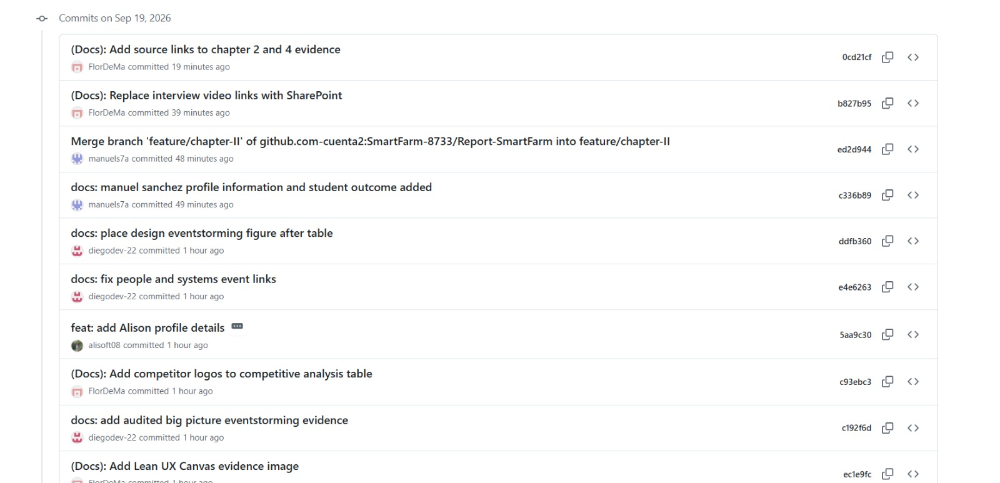

# Project Report Collaboration Insights

**Repositorio del informe:** https://github.com/SmartFarm-8733/Report-SmartFarm

## Organización del trabajo

El informe se elabora de forma colaborativa en un repositorio público dentro de la organización de GitHub del equipo, aplicando GitFlow como flujo de control de versiones y Conventional Commits para los mensajes.

Durante la elaboración de AV1 se utilizaron ramas de trabajo por capítulo y conclusiones; una vez integradas, esas ramas se cerraron. El flujo vigente conserva `main` para entregas publicadas y `develop` para integración. Cada cambio se desarrolla en una rama temporal `feature/<alcance>` o `fix/<alcance>`, creada desde `develop`, y se integra mediante un Pull Request revisado.

| Rama | Contenido |
|---|---|
| `main` | Versión publicada para cada entrega |
| `develop` | Integración de cambios en curso |
| `feature/<alcance>` / `fix/<alcance>` | Ramas temporales para cambios aislados; se eliminan tras integrarse |

## Actividad registrada durante AV1 (7–19 de septiembre de 2026)

| Métrica | Valor |
|---|---|
| Commits de contenido | 111 |
| Merges de integración | 17 |
| Commits totales del historial | 128 |
| Ramas de trabajo utilizadas durante la entrega | 7 |
| Periodo de trabajo | 7 al 19 de septiembre de 2026 |
| Artefactos versionados | 4 capítulos con contenido, 1 archivo de capítulo vacío, 114 imágenes rasterizadas, 8 SVG y 17 archivos fuente de diagramas |

## Evidencias de commits en GitHub

Las siguientes capturas documentan el historial visible de commits de la rama `feature/chapter-II` durante la consolidación del informe. En ellas se observan aportes de Diego Andres Avalos Cordova, Flor de María Contreras Leon, Giorgio Awad, Alison Arrieta y Manuel Angel Sanchez, además de la integración de ramas mediante GitFlow. La evidencia se mantiene alineada con las versiones 0.11.6 a 0.11.10 del Registro de Versiones.

*Figura. Historial de commits de `feature/chapter-II` durante la consolidación del informe (captura 1).*

*Figura. Historial de commits de `feature/chapter-II` durante la consolidación del informe (captura 2).*

*Figura. Historial de commits de `feature/chapter-II` durante la consolidación del informe (captura 3).*

## Interpretación de la actividad colaborativa

El historial de commits evidencia una elaboración distribuida del informe entre las ramas de capítulo. Las capturas muestran aportes de Diego Andres Avalos Cordova, Flor de María Contreras Leon, Giorgio Awad, Alison Arrieta y Manuel Angel Sanchez, junto con integraciones realizadas mediante GitFlow. El Registro de Versiones resume las modificaciones relevantes y mantiene la trazabilidad entre cada aporte, el autor y la sección actualizada.

Durante AV1, la organización inicial por ramas de capítulo permitió distribuir responsabilidades e integrar los aportes mediante GitFlow. Para los siguientes cambios, el repositorio mantiene `main` y `develop` como ramas permanentes y utiliza ramas temporales integradas mediante Pull Request, con la trazabilidad registrada en los commits y en el Registro de Versiones.

## TB1

### Organización del trabajo

Entre el 6 y el 8 de octubre de 2026 se reorganizaron las fuentes del informe en `report/`, se prepararon los apartados de TB1 y se integraron avances de diseño y correcciones de investigación. El trabajo siguió el flujo de ramas temporales y Pull Requests descrito en [CONTRIBUTING.md](../../CONTRIBUTING.md).

La reorganización se incorporó mediante el [PR #1](https://github.com/SmartFarm-8733/Report-SmartFarm/pull/1). Los avances del Capítulo V llegaron a `develop` mediante el [PR #6](https://github.com/SmartFarm-8733/Report-SmartFarm/pull/6), las correcciones generales mediante el [PR #7](https://github.com/SmartFarm-8733/Report-SmartFarm/pull/7) y la revisión del Big Picture EventStorming mediante el [PR #8](https://github.com/SmartFarm-8733/Report-SmartFarm/pull/8).

### Actividad colaborativa

Las siguientes métricas corresponden al historial alcanzable desde `develop` hasta [`238af37`](https://github.com/SmartFarm-8733/Report-SmartFarm/commit/238af3763c30473c9f6610ff9cd0e2d304b98359), con corte al 8 de octubre de 2026. Para el periodo de TB1 se consideran las fechas de los commits desde el 6 de octubre a las 00:00, hora de Perú (UTC−5). El corte precede a esta actualización documental.

| Métrica | Valor |
|---|---|
| Commits sin merge en el periodo de TB1 | 22 |
| Merges de integración en el periodo de TB1 | 10 |
| Commits totales del periodo de TB1 | 32 |
| Commits acumulados del historial | 160 |
| Periodo observado | 6 al 8 de octubre de 2026 |
| Artefactos del informe al corte | 5 capítulos con contenido y 1 con estructura; 120 imágenes rasterizadas, 4 SVG y 17 fuentes de diagramas |

| Integrante | Commits sin merge en el periodo | Aporte documentado |
|---|---|---|
| Avalos Cordova, Diego Andres | 15 | Reorganización del repositorio, carátula y paginación, estructura de TB1 y desarrollo de las secciones 5.1 y 5.2. |
| Contreras Leon, Flor de María | 1 | Actualización de las fotografías y referencias de los integrantes. |
| Sanchez Arenas, Manuel Angel | 2 | Revisión de Lean UX, enlaces, trazabilidad de requisitos y síntesis de la investigación. |
| Arrieta Quispe, Alison Jimena | 4 | Revisión del Big Picture EventStorming, capturas de sus cinco etapas, redacción y enlaces al tablero. |

La cantidad de commits refleja actividad versionada y no mide por sí sola el esfuerzo ni la participación total. Los merges se contabilizan por separado; el historial incluye una integración atribuida a una cuenta automatizada. Los aportes de otros integrantes fuera de este periodo y las tareas sin commit propio no se deducen de esta tabla.

El avance integrado corresponde a documentación y diseño. El Capítulo V contiene las guías de estilo y la arquitectura de información; los apartados 5.3 a 5.6 todavía requieren sus artefactos. El Capítulo VI conserva la estructura de configuración, implementación, pruebas y despliegue del Sprint 1, sin evidencias incorporadas en esas secciones.

### Evidencias de colaboración y commits

| Evidencia | Cambios que respalda |
|---|---|
| [Reorganización del informe, 1511611](https://github.com/SmartFarm-8733/Report-SmartFarm/commit/1511611) | Nueva estructura de capítulos, secciones iniciales, anexos y recursos. |
| [Fotografías del equipo, 5330abc](https://github.com/SmartFarm-8733/Report-SmartFarm/commit/5330abc) | Actualización de los perfiles de integrantes. |
| [PR #6: Capítulo V](https://github.com/SmartFarm-8733/Report-SmartFarm/pull/6) | Guías visuales y arquitectura de información. |
| [PR #7: correcciones generales](https://github.com/SmartFarm-8733/Report-SmartFarm/pull/7) | Lean UX, investigación, requisitos y referencias. |
| [PR #8: Big Picture EventStorming](https://github.com/SmartFarm-8733/Report-SmartFarm/pull/8) | Modelo As-Is y capturas de FigJam. |

Las capturas de commits de la sección AV1 se conservan como evidencia histórica de esa entrega. Para TB1, los enlaces anteriores permiten revisar autores, fechas, archivos modificados y su integración.

